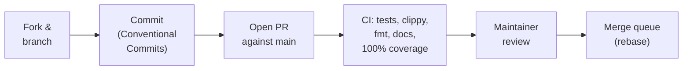

# Contributing to Leviath

Contributions are welcome: bug reports, docs fixes, and code. This page covers
both the *process* (how a change lands) and the *tooling* (hooks, lints, and the
coverage gate).

## How a change lands



Merges to `main` go through GitHub's merge queue: once a PR is approved and green, queueing it
re-runs the required checks on the exact tree that will land, then rebase-merges automatically.

- **Start with an issue** for anything non-trivial. Agreeing on the approach
  first saves you from writing code that can't be merged. Small fixes (typos,
  doc corrections, obvious bugs) can go straight to a PR.
- **Direct pushes to `main` are disabled** for everyone, maintainers included.
  Every change arrives as a pull request, must pass all required CI checks, and
  needs maintainer approval before it can merge.
- **History is rebase-only**, with no merge commits. Keep your branch rebased on
  `main`; force-pushing your own PR branch is fine and expected.
- **Commit messages follow [Conventional Commits](https://www.conventionalcommits.org)**:
  `feat:`, `fix:`, `docs:`, `ci:`, `refactor:`, `test:`, `chore:`. Look at
  `git log --oneline` for the house style.
- **Licensing**: by submitting a contribution you agree it is licensed under the
  repository's [MIT license](LICENSE). There is no CLA.
- **Conduct**: we follow the [Contributor Covenant](CODE_OF_CONDUCT.md).
- **Security issues** go through
  [private vulnerability reporting](https://github.com/GEMISIS/leviath/security/advisories/new),
  never public issues. See [SECURITY.md](SECURITY.md).

## Getting the code building

```bash
git clone https://github.com/GEMISIS/leviath.git
cd leviath
cargo build
cargo test --workspace
cargo clippy --workspace
```

## The pre-commit hook

The hook installs itself the first time you build or test, with no setup step. `cargo test` / `cargo build` pulls in `xtask`'s dev-dependencies, which include [`cargo-husky`](https://github.com/rhysd/cargo-husky). On the first build it installs `.cargo-husky/hooks/pre-commit` into `.git/hooks/pre-commit` automatically.

The hook enforces, before every commit:

- **formatting** (`cargo fmt --check`)
- **clippy** with warnings-as-errors
- **doc lints** (`cargo doc` with `-D warnings`, so no broken or private intra-doc links and no stray HTML)
- the **full test suite**
- the **coverage-suppression-marker lint** (`ast-grep scan`, if `ast-grep` is installed; CI always enforces it)

It does **not** run the full `cargo xtask coverage` check, which is several minutes, too slow for a local commit gate. CI runs it on every push instead, enforcing 100% for real.

If the hook script itself changes (e.g. a commit edits `.cargo-husky/hooks/pre-commit`), `cargo-husky` only reinstalls it on a *fresh* compile of its crate, not on incremental builds. Force it with:

```bash
cargo clean -p cargo-husky && cargo test -p xtask
```

## `ast-grep` (suppression lint)

The suppression-marker scan uses [`ast-grep`](https://ast-grep.github.io), which matches Rust/YAML structurally (via tree-sitter), and the rules live in `.sgrules/`. CI installs it automatically and always enforces the scan; the pre-commit hook runs it only if it's installed locally, otherwise it prints a warning and skips (CI is the backstop). Install it once with any of:

```bash
brew install ast-grep            # macOS / Linuxbrew
cargo install ast-grep --locked  # from source
npm install -g @ast-grep/cli     # via npm
```

## Testing policy

The workspace is gated at a hard **100%** on lines, regions, and functions, with no way to opt out. Coverage-suppression markers (`#[cfg(not(test))]`, `coverage(off)`, tarpaulin/lcov/grcov annotations) are banned by the ast-grep lint above, so code can't be hidden from measurement; it has to be refactored until it's testable. The *only* un-unit-tested code is the thin `lev` binary entrypoint (`crates/leviath-cli/src/main.rs`): the composition root that wires real terminal, stdin, network, and subprocess I/O into the library's tested cores. It's excluded from coverage measurement and guarded by a CI check that requires maintainer sign-off to change.

## Running coverage locally

`cargo xtask coverage` gates each workspace package with `cargo llvm-cov --package <pkg> --fail-under-{lines,functions,regions} 100`. llvm-cov does the counting *and* the gating; there's no custom parsing or aggregation. CI enforces a hard **100%** on all three metrics on Linux, macOS, and Windows. Any file below 100% fails the build, and a browsable HTML report lands in the gitignored `coverage/` folder.

Measurement is deliberately **per-package**, not `--workspace`: `-C instrument-coverage` records every function in every binary that links it (including ones that never call it), and the whole-workspace merge can let a never-run record shadow the covered one, so one package at a time is what keeps llvm-cov's counts accurate. See the doc comment atop `xtask/src/coverage.rs`.

```bash
cargo xtask coverage                                   # full workspace
cargo llvm-cov --package <crate> --lib                 # a single crate
cargo llvm-cov --package <crate> --lib --html --open   # browsable per-crate report
```

> Branch coverage isn't collected: `cargo llvm-cov --branch` reliably SIGSEGVs inside LLVM's own coverage-mapping code ([open upstream bug](https://github.com/llvm/llvm-project/issues/119558)). See the doc comment atop `xtask/src/coverage.rs` for the full investigation.

## Cutting a release

Releases are triggered by a version bump, not by a schedule. Merging a bump to
`main` is what puts a build in front of users, so it is a deliberate, separate
commit rather than something that rides along with a feature.

Everything ships in lockstep — all `leviath-*` crates plus the `lev` binary
carry one version — so a bump is three edits:

1. `[workspace.package] version` in the root `Cargo.toml`.
2. The eleven intra-workspace `version = "…"` pins in `[workspace.dependencies]`
   just below it. `cargo publish` refuses a path dependency without a version,
   and refuses one that disagrees with what is on crates.io, so these have to
   move together with the line above.
3. `cargo update --workspace` to bring `Cargo.lock` along. CI fails on a
   lockfile that disagrees with the manifests.

Then move `## Unreleased` in `CHANGELOG.md` under a `## X.Y.Z - YYYY-MM-DD`
heading and open a fresh empty `## Unreleased` above it.

Merging that fires the alpha release for the bump commit; beta promotes it the
following Monday and stable the Thursday after. Channels with nothing new to
publish skip in seconds. See
[Releases and channels](https://leviath.dev/docs/releases) for the full picture.

## Regenerating the workflow diagrams

The agent workflow SVGs in `docs/assets/agents/` are rendered from the Mermaid sources in `docs/assets/agents/src/`. See `docs/assets/agents/src/README.md` for the render command and theme configs. If you change an agent's stage graph in `crates/leviath-cli/agents/<name>/agent.leviath`, update its `.mmd` source and re-render both the light and dark variants.
