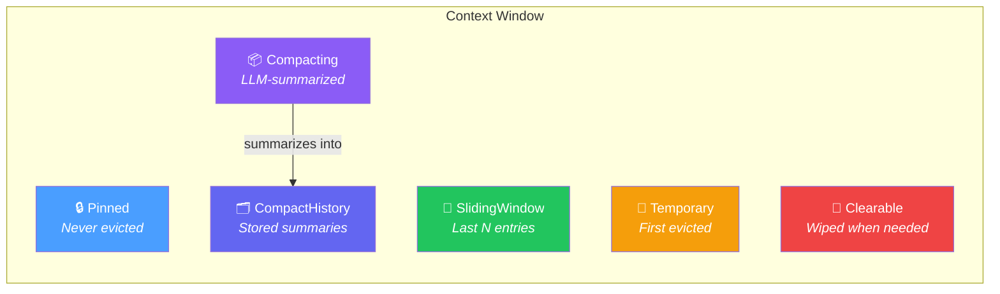
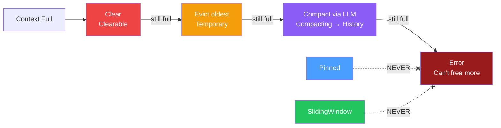
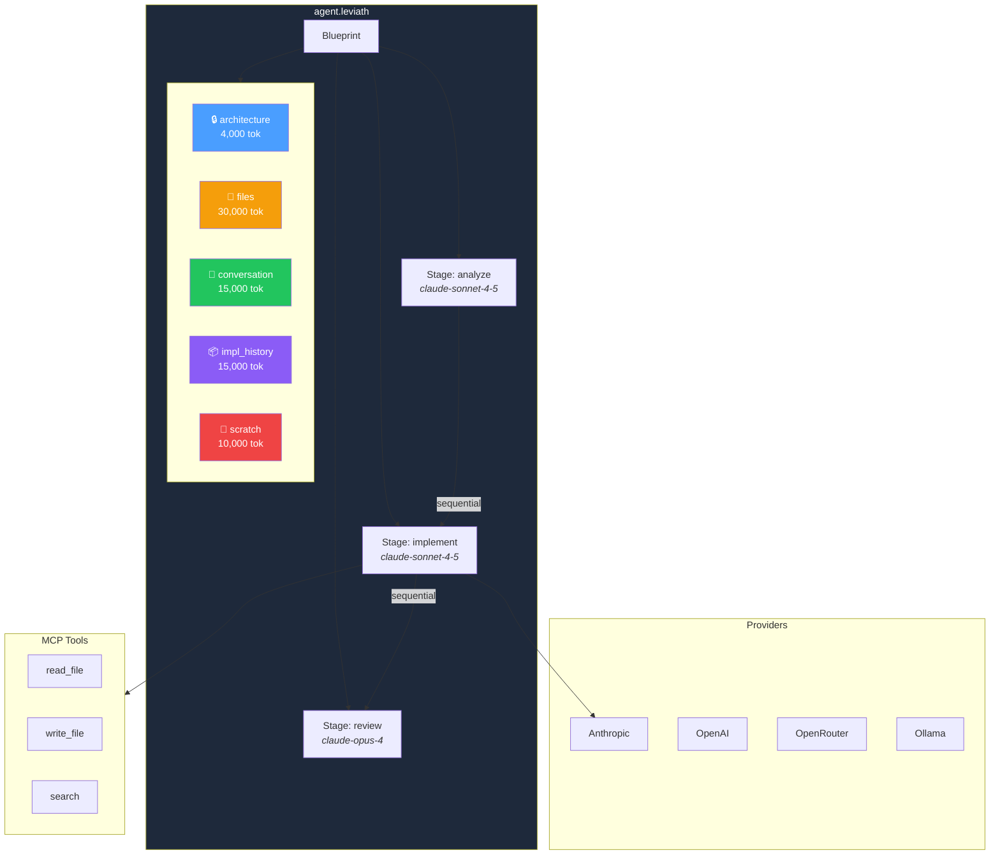
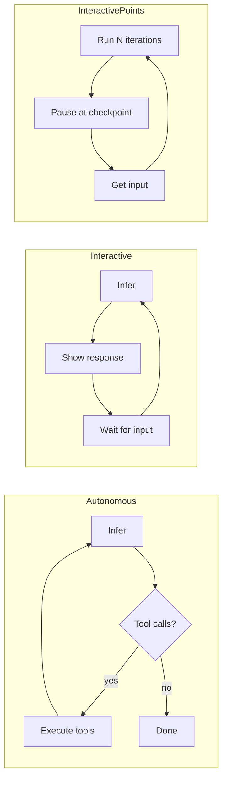
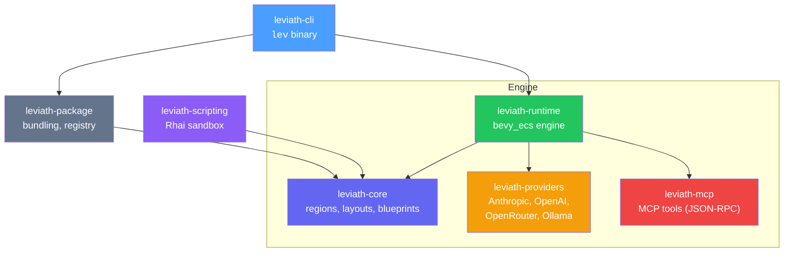

# Leviath

**Hardware-inspired context window management for LLM agents.**

Leviath gives LLM agents structured, tiered memory instead of flat conversation arrays. Inspired by hardware memory architectures — think CPU cache hierarchies, not chat logs — it provides explicit control over what stays in context, what gets summarized, and what gets evicted when memory fills up.

## The Problem

Every LLM agent framework manages context the same way: a flat array of messages with uniform compaction when it gets too long. This is like running a computer with one big memory pool that gets randomly wiped when full.

Leviath replaces this with **typed memory regions**, each with its own lifecycle:



When context fills up, eviction is deterministic:



## Quick Start

```bash
# Install
git clone https://github.com/GEMISIS/leviath.git
cd leviath
cargo install --path crates/leviath-cli

# Set your API key
export ANTHROPIC_API_KEY="sk-ant-..."

# Create and run an agent
lev init my-agent
cd my-agent
lev run --task "Explain how memory hierarchies work"
```

Other supported key sources: `OPENAI_API_KEY`, `OPENROUTER_API_KEY`, `OLLAMA_HOST`, or `~/.leviath/config.toml`:

```toml
[providers]
anthropic_api_key = "sk-ant-..."
openai_api_key = "sk-..."
```

## How It Works



Agents are defined in a single TOML file — no Rust code needed:

```toml
[agent]
name = "my-agent"
version = "0.1.0"
description = "A research assistant"

# Stages execute sequentially, each with its own model
[stages.gather]
mode = "autonomous"
model = { provider = "anthropic", model = "claude-sonnet-4-5" }
available_tools = ["web_search", "read_file"]

[stages.analyze]
mode = "autonomous"
model = { provider = "anthropic", model = "claude-sonnet-4-5" }

[stages.review]
mode = "interactive"  # Pauses for user input
model = { provider = "anthropic", model = "claude-opus-4" }

# Context regions — the memory map
[context.regions]
objective = { kind = "pinned", max_tokens = 2000 }
sources = { kind = "temporary", max_tokens = 40000 }
findings = { kind = "compacting", threshold_tokens = 8000, max_tokens = 15000 }
findings_history = { kind = "compact_history", source_region = "findings", max_tokens = 10000 }
conversation = { kind = "sliding_window", max_items = 15, max_tokens = 12000 }
scratch = { kind = "clearable", max_tokens = 8000 }

# Compaction config (optional — uses defaults if omitted)
[compaction]
provider = "anthropic"
model = "claude-sonnet-4"
```

## Stage Modes



- **`autonomous`** — runs without user input until complete
- **`interactive`** — pauses after each inference for user input
- **`interactive_points`** — runs autonomously but pauses at named checkpoints:

```toml
[stages.implement]
mode = "interactive_points"

[[stages.implement.interaction_points]]
name = "design_review"
prompt = "Here's the proposed design. Approve or suggest changes:"
required = true
```

## CLI

| Command | Description |
|---|---|
| `lev init <name>` | Create agent project (`--template default\|coding\|research`) |
| `lev run [path] --task <task>` | Run an agent (`--model` to override) |
| `lev dashboard [path] --task <task>` | TUI for managing multiple concurrent agents |
| `lev pack [path]` | Bundle for distribution → `.leviath-bundle` |
| `lev install <package>` | Install from bundle or registry |
| `lev spawn <name>` | Spawn from installed blueprint (`--count N`) |
| `lev list` | List installed and available agents |
| `lev test [path]` | Run tests (`--dry-run` for no API calls) |
| `lev context [agent_id]` | Inspect context window state |

## Dashboard

`lev dashboard` provides a terminal UI for managing multiple agents at once:

```
┌─ Agents ──────────────────────────────────────────────────┐
│ ID           │ Stage       │ Status     │ Tokens  │ Iter  │
│ coder-1      │ implement   │ ●ACTIVE    │ 45k/80k │ 12    │
│ coder-2      │ review      │ ◆WAITING   │ 32k/80k │ 8     │
│ reviewer-1   │ deep_review │ ●ACTIVE    │ 28k/50k │ 5     │
├─ Agent Detail ────────────────────────────────────────────┤
│ [coder-2] Waiting for input at: review                   │
│ The implementation looks good. Ready to commit?           │
│ > _                                                       │
├─ Log ─────────────────────────────────────────────────────┤
│ 09:15:32 coder-1: Called tool read_file(src/main.rs)      │
│ 09:15:35 coder-2: Waiting for user input                  │
└───────────────────────────────────────────────────────────┘
 [q]uit  [Enter]respond  [↑↓]select  [c]ancel  [k]ill  [n]ew
```

## Tool Result Routing

Control where tool outputs land in the context window:

```toml
[stages.implement.tool_routing]
default_region = "tool_results"
persist = true
max_result_tokens = 5000

[stages.implement.tool_routing.overrides]
read_file = "codebase"
search = "findings"
```

## Testing

Create `tests/` in your agent project:

```toml
# tests/basic.toml — run agent, check assertions
[[test]]
name = "greeting"
input = "Say hello"
expect_contains = "hello"
```

```rhai
// tests/validate.rhai — test validators
let tokens = count_tokens("Hello world");
tokens > 0 && tokens < 100
```

```bash
lev test                  # Run all (requires API key)
lev test --dry-run        # Validate structure only
```

## Packaging

```bash
lev pack                  # → my-agent-0.1.0.leviath-bundle
lev install agent.leviath-bundle
lev spawn my-agent
```

## Architecture



## Pre-built Agents

Three agents ship in `agents/`:

- **Coder** — `analyze → implement → review` (interactive review). Architecture pinned, files temporary, implementation auto-compacts.
- **Reviewer** — `scan → deep_review → report`. Guidelines pinned, findings temporary.
- **Researcher** — `gather → analyze → summarize`. Proves Leviath is domain-agnostic. Findings compact automatically.

```bash
cp -r agents/coder my-coder
lev run my-coder/ --task "Build a REST API"
```

## Development

```bash
cargo build && cargo test    # 93 tests
cargo clippy                 # Zero warnings
```

**Git worktrees** for parallel development:

```bash
git worktree add ../leviath-feat-x feat/x
cd ../leviath-feat-x
cargo build                  # Own target/, no interference

# Version-specific installs
cargo install --path crates/leviath-cli --root ~/.local/leviath-feat-x
```

## License

MIT

**Website:** [leviath.dev](https://leviath.dev) · **Repository:** [github.com/GEMISIS/leviath](https://github.com/GEMISIS/leviath)
