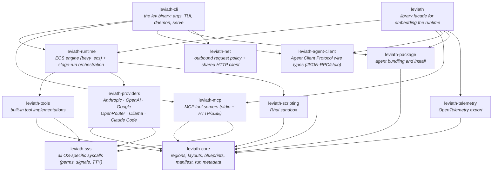

<div align="center">


**A structured runtime for AI agents**

Give a model one flat list of messages and a single big file read pushes your system prompt
out of the window. Leviath gives it structure instead.

**Coherent.** Structured context regions mean an agent still knows what it read 50 tool calls ago.<br>
**Right-sized.** Each phase of a task gets its own model, tools, and context layout, so you aren't paying frontier prices for file reads.<br>
**Light.** Thousands of agents in one [bevy_ecs](https://bevyengine.org/) process, from a single binary. No Node, Python, or Docker.

[](https://github.com/GEMISIS/leviath/actions/workflows/ci.yml)
[](https://github.com/GEMISIS/leviath/actions/workflows/ci.yml)
[](https://github.com/GEMISIS/leviath/blob/main/LICENSE)
[](https://leviath.dev)
[](https://github.com/GEMISIS/leviath/releases/latest)
[](https://github.com/GEMISIS/leviath/releases/tag/beta)
[](https://github.com/GEMISIS/leviath/releases/tag/alpha)

**[Quick Start](#quick-start) · [Agents](#agents) · [Features](#features) · [Dashboard](#dashboard) · [API](#api-server) · [Comparison](#how-it-compares) · [Why not Leviath](#why-you-might-not-want-leviath) · [Contributing](#contributing)**

</div>

---

<p align="center">
  
</p>

## At a glance

```bash
lev run coder --task "Build a CLI that converts CSV to JSON"    # run a coding agent...
lev run deep-researcher --task "Survey solid-state batteries"   # ...or a research agent
lev ps                           # list running agents, and what each is waiting on
lev msg <agent-id> "..."         # steer a running agent mid-task
lev respond                      # answer questions agents are waiting on
lev dash                         # watch everything in the TUI dashboard
lev serve                        # REST + WebSocket API server
lev agent-client --agent coder   # serve an agent over the Agent Client Protocol
lev create my-agent              # scaffold your own agent
```

## Quick Start

### 1. Install

**macOS and Linux:**

```bash
curl -fsSL https://leviath.dev/install.sh | sh
```

**Windows**, pasting into either Command Prompt or PowerShell:

```powershell
powershell -ExecutionPolicy Bypass -c "irm https://leviath.dev/install.ps1 | iex"
```

Both install prebuilt binaries, so no Rust toolchain is needed. Stable is the default; for beta or
alpha, pass the channel as an argument:
`curl -fsSL https://leviath.dev/install.sh | sh -s -- --channel beta`.
[Release channels →](https://leviath.dev/docs/releases)

<details>
<summary><b>Package managers</b>: Homebrew and Scoop, if you would rather manage it that way</summary>

<br/>

```bash
# macOS - what install.sh runs for you
brew tap gemisis/leviath https://github.com/GEMISIS/leviath-dist.git
brew trust gemisis/leviath          # Homebrew 6 requires trusting third-party taps
brew install leviath                # stable - or: leviath-beta, leviath-alpha
```

```powershell
# Windows
scoop bucket add leviath https://github.com/GEMISIS/leviath-dist.git
scoop install leviath
```

</details>

**Cargo** (any platform, requires [Rust](https://rustup.rs/)):

```bash
cargo install leviath-cli                # released version from crates.io
cargo install --git https://github.com/GEMISIS/leviath.git --bin lev   # latest development build
```

Leviath is also a library: add the [`leviath`](https://crates.io/crates/leviath) crate to embed the runtime in your own application. The [embedding guide](https://leviath.dev/docs/embedding) covers building a world, spawning agents, and streaming their events in-process.

### 2. Configure a provider

One provider is all you need: an API key from [Anthropic](https://console.anthropic.com/), [OpenAI](https://platform.openai.com/), [Google AI](https://aistudio.google.com/), or [OpenRouter](https://openrouter.ai/). No key at all? Run a local [Ollama](https://ollama.com), or opt into the [Claude Code transport](https://leviath.dev/docs/providers#claude-code-transport) to run on your Claude subscription (read its terms-of-service note first).

```bash
lev setup                                            # interactive wizard
lev setup --non-interactive --anthropic-key sk-ant-...  # scriptable
```

### 3. Run an agent

```bash
lev run coder --task "Add pagination to the /users endpoint"

# ...or try a non-coding agent
lev run log-analyzer --task "Find what caused the error spike in ./logs last night"
```

`lev run` hands the agent to a background **daemon** that hosts every agent in one shared world, so runs keep going after your terminal closes. For unattended agents, `lev daemon install` puts it under launchd/systemd so it starts at login, restarts if it dies, and reloads interrupted runs. [Daemon docs →](https://leviath.dev/docs/daemon)

### 4. Create your own

```bash
lev create my-agent        # scaffolds a new agent directory
cd my-agent
lev run . --task "Your task here"
```

This writes an `agent.leviath` config you can customize: models per stage, context regions and their budgets, tools, and the workflow graph. [Agent configuration →](https://leviath.dev/docs/agents)

## Agents

Seven agents ship out of the box, covering coding, review, research, data gathering, and log
analysis. Each is a multi-stage directed graph with structured context regions, per-stage model
fallback, and error recovery, and five of them fan out to cover several things at once instead of
one after another. `coder` is the largest:

<p align="center">
  <picture>
    <source media="(prefers-color-scheme: dark)" srcset="docs/assets/agents/coder-dark.svg">
    
  </picture>
</p>

Diamonds are LLM-routed or human-in-the-loop decisions, and dotted edges fire automatically on a
runtime condition (like the `stuck` detector) rather than by the agent's choice. Every agent's
workflow graph is in the [agent catalog →](https://leviath.dev/docs/agent-catalog)

## Features

### Structured context memory

The context window is split into named regions, and you decide what each one drops first. Architecture stays pinned, tool results go first, conversation compacts into summaries. A file dump can only crowd out the region it landed in.

Budgets are percentages of the model's window, so the same blueprint keeps its shape when you switch models. When the eight built-in region kinds do not fit, a [`custom` region](https://leviath.dev/docs/rhai-regions) hands one region to a Rhai script you write. [Learn more →](https://leviath.dev/docs/context)

### Multi-stage workflows

Each stage gets its own model, tools, and context layout. Run them linearly or as a [directed graph](https://leviath.dev/docs/stages#graph) with conditional transitions, error recovery, and LLM-driven routing, then check the graph with `lev validate`. A `stuck` edge escapes a stage that is making no progress, and stuckness is measured by the runtime (iteration counts, repeated edits to one file), not self-reported by the model. [Learn more →](https://leviath.dev/docs/stages)

### Human-in-the-loop

The core primitive is **mid-run message injection**: `lev msg` (or the API) drops a message straight into a running agent's context, and the model sees it on its next inference call, so you redirect or add constraints without restarting. Stages can opt out with `accepts_messages = false`; a message then waits in the inbox until a stage that accepts it. Force checkpoints with `interaction_points` (approve, request revisions, or edit the agent's output directly), or grant `ask_user_*` tools so the agent asks on its own judgment. [Learn more →](https://leviath.dev/docs/interaction)

### Security: sandboxed execution and taint tracking

By default an agent's shell commands run on your machine with nothing extra to install. When you want isolation, opt in per agent or per stage: hardened **containers** (Docker/Podman, capabilities dropped, warm per agent) or lighter **Linux namespaces**, mixable within one workflow, and an installed agent can tighten its sandbox but never turn one off. Experimental **taint tracking** labels every context region's sensitivity and gates exfiltration-capable tool calls before they fire, with allowlists and scripted policy rules on top. [Learn more →](https://leviath.dev/docs/security)

### ECS agent engine

Agents run as entities in a [bevy_ecs](https://bevyengine.org/) world. Thousands can share one process with game-engine-style scheduling (ten agents each fanning out to ten sub-agents is still one process), instead of that many OS processes fighting for resources.

And no, thousands of agents won't stampede your provider: a shared per-model inference pool caps how many requests are in flight to each model across the whole world, and an agent waiting for a slot just sits as data until one frees. Optional per-provider rate limits (requests and tokens per minute) are enforced on top, before every call. [Learn more →](https://leviath.dev/docs/engine)

### Sub-agents and fan-out

Agents spawn children with different blueprints. A **fan-out** stage splits a task into work items, runs one sub-agent worker per item concurrently, and merges the results back into the parent, all in the same process. Any sub-agent, at any depth, can ask the user questions directly. [Learn more →](https://leviath.dev/docs/sub-agents)

## Dashboard

<p align="center">
  
</p>

`lev dash` is a full TUI for managing concurrent agents: stage tabs, context-window visualization, markdown rendering, sub-agent tree view, and full mouse support including drag-to-copy (works over SSH). Press **`m`** to manage MCP tool servers without leaving the dashboard. [Dashboard docs →](https://leviath.dev/docs/dashboard)

## API Server

`lev serve` exposes a REST + WebSocket API, so anything that speaks HTTP can integrate with it. No SDK required. It covers agent lifecycle, human-in-the-loop interaction, per-agent streaming, and signed webhook callbacks on completion. [The Lair](https://leviath.dev/lair) is a browser console that drives it, so you get a web UI without writing one. Because the API can spawn tool-executing agents, it refuses to start without a token and binds to `127.0.0.1` by default.

```bash
export LEVIATH_API_TOKEN="$(openssl rand -hex 16)"
lev serve --port 3000

# spawn an agent (with a completion webhook + signing secret)
curl -X POST http://localhost:3000/api/agents \
  -H "Authorization: Bearer $LEVIATH_API_TOKEN" \
  -H "Content-Type: application/json" \
  -d '{"blueprint": "coder", "task": "Add input validation",
       "callback_url": "https://example.com/hook",
       "callback_secret": "whsec_…"}'
```

[Full API reference →](https://leviath.dev/docs/api)

## Observability

Production deployments can export structured traces, metrics, and logs over OpenTelemetry. Every run becomes a trace (`agent.run` → `agent.stage` → per-call `agent.inference` / `agent.tool_call` spans) alongside token counters, latency histograms, and log records carrying the run's trace ID. Off by default; one config block turns it on. [Observability docs →](https://leviath.dev/docs/observability)

## Agent Client Protocol

`lev agent-client --agent coder` serves any Leviath agent over the [Agent Client Protocol](https://agentclientprotocol.com) (JSON-RPC 2.0 over stdio), so hosts like [Zed](https://zed.dev) and [Gas City](https://github.com/gastownhall/gascity) can drive a headless agent as a child process. Wiring it into a host is config, not code. A `session/prompt` stays in flight until the run genuinely finishes, and hosts with `session/request_permission` get interactive tool approval in-turn. [Editor integration docs →](https://leviath.dev/docs/agent-client-protocol)

> "ACP" is claimed by two unrelated protocols; Leviath implements the Agent **Client** Protocol (JSON-RPC/stdio), not BeeAI's Agent Communication Protocol.

## How it compares

Leviath is a runtime that agents run *on*. Claude Code, Codex, and OpenHands are agents you work
with, CrewAI and LangGraph are frameworks you build agents *in*, and Gas Town and Gas City are
orchestrators that decide which work happens. Several of those are worth running alongside Leviath
rather than instead of it.

The full breakdown, including what each design buys and costs, when to reach for something else,
where Leviath falls short of [12-Factor Agents](https://github.com/humanlayer/12-factor-agents),
and why you might not want Leviath at all, is on the docs site:
[Where Leviath sits →](https://leviath.dev/docs/comparison)

## Why you might not want Leviath

- **It's not a replacement for Claude Code, Codex, or your favorite coding agent.** Those are polished interactive products at a different layer, and Leviath can even run on top of Claude Code as a transport.
- **Agents are config, not code.** A Leviath agent is a TOML blueprint plus optional Rhai script tools. If you want to write agent logic in Python or TypeScript against an SDK, other languages drive Leviath through the REST API instead.
- **Agents execute on one machine.** The daemon hosts every agent in a single process on a single box. You can reach it from anywhere over the REST and WebSocket API, and it can call out through signed webhooks, but there is no hosted service and no scheduling work across several machines.
- **Isolation is at the data layer, not the process layer.** Every agent has its own state, working directory, tool policy and read-path grants, and a panic fails that agent alone rather than the daemon. What is opt-in is the [OS sandbox](https://leviath.dev/docs/security) that confines shell commands, seed commands and script `shell()` calls. If you need each agent in its own kernel-enforced box by default, that is a different design.
- **You need a model provider**: an API key, a local Ollama, or the Claude Code transport (with its terms-of-service caveat).

## CLI

The [At a glance](#at-a-glance) block above covers the daily commands; the full surface (packaging, testing, policy, auth, daemon control) is in `lev --help` and the [CLI reference](https://leviath.dev/docs/cli). Every `config.toml` key and environment variable is in the [configuration reference](https://leviath.dev/docs/configuration).

Leviath also connects to [Model Context Protocol](https://modelcontextprotocol.io) tool servers over stdio or HTTP: `lev mcp add` detects OAuth servers and opens your browser to log in, and tokens are stored with `0600` permissions and refreshed automatically. [MCP docs →](https://leviath.dev/docs/mcp)

## Providers

Anthropic, OpenAI, Google (Gemini), OpenRouter, local [Ollama](https://ollama.com) with no key, and the Claude Code subscription transport, with per-stage model fallback, optional client-side rate limits enforced before each call, and custom OpenAI-compatible providers as [Rhai scripts](https://leviath.dev/docs/rhai-providers). [Provider docs →](https://leviath.dev/docs/providers)

## Security

Leviath runs LLM-driven tools on your machine. [SECURITY.md](SECURITY.md) states plainly what it defends against and what it does not, and covers vulnerability reporting, hardening a `lev serve` deployment, and verifying a release's signed build provenance.

## Contributing

```bash
git clone https://github.com/GEMISIS/leviath.git
cd leviath
cargo build
cargo test --workspace
```

The workspace is gated at a hard **100% coverage on lines, regions, and functions**, with no opt-outs and coverage-suppression markers banned by lint; CI enforces it on Linux, macOS, and Windows. The only exclusion is the thin `lev` binary entrypoint, guarded by a CI check. [CONTRIBUTING.md](CONTRIBUTING.md) covers the rest.

<details>
<summary><b>Crate map</b></summary>

<br/>

Every platform-specific system call lives in one crate, `leviath-sys`, behind a cross-platform API, so the rest of the workspace is free of scattered per-OS branches.



Two leaves round it out: `leviath-alloc`, one audited mimalloc option call for the binary, and `leviath-testkit`, shared test support.

</details>

## License

[MIT](LICENSE) © Gerald McAlister

---

<p align="center">
  <a href="https://leviath.dev">Website</a> ·
  <a href="https://leviath.dev/docs">Docs</a> ·
  <a href="https://github.com/GEMISIS/leviath">GitHub</a> ·
  <a href="https://github.com/GEMISIS/leviath/issues">Issues</a>
</p>
