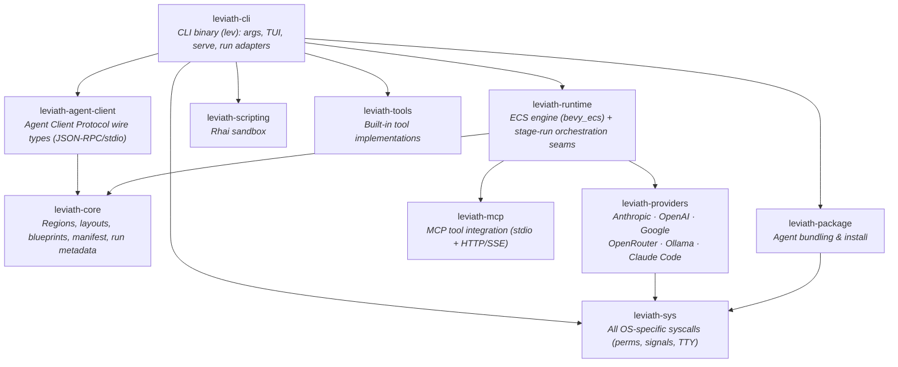

<div align="center">

# Leviath

**A structured agent runtime for LLMs**

**Coherent** — structured context regions; an agent still knows what it read 50 tool calls ago.<br>
**Staged** — each phase of a task gets its own model, tools, and context layout, wired as a graph.<br>
**Light** — dozens of agents in one [bevy_ecs](https://bevyengine.org/) process. A single binary — no Node, Python, or Docker.

[](https://github.com/Sun-Forge-AI/leviath/actions/workflows/ci.yml)
[](https://github.com/Sun-Forge-AI/leviath/actions/workflows/ci.yml)
[](https://github.com/Sun-Forge-AI/leviath/blob/main/LICENSE)
[](https://leviath.dev)

**[Quick Start](#quick-start) · [Agents](#pre-built-agents) · [Features](#features) · [Dashboard](#dashboard) · [API](#api-server) · [Agent Client Protocol](#agent-client-protocol) · [Benchmarks](#benchmarks) · [Why not Leviath](#why-you-might-not-want-leviath) · [Contributing](#contributing)**

</div>

---

Most agent tools hand an LLM a flat message array and hope for the best. Leviath gives it **structure** — so it stays coherent across hundreds of tool calls, uses the right model for each phase of a task, and runs a dozen agents without melting your machine.

<p align="center">
  
</p>

Use it for:

- **Agents beyond coding** — research, log analysis, daily briefings, writing, all [out of the box](#pre-built-agents)
- **Long tasks that stay coherent** — [context regions](#features) instead of a flat transcript
- **Agents driven from anything that speaks HTTP** — a [REST + WebSocket API](#api-server) with webhooks, backed by an always-on daemon
- **Headless agents inside any [Agent Client Protocol](#agent-client-protocol) host**
- **Tinkering** — an ECS world, workflow graphs, Rhai script tools, taint tracking, a [full TUI](#dashboard)

## At a glance

```bash
lev run coder --task "Build a CLI that converts CSV to JSON"    # run a coding agent...
lev run deep-researcher --task "Survey solid-state batteries"   # ...or a research agent
lev ps                           # list running agents
lev msg <agent-id> "..."         # steer a running agent mid-task
lev respond                      # answer questions agents are waiting on
lev dash                         # watch everything in the TUI dashboard
lev serve                        # REST + WebSocket API server
lev agent-client --agent coder   # serve an agent over the Agent Client Protocol
lev create my-agent              # scaffold your own agent
```

## Quick Start

### 1. Install

> **Private alpha:** installing needs a GitHub Personal Access Token (`repo` scope) — `GITHUB_TOKEN` for the install scripts, `HOMEBREW_GITHUB_API_TOKEN` for Homebrew. One-time setup in the [distribution repo](https://github.com/Sun-Forge-AI/leviath-dist).

**macOS (Homebrew):**

```bash
brew tap sun-forge-ai/leviath https://github.com/Sun-Forge-AI/leviath-dist.git
brew trust sun-forge-ai/leviath          # newer Homebrew requires trusting third-party taps
brew install leviath                     # stable - or: leviath-beta, leviath-alpha
```

**Linux:**

```bash
curl -fsSL -H "Authorization: token $GITHUB_TOKEN" \
  https://raw.githubusercontent.com/Sun-Forge-AI/leviath-dist/main/install.sh | bash -s -- --channel stable
```

**Windows (PowerShell):**

```powershell
irm -Headers @{Authorization="token $env:GITHUB_TOKEN"} `
  https://raw.githubusercontent.com/Sun-Forge-AI/leviath-dist/main/install.ps1 | iex
```

**Build from source** (any platform, requires [Rust](https://rustup.rs/)):

```bash
cargo install --git https://github.com/Sun-Forge-AI/leviath.git --bin lev
```

### 2. Configure a provider

One provider is all you need: an API key from [Anthropic](https://console.anthropic.com/), [OpenAI](https://platform.openai.com/), [Google AI](https://aistudio.google.com/), or [OpenRouter](https://openrouter.ai/) — or, with no key at all, a local [Ollama](https://ollama.com) or the Claude Code transport below.

```bash
lev setup                                            # interactive wizard
lev setup --non-interactive --anthropic-key sk-ant-...  # scriptable
```

<details>
<summary><b>Claude Code transport (opt-in, no API key)</b> — run Leviath on your Claude subscription; read the terms note</summary>

<br/>

If you have [Claude Code](https://claude.com/claude-code) installed and signed in, enable it in `lev setup` to run Leviath on your Claude subscription with no API key. Leviath's structured regions work normally — it drives the CLI as a plain inference relay, keeping the context window, the tool loop, and the iteration count on Leviath's side.

> **⚠️ Terms of service:** Anthropic's terms [state](https://support.claude.com/en/articles/15036540-use-the-claude-agent-sdk-with-your-claude-plan) that third-party developers may not offer claude.ai login or subscription rate limits for their products without prior approval. Using this transport routes inference through your Claude subscription via the CLI's OAuth session. **By enabling it, you accept responsibility for compliance with Anthropic's terms.** For unambiguous compliance, use a direct Anthropic API key instead.

Technical caveats, measured rather than estimated:

- The CLI adds ~130 tokens of its own context to **every** call — including **your account email address** and the current date — and no flag disables this without also disabling subscription auth.
- No prompt caching, and each call spawns a subprocess (~200 ms). Anthropic models only.
- For full control over what reaches the model, use a direct provider key.

</details>

### 3. Run an agent

```bash
lev run coder --task "Build a CLI that converts CSV to JSON"

# ...or try a non-coding agent
lev run deep-researcher --task "Survey the current state of solid-state battery technology"
```

`lev run` hands the agent to a background **daemon** that hosts every agent in one shared world, so runs keep going after your terminal closes. For unattended agents, `lev daemon install` puts it under launchd/systemd so it starts at login, restarts if it dies, and reloads interrupted runs. [Daemon docs →](https://leviath.dev/docs/daemon)

### 4. Create your own

```bash
lev create my-agent        # scaffolds a new agent directory
cd my-agent
lev run . --task "Your task here"
```

This writes an `agent.leviath` config you can customize — models per stage, context regions and their budgets, tools, and the workflow graph. [Agent configuration →](https://leviath.dev/docs/agents)

## Pre-built Agents

Ten agents ship out of the box — each a multi-stage directed graph with structured context regions, per-stage model fallback, and error recovery. Diamonds are LLM-routed or human-in-the-loop decisions; dotted edges fire automatically on a runtime condition (like the `stuck` detector) rather than by the agent's choice.

<table>
<tr><th align="left">Agent</th><th align="left">Workflow</th></tr>
<tr>
<td valign="middle" width="30%"><b>software-engineer</b> <em>(default)</em><br>Full coding workflow: codebase discovery, human-approved planning, an optional prototype spike, stuck detection</td>
<td><picture>
  <source media="(prefers-color-scheme: dark)" srcset="docs/assets/agents/software-engineer-dark.svg">
  
</picture></td>
</tr>
<tr>
<td valign="middle" width="30%"><b>parallel-fixer</b><br>Fixes many failing tests at once — one sub-agent worker per failure, merged and re-verified</td>
<td><picture>
  <source media="(prefers-color-scheme: dark)" srcset="docs/assets/agents/parallel-fixer-dark.svg">
  
</picture></td>
</tr>
<tr>
<td valign="middle" width="30%"><b>deep-researcher</b><br>Thorough single-topic investigation — follows citation chains, cross-checks claims, cited report</td>
<td><picture>
  <source media="(prefers-color-scheme: dark)" srcset="docs/assets/agents/deep-researcher-dark.svg">
  
</picture></td>
</tr>
</table>

<details>
<summary><b>The other seven</b> — coder, reviewer, wide-researcher, researcher, log-analyzer, daily-briefer, writing-assistant</summary>

<br/>

<table>
<tr><th align="left">Agent</th><th align="left">Workflow</th></tr>
<tr>
<td valign="middle" width="30%"><b>coder</b><br>Focused implementation with discovery, an optional prototype spike, stuck detection, and a review loop</td>
<td><picture>
  <source media="(prefers-color-scheme: dark)" srcset="docs/assets/agents/coder-dark.svg">
  
</picture></td>
</tr>
<tr>
<td valign="middle" width="30%"><b>reviewer</b><br>Code review and audit, grounded in a discovery pass; read-only</td>
<td><picture>
  <source media="(prefers-color-scheme: dark)" srcset="docs/assets/agents/reviewer-dark.svg">
  
</picture></td>
</tr>
<tr>
<td valign="middle" width="30%"><b>wide-researcher</b><br>Broad multi-topic landscape survey</td>
<td><picture>
  <source media="(prefers-color-scheme: dark)" srcset="docs/assets/agents/wide-researcher-dark.svg">
  
</picture></td>
</tr>
<tr>
<td valign="middle" width="30%"><b>researcher</b><br>General-purpose research with a gather↔analyze refinement loop</td>
<td><picture>
  <source media="(prefers-color-scheme: dark)" srcset="docs/assets/agents/researcher-dark.svg">
  
</picture></td>
</tr>
<tr>
<td valign="middle" width="30%"><b>log-analyzer</b><br>Log analysis with scripted aggregation, severity-ranked findings</td>
<td><picture>
  <source media="(prefers-color-scheme: dark)" srcset="docs/assets/agents/log-analyzer-dark.svg">
  
</picture></td>
</tr>
<tr>
<td valign="middle" width="30%"><b>daily-briefer</b><br>Morning summaries from local and web sources</td>
<td><picture>
  <source media="(prefers-color-scheme: dark)" srcset="docs/assets/agents/daily-briefer-dark.svg">
  
</picture></td>
</tr>
<tr>
<td valign="middle" width="30%"><b>writing-assistant</b><br>Research-backed writing with an interactive outline checkpoint and a draft⇄edit loop</td>
<td><picture>
  <source media="(prefers-color-scheme: dark)" srcset="docs/assets/agents/writing-assistant-dark.svg">
  
</picture></td>
</tr>
</table>

</details>

## Features

### Structured context memory

Six region types with deterministic eviction — architecture stays pinned, tool results evict first, conversation auto-compacts into summaries. Route reads to specific regions so a file dump can't push out your system prompt, and express region budgets as percentages of the model's context window so a blueprint's intent survives across models. [Learn more →](https://leviath.dev/docs/context)

### Multi-stage workflows

Each stage gets its own model, tools, and context layout. Run them linearly or as a [directed graph](https://leviath.dev/docs/stages#graph) with conditional transitions, error recovery, and LLM-driven routing — check it with `lev validate`. A `stuck` edge escapes a stage that is making no progress — measured, not self-reported:

```toml
[stages.implement.transitions.reassess]
condition = "stuck"
stuck_after_iterations      = 20   # inferences in this stage
stuck_after_same_file_edits = 5    # write/edit calls against one path
```

[Learn more →](https://leviath.dev/docs/stages)

### ECS agent engine

Agents run as entities in a [bevy_ecs](https://bevyengine.org/) world. Dozens share one process with game-engine-style scheduling, instead of that many OS processes fighting for resources. [Learn more →](https://leviath.dev/docs/engine)

### Sub-agents and fan-out

Agents spawn children with different blueprints. A **fan-out** stage splits a task into work items, runs one sub-agent worker per item concurrently, and merges the results back into the parent — all in the same process. Any sub-agent, at any depth, can ask the user questions directly. [Learn more →](https://leviath.dev/docs/sub-agents)

### Human-in-the-loop

Message a running agent from the terminal or dashboard — input is injected between inference calls, so you redirect or add constraints without restarting. Force checkpoints with `interaction_points` (approve, request revisions, or edit the agent's output directly), or grant `ask_user_*` tools so the agent asks on its own judgment.

### Security: taint tracking and sandboxing

- A deterministic sensitivity model (Public / Internal / Private) tags every context region — set by the runtime, never by model output.
- Outbound tools carrying data above their clearance are blocked before they fire, or surfaced as an *allow once / allow for session / deny* prompt in the daemon.
- Every tool that can carry bytes off the machine is gated — `shell`, `web_fetch`, HTTP tools, and any MCP or script tool; unrecognized tools fail closed.
- Layer on allowlists and Rhai policy rules; dry-run any tool with `lev policy test`. An agent's manifest can turn tracking *on*, never off.
- Shell commands run directly on your machine by default; opt in per agent *or* per stage to a **container** (Docker/Podman) or Linux **namespaces**.
- `namespace` is lighter but **shares the host root filesystem** — choose `container` when the goal is to contain what an agent can reach.
- An installed agent can tighten its sandbox but never turn one off.
- Command seeds (populating a region from e.g. `git ls-files` at spawn) are auditable via `lev validate` and refusable per-run or machine-wide.

[Learn more →](https://leviath.dev/docs/security)

### Codebase discovery

The coding agents open with a `discover` stage that answers *what is this codebase* and *how do I verify my work here* before a line is written, then commits a concrete verification workflow to a pinned region. The implement stage captures a baseline before its first edit and diffs every later run against it, so a regression is caught immediately instead of at review time. [Learn more →](https://leviath.dev/docs/agents#discovery)

## Dashboard

<p align="center">
  
</p>

`lev dash` is a full TUI for managing concurrent agents: stage tabs, context-window visualization, markdown rendering, sub-agent tree view, and full mouse support including drag-to-copy (works over SSH). Press **`m`** to manage MCP tool servers without leaving the dashboard. [Dashboard docs →](https://leviath.dev/docs/dashboard)

## API Server

`lev serve` exposes a REST + WebSocket API — integrate from anything that speaks HTTP, no SDK required. It covers agent lifecycle, human-in-the-loop interaction, per-agent streaming, and signed webhook callbacks on completion. Because the API can spawn tool-executing agents, it refuses to start without a token and binds to `127.0.0.1` by default.

```bash
lev serve --port 3000

# spawn an agent (with a completion webhook + signing secret)
curl -X POST http://localhost:3000/api/agents \
  -H "Content-Type: application/json" \
  -d '{"blueprint": "coder", "task": "Add input validation",
       "callback_url": "https://example.com/hook",
       "callback_secret": "whsec_…"}'
```

[Full API reference →](https://leviath.dev/docs/api)

## Agent Client Protocol

`lev agent-client` serves any Leviath agent over the [Agent Client Protocol](https://agentclientprotocol.com) — JSON-RPC 2.0 over stdio, the protocol agent hosts like [Gas City](https://github.com/gastownhall/gascity) and [Zed](https://zed.dev) use to drive a headless agent as a child process. A `session/prompt` runs the blueprint in the shared-world daemon and streams output back as `session/update` notifications.

```bash
lev agent-client --agent coder            # speaks the protocol on stdin/stdout
```

Wiring it into a host is config, not code — for example, a Gas City provider:

```toml
# Gas City provider declaration
[providers.leviath]
command      = "lev agent-client --agent coder"
supports_acp = true

# agents/reviewer/agent.toml
provider = "leviath"
session  = "acp"          # Gas City's key name for the Agent Client Protocol
```

- A `session/prompt` stays in flight until the run **genuinely finishes** — never reported "done" while the agent waits on input.
- Hosts that implement `session/request_permission` (e.g. Zed) get interactive tool approval in-turn.
- Hosts that don't (e.g. Gas City) see questions surfaced as agent output; resolve them via `lev dash` / `lev respond`, or prefer autonomous blueprints / `--yolo` for a clean sling-a-task-get-a-result flow.

> "ACP" is claimed by two unrelated protocols; Leviath implements the Agent **Client** Protocol (JSON-RPC/stdio), not BeeAI's Agent Communication Protocol.

## Benchmarks

Leviath is a runtime that orchestrates agents, not a coding agent itself — so we don't publish head-to-head numbers against tools like Claude Code or Codex, which sit at a different layer of the stack. What we measure instead, on the same tasks with the same models:

- **Structured vs flat context** — the same Leviath runtime with regions enabled vs disabled: held-out test pass rate, total billed tokens (including cache reads and writes), and cost.
- **Resource footprint** — absolute memory of one daemon running many concurrent agents.

A benchmark round is currently being re-run under a frozen, reproducible methodology; numbers will land here when it completes, with all runs published. Methodology and raw data: [leviath-benchmarks](https://github.com/Sun-Forge-AI/leviath-benchmarks).

## Why you might not want Leviath

- **It's not a replacement for Claude Code, Codex, or your favorite coding agent.** Leviath is a runtime for building and orchestrating agents; those are polished interactive products at a different layer — Leviath can even run on top of Claude Code as a transport.
- **Private alpha.** Installing needs a GitHub PAT, and the blueprint format is still evolving between releases.
- **You need a model provider** — an API key, a local Ollama, or the Claude Code transport (with its terms-of-service caveat).
- **`namespace` isolation is not a filesystem sandbox** — it shares the host root filesystem. Use `container` isolation to contain what an agent can reach.
- **MCP client only.** Leviath consumes MCP tool servers; it doesn't expose itself as one. Integrate via the REST API or the Agent Client Protocol instead.

## CLI

| Command | Description |
|---------|-------------|
| `lev create <name>` | Create an agent project |
| `lev run [path] --task "..."` | Run an agent in the shared-world daemon (auto-started) |
| `lev ps` | List running agents and their status |
| `lev msg <agent-id> <content>` | Send a message to a running agent |
| `lev cancel <run-id>` | Cancel a running agent |
| `lev respond [req-id] [value]` | List or answer pending `ask_user` interactions |
| `lev daemon` | Run the shared-world daemon in the foreground |
| `lev daemon install` / `uninstall` | Supervise the daemon (launchd / systemd `--user`) |
| `lev dash` | TUI dashboard |
| `lev serve` | REST + WebSocket API server |
| `lev agent-client` | Serve an agent over the Agent Client Protocol (stdio) |
| `lev validate [path]` | Validate an agent blueprint |
| `lev pack` / `lev add` / `lev remove` | Package management |
| `lev list` | List installed agents |
| `lev test` | Run agent tests |
| `lev tools` | List and validate the global Rhai script tools |
| `lev policy list\|add\|test` | Manage taint-tracking policy rules (`test` runs the real gate) |
| `lev context <run-id>` | Show a run's context-window history |
| `lev auth status\|migrate` | Inspect and move the secrets Leviath holds |
| `lev mcp add\|list\|remove\|login\|logout\|test` | Manage MCP tool servers |
| `lev setup` / `lev models` | Configuration |

### MCP tool servers

Leviath connects to [Model Context Protocol](https://modelcontextprotocol.io) servers over stdio or HTTP. `lev mcp add` detects OAuth servers and opens your browser to log in; tokens are stored with `0600` permissions and refreshed automatically. Configure in `~/.leviath/config.toml`:

```toml
[[mcp_servers]]
name = "filesystem"
command = "npx"
args = ["-y", "@modelcontextprotocol/server-filesystem", "/path"]
```

[MCP docs →](https://leviath.dev/docs/mcp)

## Providers

| Provider | API Key |
|----------|---------|
| Anthropic | `ANTHROPIC_API_KEY` |
| OpenAI | `OPENAI_API_KEY` |
| Google (Gemini) | `GOOGLE_API_KEY` |
| OpenRouter | `OPENROUTER_API_KEY` |
| Ollama | *none (local)* |
| Claude Code | *none (subscription)* |

Optional client-side rate limits per provider (requests and tokens per minute), enforced before each call. Custom OpenAI-compatible providers can be added as Rhai scripts. [Provider docs →](https://leviath.dev/docs/providers)

## Releases

| Channel | Cadence | Tag | Stability |
|---------|---------|-----|-----------|
| **Alpha** | Nightly | `alpha` | Bleeding edge |
| **Beta** | Weekly (Monday) | `beta` | Tested |
| **Stable** | Weekly (Thursday, approval-gated) | `latest` | Production |

Channel tags roll with every publish; each stable deploy also cuts an immutable `vX.Y.Z` release, which is what Homebrew and Scoop pin to. Install commands per channel: [distribution repo](https://github.com/Sun-Forge-AI/leviath-dist).

## Security

Leviath runs LLM-driven tools on your machine, so [SECURITY.md](SECURITY.md) states plainly what it defends against — a malicious agent package, prompt injection reaching an agent's tools, a hostile MCP server, another local user — and what it does not, including that the model can do anything you granted it. It also covers vulnerability reporting, where every secret lives, hardening a `lev serve` deployment, and verifying a release's signed build provenance.

## Contributing

```bash
git clone https://github.com/Sun-Forge-AI/leviath.git
cd leviath
cargo build
cargo test --workspace
```

The pre-commit hook installs itself on first build — no setup step — and enforces formatting, clippy, doc lints, and the full test suite. The workspace is gated at a hard **100% coverage on lines, regions, and functions**, with no opt-outs and coverage-suppression markers banned by lint; CI enforces it on Linux, macOS, and Windows. The only exclusion is the thin `lev` binary entrypoint, guarded by a CI check. Details on the hook, `ast-grep`, and the coverage tooling: [CONTRIBUTING.md](CONTRIBUTING.md).

<details>
<summary><b>Crate map</b></summary>

<br/>

Every platform-specific system call lives in one crate — `leviath-sys` — behind a cross-platform API, so the rest of the workspace is free of scattered per-OS branches.



</details>

## License

[MIT](LICENSE) © Sun Forge AI

---

<p align="center">
  <a href="https://leviath.dev">Website</a> ·
  <a href="https://leviath.dev/docs">Docs</a> ·
  <a href="https://github.com/Sun-Forge-AI/leviath">GitHub</a> ·
  <a href="https://github.com/Sun-Forge-AI/leviath/issues">Issues</a>
</p>
