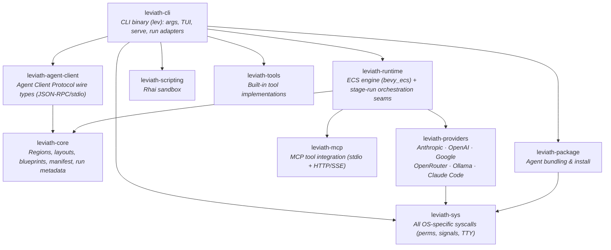

<div align="center">

# Leviath

**A structured agent runtime for LLMs**

**Coherent.** Structured context regions mean an agent still knows what it read 50 tool calls ago.<br>
**Right-sized.** Each phase of a task gets its own model, tools, and context layout, so you aren't paying frontier prices for file reads.<br>
**Light.** Hundreds of agents in one [bevy_ecs](https://bevyengine.org/) process, from a single binary. No Node, Python, or Docker.

[](https://github.com/Sun-Forge-AI/leviath/actions/workflows/ci.yml)
[](https://github.com/Sun-Forge-AI/leviath/actions/workflows/ci.yml)
[](https://github.com/Sun-Forge-AI/leviath/blob/main/LICENSE)
[](https://leviath.dev)

**[Quick Start](#quick-start) · [Agents](#pre-built-agents) · [Features](#features) · [Dashboard](#dashboard) · [API](#api-server) · [Agent Client Protocol](#agent-client-protocol) · [Comparison](#how-it-compares) · [Why not Leviath](#why-you-might-not-want-leviath) · [Contributing](#contributing)**

</div>

---

Most agent tools hand an LLM a flat message array and hope for the best. Leviath gives it **structure**: context that stays coherent across hundreds of tool calls, the right model for each phase of a task, and a dozen agents running at once without melting your machine.

<p align="center">
  
</p>

Use it for:

- **Agents beyond coding**: research, log analysis, daily briefings, and writing all ship [out of the box](#pre-built-agents)
- **Long tasks that stay coherent**: [context regions](#features) instead of a flat transcript
- **Agents you drive from anything that speaks HTTP**: a [REST + WebSocket API](#api-server) with webhooks, backed by an always-on daemon
- **Headless agents inside any [Agent Client Protocol](#agent-client-protocol) host**
- **Tinkering**: an ECS world, workflow graphs, Rhai script tools, and a [full TUI](#dashboard)

## At a glance

```bash
lev run coder --task "Build a CLI that converts CSV to JSON"    # run a coding agent...
lev run deep-researcher --task "Survey solid-state batteries"   # ...or a research agent
lev ps                           # list running agents
lev msg <agent-id> "..."         # steer a running agent mid-task
lev respond                      # answer questions agents are waiting on
lev dash                         # watch everything in the TUI dashboard
lev serve                        # REST + WebSocket API server
lev agent-client --agent coder   # serve an agent over the Agent Client Protocol
lev create my-agent              # scaffold your own agent
```

## Quick Start

### 1. Install

> **Private alpha:** installing needs a GitHub Personal Access Token; one-time setup in the [distribution repo](https://github.com/Sun-Forge-AI/leviath-dist).

**macOS (Homebrew):**

```bash
brew tap sun-forge-ai/leviath https://github.com/Sun-Forge-AI/leviath-dist.git
brew trust sun-forge-ai/leviath          # newer Homebrew requires trusting third-party taps
brew install leviath                     # stable - or: leviath-beta, leviath-alpha
```

**Linux:**

```bash
curl -fsSL -H "Authorization: token $GITHUB_TOKEN" \
  https://raw.githubusercontent.com/Sun-Forge-AI/leviath-dist/main/install.sh | bash -s -- --channel stable
```

**Windows (PowerShell):**

```powershell
irm -Headers @{Authorization="token $env:GITHUB_TOKEN"} `
  https://raw.githubusercontent.com/Sun-Forge-AI/leviath-dist/main/install.ps1 | iex
```

**Build from source** (any platform, requires [Rust](https://rustup.rs/)):

```bash
cargo install --git https://github.com/Sun-Forge-AI/leviath.git --bin lev
```

### 2. Configure a provider

One provider is all you need: an API key from [Anthropic](https://console.anthropic.com/), [OpenAI](https://platform.openai.com/), [Google AI](https://aistudio.google.com/), or [OpenRouter](https://openrouter.ai/). No key at all? Run a local [Ollama](https://ollama.com), or use the Claude Code transport below.

```bash
lev setup                                            # interactive wizard
lev setup --non-interactive --anthropic-key sk-ant-...  # scriptable
```

<details>
<summary><b>Claude Code transport (opt-in, no API key)</b>: run Leviath on your Claude subscription. Read the terms note.</summary>

<br/>

If you have [Claude Code](https://claude.com/claude-code) installed and signed in, enable it in `lev setup` to run Leviath on your Claude subscription with no API key. Leviath's structured regions work normally. It drives the CLI as a plain inference relay, keeping the context window, the tool loop, and the iteration count on Leviath's side.

> **⚠️ Terms of service:** Anthropic's terms [state](https://support.claude.com/en/articles/15036540-use-the-claude-agent-sdk-with-your-claude-plan) that third-party developers may not offer claude.ai login or subscription rate limits for their products without prior approval. Using this transport routes inference through your Claude subscription via the CLI's OAuth session. **By enabling it, you accept responsibility for compliance with Anthropic's terms.** For unambiguous compliance, use a direct Anthropic API key instead.

A few caveats, all measured:

- The CLI adds ~130 tokens of its own context to **every** call, including **your account email address** and the current date. No flag disables this without also disabling subscription auth.
- No prompt caching, and each call spawns a subprocess (~200 ms). Anthropic models only.
- For full control over what reaches the model, use a direct provider key.

</details>

### 3. Run an agent

```bash
lev run coder --task "Add pagination to the /users endpoint"

# ...or try a non-coding agent
lev run log-analyzer --task "Find what caused the error spike in ./logs last night"
```

`lev run` hands the agent to a background **daemon** that hosts every agent in one shared world, so runs keep going after your terminal closes. For unattended agents, `lev daemon install` puts it under launchd/systemd so it starts at login, restarts if it dies, and reloads interrupted runs. [Daemon docs →](https://leviath.dev/docs/daemon)

### 4. Create your own

```bash
lev create my-agent        # scaffolds a new agent directory
cd my-agent
lev run . --task "Your task here"
```

This writes an `agent.leviath` config you can customize: models per stage, context regions and their budgets, tools, and the workflow graph. [Agent configuration →](https://leviath.dev/docs/agents)

## Pre-built Agents

Ten agents ship out of the box, each a multi-stage directed graph with structured context regions, per-stage model fallback, and error recovery. In the graphs below, diamonds are LLM-routed or human-in-the-loop decisions, and dotted edges fire automatically on a runtime condition (like the `stuck` detector) rather than by the agent's choice.

<table>
<tr><th align="left">Agent</th><th align="left">Workflow</th></tr>
<tr>
<td valign="middle" width="30%"><b>software-engineer</b><br>Full coding workflow: codebase discovery, human-approved planning, an optional prototype spike, stuck detection</td>
<td><picture>
  <source media="(prefers-color-scheme: dark)" srcset="docs/assets/agents/software-engineer-dark.svg">
  
</picture></td>
</tr>
<tr>
<td valign="middle" width="30%"><b>wide-researcher</b><br>Broad multi-topic landscape survey: compares approaches, dives on interesting threads</td>
<td><picture>
  <source media="(prefers-color-scheme: dark)" srcset="docs/assets/agents/wide-researcher-dark.svg">
  
</picture></td>
</tr>
<tr>
<td valign="middle" width="30%"><b>deep-researcher</b><br>Thorough single-topic investigation: follows citation chains, cross-checks claims, writes a cited report</td>
<td><picture>
  <source media="(prefers-color-scheme: dark)" srcset="docs/assets/agents/deep-researcher-dark.svg">
  
</picture></td>
</tr>
</table>

<details>
<summary><b>The other seven</b>: coder, reviewer, parallel-fixer, researcher, log-analyzer, daily-briefer, writing-assistant</summary>

<br/>

<table>
<tr><th align="left">Agent</th><th align="left">Workflow</th></tr>
<tr>
<td valign="middle" width="30%"><b>coder</b><br>Focused implementation with discovery, an optional prototype spike, stuck detection, and a review loop</td>
<td><picture>
  <source media="(prefers-color-scheme: dark)" srcset="docs/assets/agents/coder-dark.svg">
  
</picture></td>
</tr>
<tr>
<td valign="middle" width="30%"><b>reviewer</b><br>Code review and audit, grounded in a discovery pass; read-only</td>
<td><picture>
  <source media="(prefers-color-scheme: dark)" srcset="docs/assets/agents/reviewer-dark.svg">
  
</picture></td>
</tr>
<tr>
<td valign="middle" width="30%"><b>parallel-fixer</b><br>Fixes many failing tests at once: one sub-agent worker per failure, merged and re-verified</td>
<td><picture>
  <source media="(prefers-color-scheme: dark)" srcset="docs/assets/agents/parallel-fixer-dark.svg">
  
</picture></td>
</tr>
<tr>
<td valign="middle" width="30%"><b>researcher</b><br>General-purpose research with a gather↔analyze refinement loop</td>
<td><picture>
  <source media="(prefers-color-scheme: dark)" srcset="docs/assets/agents/researcher-dark.svg">
  
</picture></td>
</tr>
<tr>
<td valign="middle" width="30%"><b>log-analyzer</b><br>Log analysis with scripted aggregation, severity-ranked findings</td>
<td><picture>
  <source media="(prefers-color-scheme: dark)" srcset="docs/assets/agents/log-analyzer-dark.svg">
  
</picture></td>
</tr>
<tr>
<td valign="middle" width="30%"><b>daily-briefer</b><br>Morning summaries from local and web sources</td>
<td><picture>
  <source media="(prefers-color-scheme: dark)" srcset="docs/assets/agents/daily-briefer-dark.svg">
  
</picture></td>
</tr>
<tr>
<td valign="middle" width="30%"><b>writing-assistant</b><br>Research-backed writing with an interactive outline checkpoint and a draft⇄edit loop</td>
<td><picture>
  <source media="(prefers-color-scheme: dark)" srcset="docs/assets/agents/writing-assistant-dark.svg">
  
</picture></td>
</tr>
</table>

</details>

## Features

### Structured context memory

Eight region kinds with deterministic eviction: architecture stays pinned, tool results evict first, and conversation auto-compacts into summaries. Route reads to specific regions so a file dump can't push out your system prompt. Budgets can be percentages of the model's context window, so a blueprint's intent survives across models of different sizes. And when the built-ins don't fit, a [`custom` region](docs/rhai-regions.md) hands one region's rendering, writes, and eviction to a Rhai script you control - up to owning the entire context window as a single scripted region. [Learn more →](https://leviath.dev/docs/context)

### Multi-stage workflows

Each stage gets its own model, tools, and context layout. Run them linearly or as a [directed graph](https://leviath.dev/docs/stages#graph) with conditional transitions, error recovery, and LLM-driven routing, then check the graph with `lev validate`. A `stuck` edge escapes a stage that is making no progress. Stuckness is measured, not self-reported:

```toml
[stages.implement.transitions.reassess]
condition = "stuck"
stuck_after_iterations      = 20   # inferences in this stage
stuck_after_same_file_edits = 5    # write/edit calls against one path
```

[Learn more →](https://leviath.dev/docs/stages)

### ECS agent engine

Agents run as entities in a [bevy_ecs](https://bevyengine.org/) world. Hundreds can share one process with game-engine-style scheduling (ten agents each fanning out to ten sub-agents is still one process), instead of that many OS processes fighting for resources.

And no, hundreds of agents won't stampede your provider: a shared per-model inference pool caps how many requests are in flight to each model across the whole world, and an agent waiting for a slot just sits as data until one frees. Optional per-provider rate limits (requests and tokens per minute) are enforced on top, before every call. [Learn more →](https://leviath.dev/docs/engine)

### Sub-agents and fan-out

Agents spawn children with different blueprints. A **fan-out** stage splits a task into work items, runs one sub-agent worker per item concurrently, and merges the results back into the parent, all in the same process. Any sub-agent, at any depth, can ask the user questions directly. [Learn more →](https://leviath.dev/docs/sub-agents)

### Human-in-the-loop

The core primitive is **mid-run message injection**: `lev msg` (or the API) drops a message straight into a running agent's context, and the model sees it on its next inference call, so you redirect or add constraints without restarting. Stages can opt out with `accepts_messages = false`; a message then waits in the inbox until a stage that accepts it. Force checkpoints with `interaction_points` (approve, request revisions, or edit the agent's output directly), or grant `ask_user_*` tools so the agent asks on its own judgment. [Learn more →](https://leviath.dev/docs/interaction)

### Security: sandboxed execution and taint tracking

By default an agent's shell commands run directly on your machine, with nothing extra to install. When you want isolation, opt in per agent or per stage:

- **Containers** (Docker, Podman, or anything Docker-CLI-compatible). The daemon keeps a warm container per agent and tears it down when the run ends. Containers drop every capability, forbid privilege regain, and are bounded in processes and memory, while file tools keep working over the bind-mounted workdir.
- **Linux namespaces**, a lighter option that needs no container runtime. It isolates PIDs and, with `network = false`, connectivity. It shares the host filesystem, so reach for a container when you want real containment.
- Mix them per stage: run analysis on the host and implementation in a networkless container. An installed agent can tighten its sandbox but never turn one off.

**Taint tracking (experimental).** A deterministic sensitivity model for what leaves the machine:

- Every context region carries a sensitivity label (Public / Internal / Private), set by the runtime and never by model output.
- Any tool that can carry bytes off the machine is gated: a call carrying data above its clearance is blocked before it fires, or surfaced as an *allow once / allow for session / deny* prompt in the daemon.
- Layer on allowlists and Rhai policy rules for finer control.
- Dry-run any tool against the real gate with `lev policy test`.

[Learn more →](https://leviath.dev/docs/security)

## Dashboard

<p align="center">
  
</p>

`lev dash` is a full TUI for managing concurrent agents: stage tabs, context-window visualization, markdown rendering, sub-agent tree view, and full mouse support including drag-to-copy (works over SSH). Press **`m`** to manage MCP tool servers without leaving the dashboard. [Dashboard docs →](https://leviath.dev/docs/dashboard)

## API Server

`lev serve` exposes a REST + WebSocket API, so anything that speaks HTTP can integrate with it. No SDK required. It covers agent lifecycle, human-in-the-loop interaction, per-agent streaming, and signed webhook callbacks on completion. Because the API can spawn tool-executing agents, it refuses to start without a token and binds to `127.0.0.1` by default.

```bash
lev serve --port 3000

# spawn an agent (with a completion webhook + signing secret)
curl -X POST http://localhost:3000/api/agents \
  -H "Content-Type: application/json" \
  -d '{"blueprint": "coder", "task": "Add input validation",
       "callback_url": "https://example.com/hook",
       "callback_secret": "whsec_…"}'
```

[Full API reference →](https://leviath.dev/docs/api)

## Observability

Production deployments can export structured traces, metrics, and logs over OpenTelemetry. Every run becomes a trace — `agent.run` → `agent.stage` → per-call `agent.inference` / `agent.tool_call` spans — alongside token counters, stage-duration and inference-latency histograms, and log records carrying the run's trace ID.

```toml
[observability]
enabled = true
exporter = "otlp"                     # "otlp" | "stdout" | "none"
endpoint = "http://localhost:4318"    # OTLP over HTTP - 4318, not the 4317 gRPC port
service_name = "leviath"
```

Off by default. The standard `OTEL_EXPORTER_OTLP_ENDPOINT` / `OTEL_SERVICE_NAME` env vars fill any hole the file leaves. `exporter = "stdout"` narrates the same events as readable log lines on stderr instead.

## Agent Client Protocol

`lev agent-client` serves any Leviath agent over the [Agent Client Protocol](https://agentclientprotocol.com): JSON-RPC 2.0 over stdio, the protocol agent hosts like [Gas City](https://github.com/gastownhall/gascity) and [Zed](https://zed.dev) use to drive a headless agent as a child process. A `session/prompt` runs the blueprint in the shared-world daemon and streams output back as `session/update` notifications.

```bash
lev agent-client --agent coder            # speaks the protocol on stdin/stdout
```

Wiring it into a host is config, not code. Here's a Gas City provider, for example:

```toml
# Gas City provider declaration
[providers.leviath]
command      = "lev agent-client --agent coder"
supports_acp = true

# agents/reviewer/agent.toml
provider = "leviath"
session  = "acp"          # Gas City's key name for the Agent Client Protocol
```

- A `session/prompt` stays in flight until the run **genuinely finishes**. It is never reported "done" while the agent waits on input.
- Hosts that implement `session/request_permission` (e.g. Zed) get interactive tool approval in-turn.
- Hosts that don't (e.g. Gas City) see questions surfaced as agent output; resolve them via `lev dash` / `lev respond`, or prefer autonomous blueprints / `--yolo` for a clean sling-a-task-get-a-result flow.

> "ACP" is claimed by two unrelated protocols; Leviath implements the Agent **Client** Protocol (JSON-RPC/stdio), not BeeAI's Agent Communication Protocol.

## How we measure

Leviath is a runtime that orchestrates agents, not a coding agent itself, so we don't publish head-to-head numbers against tools like Claude Code or Codex. They sit at a different layer of the stack. What we measure, on the same tasks with the same models, with every run published:

- **Structured vs flat context**: the same Leviath runtime with regions enabled vs disabled, scored on held-out test pass rate, total billed tokens (including cache reads and writes), and cost.
- **Resource footprint**: absolute memory of one daemon running many concurrent agents.

Methodology and raw data: [leviath-benchmarks](https://github.com/Sun-Forge-AI/leviath-benchmarks).

## How it compares

These four tools sit at different layers of the agent stack and make different architectural bets. Claude Code is a polished coding agent with an SDK to embed its harness, CrewAI and LangGraph are frameworks you build agents *in*, and Leviath is a standalone runtime agents run *on*. None is a drop-in replacement for another, so this table compares models, not merit; competitor descriptions come from each project's own documentation.

| | **Leviath** | **Claude Code + Agent SDK** | **CrewAI** | **LangGraph** |
|---|---|---|---|---|
| **Primary layer** | Standalone agent runtime, single binary | Coding agent CLI + SDK harness | Python multi-agent framework | Low-level orchestration framework (Python/JS) |
| **Process model for N agents** | N agents as entities in one bevy_ecs daemon | One `claude` subprocess per session; "N sessions = N subprocesses" | Runs inside your Python app; async kickoff variants | Runs in your app process; hosted server optional |
| **Context-window management** | Typed regions, deterministic eviction, per-stage budgets | Auto-compaction summarizes history near the limit | Auto-summarizes on overflow (`respect_context_window`) | Developer-controlled graph state, durable via checkpointers |
| **Multi-agent orchestration** | Multi-stage workflow graphs; in-process sub-agent fan-out | Subagents within a session; agent teams (experimental) | Crews (role-based teams) coordinated by Flows | Explicit graphs mixing deterministic and agentic steps |
| **How agents are defined** | TOML blueprints + Rhai script tools | Markdown + YAML frontmatter; code via SDK | JSONC/YAML config or Python `Agent` classes | Python or TypeScript code |
| **Runtime dependencies** | Single native binary; no Node/Python/Docker | Native CLI; SDKs need Node 18+ or Python 3.10+ | Python 3.10-3.13, uv-managed | Python or Node.js application runtime |
| **Headless / API surface** | REST + WebSocket daemon; Agent Client Protocol stdio | `claude -p` with JSON/stream output; Python/TS SDK | `kickoff()` in-process; REST via CrewAI AMP | Library calls; REST via LangSmith Deployment |
| **Human-in-the-loop mid-run** | Mid-run message injection; forced checkpoints; ask-user tools | Interactive steering, interrupts, permission prompts | `human_input` flag pauses a task for feedback | First-class `interrupt()`: pause indefinitely, resume with `Command` |
| **Sandboxing / isolation** | Opt-in per agent or stage: containers or Linux namespaces | Opt-in OS sandbox for Bash (Seatbelt / bubblewrap) | Docs recommend external sandbox services (E2B, Modal) | Sandbox backends via LangChain's Deep Agents |
| **Managed / hosted option** | None; single machine | Managed Agents (Anthropic-hosted) | CrewAI AMP | LangSmith Deployment cloud |

And here is Leviath scored against [12-Factor Agents](https://github.com/humanlayer/12-factor-agents), including where it falls short today:

| # | Factor | Status | Notes |
|---|---|---|---|
| 1 | Natural language to tool calls | ✓ | Provider tool calls map 1:1 into the runtime; a text-protocol fallback exists only for the Claude Code transport |
| 2 | Own your prompts | ✓ | Stage, system, and transition prompts live in your blueprint TOML; a few small framework nudges are fixed text |
| 3 | Own your context window | ✓ | Region kinds, per-stage layouts, per-tool routing, percentage budgets |
| 4 | Tools are structured outputs | partial | Tools declare JSON Schemas; arguments are checked per-handler, not schema-validated at dispatch |
| 5 | Unify execution and business state | ✓ | One append-only run journal, replayable with `lev context` |
| 6 | Launch / pause / resume | partial | Launch via CLI, REST, or ACP; pause and resume exist in the runtime but have no user-facing command yet |
| 7 | Contact humans with tool calls | ✓ | `ask_user_*` tools plus blueprint `interaction_points`, answered from CLI, REST, or ACP |
| 8 | Own your control flow | ✓ | Graph transitions with error, max-iterations, stuck, and LLM-choice conditions |
| 9 | Compact errors into context | partial | Tool errors land in context; inference errors currently go to logs, not context |
| 10 | Small, focused agents | ✓ | Per-stage models, tools, and prompts; sub-agents; bounded fan-out |
| 11 | Trigger from anywhere | partial | CLI, REST + WebSocket, ACP stdio, signed webhooks out; no built-in scheduler, so use system cron |
| 12 | Stateless reducer | ✗ | The engine is a stateful ECS world; the run journal's fold is a true reducer, but the loop itself isn't |

## Why you might not want Leviath

- **It's not a replacement for Claude Code, Codex, or your favorite coding agent.** Leviath is a runtime for building and orchestrating agents. Those are polished interactive products at a different layer, and Leviath can even run on top of Claude Code as a transport.
- **Agents are config, not code.** A Leviath agent is a TOML blueprint plus optional Rhai script tools. If you want to write agent logic as Python or TypeScript against an SDK, that model isn't here; other languages drive Leviath through the REST API instead.
- **It runs on one machine.** The daemon hosts every agent in a single process on a single box. There is no hosted service and no multi-machine orchestration.
- **You need a model provider**: an API key, a local Ollama, or the Claude Code transport (with its terms-of-service caveat).

## CLI

| Command | Description |
|---------|-------------|
| `lev create <name>` | Create an agent project |
| `lev run [path] --task "..."` | Run an agent in the shared-world daemon (auto-started) |
| `lev ps` | List running agents and their status |
| `lev msg <agent-id> <content>` | Inject a message into a running agent |
| `lev respond [req-id] [value]` | List or answer pending `ask_user` interactions |
| `lev cancel <run-id>` | Cancel a running agent |
| `lev dash` | TUI dashboard |
| `lev serve` | REST + WebSocket API server |
| `lev agent-client` | Serve an agent over the Agent Client Protocol (stdio) |
| `lev validate [path]` | Validate an agent blueprint |
| `lev mcp add\|list\|remove` | Manage MCP tool servers |
| `lev setup` | Configuration wizard |

The full list, including packaging, testing, policy, and auth commands: `lev --help`.

### MCP tool servers

Leviath connects to [Model Context Protocol](https://modelcontextprotocol.io) servers over stdio or HTTP. `lev mcp add` detects OAuth servers and opens your browser to log in; tokens are stored with `0600` permissions and refreshed automatically. Configure in `~/.leviath/config.toml`:

```toml
[[mcp_servers]]
name = "filesystem"
command = "npx"
args = ["-y", "@modelcontextprotocol/server-filesystem", "/path"]
```

[MCP docs →](https://leviath.dev/docs/mcp)

## Providers

| Provider | API Key |
|----------|---------|
| Anthropic | `ANTHROPIC_API_KEY` |
| OpenAI | `OPENAI_API_KEY` |
| Google (Gemini) | `GOOGLE_API_KEY` |
| OpenRouter | `OPENROUTER_API_KEY` |
| Ollama | *none (local)* |
| Claude Code | *none (subscription)* |

Optional client-side rate limits per provider (requests and tokens per minute), enforced before each call. Custom OpenAI-compatible providers can be added as Rhai scripts. [Provider docs →](https://leviath.dev/docs/providers)

## Releases

| Channel | Cadence | Tag | Stability |
|---------|---------|-----|-----------|
| **Alpha** | Nightly | `alpha` | Bleeding edge |
| **Beta** | Weekly (Monday) | `beta` | Tested |
| **Stable** | Weekly (Thursday, approval-gated) | `latest` | Production |

Channel tags roll with every publish; each stable deploy also cuts an immutable `vX.Y.Z` release, which is what Homebrew and Scoop pin to. Install commands per channel: [distribution repo](https://github.com/Sun-Forge-AI/leviath-dist).

## Security

Leviath runs LLM-driven tools on your machine, so [SECURITY.md](SECURITY.md) states plainly what it defends against (a malicious agent package, prompt injection reaching an agent's tools, a hostile MCP server, another local user) and what it does not, including that the model can do anything you granted it. It also covers vulnerability reporting, where every secret lives, hardening a `lev serve` deployment, and verifying a release's signed build provenance.

## Contributing

```bash
git clone https://github.com/Sun-Forge-AI/leviath.git
cd leviath
cargo build
cargo test --workspace
```

The pre-commit hook installs itself on first build, with no setup step, and enforces formatting, clippy, doc lints, and the full test suite. The workspace is gated at a hard **100% coverage on lines, regions, and functions**, with no opt-outs and coverage-suppression markers banned by lint; CI enforces it on Linux, macOS, and Windows. The only exclusion is the thin `lev` binary entrypoint, guarded by a CI check. Details on the hook, `ast-grep`, and the coverage tooling: [CONTRIBUTING.md](CONTRIBUTING.md).

<details>
<summary><b>Crate map</b></summary>

<br/>

Every platform-specific system call lives in one crate, `leviath-sys`, behind a cross-platform API, so the rest of the workspace is free of scattered per-OS branches.



</details>

## License

[MIT](LICENSE) © Sun Forge AI

---

<p align="center">
  <a href="https://leviath.dev">Website</a> ·
  <a href="https://leviath.dev/docs">Docs</a> ·
  <a href="https://github.com/Sun-Forge-AI/leviath">GitHub</a> ·
  <a href="https://github.com/Sun-Forge-AI/leviath/issues">Issues</a>
</p>
