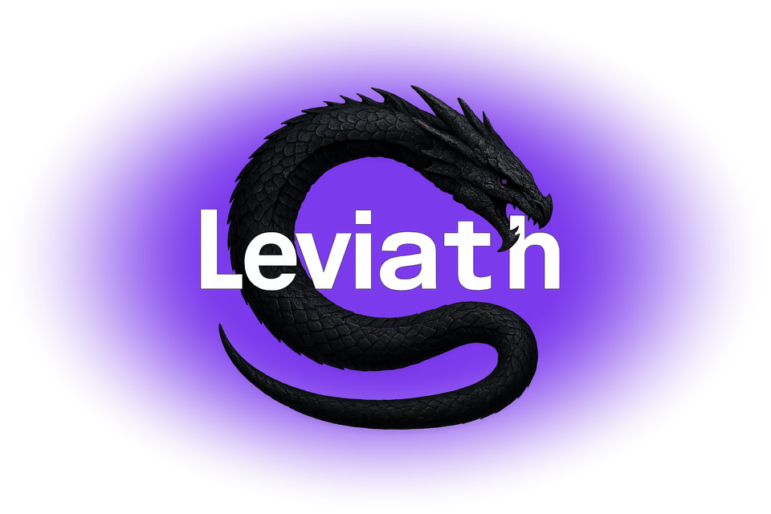
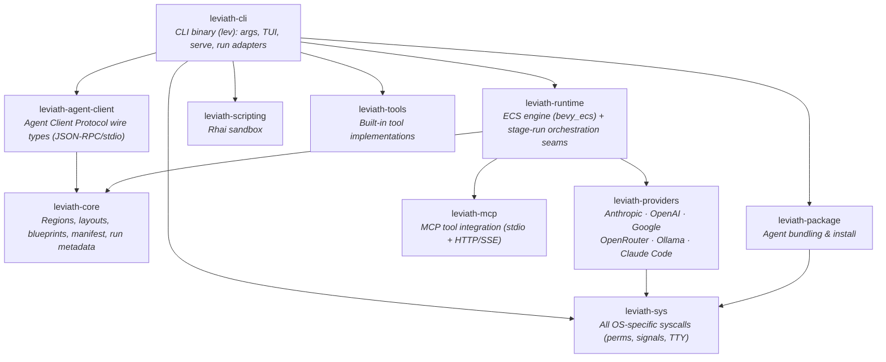

<div align="center">



**A structured runtime for AI agents**

**Coherent.** Structured context regions mean an agent still knows what it read 50 tool calls ago.<br>
**Right-sized.** Each phase of a task gets its own model, tools, and context layout, so you aren't paying frontier prices for file reads.<br>
**Light.** Hundreds of agents in one [bevy_ecs](https://bevyengine.org/) process, from a single binary. No Node, Python, or Docker.

[](https://github.com/GEMISIS/leviath/actions/workflows/ci.yml)
[](https://github.com/GEMISIS/leviath/actions/workflows/ci.yml)
[](https://github.com/GEMISIS/leviath/blob/main/LICENSE)
[](https://leviath.dev)

[](https://github.com/GEMISIS/leviath/releases/latest)
[](https://github.com/GEMISIS/leviath/releases/tag/beta)
[](https://github.com/GEMISIS/leviath/releases/tag/alpha)

**[Quick Start](#quick-start) · [Agents](#pre-built-agents) · [Features](#features) · [Dashboard](#dashboard) · [API](#api-server) · [Agent Client Protocol](#agent-client-protocol) · [Comparison](#how-it-compares) · [Why not Leviath](#why-you-might-not-want-leviath) · [Contributing](#contributing)**

</div>

---

Give a model one flat list of messages and a single big file read pushes your system prompt out of the window. Leviath gives it **structure** instead: context that stays coherent across hundreds of tool calls, the right model for each phase of a task, and hundreds of agents running at once on one machine.

<p align="center">
  
</p>

Use it for:

- **Agents beyond coding**: research, log analysis, daily briefings, and writing all ship [out of the box](#pre-built-agents)
- **Long tasks that stay coherent**: [context regions](#features) instead of a flat transcript
- **Agents you drive from anything that speaks HTTP**: a [REST + WebSocket API](#api-server) with webhooks, backed by an always-on daemon
- **Headless agents inside any [Agent Client Protocol](#agent-client-protocol) host**
- **Tinkering**: an ECS world, workflow graphs, Rhai script tools, and a [full TUI](#dashboard)

## At a glance

```bash
lev run coder --task "Build a CLI that converts CSV to JSON"    # run a coding agent...
lev run deep-researcher --task "Survey solid-state batteries"   # ...or a research agent
lev ps                           # list running agents, and what each is waiting on
lev msg <agent-id> "..."         # steer a running agent mid-task
lev respond                      # answer questions agents are waiting on
lev dash                         # watch everything in the TUI dashboard
lev serve                        # REST + WebSocket API server
lev agent-client --agent coder   # serve an agent over the Agent Client Protocol
lev create my-agent              # scaffold your own agent
```

## Quick Start

### 1. Install

**macOS and Linux:**

```bash
curl -fsSL https://leviath.dev/install.sh | sh
```

**Windows**, pasting into either Command Prompt or PowerShell:

```powershell
powershell -ExecutionPolicy Bypass -c "irm https://leviath.dev/install.ps1 | iex"
```

The script picks the right installer for your platform and takes the stable
channel by default; set `LEVIATH_CHANNEL` to `beta` or `alpha` to switch. Both
install prebuilt binaries, so no Rust toolchain is needed.

<details>
<summary><b>Package managers</b>: Homebrew and Scoop, if you would rather manage it that way</summary>

<br/>

```bash
# macOS - what install.sh runs for you
brew tap gemisis/leviath https://github.com/GEMISIS/leviath-dist.git
brew trust gemisis/leviath          # Homebrew 6 requires trusting third-party taps
brew install leviath                # stable - or: leviath-beta, leviath-alpha
```

```powershell
# Windows
scoop bucket add leviath https://github.com/GEMISIS/leviath-dist.git
scoop install leviath
```

</details>

**Cargo** (any platform, requires [Rust](https://rustup.rs/)):

```bash
cargo install leviath-cli                # released version from crates.io
cargo install --git https://github.com/GEMISIS/leviath.git --bin lev   # latest development build
```

Leviath is also a library: add the [`leviath`](https://crates.io/crates/leviath) crate to embed the runtime in your own application. The [embedding guide](https://leviath.dev/docs/embedding) covers building a world, spawning agents, and streaming their events in-process.

### 2. Configure a provider

One provider is all you need: an API key from [Anthropic](https://console.anthropic.com/), [OpenAI](https://platform.openai.com/), [Google AI](https://aistudio.google.com/), or [OpenRouter](https://openrouter.ai/). No key at all? Run a local [Ollama](https://ollama.com), or use the Claude Code transport below.

```bash
lev setup                                            # interactive wizard
lev setup --non-interactive --anthropic-key sk-ant-...  # scriptable
```

<details>
<summary><b>Claude Code transport (opt-in, no API key)</b>: run Leviath on your Claude subscription. Read the terms note.</summary>

<br/>

If you have [Claude Code](https://claude.com/claude-code) installed and signed in, enable it in `lev setup` to run Leviath on your Claude subscription with no API key. Leviath's structured regions work normally. It drives the CLI as a plain inference relay, keeping the context window, the tool loop, and the iteration count on Leviath's side.

> **⚠️ Terms of service:** Anthropic's terms [state](https://support.claude.com/en/articles/15036540-use-the-claude-agent-sdk-with-your-claude-plan) that third-party developers may not offer claude.ai login or subscription rate limits for their products without prior approval. Using this transport routes inference through your Claude subscription via the CLI's OAuth session. **By enabling it, you accept responsibility for compliance with Anthropic's terms.** For unambiguous compliance, use a direct Anthropic API key instead.

A few caveats, all measured:

- The CLI adds ~130 tokens of its own context to **every** call, including **your account email address** and the current date. No flag disables this without also disabling subscription auth.
- No prompt caching, and each call spawns a subprocess (~200 ms). Anthropic models only.
- For full control over what reaches the model, use a direct provider key.

</details>

### 3. Run an agent

```bash
lev run coder --task "Add pagination to the /users endpoint"

# ...or try a non-coding agent
lev run log-analyzer --task "Find what caused the error spike in ./logs last night"
```

`lev run` hands the agent to a background **daemon** that hosts every agent in one shared world, so runs keep going after your terminal closes. For unattended agents, `lev daemon install` puts it under launchd/systemd so it starts at login, restarts if it dies, and reloads interrupted runs. [Daemon docs →](https://leviath.dev/docs/daemon)

### 4. Create your own

```bash
lev create my-agent        # scaffolds a new agent directory
cd my-agent
lev run . --task "Your task here"
```

This writes an `agent.leviath` config you can customize: models per stage, context regions and their budgets, tools, and the workflow graph. [Agent configuration →](https://leviath.dev/docs/agents)

## Pre-built Agents

Ten agents ship out of the box, each a multi-stage directed graph with structured context regions, per-stage model fallback, and error recovery. In the graphs below, diamonds are LLM-routed or human-in-the-loop decisions, and dotted edges fire automatically on a runtime condition (like the `stuck` detector) rather than by the agent's choice.

<table>
<tr><th align="left">Agent</th><th align="left">Workflow</th></tr>
<tr>
<td valign="middle" width="30%"><b>software-engineer</b><br>Full coding workflow: codebase discovery, human-approved planning, an optional prototype spike, stuck detection</td>
<td><picture>
  <source media="(prefers-color-scheme: dark)" srcset="docs/assets/agents/software-engineer-dark.svg">
  
</picture></td>
</tr>
<tr>
<td valign="middle" width="30%"><b>wide-researcher</b><br>Broad multi-topic landscape survey: compares approaches, dives on interesting threads</td>
<td><picture>
  <source media="(prefers-color-scheme: dark)" srcset="docs/assets/agents/wide-researcher-dark.svg">
  
</picture></td>
</tr>
<tr>
<td valign="middle" width="30%"><b>deep-researcher</b><br>Thorough single-topic investigation: follows citation chains, cross-checks claims, writes a cited report</td>
<td><picture>
  <source media="(prefers-color-scheme: dark)" srcset="docs/assets/agents/deep-researcher-dark.svg">
  
</picture></td>
</tr>
</table>

<details>
<summary><b>The other seven</b>: coder, reviewer, parallel-fixer, researcher, log-analyzer, daily-briefer, writing-assistant</summary>

<br/>

<table>
<tr><th align="left">Agent</th><th align="left">Workflow</th></tr>
<tr>
<td valign="middle" width="30%"><b>coder</b><br>Focused implementation with discovery, an optional prototype spike, stuck detection, and a review loop</td>
<td><picture>
  <source media="(prefers-color-scheme: dark)" srcset="docs/assets/agents/coder-dark.svg">
  
</picture></td>
</tr>
<tr>
<td valign="middle" width="30%"><b>reviewer</b><br>Code review and audit, grounded in a discovery pass; read-only</td>
<td><picture>
  <source media="(prefers-color-scheme: dark)" srcset="docs/assets/agents/reviewer-dark.svg">
  
</picture></td>
</tr>
<tr>
<td valign="middle" width="30%"><b>parallel-fixer</b><br>Fixes many failing tests at once: one sub-agent worker per failure, merged and re-verified</td>
<td><picture>
  <source media="(prefers-color-scheme: dark)" srcset="docs/assets/agents/parallel-fixer-dark.svg">
  
</picture></td>
</tr>
<tr>
<td valign="middle" width="30%"><b>researcher</b><br>General-purpose research with a gather↔analyze refinement loop</td>
<td><picture>
  <source media="(prefers-color-scheme: dark)" srcset="docs/assets/agents/researcher-dark.svg">
  
</picture></td>
</tr>
<tr>
<td valign="middle" width="30%"><b>log-analyzer</b><br>Log analysis with scripted aggregation, severity-ranked findings</td>
<td><picture>
  <source media="(prefers-color-scheme: dark)" srcset="docs/assets/agents/log-analyzer-dark.svg">
  
</picture></td>
</tr>
<tr>
<td valign="middle" width="30%"><b>daily-briefer</b><br>Morning summaries from local and web sources</td>
<td><picture>
  <source media="(prefers-color-scheme: dark)" srcset="docs/assets/agents/daily-briefer-dark.svg">
  
</picture></td>
</tr>
<tr>
<td valign="middle" width="30%"><b>writing-assistant</b><br>Research-backed writing with an interactive outline checkpoint and a draft⇄edit loop</td>
<td><picture>
  <source media="(prefers-color-scheme: dark)" srcset="docs/assets/agents/writing-assistant-dark.svg">
  
</picture></td>
</tr>
</table>

</details>

## Features

### Structured context memory

The context window is split into named regions, and you decide what each one drops first. Architecture stays pinned, tool results go first, conversation compacts into summaries. A file dump can only crowd out the region it landed in.

Budgets are percentages of the model's window, so the same blueprint keeps its shape when you switch models. When the eight built-in region kinds do not fit, a [`custom` region](https://leviath.dev/docs/rhai-regions) hands one region to a Rhai script you write. [Learn more →](https://leviath.dev/docs/context)

### Multi-stage workflows

Each stage gets its own model, tools, and context layout. Run them linearly or as a [directed graph](https://leviath.dev/docs/stages#graph) with conditional transitions, error recovery, and LLM-driven routing, then check the graph with `lev validate`. A `stuck` edge escapes a stage that is making no progress, and stuckness is measured by the runtime (iteration counts, repeated edits to one file), not self-reported by the model. [Learn more →](https://leviath.dev/docs/stages)

### ECS agent engine

Agents run as entities in a [bevy_ecs](https://bevyengine.org/) world. Hundreds can share one process with game-engine-style scheduling (ten agents each fanning out to ten sub-agents is still one process), instead of that many OS processes fighting for resources.

And no, hundreds of agents won't stampede your provider: a shared per-model inference pool caps how many requests are in flight to each model across the whole world, and an agent waiting for a slot just sits as data until one frees. Optional per-provider rate limits (requests and tokens per minute) are enforced on top, before every call. [Learn more →](https://leviath.dev/docs/engine)

### Sub-agents and fan-out

Agents spawn children with different blueprints. A **fan-out** stage splits a task into work items, runs one sub-agent worker per item concurrently, and merges the results back into the parent, all in the same process. Any sub-agent, at any depth, can ask the user questions directly. [Learn more →](https://leviath.dev/docs/sub-agents)

### Human-in-the-loop

The core primitive is **mid-run message injection**: `lev msg` (or the API) drops a message straight into a running agent's context, and the model sees it on its next inference call, so you redirect or add constraints without restarting. Stages can opt out with `accepts_messages = false`; a message then waits in the inbox until a stage that accepts it. Force checkpoints with `interaction_points` (approve, request revisions, or edit the agent's output directly), or grant `ask_user_*` tools so the agent asks on its own judgment. [Learn more →](https://leviath.dev/docs/interaction)

### Security: sandboxed execution and taint tracking

By default an agent's shell commands run on your machine with nothing extra to install. When you want isolation, opt in per agent or per stage: hardened **containers** (Docker/Podman, capabilities dropped, warm per agent) or lighter **Linux namespaces**, mixable within one workflow - and an installed agent can tighten its sandbox but never turn one off. Experimental **taint tracking** labels every context region's sensitivity and gates exfiltration-capable tool calls before they fire, with allowlists and scripted policy rules on top. [Learn more →](https://leviath.dev/docs/security)

## Dashboard

<p align="center">
  
</p>

`lev dash` is a full TUI for managing concurrent agents: stage tabs, context-window visualization, markdown rendering, sub-agent tree view, and full mouse support including drag-to-copy (works over SSH). Press **`m`** to manage MCP tool servers without leaving the dashboard. [Dashboard docs →](https://leviath.dev/docs/dashboard)

## API Server

`lev serve` exposes a REST + WebSocket API, so anything that speaks HTTP can integrate with it. No SDK required. It covers agent lifecycle, human-in-the-loop interaction, per-agent streaming, and signed webhook callbacks on completion, and it ships a browser console at `/app` for driving agents from a web page. Because the API can spawn tool-executing agents, it refuses to start without a token and binds to `127.0.0.1` by default.

```bash
export LEVIATH_API_TOKEN="$(openssl rand -hex 16)"
lev serve --port 3000

# spawn an agent (with a completion webhook + signing secret)
curl -X POST http://localhost:3000/api/agents \
  -H "Authorization: Bearer $LEVIATH_API_TOKEN" \
  -H "Content-Type: application/json" \
  -d '{"blueprint": "coder", "task": "Add input validation",
       "callback_url": "https://example.com/hook",
       "callback_secret": "whsec_…"}'
```

[Full API reference →](https://leviath.dev/docs/api)

## Observability

Production deployments can export structured traces, metrics, and logs over OpenTelemetry. Every run becomes a trace (`agent.run` → `agent.stage` → per-call `agent.inference` / `agent.tool_call` spans) alongside token counters, latency histograms, and log records carrying the run's trace ID. Off by default; one config block turns it on. [Observability docs →](https://leviath.dev/docs/observability)

## Agent Client Protocol

`lev agent-client --agent coder` serves any Leviath agent over the [Agent Client Protocol](https://agentclientprotocol.com) (JSON-RPC 2.0 over stdio), so hosts like [Zed](https://zed.dev) and [Gas City](https://github.com/gastownhall/gascity) can drive a headless agent as a child process. Wiring it into a host is config, not code. A `session/prompt` stays in flight until the run genuinely finishes, and hosts with `session/request_permission` get interactive tool approval in-turn. [Editor integration docs →](https://leviath.dev/docs/agent-client-protocol)

> "ACP" is claimed by two unrelated protocols; Leviath implements the Agent **Client** Protocol (JSON-RPC/stdio), not BeeAI's Agent Communication Protocol.

## How we measure

Leviath is a runtime that orchestrates agents, not a coding agent itself, so we don't publish head-to-head numbers against tools like Claude Code or Codex. They sit at a different layer of the stack. What we measure, on the same tasks with the same models:

- **Structured vs flat context**: the same Leviath runtime with regions enabled vs disabled, scored on held-out test pass rate, total billed tokens (including cache reads and writes), and cost.
- **Resource footprint**: absolute memory of one daemon running many concurrent agents.

Methodology and raw data will be published alongside the benchmark results.

## How it compares

Leviath is a runtime that agents run *on*. Claude Code is a polished coding agent you work with,
CrewAI and LangGraph are frameworks you build agents *in*, and Gas Town, Gas City and Smithy are
orchestrators that decide which work happens. Several of those are worth running alongside Leviath
rather than instead of it.

The full breakdown, including what each design buys and costs, when to reach for something else,
where Leviath falls short of [12-Factor Agents](https://github.com/humanlayer/12-factor-agents),
and why you might not want Leviath at all, is on the docs site:
[Where Leviath sits →](https://leviath.dev/docs/comparison)

## Why you might not want Leviath

- **It's not a replacement for Claude Code, Codex, or your favorite coding agent.** Those are polished interactive products at a different layer, and Leviath can even run on top of Claude Code as a transport.
- **Agents are config, not code.** A Leviath agent is a TOML blueprint plus optional Rhai script tools. If you want to write agent logic in Python or TypeScript against an SDK, other languages drive Leviath through the REST API instead.
- **It runs on one machine.** The daemon hosts every agent in a single process on a single box. There is no hosted service and no multi-machine orchestration.
- **Agents share a process.** That is what makes them cheap, and it means you don't get the isolation a process-per-agent design gives you for free. [Sandboxing](https://leviath.dev/docs/security) is opt-in.
- **You need a model provider**: an API key, a local Ollama, or the Claude Code transport (with its terms-of-service caveat).

## CLI

The [At a glance](#at-a-glance) block above covers the daily commands; the full surface (packaging, testing, policy, auth, daemon control) is in `lev --help` and the [CLI reference](https://leviath.dev/docs/cli). Every `config.toml` key and environment variable is in the [configuration reference](https://leviath.dev/docs/configuration).

Leviath also connects to [Model Context Protocol](https://modelcontextprotocol.io) tool servers over stdio or HTTP: `lev mcp add` detects OAuth servers and opens your browser to log in, and tokens are stored with `0600` permissions and refreshed automatically. [MCP docs →](https://leviath.dev/docs/mcp)

## Providers

Anthropic, OpenAI, Google (Gemini), OpenRouter, local [Ollama](https://ollama.com) with no key, and the Claude Code subscription transport, with per-stage model fallback, optional client-side rate limits enforced before each call, and custom OpenAI-compatible providers as [Rhai scripts](https://leviath.dev/docs/rhai-providers). [Provider docs →](https://leviath.dev/docs/providers)

## Releases

| Channel | Cadence | Tag | Stability |
|---------|---------|-----|-----------|
| **Alpha** | Nightly | `alpha` | Bleeding edge |
| **Beta** | Weekly (Monday) | `beta` | Tested |
| **Stable** | Weekly (Thursday, approval-gated) | `latest` | Production |

Channel tags roll with every publish; each stable deploy also cuts an immutable versioned release (`vX.Y.Z`, date-suffixed when the same version ships twice). One binary is built on alpha and promoted unchanged through beta and stable, checksum-verified at every hop, and each channel's docs are rendered from the exact commit its binaries came from. [Release docs →](https://leviath.dev/docs/releases) · [distribution repo](https://github.com/GEMISIS/leviath-dist)

## Security

Leviath runs LLM-driven tools on your machine, so [SECURITY.md](SECURITY.md) states plainly what it defends against (a malicious agent package, prompt injection reaching an agent's tools, a hostile MCP server, another local user) and what it does not, including that the model can do anything you granted it. It also covers vulnerability reporting, where every secret lives, hardening a `lev serve` deployment, and verifying a release's signed build provenance.

## Contributing

```bash
git clone https://github.com/GEMISIS/leviath.git
cd leviath
cargo build
cargo test --workspace
```

The pre-commit hook installs itself on first build, with no setup step, and enforces formatting, clippy, doc lints, and the full test suite. The workspace is gated at a hard **100% coverage on lines, regions, and functions**, with no opt-outs and coverage-suppression markers banned by lint; CI enforces it on Linux, macOS, and Windows. The only exclusion is the thin `lev` binary entrypoint, guarded by a CI check. Details on the hook, `ast-grep`, and the coverage tooling: [CONTRIBUTING.md](CONTRIBUTING.md).

<details>
<summary><b>Crate map</b></summary>

<br/>

Every platform-specific system call lives in one crate, `leviath-sys`, behind a cross-platform API, so the rest of the workspace is free of scattered per-OS branches.



</details>

## License

[MIT](LICENSE) © Gerald McAlister

---

<p align="center">
  <a href="https://leviath.dev">Website</a> ·
  <a href="https://leviath.dev/docs">Docs</a> ·
  <a href="https://github.com/GEMISIS/leviath">GitHub</a> ·
  <a href="https://github.com/GEMISIS/leviath/issues">Issues</a>
</p>
