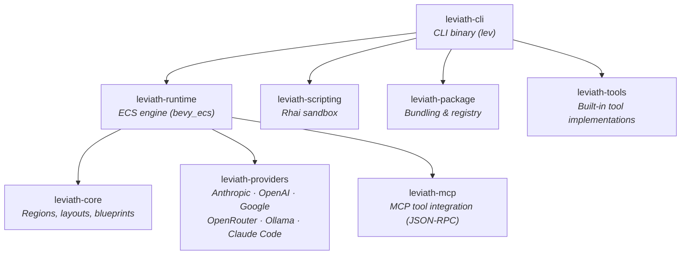

<div align="center">

# Leviath

**A structured agent runtime for LLMs**

Structured memory, multi-stage workflows, and an ECS engine — so agents stay coherent
on long tasks, use the right model for each phase, and don't melt your machine when
you run a dozen at once.

[](https://github.com/Sun-Forge-AI/leviath/actions/workflows/ci.yml)
[](https://github.com/Sun-Forge-AI/leviath/actions/workflows/ci.yml)
[](https://github.com/Sun-Forge-AI/leviath/actions/workflows/ci.yml)
[](https://github.com/Sun-Forge-AI/leviath/actions/workflows/ci.yml)

[](https://github.com/Sun-Forge-AI/leviath/blob/main/LICENSE)
[](https://leviath.dev)

**[Quick Start](#-quick-start) · [Features](#-features) · [Agents](#-pre-built-agents) · [Docs](https://leviath.dev/docs)**

</div>

---

Most agent tools hand an LLM a flat message array and hope for the best. Leviath gives it **structure** — so it stays coherent across hundreds of tool calls, uses the right model for each phase of a task, and runs dozens of agents in a single process instead of one OS process each.

Pick a pre-built agent or write your own, run it, and watch it actually remember what it read 50 tool calls ago.

<p align="center">
  
</p>

## 📋 Requirements

- An API key from [Anthropic](https://console.anthropic.com/), [OpenAI](https://platform.openai.com/), [Google AI](https://aistudio.google.com/), or [OpenRouter](https://openrouter.ai/) — or run [Ollama](https://ollama.com) locally (free, no key)
- macOS, Linux, or Windows
- No runtime dependencies — a single binary, no Node/Python/Docker required

> **Claude Code Agent SDK:** Leviath works with the [Claude Code agent SDK](https://docs.anthropic.com/en/docs/claude-code/sdk) as a provider, but that routes inference through Claude Code's own context management and bypasses Leviath's structured regions — the whole point. Use a direct provider (Anthropic, OpenAI, …) for the full experience.

## 🚀 Quick Start

### 1. Install

> **Private alpha:** the repo and its releases are currently private, so installing needs a GitHub Personal Access Token (`repo` scope) — exported as `GITHUB_TOKEN` for the install scripts, and `HOMEBREW_GITHUB_API_TOKEN` for Homebrew. The [distribution repo](https://github.com/Sun-Forge-AI/leviath-dist) has the one-time token setup and full instructions.

**macOS (Homebrew):**

```bash
brew tap sun-forge-ai/leviath https://github.com/Sun-Forge-AI/leviath-dist.git
brew trust sun-forge-ai/leviath          # newer Homebrew requires trusting third-party taps
brew install leviath                     # stable — or: leviath-beta, leviath-alpha
```

**Linux:**

```bash
curl -fsSL -H "Authorization: token $GITHUB_TOKEN" \
  https://raw.githubusercontent.com/Sun-Forge-AI/leviath-dist/main/install.sh | bash -s -- --channel stable
# Channels: alpha (default), beta, stable
```

**Windows (PowerShell):**

```powershell
irm -Headers @{Authorization="token $env:GITHUB_TOKEN"} `
  https://raw.githubusercontent.com/Sun-Forge-AI/leviath-dist/main/install.ps1 | iex
# For a specific channel, download the script and run: .\install.ps1 -Channel stable
```

**Build from source** (any platform, requires [Rust](https://rustup.rs/)):

```bash
cargo install --git https://github.com/Sun-Forge-AI/leviath.git --bin lev
```

### 2. Configure a provider

You need at least one LLM provider. The interactive wizard walks you through API keys for Anthropic, OpenAI, or OpenRouter — or pointing at a local [Ollama](https://ollama.com) instance (no key needed):

```bash
lev setup
```

Prefer to script it? Pass keys directly:

```bash
lev setup --non-interactive --anthropic-key sk-ant-...
```

### 3. Run your first agent

```bash
lev run coder --task "Build a CLI that converts CSV to JSON"

# ...or try a non-coding agent
lev run deep-researcher --task "Survey the current state of solid-state battery technology"
```

Then open the dashboard to watch it work:

```bash
lev dash
```

### 4. Create your own

```bash
lev create my-agent        # scaffolds a new agent directory
cd my-agent
lev run . --task "Your task here"
```

This writes an `agent.leviath` config you can customize — models per stage, context regions, tools, and workflow graph. See [agent configuration →](https://leviath.dev/docs/agents)

## 🧩 Features

<table>
<tr>
<td width="33%" valign="top">

**🧠 Structured Context Memory**

Six region types with deterministic eviction — architecture stays pinned, tool results evict first, conversation auto-compacts into summaries. Route reads to specific regions so a file dump can't push out your system prompt.

[Learn more →](https://leviath.dev/docs/context)

</td>
<td width="33%" valign="top">

**🔀 Multi-Stage Workflows**

Each stage gets its own model, tools, and context layout. Run them linearly or as a [directed graph](https://leviath.dev/docs/stages#graph) with conditional transitions, error recovery, and LLM-driven routing — check it with `lev validate`.

[Learn more →](https://leviath.dev/docs/stages)

</td>
<td width="33%" valign="top">

**🎮 ECS Agent Engine**

Agents run as entities in a [bevy_ecs](https://bevyengine.org/) world. Dozens share one process with game-engine-style scheduling, instead of that many OS processes fighting for resources.

[Learn more →](https://leviath.dev/docs/engine)

</td>
</tr>
<tr>
<td width="33%" valign="top">

**🧬 Sub-Agents**

Agents spawn children with different blueprints. Any sub-agent, at any depth, can ask the user questions directly — no fire-and-forget, no routing through the parent.

[Learn more →](https://leviath.dev/docs/sub-agents)

</td>
<td width="33%" valign="top">

**💬 Mid-Run Collaboration**

Message agents while they work, from the terminal or the dashboard. Input is injected between inference calls, so you can redirect, answer a question, or add constraints without restarting. On by default.

</td>
<td width="33%" valign="top">

**🙋 Human-in-the-Loop**

Force a checkpoint every time a stage runs with `interaction_points` (plus `followups` for detail), or grant the agent `ask_user_*` tools so it asks on its own judgment. Both gated by the same per-stage tool permissions.

</td>
</tr>
</table>

## 📊 Benchmarks

# Fake Numbers! To be filled in!
<!-- ⚠️ Numbers below are targets — replace with actuals from benchmark runs before launch -->

**Context retention** — same model, same tools; only context management differs:

| Metric | Leviath | Flat Context | Improvement |
|--------|--------:|-------------:|------------:|
| Retention @ 50 tool calls | 94% | 61% | **+54%** |
| Retention @ 100 tool calls | 89% | 34% | **+162%** |
| Multi-file consistency (10+ files) | 91% | 64% | **+42%** |
| Token usage (avg per task) | 127K | 203K | **−37%** |

**Prompt caching** — regions ordered by volatility form a stable prefix that providers cache automatically:

| Provider | Cache Hit Rate | Cost Savings | Mechanism |
|----------|---------------:|-------------:|-----------|
| Anthropic | 70–85% | 55–65% | Explicit breakpoints, 90% discount |
| OpenAI | 50–70% | 25–35% | Auto prefix matching, 50% discount |
| Google | 50–70% | 35–50% | Auto prefix matching |

**Resource efficiency** — ECS engine vs. process-per-agent:

| Concurrent Agents | Leviath | Process-per-agent |
|-------------------|--------:|------------------:|
| 25 | 180 MB | 4.2 GB |
| 50 | 310 MB | 8.1 GB |
| Spawn overhead | <1 ms | ~2 s |

[Full methodology →](https://leviath.dev/docs/benchmarks)

## 🤖 Pre-built Agents

Nine agents ship out of the box — each a multi-stage graph with model fallback (Anthropic → OpenAI → local) and error recovery:

| Agent | Workflow | Best for |
|-------|----------|----------|
| **software-engineer** | plan ⇄ implement ⇄ review | Full coding workflow with human-approved planning *(default)* |
| **coder** | analyze → implement ⇄ review | Focused implementation with a review loop |
| **reviewer** | scan → deep_review → report | Code review and audit |
| **deep-researcher** | gather ⇄ analyze → synthesize | Thorough single-topic investigation |
| **wide-researcher** | survey ⇄ compare → summarize | Broad multi-topic landscape survey |
| **researcher** | gather ⇄ analyze → summarize | General-purpose research |
| **log-analyzer** | ingest → analyze ⇄ script → report | Log analysis with scripted aggregation |
| **daily-briefer** | collect → prioritize → brief | Morning summaries from multiple sources |
| **writing-assistant** | research → outline → draft ⇄ edit | Blog posts, reports, documentation |

## 🖥️ Dashboard

<p align="center">
  
</p>

`lev dash` is a full TUI for managing concurrent agents: stage tabs, context-window visualization, markdown rendering, search/filter, sub-agent tree view, clipboard yank, and mouse support.

## 🌐 API Server

`lev serve` exposes a REST + WebSocket API — integrate from Python, TypeScript, Go, or anything that speaks HTTP. No SDK required.

```bash
lev serve --port 3000

# spawn an agent
curl -X POST http://localhost:3000/api/agents \
  -H "Content-Type: application/json" \
  -d '{"blueprint": "coder", "task": "Add input validation", "webhook_url": "https://example.com/hook"}'
```

Covers agent lifecycle, human-in-the-loop interaction, blueprint management, per-agent WebSocket streaming, and webhook callbacks on completion. [Full API reference →](https://leviath.dev/docs/api)

## ⌨️ CLI

| Command | Description |
|---------|-------------|
| `lev create <name>` | Create an agent project |
| `lev run [path] --task "..."` | Run an agent |
| `lev dash` | TUI dashboard |
| `lev serve` | API server |
| `lev validate [path]` | Validate an agent blueprint |
| `lev pack` / `lev add` / `lev remove` | Package management |
| `lev list` | List agents |
| `lev test` | Run agent tests |
| `lev setup` / `lev models` | Configuration |

## 🔌 Providers

| Provider | API Key |
|----------|---------|
| Anthropic | `ANTHROPIC_API_KEY` |
| OpenAI | `OPENAI_API_KEY` |
| Google (Gemini) | `GOOGLE_API_KEY` |
| OpenRouter | `OPENROUTER_API_KEY` |
| Ollama | *none (local)* |
| Claude Code | *none (subscription)* |

## 🏗️ Architecture



## 🤝 Contributing

```bash
git clone https://github.com/Sun-Forge-AI/leviath.git
cd leviath
cargo build
cargo test --workspace
cargo clippy --workspace
```

The pre-commit hook installs itself the first time you build or test — no setup step. It enforces formatting, clippy (warnings-as-errors), the full test suite, and the coverage guardrails before every commit.

<details>
<summary>How the pre-commit hook works (and how to refresh it)</summary>

<br/>

`cargo test` / `cargo build` pulls in `xtask`'s dev-dependencies, which include [`cargo-husky`](https://github.com/rhysd/cargo-husky). On the first build it installs `.cargo-husky/hooks/pre-commit` into `.git/hooks/pre-commit` automatically.

The hook enforces, before every commit:

- **formatting** (`cargo fmt --check`)
- **clippy** with warnings-as-errors
- the **full test suite**
- the **coverage-suppression-marker lint** (`cargo xtask check-exclusions`)
- that the **coverage ceiling** in `xtask/src/coverage.rs` wasn't silently raised (`cargo xtask check-ceiling`)

It does **not** run the full `cargo xtask coverage` check — that's several minutes, too slow for a local commit gate. CI runs it on every push instead, enforcing the same ceiling for real.

If the hook script itself changes (e.g. a commit edits `.cargo-husky/hooks/pre-commit`), `cargo-husky` only reinstalls it on a *fresh* compile of its crate, not on incremental builds. Force it with:

```bash
cargo clean -p cargo-husky && cargo test -p xtask
```

</details>

### Running coverage locally

`cargo xtask coverage` runs `cargo-llvm-cov` across the workspace and reports region/line/function percentages, written to the gitignored `coverage/` folder.

```bash
cargo xtask coverage                                   # full workspace
cargo llvm-cov --package <crate> --lib                 # a single crate
cargo llvm-cov --package <crate> --lib --html --open   # browsable per-crate report
```

> Branch coverage isn't collected: `cargo llvm-cov --branch` reliably SIGSEGVs inside LLVM's own coverage-mapping code ([open upstream bug](https://github.com/llvm/llvm-project/issues/119558)). See the doc comment atop `xtask/src/coverage.rs` for the full investigation.

## 📦 Releases

Leviath ships on three rolling channels, published automatically from CI:

| Channel | Cadence | Tag | Stability |
|---------|---------|-----|-----------|
| **Alpha** | Nightly | `alpha` | ⚠️ Bleeding edge |
| **Beta** | Weekly (Monday) | `beta` | 🟡 Tested |
| **Stable** | Weekly (Thursday, approval-gated) | `latest` | ✅ Production |

Each channel tag is a *rolling* release — deleted and recreated on every publish so it always points at that channel's newest build. That's what the shell/PowerShell installers resolve (`--channel alpha|beta|stable` → `alpha`/`beta`/`latest`).

Separately, every **stable** deploy also cuts an **immutable versioned release** (`vX.Y.Z`, which carries GitHub's "Latest" badge). Those never change, so they're what Homebrew and Scoop pin to and what `cargo install --tag vX.Y.Z` fetches. Seeing both a `vX.Y.Z` release *and* a `latest` release for the same version is by design — one is the permanent archive, the other the moving pointer.

Install commands for each channel live in the [distribution repo](https://github.com/Sun-Forge-AI/leviath-dist).

## 📄 License

[MIT](LICENSE) © Sun Forge AI

---

<p align="center">
  <a href="https://leviath.dev">Website</a> ·
  <a href="https://leviath.dev/docs">Docs</a> ·
  <a href="https://github.com/Sun-Forge-AI/leviath">GitHub</a> ·
  <a href="https://github.com/Sun-Forge-AI/leviath/issues">Issues</a>
</p>
