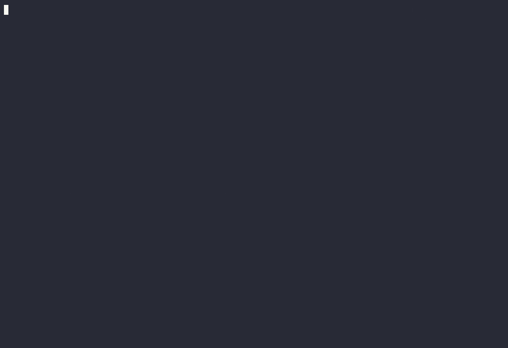
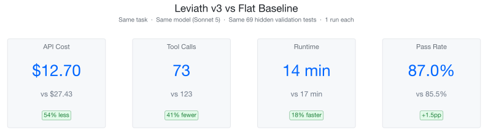
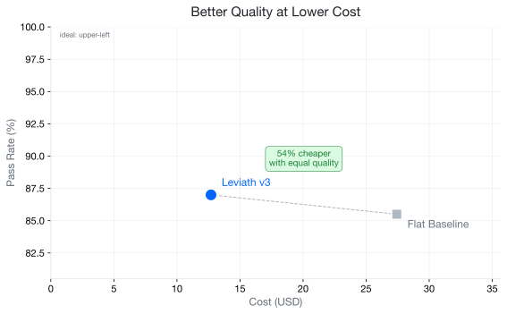
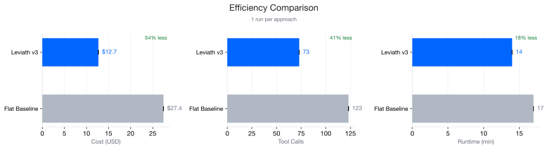
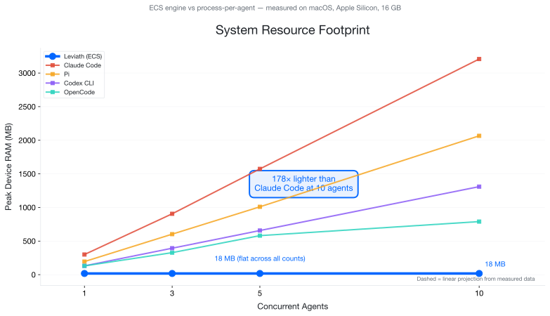
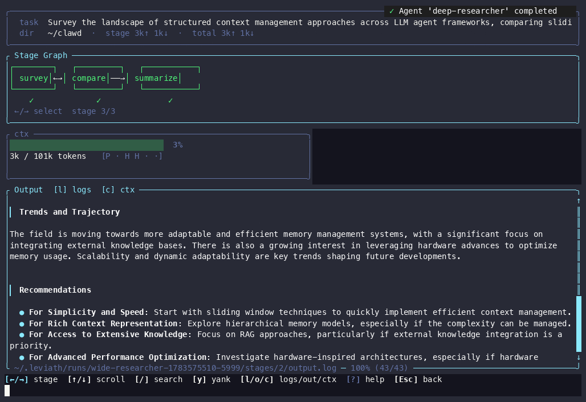
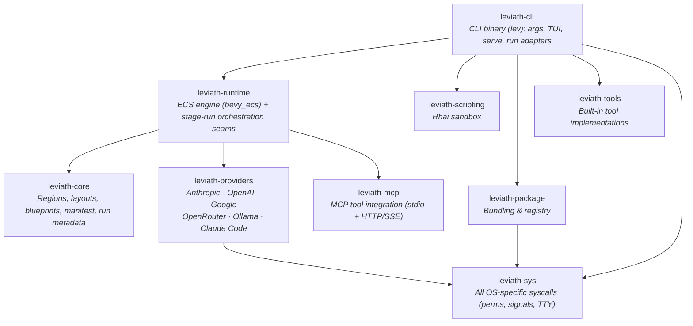

<div align="center">

# Leviath

**A structured agent runtime for LLMs**

Structured memory, multi-stage workflows, and an ECS engine — so agents stay coherent
on long tasks, use the right model for each phase, and don't melt your machine when
you run a dozen at once.

[](https://github.com/Sun-Forge-AI/leviath/actions/workflows/ci.yml)
[](https://github.com/Sun-Forge-AI/leviath/actions/workflows/ci.yml)
[](https://github.com/Sun-Forge-AI/leviath/actions/workflows/ci.yml)
[](https://github.com/Sun-Forge-AI/leviath/actions/workflows/ci.yml)

[](https://github.com/Sun-Forge-AI/leviath/blob/main/LICENSE)
[](https://leviath.dev)

**[Quick Start](#-quick-start) · [Features](#-features) · [Agents](#-pre-built-agents) · [Docs](https://leviath.dev/docs)**

</div>

---

Most agent tools hand an LLM a flat message array and hope for the best. Leviath gives it **structure** — so it stays coherent across hundreds of tool calls, uses the right model for each phase of a task, and runs dozens of agents in a single process instead of one OS process each.

Pick a pre-built agent or write your own, run it, and watch it actually remember what it read 50 tool calls ago.

<p align="center">
  
</p>

## 📋 Requirements

- An API key from [Anthropic](https://console.anthropic.com/), [OpenAI](https://platform.openai.com/), [Google AI](https://aistudio.google.com/), or [OpenRouter](https://openrouter.ai/) — or, with no key at all, run [Ollama](https://ollama.com) locally or use the Claude Code transport below
- macOS, Linux, or Windows
- No runtime dependencies — a single binary, no Node/Python/Docker required

> **Claude Code transport (opt-in):** if you have [Claude Code](https://claude.com/claude-code) installed and signed in, enable it in `lev setup` to run Leviath on your Claude subscription with no API key. Leviath's structured regions work normally — it drives the CLI as a plain inference relay, keeping the context window, the tool loop, and the iteration count on Leviath's side.
>
> Caveats, measured rather than estimated: the CLI adds ~130 tokens of its own context to **every** call, including **your account email address** and the current date. This cannot be disabled — every flag that suppresses it also disables subscription auth. There is no prompt caching, and each call spawns a subprocess (~200 ms). Anthropic models only. For full control over what reaches the model, use a direct provider.

## 🚀 Quick Start

### 1. Install

> **Private alpha:** the repo and its releases are currently private, so installing needs a GitHub Personal Access Token (`repo` scope) — exported as `GITHUB_TOKEN` for the install scripts, and `HOMEBREW_GITHUB_API_TOKEN` for Homebrew. The [distribution repo](https://github.com/Sun-Forge-AI/leviath-dist) has the one-time token setup and full instructions.

**macOS (Homebrew):**

```bash
brew tap sun-forge-ai/leviath https://github.com/Sun-Forge-AI/leviath-dist.git
brew trust sun-forge-ai/leviath          # newer Homebrew requires trusting third-party taps
brew install leviath                     # stable — or: leviath-beta, leviath-alpha
```

**Linux:**

```bash
curl -fsSL -H "Authorization: token $GITHUB_TOKEN" \
  https://raw.githubusercontent.com/Sun-Forge-AI/leviath-dist/main/install.sh | bash -s -- --channel stable
# Channels: alpha (default), beta, stable
```

**Windows (PowerShell):**

```powershell
irm -Headers @{Authorization="token $env:GITHUB_TOKEN"} `
  https://raw.githubusercontent.com/Sun-Forge-AI/leviath-dist/main/install.ps1 | iex
# For a specific channel, download the script and run: .\install.ps1 -Channel stable
```

**Build from source** (any platform, requires [Rust](https://rustup.rs/)):

```bash
cargo install --git https://github.com/Sun-Forge-AI/leviath.git --bin lev
```

### 2. Configure a provider

You need at least one LLM provider. The interactive wizard walks you through API keys for Anthropic, OpenAI, or OpenRouter — or pointing at a local [Ollama](https://ollama.com) instance (no key needed):

```bash
lev setup
```

Prefer to script it? Pass keys directly:

```bash
lev setup --non-interactive --anthropic-key sk-ant-...
```

### 3. Run your first agent

```bash
lev run coder --task "Build a CLI that converts CSV to JSON"

# ...or try a non-coding agent
lev run deep-researcher --task "Survey the current state of solid-state battery technology"
```

`lev run` hands the agent to a background **daemon** that hosts every agent in
one shared world, so runs keep going after your terminal closes. The daemon
starts automatically on first use (run it yourself with `lev daemon` to watch its
logs). Inspect and steer running agents from any terminal:

```bash
lev ps                       # list running agents and their status
lev msg <agent-id> "..."     # send a message to a running agent
lev cancel <run-id>          # cancel a run
lev respond                  # list interactions an agent is waiting on
lev respond <req-id> "..."   # answer a pending ask_user interaction
```

Or open the dashboard to watch them work:

```bash
lev dash
```

### 4. Create your own

```bash
lev create my-agent        # scaffolds a new agent directory
cd my-agent
lev run . --task "Your task here"
```

This writes an `agent.leviath` config you can customize — models per stage, context regions, tools, and workflow graph. See [agent configuration →](https://leviath.dev/docs/agents)

## 🧩 Features

<table>
<tr>
<td width="33%" valign="top">

**🧠 Structured Context Memory**

Six region types with deterministic eviction — architecture stays pinned, tool results evict first, conversation auto-compacts into summaries. Route reads to specific regions so a file dump can't push out your system prompt.

[Learn more →](https://leviath.dev/docs/context)

</td>
<td width="33%" valign="top">

**🔀 Multi-Stage Workflows**

Each stage gets its own model, tools, and context layout. Run them linearly or as a [directed graph](https://leviath.dev/docs/stages#graph) with conditional transitions, error recovery, and LLM-driven routing — check it with `lev validate`.

[Learn more →](https://leviath.dev/docs/stages)

</td>
<td width="33%" valign="top">

**🎮 ECS Agent Engine**

Agents run as entities in a [bevy_ecs](https://bevyengine.org/) world. Dozens share one process with game-engine-style scheduling, instead of that many OS processes fighting for resources.

[Learn more →](https://leviath.dev/docs/engine)

</td>
</tr>
<tr>
<td width="33%" valign="top">

**🧬 Sub-Agents & Fan-Out**

Agents spawn children with different blueprints. A **fan-out** stage splits a task into work items and runs one sub-agent worker per item concurrently (bounded by `max_workers`), then merges their results back into the parent — all in the same process, over one shared lock-free inference driver. Any sub-agent, at any depth, can ask the user questions directly — no fire-and-forget, no routing through the parent.

[Learn more →](https://leviath.dev/docs/sub-agents)

</td>
<td width="33%" valign="top">

**🙋 Human-in-the-Loop**

Message a running agent from the terminal or dashboard — input is injected between inference calls, so you redirect, answer, or add constraints without restarting. Force checkpoints with a stage's `interaction_points` — approve, request revisions, or **edit the agent's output directly** (e.g. tweak the plan before it's implemented, and your edits stick through later revisions) — or grant `ask_user_*` tools so the agent asks on its own judgment. All gated by per-stage tool permissions.

</td>
<td width="33%" valign="top">

**🛡️ Taint-Tracked Data Flow**

A deterministic sensitivity model (Public / Internal / Private) tags every context region — set by the runtime, never by model output. Tools declare a direction and clearance, so an outbound call carrying data above its level is blocked before it fires — returned as `[blocked]`, or, in the daemon, surfaced as an *allow once / allow for this session / deny* prompt — and taint recovers automatically as entries evict. Configure it with an opt-in `[security]` block, layer on allowlists and Rhai policy rules, and dry-run any tool with `lev policy test`.

</td>
</tr>
</table>

## 📊 Benchmarks

### Why these benchmarks exist

Leviath is **not** a replacement for Claude Code, Codex, or any other coding agent — it's a runtime that orchestrates them. Today, orchestration tools that need multiple agents (parallel issue fixing, decomposed tasks, review loops) typically spawn each one as a **separate OS process**. That works, but it means every agent carries the full weight of a Node.js or Go runtime, and every agent manages its own flat context window — re-reading files, losing specs to eviction, and burning tokens.

Leviath addresses both problems:
1. **Structured context** — regions prevent important information from being evicted, cutting redundant reads and token waste
2. **ECS engine** — all agents share a single Rust process, so spinning up 10 agents doesn't mean 10× the device RAM

These benchmarks measure each claim independently.

---

### Context Quality: Structured vs Flat

Both approaches build the same 12-file multi-tenant event processing platform from 11 spec files and 4 config files. Same model (Claude Sonnet 5), same tools, same task. Quality is measured by a **hidden validation suite** of 69 tests the agent never sees — no self-grading.

<p align="center">
  <picture>
    
  </picture>
</p>

**Half the cost, same quality.** Leviath's structured context window keeps specs in compacting storage (summarized instead of evicted), so the agent doesn't waste tokens re-reading files it's already seen. The flat baseline's sliding window constantly reshuffles messages, destroying cache locality and burning tokens.

<p align="center">
  <picture>
    
  </picture>
</p>

<details>
<summary><b>Detailed efficiency breakdown</b></summary>

<p align="center">
  <picture>
    
  </picture>
</p>

</details>

> **Context benchmark methodology:** The "flat baseline" is an independent Rust binary calling the same Anthropic API with the same tools and system prompt — no Leviath dependency, no shared code. Both approaches receive identical seed files and task descriptions. Results are averaged across multiple independent runs. Quality is measured by 69 hidden validation tests covering 13 categories (happy path, schema validation, auth, rate limiting, DLQ, etc.) that neither agent sees during the task. Full methodology and raw data: [leviath-benchmarks](https://github.com/Sun-Forge-AI/leviath-benchmarks).

---

### Device Resource Footprint: ECS vs Process-per-Agent

When orchestration tools run multiple agents, each one is typically its own OS process. Anthropic's own [Agent SDK hosting docs](https://code.claude.com/docs/en/agent-sdk/hosting.md) confirm: *"Running N concurrent sessions means N subprocesses, each with its own process tree."* This adds up fast.

Leviath's ECS architecture runs all agents as entities in a single Rust process — no per-agent process overhead. We measured peak device RAM (RSS) for Leviath against four popular coding agents at 1, 3, 5, and 10 concurrent instances:

<p align="center">
  <picture>
    
  </picture>
</p>

At 10 concurrent agents, Leviath uses **18 MB** of device RAM vs. **3,209 MB** for Claude Code — **178× lighter**. All data points are measured, not projected.

> **Resource benchmark methodology:** Each tool was launched N times concurrently (same coding task, separate git-initialized temp directories). RSS was sampled every 1 second for 15 seconds after an 8-second warmup. Peak total RSS across all instances was recorded. All instances were verified alive at time of measurement. System: macOS 15.5, Apple Silicon, 16 GB. Tool versions: Claude Code 2.1.86, Codex CLI 0.144.1, Pi (latest), OpenCode 0.0.55. Leviath was measured via `lev serve` with tasks submitted through the API. Full data: [leviath-benchmarks](https://github.com/Sun-Forge-AI/leviath-benchmarks).
>
> **Note:** This compares the runtime footprint of the orchestration layer, not the inference cost or quality of each tool's underlying model. Claude Code, Codex, Pi, and OpenCode are excellent coding agents — the point is that wrapping them in a process-per-agent pattern has a measurable device cost that an ECS engine avoids.

## 🤖 Pre-built Agents

Ten agents ship out of the box — each a multi-stage graph with model fallback (Anthropic → OpenAI → local) and error recovery:

| Agent | Workflow | Best for |
|-------|----------|----------|
| **software-engineer** | plan ⇄ implement ⇄ review | Full coding workflow with human-approved planning *(default)* |
| **coder** | analyze → implement ⇄ review | Focused implementation with a review loop |
| **reviewer** | scan → deep_review → report | Code review and audit |
| **parallel-fixer** | validate → fan-out → merge | Fixing many failing tests at once — one worker per failure |
| **deep-researcher** | gather ⇄ analyze → synthesize | Thorough single-topic investigation |
| **wide-researcher** | survey ⇄ compare → summarize | Broad multi-topic landscape survey |
| **researcher** | gather ⇄ analyze → summarize | General-purpose research |
| **log-analyzer** | ingest → analyze ⇄ script → report | Log analysis with scripted aggregation |
| **daily-briefer** | collect → prioritize → brief | Morning summaries from multiple sources |
| **writing-assistant** | research → outline → draft ⇄ edit | Blog posts, reports, documentation |

## 🖥️ Dashboard

<p align="center">
  
</p>

`lev dash` is a full TUI for managing concurrent agents: stage tabs, context-window visualization, markdown rendering, search/filter, sub-agent tree view, clipboard yank, and mouse support. Press **`m`** to open the MCP management screen — add, remove, log in to, and test tool servers without leaving the dashboard.

## 🌐 API Server

`lev serve` exposes a REST + WebSocket API — integrate from Python, TypeScript, Go, or anything that speaks HTTP. No SDK required.

```bash
lev serve --port 3000

# spawn an agent
curl -X POST http://localhost:3000/api/agents \
  -H "Content-Type: application/json" \
  -d '{"blueprint": "coder", "task": "Add input validation", "webhook_url": "https://example.com/hook"}'
```

Covers agent lifecycle, human-in-the-loop interaction, blueprint management, per-agent WebSocket streaming, and webhook callbacks on completion. [Full API reference →](https://leviath.dev/docs/api)

## ⌨️ CLI

| Command | Description |
|---------|-------------|
| `lev create <name>` | Create an agent project |
| `lev run [path] --task "..."` | Run an agent in the shared-world daemon (auto-started) |
| `lev ps` | List running agents and their status |
| `lev msg <agent-id> <content>` | Send a message to a running agent |
| `lev cancel <run-id>` | Cancel a running agent |
| `lev respond [req-id] [value]` | List or answer pending `ask_user` interactions |
| `lev daemon` | Run the shared-world daemon in the foreground |
| `lev dash` | TUI dashboard |
| `lev serve` | API server |
| `lev validate [path]` | Validate an agent blueprint |
| `lev pack` / `lev add` / `lev remove` | Package management |
| `lev list` | List installed agents |
| `lev test` | Run agent tests |
| `lev mcp add\|list\|remove\|login\|logout\|test` | Manage MCP tool servers (auto-logs in on `add`) |
| `lev setup` / `lev models` | Configuration |

### 🧩 MCP tool servers

Leviath connects to [Model Context Protocol](https://modelcontextprotocol.io)
servers over **stdio** (a spawned process) or **HTTP** (streamable, with a
legacy HTTP+SSE fallback). Configure them in `~/.leviath/config.toml`:

```toml
# stdio — a locally spawned server
[[mcp_servers]]
name = "filesystem"
command = "npx"
args = ["-y", "@modelcontextprotocol/server-filesystem", "/path"]

# HTTP — a remote server (static token optional; ${VAR} keeps it out of the file)
[[mcp_servers]]
name = "navigator"
url = "https://mcp.example.com/mcp"
headers = { Authorization = "Bearer ${MY_MCP_TOKEN}" }
```

Servers that authenticate via the browser (OAuth) need no token in the config —
`lev mcp add navigator --url https://mcp.example.com/mcp` detects the login
requirement and opens your browser automatically. Tokens are stored in
`~/.leviath/mcp-auth.json` (mode `0600`) and refreshed non-interactively as the
daemon runs.

## 🔌 Providers

| Provider | API Key |
|----------|---------|
| Anthropic | `ANTHROPIC_API_KEY` |
| OpenAI | `OPENAI_API_KEY` |
| Google (Gemini) | `GOOGLE_API_KEY` |
| OpenRouter | `OPENROUTER_API_KEY` |
| Ollama | *none (local)* |
| Claude Code | *none (subscription)* |

## 🏗️ Architecture



Every platform-specific system call (Unix file permissions, `setsid` process
detaching, `SIGTERM`, the OSC52 `/dev/tty` clipboard write) lives in one place —
**`leviath-sys`** — behind a cross-platform API, so the rest of the workspace is
free of scattered `#[cfg(unix)]`/`#[cfg(windows)]` branches and per-OS test
coverage stays correct by construction.

## 🤝 Contributing

```bash
git clone https://github.com/Sun-Forge-AI/leviath.git
cd leviath
cargo build
cargo test --workspace
cargo clippy --workspace
```

The pre-commit hook installs itself the first time you build or test — no setup step. It enforces formatting, clippy (warnings-as-errors), the full test suite, and the coverage guardrails before every commit.

<details>
<summary>How the pre-commit hook works (and how to refresh it)</summary>

<br/>

`cargo test` / `cargo build` pulls in `xtask`'s dev-dependencies, which include [`cargo-husky`](https://github.com/rhysd/cargo-husky). On the first build it installs `.cargo-husky/hooks/pre-commit` into `.git/hooks/pre-commit` automatically.

The hook enforces, before every commit:

- **formatting** (`cargo fmt --check`)
- **clippy** with warnings-as-errors
- **doc lints** (`cargo doc` with `-D warnings` — no broken/private intra-doc links or stray HTML)
- the **full test suite**
- the **coverage-suppression-marker lint** (`ast-grep scan`, if `ast-grep` is installed; CI always enforces it)

It does **not** run the full `cargo xtask coverage` check — that's several minutes, too slow for a local commit gate. CI runs it on every push instead, enforcing 100% for real.

### `ast-grep` (suppression lint)

The suppression-marker scan uses [`ast-grep`](https://ast-grep.github.io), which matches Rust/YAML structurally (via tree-sitter) — rules live in `.sgrules/`. CI installs it automatically and always enforces the scan; the pre-commit hook runs it only if it's installed locally, otherwise it prints a warning and skips (CI is the backstop). Install it once with any of:

```bash
brew install ast-grep            # macOS / Linuxbrew
cargo install ast-grep --locked  # from source
npm install -g @ast-grep/cli     # via npm
```

If the hook script itself changes (e.g. a commit edits `.cargo-husky/hooks/pre-commit`), `cargo-husky` only reinstalls it on a *fresh* compile of its crate, not on incremental builds. Force it with:

```bash
cargo clean -p cargo-husky && cargo test -p xtask
```

</details>

### Testing policy

The workspace is gated at a hard **100%** on lines, regions, and functions — with no way to opt out. Coverage-suppression markers (`#[cfg(not(test))]`, `coverage(off)`, tarpaulin/lcov/grcov annotations) are banned by the ast-grep lint above, so code can't be hidden from measurement — it has to be refactored until it's testable. The *only* un-unit-tested code is the thin `lev` binary entrypoint (`crates/leviath-cli/src/main.rs`): the composition root that wires real terminal, stdin, network, and subprocess I/O into the library's tested cores. It's excluded from coverage measurement and guarded by a CI check that requires maintainer sign-off to change.

### Running coverage locally

`cargo xtask coverage` gates each workspace package with `cargo llvm-cov --package <pkg> --fail-under-{lines,functions,regions} 100` — llvm-cov does the counting *and* the gating; there's no custom parsing or aggregation. CI enforces a hard **100%** on all three metrics on Linux, macOS, and Windows — any file below 100% fails the build, and a browsable HTML report lands in the gitignored `coverage/` folder. Measurement is deliberately **per-package**, not `--workspace`: `-C instrument-coverage` records every function in every binary that links it (including ones that never call it), and the whole-workspace merge can let a never-run record shadow the covered one — so one package at a time is what keeps llvm-cov's counts accurate. See the doc comment atop `xtask/src/coverage.rs`.

```bash
cargo xtask coverage                                   # full workspace
cargo llvm-cov --package <crate> --lib                 # a single crate
cargo llvm-cov --package <crate> --lib --html --open   # browsable per-crate report
```

> Branch coverage isn't collected: `cargo llvm-cov --branch` reliably SIGSEGVs inside LLVM's own coverage-mapping code ([open upstream bug](https://github.com/llvm/llvm-project/issues/119558)). See the doc comment atop `xtask/src/coverage.rs` for the full investigation.

## 📦 Releases

Leviath ships on three rolling channels, published automatically from CI:

| Channel | Cadence | Tag | Stability |
|---------|---------|-----|-----------|
| **Alpha** | Nightly | `alpha` | ⚠️ Bleeding edge |
| **Beta** | Weekly (Monday) | `beta` | 🟡 Tested |
| **Stable** | Weekly (Thursday, approval-gated) | `latest` | ✅ Production |

Each channel tag is a *rolling* release — deleted and recreated on every publish so it always points at that channel's newest build. That's what the shell/PowerShell installers resolve (`--channel alpha|beta|stable` → `alpha`/`beta`/`latest`).

Separately, every **stable** deploy also cuts an **immutable versioned release** (`vX.Y.Z`, which carries GitHub's "Latest" badge). Those never change, so they're what Homebrew and Scoop pin to and what `cargo install --tag vX.Y.Z` fetches. Seeing both a `vX.Y.Z` release *and* a `latest` release for the same version is by design — one is the permanent archive, the other the moving pointer.

Install commands for each channel live in the [distribution repo](https://github.com/Sun-Forge-AI/leviath-dist).

## 📄 License

[MIT](LICENSE) © Sun Forge AI

---

<p align="center">
  <a href="https://leviath.dev">Website</a> ·
  <a href="https://leviath.dev/docs">Docs</a> ·
  <a href="https://github.com/Sun-Forge-AI/leviath">GitHub</a> ·
  <a href="https://github.com/Sun-Forge-AI/leviath/issues">Issues</a>
</p>
