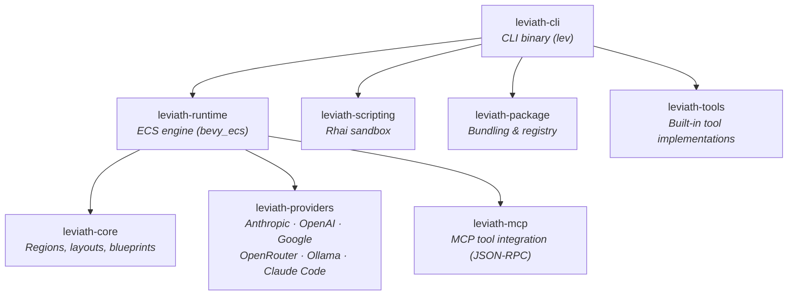

<p align="center">
  <h1 align="center">Leviath</h1>
  <p align="center">
    <strong>A structured agent runtime for LLMs</strong>
  </p>
</p>

<div align="center">

| Linux | macOS | Windows | Coverage |
| :-: | :-: | :-: | :-: |
| [](https://github.com/Sun-Forge-AI/leviath/actions/workflows/ci.yml) | [](https://github.com/Sun-Forge-AI/leviath/actions/workflows/ci.yml) | [](https://github.com/Sun-Forge-AI/leviath/actions/workflows/ci.yml) | [](https://github.com/Sun-Forge-AI/leviath/actions/workflows/ci.yml) |

</div>

<p align="center">
  <a href="https://github.com/Sun-Forge-AI/leviath/blob/main/LICENSE"></a>
  <a href="https://leviath.dev"></a>
</p>

---

Most agent tools give LLMs a flat message array and hope for the best. Leviath gives them structure — structured memory, multi-stage workflows, and an ECS engine — so agents stay coherent on long tasks, use the right model for each phase, and don't melt your machine when you run a dozen at once.

Pick a pre-built agent or create your own. Run it. Watch it actually remember what it read 50 tool calls ago.

<!-- TODO: hero gif of dashboard with agents running -->

## Requirements

- An API key from [Anthropic](https://console.anthropic.com/), [OpenAI](https://platform.openai.com/), [Google AI](https://aistudio.google.com/), or [OpenRouter](https://openrouter.ai/) — or run [Ollama](https://ollama.com) locally (free, no key)
- macOS, Linux, or Windows
- No runtime dependencies — single binary, no Node/Python/Docker required

> **Claude Code Agent SDK:** Leviath is compatible with the [Claude Code agent SDK](https://docs.anthropic.com/en/docs/claude-code/sdk) as a provider. However, this routes all inference through Claude Code's own context management, which bypasses Leviath's structured regions — the core feature. Use a direct provider (Anthropic, OpenAI, etc.) for the full experience.

## Quick Start

### 1. Install

```bash
# macOS
brew install gemisis/tap/leviath

# Linux
curl -fsSL https://github.com/Sun-Forge-AI/leviath/releases/latest/download/leviath-linux-x64.tar.gz | tar xz -C /usr/local/bin

# Windows — download from GitHub Releases
# https://github.com/Sun-Forge-AI/leviath/releases

# Build from source (any platform, requires Rust)
cargo install --path crates/leviath-cli
```

### 2. Configure a Provider

Before running anything, you need at least one LLM provider set up. Run the interactive setup wizard:

```bash
lev setup
```

It'll walk you through adding API keys for Anthropic, OpenAI, OpenRouter, or pointing to a local [Ollama](https://ollama.com) instance (no key needed). You can also pass keys directly:

```bash
lev setup --non-interactive --anthropic-key sk-ant-...
```

### 3. Run Your First Agent

```bash
lev run coder --task "Build a CLI that converts CSV to JSON"

# or try a non-coding agent
lev run deep-researcher --task "Survey the current state of solid-state battery technology"
```

Open the dashboard to watch it work:

```bash
lev dash
```

### 4. Create a Custom Agent

```bash
lev create my-agent        # Scaffolds a new agent directory
cd my-agent
lev run . --task "Your task here"
```

This generates an `agent.leviath` config you can customize — pick models per stage, define context regions, choose tools. See [agent configuration →](https://leviath.dev/docs/agents)

## Features

**🧠 Structured Context Memory** — Six region types with deterministic eviction. Architecture docs stay pinned. Tool results evict first. Conversation auto-compacts into summaries. Route tool results to specific regions so file reads don't push out your system prompt. [Learn more →](https://leviath.dev/docs/context)

```toml
[context.regions]
architecture = { kind = "pinned", max_tokens = 4000 }         # never evicted
conversation = { kind = "compacting", threshold_tokens = 8000 } # auto-summarizes when full
tool_results = { kind = "temporary", max_tokens = 20000 }      # oldest evicts first
scratch      = { kind = "clearable", max_tokens = 5000 }       # wipes clean between stages
```

**🔀 Multi-Stage Workflows** — Each stage gets its own model, tools, context layout, and interaction mode. Sonnet for analysis, Opus for review, each seeing only the context it needs. Stages can be linear or a [directed graph](https://leviath.dev/docs/stages#graph) with conditional transitions, error recovery, and LLM-driven routing — check your graph with `lev validate`. [Learn more →](https://leviath.dev/docs/stages)

**🎮 ECS Agent Engine** — Agents run as entities in a [bevy_ecs](https://bevyengine.org/) world. 50 agents share one process with game-engine-style scheduling, instead of 50 OS processes fighting for resources. [Learn more →](https://leviath.dev/docs/engine)

**🧬 Sub-Agents** — Agents spawn children with different blueprints. Unlike other tools, sub-agents at any depth can independently ask the user questions — no fire-and-forget, no routing through the parent. [Learn more →](https://leviath.dev/docs/sub-agents)

**💬 Mid-Run Collaboration** — Send messages to agents while they work. Type in the terminal or use the dashboard — your input is injected between inference calls so the agent sees it naturally. Redirect an implementation, answer a question, or add constraints without restarting. Enabled by default on all stages.

**🙋 Two Ways to Put a Human in the Loop** — `interaction_points` in a stage's config force a checkpoint every time that stage runs (with optional `followups` so a multiple-choice answer like "Revise" can prompt for the actual details, not just a label). For input the *agent* decides it needs, grant it the `ask_user_text` / `ask_user_choice` / `ask_user_confirm` built-in tools via `available_tools` — it calls them on its own judgment, mid-reasoning, instead of guessing. Both are gated by the same `tool_permissions`/`available_tools` allow-or-deny rules as every other tool, so you decide per-stage which mechanism (forced checkpoint, agent's own judgment, or both) applies.

## Benchmarks

<!-- ⚠️ Numbers below are targets — replace with actuals from benchmark runs before launch -->

**Context Retention** — same model, same tools, only context management differs:

| Metric | Leviath | Flat Context | Improvement |
|--------|---------|--------------|-------------|
| Retention @ 50 tool calls | 94% | 61% | +54% |
| Retention @ 100 tool calls | 89% | 34% | +162% |
| Multi-file consistency (10+ files) | 91% | 64% | +42% |
| Token usage (avg per task) | 127K | 203K | -37% |

**Prompt Caching** — regions ordered by volatility form a stable prefix that providers cache automatically:

| Provider | Cache Hit Rate | Cost Savings | Mechanism |
|----------|---------------|-------------|-----------|
| Anthropic | 70-85% | 55-65% | Explicit breakpoints, 90% discount |
| OpenAI | 50-70% | 25-35% | Auto prefix matching, 50% discount |
| Google | 50-70% | 35-50% | Auto prefix matching |

**Resource Efficiency** — ECS engine vs process-per-agent:

| Concurrent Agents | Leviath | Process-per-agent |
|-------------------|---------|-------------------|
| 25 | 180MB | 4.2GB |
| 50 | 310MB | 8.1GB |
| Spawn overhead | <1ms | ~2s |

[Full methodology →](https://leviath.dev/docs/benchmarks)

## Pre-built Agents

Nine agents ship out of the box:

| Agent | Stages | Best For |
|-------|--------|----------|
| **software-engineer** | plan ⇄ implement ⇄ review | Full coding workflow with graph transitions (default) |
| **coder** | analyze → implement ⇄ review | Focused implementation with review loop |
| **reviewer** | scan → deep_review → report | Code review and audit with error handling |
| **deep-researcher** | gather ⇄ analyze → synthesize | Thorough single-topic investigation |
| **wide-researcher** | survey ⇄ compare → summarize | Broad multi-topic landscape survey |
| **researcher** | gather ⇄ analyze → summarize | General-purpose research |
| **log-analyzer** | ingest → analyze ⇄ script → report | Log file analysis with scripted aggregation |
| **daily-briefer** | collect → prioritize → brief | Morning summaries from multiple sources |
| **writing-assistant** | research → outline → draft ⇄ edit | Blog posts, reports, documentation |

## Dashboard

<!-- TODO: replace with real screenshot -->
```
┌─ Agents ──────────────────────────────────┐┌─ Stage: implement (2/3) ─────────────────┐
│ ● software-engineer  Active   3m 22s      ││ ⠋ Implementing CSV parser module...      │
│ ○ deep-researcher    Waiting  1m 05s      ││                                          │
│ ○ daily-briefer      Complete 0m 48s      ││ ┌─ Context ─────────────────────────────┐ │
│                                           ││ │ ████████░░░░░ 61% (42K/68K tokens)   │ │
│                                           ││ │ pinned: 4K  conv: 18K  tools: 20K    │ │
│                                           ││ └───────────────────────────────────────┘ │
├─ Log ─────────────────────────────────────┤│                                          │
│ [3:22] write_file src/parser.rs           ││ > fn parse_record(line: &str) -> Vec... │
│ [3:18] read_file Cargo.toml              ││ > fn detect_delimiter(header: &str)...  │
│ [3:15] bash cargo check                  ││ >                                        │
│ [3:10] write_file src/main.rs            ││ > // Handle quoted fields containing    │
│ [3:02] ✓ Stage 'analyze' complete         ││ > // delimiters and newlines             │
└───────────────────────────────────────────┘└──────────────────────────────────────────┘
```

`lev dash` — a full TUI for managing concurrent agents. Stage tabs, context window visualization, markdown rendering, search/filter, sub-agent tree view, clipboard yank, mouse support.

## API Server

`lev serve` exposes a REST + WebSocket API. Integrate from Python, TypeScript, Go, or anything that speaks HTTP — no SDK required.

```bash
lev serve --port 3000

# spawn an agent
curl -X POST http://localhost:3000/api/agents \
  -H "Content-Type: application/json" \
  -d '{"blueprint": "coder", "task": "Add input validation", "webhook_url": "https://example.com/hook"}'
```

Agent lifecycle, interaction (human-in-the-loop), blueprint management, per-agent WebSocket streaming, and webhook callbacks on completion. [Full API reference →](https://leviath.dev/docs/api)

## CLI

| Command | Description |
|---------|-------------|
| `lev create <name>` | Create agent project |
| `lev run [path] --task "..."` | Run agent |
| `lev dash` | TUI dashboard |
| `lev serve` | API server |
| `lev validate [path]` | Validate agent blueprint |
| `lev pack` / `lev add` / `lev remove` | Package management |
| `lev list` | List agents |
| `lev test` | Run agent tests |
| `lev setup` / `lev models` | Configuration |

## Providers

| Provider | API Key |
|----------|---------|
| Anthropic | `ANTHROPIC_API_KEY` |
| OpenAI | `OPENAI_API_KEY` |
| Google (Gemini) | `GOOGLE_API_KEY` |
| OpenRouter | `OPENROUTER_API_KEY` |
| Ollama | None (local) |
| Claude Code | None (subscription) |

## Architecture



## Contributing

```bash
git clone https://github.com/Sun-Forge-AI/leviath.git
cd leviath
cargo build
cargo test --workspace
cargo clippy --workspace
```

No manual setup step needed for the pre-commit hook — `cargo test`/`cargo build` above pulls in `xtask`'s dev-dependencies, which includes [`cargo-husky`](https://github.com/rhysd/cargo-husky), and it installs the hook script from `.cargo-husky/hooks/pre-commit` into `.git/hooks/pre-commit` automatically the first time you build or test the workspace. The hook enforces formatting, clippy (warnings-as-errors), all tests passing, the coverage-suppression-marker lint (`cargo xtask check-exclusions`), and that the coverage ceiling in `xtask/src/coverage.rs` wasn't silently raised (`cargo xtask check-ceiling`) before every commit — it does *not* run the full `cargo xtask coverage` check (too slow for a local commit gate, several minutes); that runs in CI on every push instead, enforcing that same ceiling for real. If the hook script itself is ever updated (e.g. a new commit changes `.cargo-husky/hooks/pre-commit`), `cargo-husky` only reinstalls it on a *fresh* compile of the `cargo-husky` crate, not on ordinary incremental builds — run `cargo clean -p cargo-husky && cargo test -p xtask` to force it to pick up the change.

### Running coverage locally

Use **`cargo xtask coverage`** — it runs `cargo-llvm-cov` across the whole workspace and reports region/line/function percentages. Output is written to the gitignored `coverage/` folder.

```bash
cargo xtask coverage                     # full workspace
cargo llvm-cov --package <crate> --lib   # coverage for a single crate
cargo llvm-cov --package <crate> --lib --html --open   # browsable per-crate report
```

Branch coverage isn't collected: `cargo llvm-cov --branch` reliably crashes with SIGSEGV inside LLVM's own coverage-mapping code, an [open, unresolved upstream bug](https://github.com/llvm/llvm-project/issues/119558) — see the doc comment at the top of `xtask/src/coverage.rs` for the full investigation.

## Releases

Leviath ships on three rolling channels, published automatically from CI:

| Channel | Cadence | GitHub release/tag | Stability |
|---|---|---|---|
| **Alpha** | Nightly | `alpha` | Bleeding edge |
| **Beta** | Weekly (Monday) | `beta` | Tested |
| **Stable** | Weekly (Thursday, approval-gated) | `latest` | Production |

Each channel tag is a *rolling* release — it's deleted and recreated on every
publish so it always points at the newest build for that channel. That's what
the shell/PowerShell installers resolve (`--channel alpha|beta|stable` →
`alpha`/`beta`/`latest`).

Separately, every **stable** deploy also cuts an **immutable versioned release**
(`vX.Y.Z`, which carries GitHub's "Latest" badge). These never change, so they're
what Homebrew and Scoop pin to and what `cargo install --tag vX.Y.Z` fetches. So
if you see a `vX.Y.Z` release *and* a `latest` release for the same version, that's
by design — one is the permanent archive, the other is the moving pointer.

Install commands for each channel are in the
[distribution repo](https://github.com/Sun-Forge-AI/leviath-dist).

## License

[MIT](LICENSE)

---

<p align="center">
  <a href="https://leviath.dev">Website</a> ·
  <a href="https://leviath.dev/docs">Docs</a> ·
  <a href="https://github.com/Sun-Forge-AI/leviath">GitHub</a> ·
  <a href="https://github.com/Sun-Forge-AI/leviath/issues">Issues</a>
</p>
