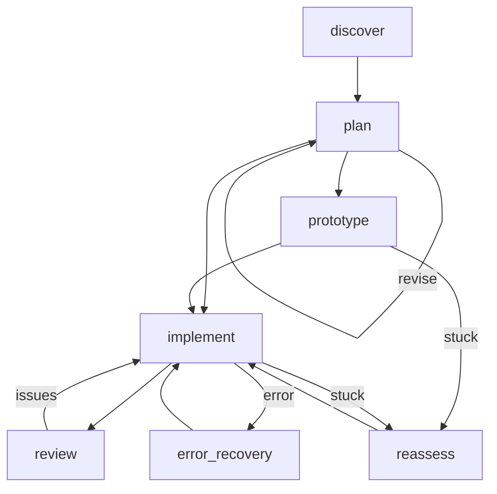
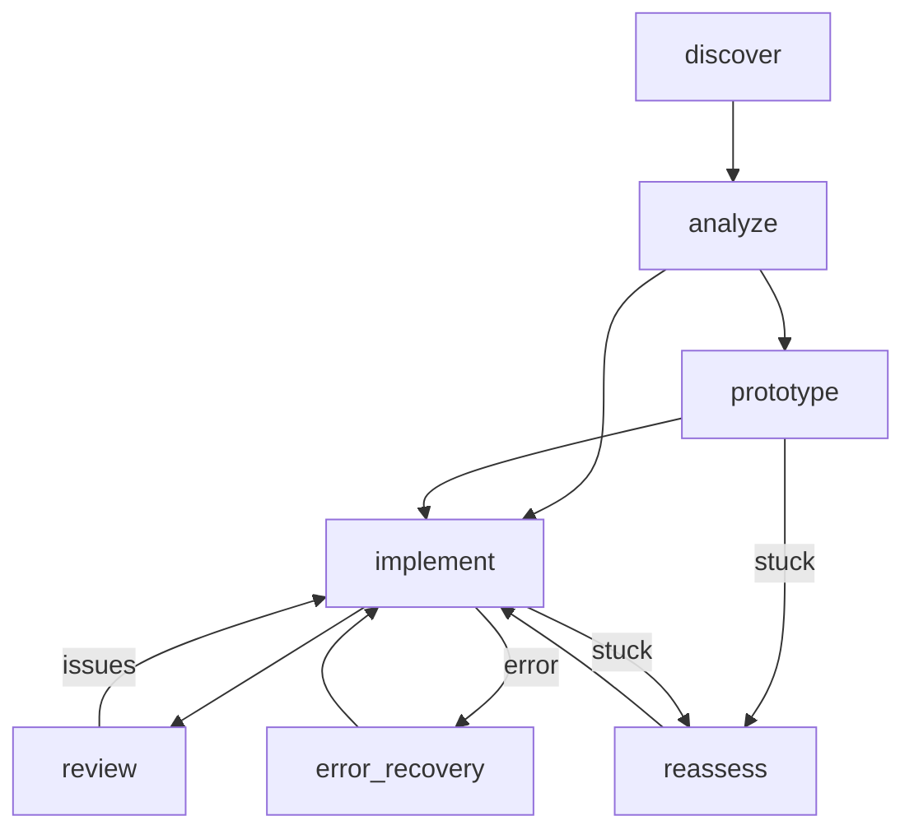
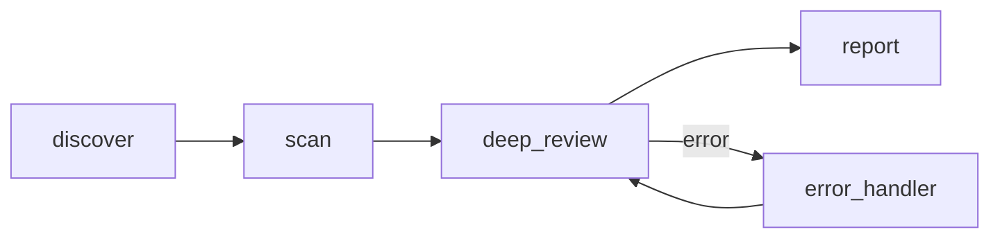
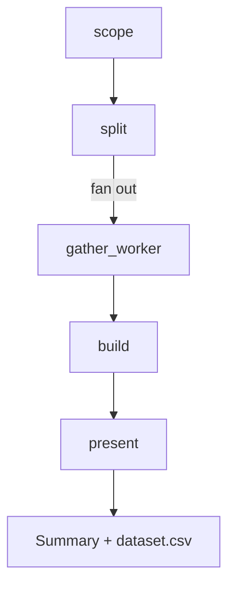
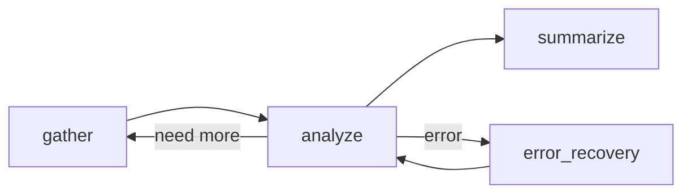
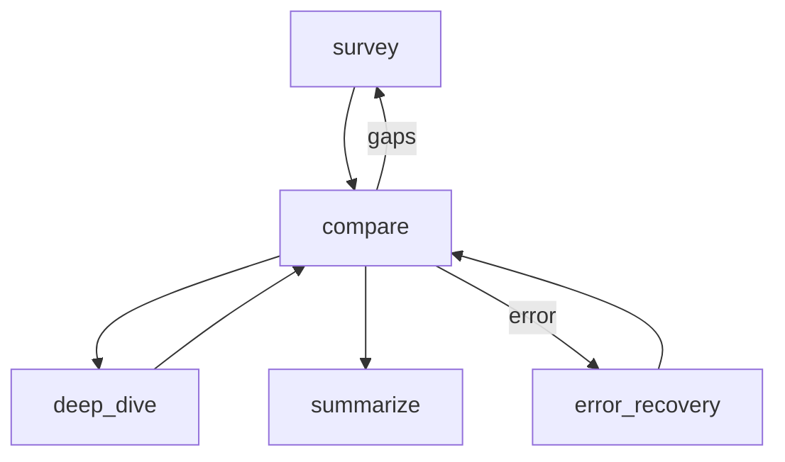
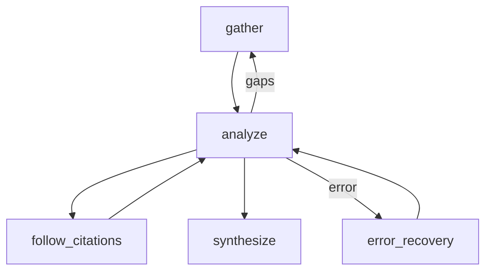
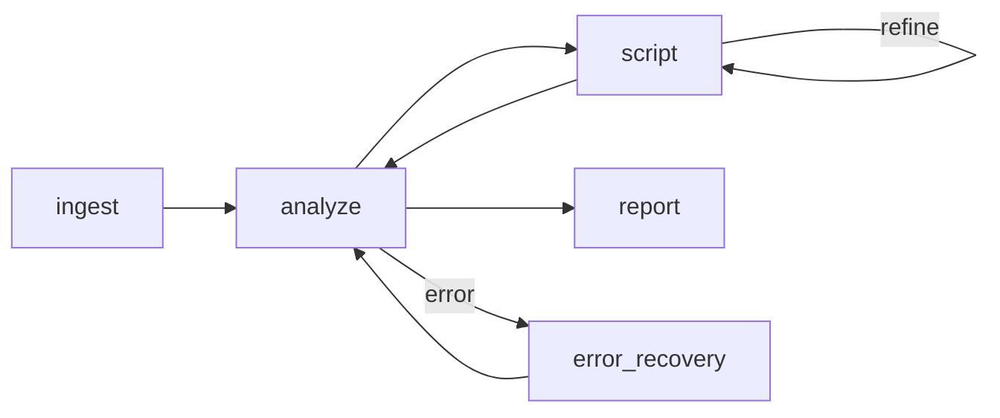
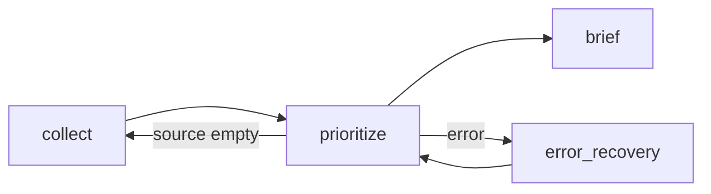
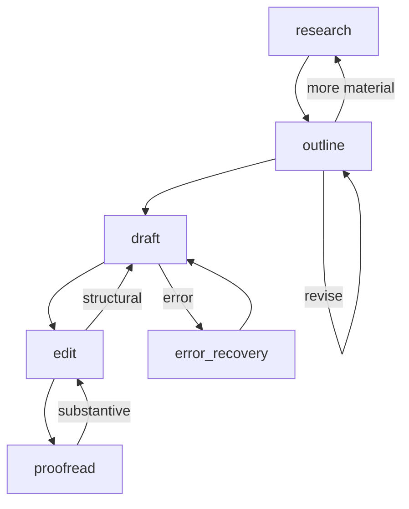

# Agent catalog

Leviath ships with ten pre-built agents. They live in `agents/`, one directory per agent, each
holding an `agent.leviath` [blueprint](/docs/agents). Run any of them by name:

```bash
lev run coder --task "Build a CLI that converts CSV to JSON"
```

This page is also a set of worked examples. Each section shows the agent's real stages and how
they route, so you can copy the patterns into your own blueprint (`lev create my-agent` scaffolds
one, then read [Agents](/docs/agents)). The diagrams show the main path; almost every stage also
carries an `error` edge into a recovery stage, drawn once per agent to keep things readable.

> [!TIP]
> Pick by the shape of the work: a codebase change (the coding agents), a question to answer from
> sources (the research agents), or a recurring chore like logs, briefings, or drafts.

## software-engineer

Plan-then-implement with a human sign-off before any code is written. Reach for it when you want
to approve the approach first.



```bash
lev run software-engineer --task "Add rate limiting to the public API"
```

The `plan` stage runs in `interactive_points` mode, so it pauses for your approval before the flow
continues. That is the [human-in-the-loop](/docs/interaction) pattern. `discover` and `plan` run on
Sonnet; `implement`, `review`, and `reassess` step up to Opus.

## coder

The same discover, prototype, implement, review shape without the human gate. Reach for it when
you just want the change made.



```bash
lev run coder --task "Fix the flaky retry logic in the uploader"
```

`analyze` chooses between a direct `implement` and a `prototype` spike when the approach is
uncertain. `reassess` is reached only on a `stuck` edge. Cheap model early, Opus for the
implement and review passes, so it is a [multi-model](/docs/stages) blueprint.

## reviewer

Review only: a fast scan pass, then a deeper look at correctness, security, and architecture,
ending in a ranked report. Reach for it to vet a diff or PR.



```bash
lev run reviewer --task "Review the changes on the feature/auth branch"
```

The two-pass split is deliberate: `scan` runs on Sonnet to flag areas, then `deep_review`
escalates to Opus to scrutinize only what was flagged, which keeps the expensive model focused.

## data-analyst

Searches the web for data on a subject, builds a clean CSV of it, and hands back a summary of what
the numbers say. Reach for it when you want a dataset you can open, not a paragraph about one.



```bash
lev run data-analyst --task "EV registrations by country, 2015 to 2024"
lev result <run-id>                       # what the numbers say
```

`scope` decides the table's columns before anything is gathered, which is what keeps a hundred rows
from drifting into a hundred shapes. `split` runs in `fan_out` mode, one worker per slice of the
subject, so a broad question is gathered in parallel rather than one source at a time. See
[Sub-agents and fan-out](/docs/sub-agents).

Each worker hands back CSV rows through [`submit_output`](/docs/outputs), and `require_output` makes
that a guarantee rather than a hope. Because the worker declares `format = "csv"`, a worker whose
rows do not parse is told so and retries before the merge ever sees them.

`present` names `data/dataset.csv` in its `artifacts`, so a caller fetches the file rather than
parsing its path out of prose.

## researcher

General-purpose research: gather, analyze, summarize, with a refinement loop. Reach for it for a
quick, focused answer.



```bash
lev run researcher --task "What changed in the HTTP/3 spec this year?"
```

The `analyze` stage loops back to `gather` when a specific sub-topic is thin, then moves to
`summarize` once the picture holds. `analyze` runs on Opus; gather and summarize stay cheap, the
[multi-model](/docs/stages) split again.

## wide-researcher

Broad landscape survey: cast a wide net, compare approaches, deep-read the interesting threads,
then write an overview with recommendations. Reach for it to map a whole space.



```bash
lev run wide-researcher --task "Survey approaches to vector database indexing"
```

`compare` is the hub: it can widen coverage (back to `survey`), pull one thread for a focused
`deep_dive`, or finish. The breadth here comes from the survey-then-compare loop, not fan-out.

## deep-researcher

Thorough single-topic investigation: follows citation chains, cross-checks claims, and produces a
structured, cited report. Reach for it when rigor and sources matter.



```bash
lev run deep-researcher --task "Investigate the evidence for X causing Y"
```

`follow_citations` is a dedicated targeted-read stage: `analyze` flags a specific cited source, the
stage pulls and reads it, then hands control back. Evidence accumulates in
[context regions](/docs/context) across the loop before `synthesize` writes the report on Opus.

## log-analyzer

Analyzes log files for anomalies, trends, and error patterns through a scripted analyze and script
loop, keeping a severity-ranked findings index. Reach for it to triage a noisy log.



```bash
lev run log-analyzer --task "Find the error patterns in /var/log/app.log"
```

`analyze` (on Opus) hands off to `script` to write and run parsing or aggregation code, which can
refine itself before returning results. Findings persist in a [context region](/docs/context)
across passes so the report ranks them by severity.

## daily-briefer

A morning digest: gathers from local and web sources, ranks items into a priorities index, and
delivers a concise briefing. Reach for it for a recurring standup-style summary.



```bash
lev run daily-briefer --task "Brief me on overnight activity across my repos and inbox"
```

`prioritize` (on Opus) can send the flow back to `collect` when a critical source came back empty,
so the briefing is not built on a gap. The ranked items live in a [context region](/docs/context).

## writing-assistant

Research-backed writing from topic to polished draft, with an interactive outline checkpoint and a
draft, edit, proofread loop. Reach for it to produce a sourced piece.



```bash
lev run writing-assistant --task "Write a 1500-word explainer on consistent hashing"
```

`outline` runs in `interactive_points` mode, so it stops for your approval before drafting starts,
the [human-in-the-loop](/docs/interaction) checkpoint. From there `edit` and `proofread` can each
kick the piece back a stage when they hit a structural or substantive problem.

## Running one

Every agent runs the same way, name it and hand it a task:

```bash
lev run deep-researcher --task "Survey the state of solid-state batteries"
```

To build your own, read how blueprints are structured in [Agents](/docs/agents), how the stage
graph routes and recovers in [Multi-stage workflows](/docs/stages), and how the parallel agents
split work in [Sub-agents and fan-out](/docs/sub-agents).
