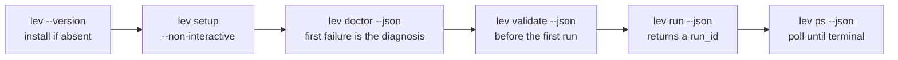

# Quickstart for agents

This page is written to be executed rather than read. Every step is a command, what its output
means, and what to do when it fails. It suits a person in a hurry too, but it exists because
`lev run` hands work to a background daemon, and a caller that does not know that sees a command
return instantly and concludes nothing happened.

If you are reading the docs as a person, [Getting Started](/docs/getting-started) covers the same
ground with more explanation.



## 1. Check for an existing install

```bash
lev --version
```

If that prints a version, skip to step 2. Otherwise install by platform. Pick the first row that
applies and do not try the others.

| Platform | Command |
|---|---|
| macOS or Linux | `curl -fsSL https://leviath.dev/install.sh \| sh` |
| Windows | `powershell -ExecutionPolicy Bypass -c "irm https://leviath.dev/install.ps1 \| iex"` |
| Any, with Rust already present | `cargo install leviath-cli` |

The one-liners need no Rust toolchain. Set `LEVIATH_CHANNEL` to `beta` or `alpha` to install ahead
of stable. See [Releases and channels](/docs/releases) for what those mean.

## 2. Configure a provider

```bash
lev setup --non-interactive --anthropic-key "$ANTHROPIC_API_KEY" --install-agents
```

Two things about this command are easy to get wrong.

**Without `--install-agents`, non-interactive setup installs no blueprints.** The interactive wizard
asks; the scripted path does not, so `lev run coder` then fails with nothing to run.

**If your key is not Anthropic, pass `--default-model` as well.** The flags are
`--openai-key`, `--google-key`, `--openrouter-key`, and `--ollama-url`. Setup points
`default_provider` at whichever one you configured, but it cannot guess which of that provider's
models you want, and a stage stating no model preference needs one:

```bash
lev setup --non-interactive \
  --openrouter-key "$OPENROUTER_API_KEY" \
  --default-model "deepseek/deepseek-v4-flash" \
  --install-agents
```

Ask [`lev models list --json --all`](/docs/cli) for the model ids a provider offers.

## 3. Verify with `lev doctor`

```bash
lev doctor --json
```

Four checks run in order and stop at the first failure, because that failure is the diagnosis:

| Check | What it proves | If it fails |
|---|---|---|
| `config` | config.toml parses and a provider registry builds | Fix the file, or rerun `lev setup` |
| `resolve` | your defaults name a provider that is registered | Set `default_provider` and `default_model` |
| `inference` | one real API call succeeds | The provider's own error text is in `detail` |
| `daemon` | the daemon accepts and runs a throwaway agent | Your keys are fine; the daemon is not |

The reply is `{"checks": [...], "passed": bool}`, and each check carries `name`, `status`, and
`detail`. Branch on `passed`. The command also exits non-zero on failure, so it works as a gate in a
script that does not parse JSON.

`lev doctor` bills two inferences of at most 64 output tokens. `--no-daemon` stops after check three
and bills one.

## 4. Validate a blueprint before running it

```bash
lev validate <path> --json
```

Run this before the first `lev run` of any blueprint you did not write. It catches the settings whose
absence quietly changes what a run does: a top-level `[model]` block, which parses and is then read
by nothing, and a stage with no model, which silently takes the host default.

The report is one shape whatever happens, so you parse once and branch on `valid`:

```json
{
  "valid": true,
  "blueprint": { "name": "reviewer", "version": "0.0.2", "entry_stage": "discover", "stages": ["discover", "scan"] },
  "error": null,
  "findings": [{ "severity": "note", "code": "command-seed", "stage": null, "message": "...", "fix": "..." }],
  "errors": 0, "warnings": 0, "notes": 0
}
```

A manifest that did not parse fills `error` and leaves `blueprint` null. Each finding's `code` is a
stable slug to branch on; the `message` is written to be read. Notes never fail the command, and
`--deny-warnings` makes warnings fail it too.

## 5. Spawn a run

```bash
lev run <blueprint> --task "..." --json --yolo
```

This is the step that surprises callers. `lev run` does not run the agent in your process. It hands
it to a background [daemon](/docs/daemon) and returns immediately, so the run survives your shell
exiting. The reply is the only handle you get on it:

```json
{
  "run_id": "software-engineer-1785800124-c8958e7267f4",
  "blueprint_path": "/home/you/.leviath/agents/software-engineer/agent.leviath",
  "workdir": "/home/you/project",
  "yolo": false
}
```

Keep `run_id`. Everything after this needs it. Warnings go to stderr, so stdout parses on its own.

`--yolo` is in that command deliberately. Without it, most blueprints stop on the first tool call
whose permission is `ask` and wait for a person to approve it. Nobody answers, and an hour later
`[limits] interaction_timeout_secs` expires and denies it. If you leave `--yolo` off, you are
committing to answering prompts yourself, which step 7 covers.

Useful flags: `--workdir <dir>` confines the agent's file tools, `--model provider/model` overrides
the blueprint's choice for every stage, and `--task` also accepts a file path.

## 6. Poll until it finishes

```bash
lev ps --json
```

`runs` holds what is live and `finished` what completed recently. Each entry carries `status`,
`stage`, `iteration`, and `wait_reason`. Poll on an interval of seconds, not milliseconds: an
inference call takes seconds, so a faster loop only burns CPU.

| `status` | Meaning | What to do |
|---|---|---|
| `Active` | Working | Keep polling |
| `Idle` | Alive, with nothing queued | Keep polling |
| `Waiting` | Blocked | Read `wait_reason`, below |
| `Paused` | Held by `lev pause` | `lev resume <run_id>` |
| `Complete` | Finished | Read its output; stop polling |
| `Error` | Errored, with a `message` | `lev context <run_id> --json` has the history |
| `Cancelled` | Stopped by `lev cancel` | Stop polling |

`Complete`, `Error`, and `Cancelled` are terminal. The rest can still change.

`Waiting` is the one that needs care, because two very different things share it. `wait_reason` is
an object with a `reason` key:

| `wait_reason.reason` | Needs a person | What to do |
|---|---|---|
| `fan_out_workers` | No | Nothing. `outstanding` counts the workers still going |
| `children` | No | Nothing. Sub-agents are running |
| `tool_approval` | Yes | Approve it, or use `--yolo`. See step 7 |
| `user_prompt` | Yes | The agent asked a question. See step 7 |
| `interaction_point` | Yes | A blueprint checkpoint. See step 7 |
| `taint_gate` | Yes | A clearance prompt. See step 7 |

The first two resolve on their own and are healthy. The rest are stopped until somebody answers, and
a caller that treats them as healthy waits out the timeout for nothing.

A finished run leaves `runs` and appears in `finished` for `[limits] finished_retention_secs`
(300 by default). A run that is in neither is older than that, not lost. `lev ps --all` also lists
on-disk runs the daemon is not hosting.

## 7. Unattended runs, and answering when you are not one

`--yolo` approves every tool call and answers the agent's own `ask_user_*` prompts instead of
waiting for a person. Under `--yolo` those five tools are not advertised to the model at all, so it
decides for itself rather than spending a round trip to be told nobody is there. That clears
`tool_approval`, `user_prompt`, and `taint_gate`.

Without `--yolo`, you answer them. `lev respond --json` lists every open question with the run
holding it, its kind, and its options:

```bash
lev respond --json
lev respond <request_id> --approve            # a tool approval or a confirm
lev respond <request_id> --approve --session  # and every later call to that tool
lev respond <request_id> --deny
lev respond <request_id> --choice 0           # a multiple-choice question
lev respond <request_id> "some text"          # a free-text question
```

A prompt nobody answers is not held forever. `[limits] interaction_timeout_secs` expires it, and an
expired tool approval is **denied**: a timeout is never read as consent.

One exception matters, and it is the one that looks like a hang. A blueprint
[interaction point](/docs/interaction#interaction-points) may declare `unattended = "ask"`, and then
it holds for a person even under `--yolo`. The shipped `software-engineer` does exactly that for its
plan approval, deliberately, because everything after that gate writes code.

Such a run reports `Waiting` with a `wait_reason` of `interaction_point` and does nothing until
`[limits] interaction_timeout_secs` expires. That defaults to one hour, so the run is not stuck, but
for an hour it is indistinguishable from a run that is. You have three ways out:

- Lower `interaction_timeout_secs` in `config.toml` so the gate releases sooner. It is read once at
  daemon start, so change it before `lev daemon restart`.
- Answer the question yourself. `lev respond --json` lists every open interaction with the agent
  holding it, and `lev respond <request_id> --choice <n>` answers one.
- Run a blueprint with no such gate. `coder` does the same work with no plan checkpoint.

## 8. Choose the right surface

The CLI is one of four ways in. Pick by what is calling.

| You are | Use | Why |
|---|---|---|
| A script or coding agent at a shell | The CLI with `--json` | Everything on this page |
| An editor or orchestrator that spawns processes | [`lev agent-client`](/docs/agent-client-protocol) | Agent Client Protocol over stdio |
| A service that speaks HTTP | [`lev serve`](/docs/api) | REST plus a WebSocket event stream |
| A Rust program | [the `leviath` crate](/docs/embedding) | In-process, no daemon or socket |

[Where Leviath fits](/docs/integrations) goes through the tradeoffs.

## When something goes wrong

| Symptom | First thing to run |
|---|---|
| Any command behaves oddly | `lev doctor --json` |
| A run is `Waiting` and you do not know why | `lev respond --json` |
| A run says `Active` but nothing changes | `lev ps --json` and watch `iteration` |
| A run is missing from `lev ps` | `lev ps --all --json` |
| A run failed and you want the history | `lev context <run_id> --json` |
| A blueprint behaves unlike its manifest | `lev validate <path> --json --deny-warnings` |

[Troubleshooting](/docs/troubleshooting) is organised by symptom and covers the rest.

## Which commands speak JSON

`--json` is on `run`, `ps`, `doctor`, `validate`, `list`, `models list`, `context`, `mcp list`, and
`respond`. Everything else prints for a person. [CLI reference](/docs/cli) has every command and
flag.
