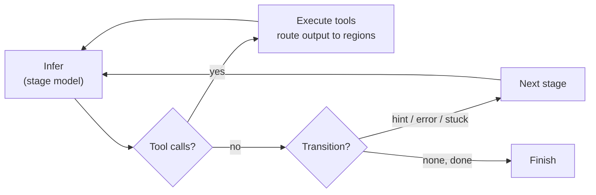
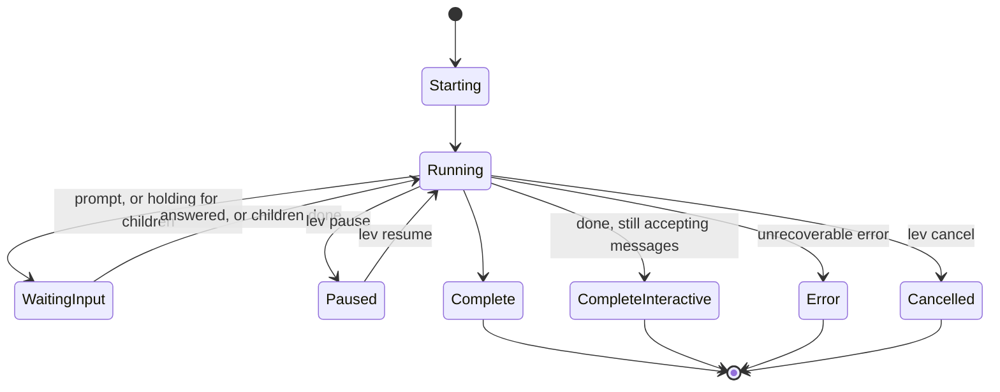

# Agent blueprints (`agent.leviath`)

An agent is a directory with an `agent.leviath` file, a TOML **blueprint** describing a
multi-stage [workflow graph](/docs/stages). The [agent catalog](/docs/agent-catalog) has seven
complete ones worth stealing from.

New to this? [Build your first agent](/docs/first-agent) walks through writing one stage by
stage; this page is the reference for every field it uses.

Start from a scaffold rather than a blank file:

```bash
lev create my-agent
cd my-agent
lev run . --task "Your task here"
```

A blueprint needs very little to run: a name, an entry stage, and one stage with a prompt.
Everything else on this page is opt-in from there. A fuller one looks like this
(machine-checkable against the published
[blueprint schema](https://leviath.dev/docs/stable/blueprint.schema.json)):

```toml
[agent]
name = "coder"
version = "0.2.0"
description = "Analyze, implement, and review with graph-based recovery"
entry_stage = "analyze"

[tool_permissions]           # global defaults; per-stage overrides allowed
read_file  = "allow"
write_file = "ask"
bash       = "ask"

[stages.analyze]
mode = "autonomous"
model = { models = [
  { provider = "anthropic", model = "claude-sonnet-4-6" },
  { provider = "openai",    model = "gpt-5.4-mini" },
] }
available_tools = ["read_file", "list_dir"]
required_tools = []                # human-in-the-loop tools kept in an unattended run
max_iterations = 15
system_prompt = """Understand the task and produce a short implementation plan."""

[stages.analyze.transitions.implement]
hint = "Plan ready, begin implementation"
```

## The run loop

Within a stage, an agent runs a tight loop (infer, act on tool calls, repeat) until the model
signals it's done or a [transition](/docs/stages) fires:



## Lifecycle

A run moves through a handful of states the [dashboard](/docs/dashboard) and [API](/docs/api)
report on:



These are the exact `RunStatus` values the [dashboard](/docs/dashboard) and [API](/docs/api)
report. `CompleteInteractive` means every required stage finished but the agent is still
accepting [messages](/docs/interaction).

`WaitingInput` covers two very different situations: a run stopped on a prompt somebody has
to answer, and a run parked while its own [sub-agents](/docs/sub-agents) or
[fan-out](/docs/stages) workers get on with it. The second needs nothing from you.
[`lev ps`](/docs/cli#reading-lev-ps) tells them apart, so reach for it before concluding a
run is stuck.

## Stages and models

Each stage gets its own **model** (an ordered provider/model fallback list: the first configured
provider wins), tools, iteration cap, and context layout. Transitions form a
[graph](/docs/stages): linear by default, or branch on conditions like `error` and `stuck`.

```toml
[stages.analyze.model]
allow_user_default = true          # fall back to the user's default model, else fail closed
models = [
  { provider = "anthropic", model = "claude-sonnet-4-6" },
  { provider = "openai",    model = "gpt-5.4-mini" },
]
request_timeout_secs = 120         # per-stage inference wall-clock cap

[stages.analyze.model.parameters]  # free-form, passed through to the provider
temperature = 0.2
max_tokens  = 8000
```

Model selection is per stage, and only per stage. Two mistakes here are quiet ones. A top-level
`[model]` block parses and is read by nothing, and a stage naming no model takes the host default
without saying so. `lev validate` reports both. See
[every stage should name its own model](/docs/stages#every-stage-should-name-its-own-model).

### Which tools a stage gets

`available_tools` lists what the stage may call.

`required_tools` is the exception to the unattended cut. A [`--yolo`](/docs/glossary) run drops
every tool that waits on a person, and this is where a stage names the ones it wants kept anyway. Every entry must also
appear in `available_tools`.

Naming a tool here also settles the `blocking-tool-in-autonomous-stage` lint for it, since listing
it is how you say you meant it. See
[human-in-the-loop tools](/docs/tools#these-tools-need-someone-there).

## Context regions

`[context.regions]` defines the memory layout. There are nine region kinds (the default is
`temporary`); see [Structured context](/docs/context) for what each one does. Budgets come in
three forms:

```toml
[context.regions.codebase]
kind = "compacting"
budget = "35%"             # ceiling as a share of the model's context window
max_tokens = 60000         # absolute guard-rail the percentage never exceeds
min_tokens = 4000          # absolute floor on small context windows

[context.regions.task]
kind = "pinned"
max_tokens = 2000          # bare max_tokens alone = fixed absolute budget
```

Percentages are **ceilings, not allocations**. They may sum past 100%, because regions rarely all
fill at once. With a percentage, `max_tokens` caps and `min_tokens` floors the resolved value;
without one, `max_tokens` is the fixed budget. Compacting regions also take
`threshold_tokens`, the fill level that triggers compaction.

A stage can override the whole layout for just itself with `[stages.<name>.context.regions]`. The
per-stage layout applies when the stage is entered, and uses the same syntax:

```toml
[stages.plan.context.regions.constraints]
kind = "pinned"
budget = "10%"
```

**A region the stage leaves out is hidden, not destroyed.** It keeps its contents, is left out of
that stage's prompt, and comes back with everything in it as soon as a later stage declares it
again. That is what makes this usable for narrowing: a compute stage need not carry a large data
preview through every one of its calls, and a summary stage further on can still read it.

`conversation`, `tool_results` and `final_output` are always visible, whatever a stage declares.
The first two hold the typed tool-call turns the next stage's own turns attach to, and an answer
submitted early has to survive to the end.

## Seed commands

A region can be seeded before the run starts:

```toml
[context.regions.codebase]
kind = "compacting"
seed = { command = "git ls-files" }
```

Seeds run at spawn **before any approval prompt**, confined to the workdir and routed through the
entry stage's sandbox, time- and size-capped.

> [!WARNING]
> A seed command runs a shell command before you approve anything, so it must be covered by
> [`[safe_commands]`](/docs/interaction#what-runs-without-asking) to run at all. `lev validate`
> prints every seed a blueprint will run; review them for third-party blueprints. Refuse with
> `--no-seed-commands` or `[security] allow_seed_commands = false`.

## Read paths

An agent that needs to *read* beyond its workdir, for run archives, design docs, or sibling
directories, declares them:

```toml
[read_paths]
allow = ["~/.leviath/runs", "../shared-docs", "glob:~/design-docs/**"]
```

The declarations do nothing on their own: the user's config must grant them, they are
read-only, and every access is checked against the symlink-resolved real path. Run
`lev validate` to see which of them the config on this machine actually grants. See
[Security](/docs/security) for the grant stanzas and the full matching rules.

## How the coding agents verify their work

The bundled `coder` agent decides what "done" means before it
start, rather than judging it at the end. Their entry stage is `discover`: before planning anything, the agent classifies the
project's testing story and writes a `workflow` region ending in three literal lines that later
stages execute verbatim:

```text
BASELINE: <command to run BEFORE any edit>
VERIFY: <command to re-run after each change>
DONE WHEN: <the completion bar, including "no regressions vs baseline">
```

The baseline is captured before the first edit, so "a test that was already failing" and "a test
I broke" are distinguishable. Each change re-runs VERIFY and compares against the baseline, and
the run is only done when DONE WHEN holds, not when "most tests pass". Regions that carry this
state are marked `required = true`; if one is empty when a stage needs it, the workflow routes
back through discovery instead of guessing. Projects with no tests at all are handled explicitly:
the plan must include *building* verification (a smoke test to write and run), stated plainly
rather than invented.

## Tracking files the agent touches

`[context.file_tracking]` keeps a running list of what the agent has read and written, in its own
region, so a later stage knows what has already been looked at.

```toml
[context.file_tracking]
region          = "files"    # default "files"
track_reads     = true       # default true
track_writes    = true       # default true
max_file_tokens = 4000       # cap on how much of one file is tracked
```

## Catching an agent going in circles

`[repetition_detection]` watches for an agent making the same call over and over, or reading without
ever writing. When it sees one, it writes a `[System]` note into the agent's conversation telling it
what it is doing and to try something else.

It nudges, it does not intervene. The run keeps going either way, the stage does not fail, and no
transition fires. If you want a loop like this to actually route somewhere, use a `stuck` edge in
[stages](/docs/stages#stuck-detection). The two work well together: the nudge gives the agent a
chance to correct itself, and the edge catches it if it does not.

```toml
[repetition_detection]
enabled             = true   # default
max_repeat_calls    = 3      # default; identical tool call, back to back
max_readonly_streak = 10     # default; read-only calls with no modification in between
```

## Who does the summarizing

A [`compacting` region](/docs/context) summarizes rather than evicting, and something has to write
that summary. By default it is Sonnet on Anthropic, whatever the stage itself runs on, because a
summary is cheap work that does not need the stage's model:

```toml
[compaction]
provider           = "anthropic"          # default
model              = "claude-sonnet-4-6"  # default
max_summary_tokens = 2000                 # default
temperature        = 0.2                  # default
system_prompt      = "..."                # optional; replaces the built-in summarizer prompt
```

Point it at a provider you have configured if you do not use Anthropic. A run whose compaction
provider is not registered loses compaction rather than failing, so an unset `[compaction]` on an
OpenAI-only machine quietly stops summarizing. `lev doctor` reports which providers are
registered.

## Discovering tools mid-run

By default a stage advertises a fixed tool set resolved at spawn, and a tool that appears later is
invisible to it. `dynamic_tools` opts an agent in to re-advertising:

```toml
[agent]
dynamic_tools = true
```

With it on, a script tool written into the run's own `tools/` directory becomes callable on the
next inference. Off (the default) is the safer choice, since it means an agent cannot grow its own
capabilities mid-run.

## Handing context to a sub-agent

`[[transforms]]` maps one blueprint's regions onto another's when a parent spawns a child, so the
child starts with the parent's findings under its own region names.

```toml
[[transforms]]
from_blueprint = "researcher"
to_blueprint   = "reviewer"

[[transforms.mappings]]
from_region = "findings"
to_region   = "source_material"
transform   = "direct"        # direct | summarize | extract

[[transforms.mappings]]
from_region = "conversation"
to_region   = "brief"
transform   = "summarize"
```

`extract` additionally takes `fields` to pull named pieces out. See
[Sub-agents](/docs/sub-agents).

## Validate before you run

```bash
lev validate .                    # check the graph, and what the blueprint leaves unsaid
lev validate . --deny-warnings    # for CI: warnings fail too
lev test .                        # run the blueprint's tests/ cases (real API calls)
lev test . --dry-run              # parse and report them without calling a provider
```

Beyond the graph, `lev validate` reports the fields whose absence quietly changes what a run does.
That covers a stage with no model block, a tool name that matches nothing, and an autonomous stage
offering a tool that waits for a person. Errors exit non-zero, warnings do not, notes never can. The
[CLI reference](/docs/cli#lev-validate-path) lists every check. The daemon logs the same findings
when a run spawns, so a blueprint nobody validated still says what is wrong with it.
