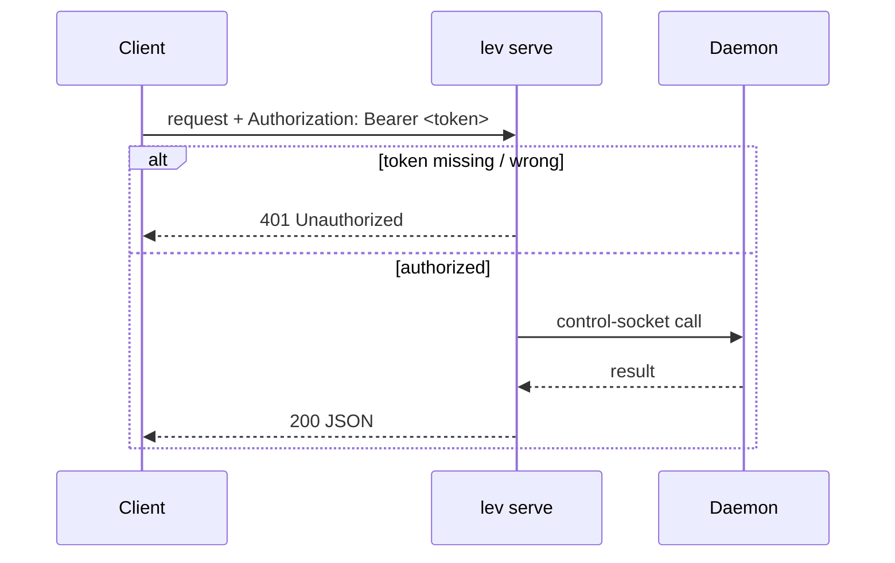
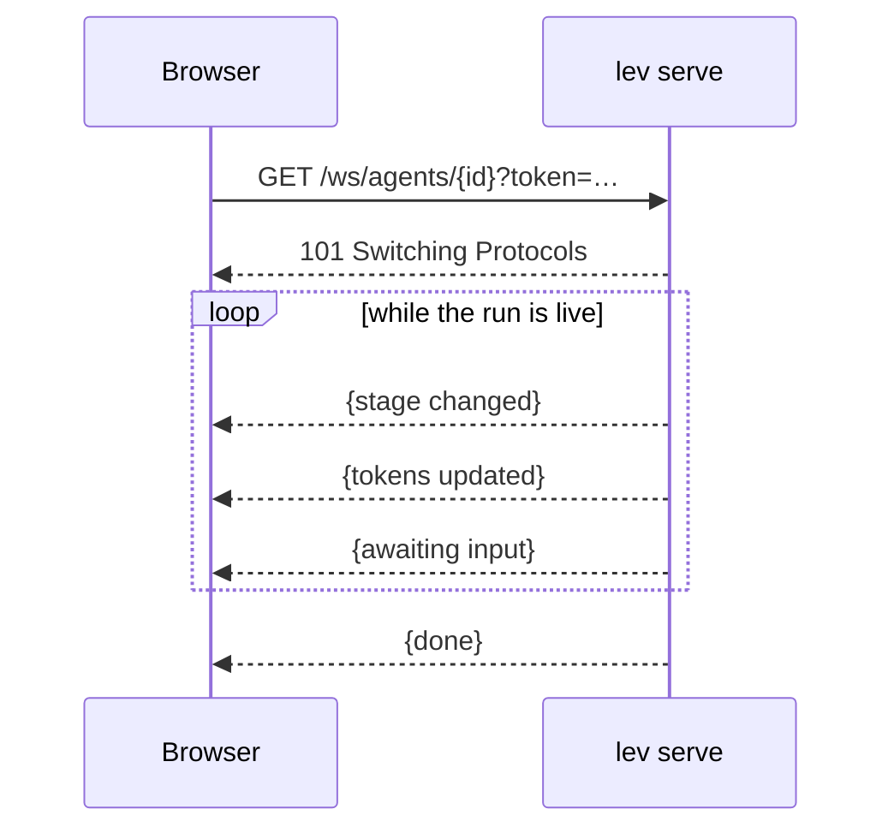

# HTTP API (`lev serve`)

`lev serve` exposes a REST + WebSocket API in front of the [daemon](/docs/daemon), so anything that
speaks HTTP can drive Leviath, including [The Lair](https://leviath.dev/lair), the browser console.

```bash
lev serve --port 3000 --token "$(openssl rand -hex 16)" --cors https://leviath.dev
```

Every route on this page is also published as a machine-readable
[OpenAPI spec](https://leviath.dev/docs/stable/openapi.json), kept in lockstep with the server by
a test, so a client generator or an agent can consume the contract directly.

## Security model

- **A token is required.** The server refuses to start without `--token <t>` (or
  `LEVIATH_API_TOKEN`). Every request must send `Authorization: Bearer <t>`; WebSocket clients
  pass it as `?token=<t>` because browsers can't set WS headers. On shared machines prefer the
  environment variable: a `--token` value is visible to other local users in the process table
  (`ps`).
- **CORS is closed by default.** Pass `--cors <origin>` (e.g. `https://leviath.dev`) or `--cors "*"`
  to allow a browser to call it cross-origin.
- **Binds to `127.0.0.1`** by default. `--host 0.0.0.0` exposes it on your network. Without
  `--tls-cert`, that puts the bearer token on the wire in cleartext for anyone on that network to read.
  If the address is publicly routable, that is the open internet. See
  [reaching a Leviath on another machine](#reaching-a-leviath-on-another-machine).
- **`--tls-cert` / `--tls-key`** serve HTTPS instead of HTTP. Off by default, bring your own
  certificate; Leviath never generates one.
- **`GET /` needs no token.** It returns a fixed "Leviath is running." page and nothing else: no
  version, no run counts, no endpoint list. It exists so a certificate can be accepted in a browser
  tab; see the section below.
- **`--allow-admin`** mounts the mutating admin routes. `GET /api/config` and
  `GET /api/mcp/servers` are always available. The writes are only mounted with `--allow-admin`, and
  the route is genuinely absent without it rather than gated by a check inside the handler. What you
  get back depends on whether the path exists at all for another method:

  | Without `--allow-admin` | Response |
  |---|---|
  | `PUT /api/config` | 405, because `GET /api/config` is mounted |
  | `POST /api/mcp/servers` | 405, because `GET /api/mcp/servers` is mounted |
  | `DELETE /api/mcp/servers/{name}` | 404, because nothing else is mounted on that path |
- **`--workdir-root`** confines agent workdirs; **`--no-remote-yolo`** forbids `"yolo": true` and
  `"allow": [...]` on spawn, which are one lever rather than two.

> [!CAUTION]
> `lev serve` runs LLM-driven tools with whatever permissions the blueprint grants. Treat it as
> trusted-network only unless hardened. See [Security](/docs/security).

## Reaching a Leviath on another machine

The short version: **`http://` only works on loopback.** Everything else needs HTTPS or a tunnel.

A browser treats `http://localhost` and `http://127.0.0.1` as potentially trustworthy, which is the
only reason the default setup works from a page served over HTTPS. Every other address is blocked,
and **a LAN address is blocked exactly like a public one**. `http://192.168.1.50:3000` fails just as
`http://203.0.113.10:8080` does:

```
Mixed Content: The page at 'https://leviath.dev/lair' was loaded over HTTPS, but requested an
insecure resource 'http://203.0.113.10:8080/api/config'. This request has been blocked.
```

Two things that are *not* the problem, because they are what people reach for first:

- **It is not CORS.** The request is killed inside the browser before it is sent, so it never reaches
  Leviath and `--cors` is never consulted. No response header on either side lifts a mixed-content
  block.
- **The site cannot fix it.** leviath.dev is HTTPS-only, and an HTTPS page may not call `http://`.

Pick whichever of these suits you.

### mkcert, if the browser and Leviath are on machines you control

The best outcome: a certificate that is *fully* trusted, with no interstitial and nothing to accept.
[mkcert](https://github.com/FiloSottile/mkcert) installs a local CA into your OS and browser trust
stores and will issue for a bare IP.

```bash
mkcert -install                      # once, on the machine running the BROWSER
mkcert 192.168.1.50                  # on the machine running Leviath
lev serve --host 0.0.0.0 --port 3000 \
  --tls-cert ./192.168.1.50.pem --tls-key ./192.168.1.50-key.pem \
  --cors https://leviath.dev --token "$LEVIATH_API_TOKEN"
```

Installing a CA into your trust store is a real trust decision: anything holding that CA's key can
issue a certificate your browser will believe. `mkcert` keeps the key on the machine that made it.

### Tailscale, for a publicly-trusted name

`tailscale cert` issues a real certificate for your `*.ts.net` hostname, so nothing needs installing
in a trust store and the port never faces the internet.

```bash
tailscale cert my-box.tail1234.ts.net
lev serve --host 0.0.0.0 --tls-cert my-box.tail1234.ts.net.crt \
  --tls-key my-box.tail1234.ts.net.key --cors https://leviath.dev
```

### Self-signed, as a fallback

Works, with one manual step and one caveat.

```bash
openssl req -x509 -newkey rsa:2048 -nodes -days 365 \
  -keyout key.pem -out cert.pem -subj "/CN=leviath" \
  -addext "subjectAltName=IP:192.168.1.50"
lev serve --host 0.0.0.0 --tls-cert cert.pem --tls-key key.pem --cors https://leviath.dev
```

Then **open `https://192.168.1.50:3000/` in a browser tab and accept the warning.** That is what the
unauthenticated `GET /` page is for: The Lair's requests are subresource `fetch` calls, which get
no interstitial to click through, so the exception has to be established in a tab first. Afterwards
The Lair works.

Chrome discards accepted exceptions when the browser restarts, so this comes back. Firefox keeps
them. iOS Safari is unreliable about it.

### SSH forward, if you would rather not deal with certificates

Nothing to install on either end, and it puts you back inside the loopback exemption.

```bash
ssh -N -L 3000:127.0.0.1:3000 you@that-machine
```

Then point The Lair at `http://127.0.0.1:3000`. Leave Leviath on its default `127.0.0.1` bind for
this. `--host 0.0.0.0` is not wanted and only widens the exposure.

## Auth flow



## Endpoints

Base path `/api`; all JSON unless noted.

| Method · Path | Purpose |
|---|---|
| `GET /api/runs` | List runs: paginated, sortable, searchable. See [below](#listing-and-searching-runs) |
| `GET /api/agents` · `POST /api/agents` | List runs *(deprecated, use `/api/runs`)* · spawn an agent. Reads the persisted records, so finished runs stay listed |
| `GET /api/agents/{id}` · `DELETE …` | Get one · cancel |
| `GET /api/agents/{id}/result` · `/context` | The run's answer and log tail · current context window |
| `GET /api/agents/{id}/logs?stage=&stream=&tail=` | A run's logs. `stage`, `stream` and `tail` pick which stage, which stream, and how much |
| `GET /api/agents/{id}/context/history` | How the context window changed over the run, paginated |
| `GET /api/agents/{id}/stages` | The per-stage ledger: what each stage cost, which regions it carried, and whether it ran at all. See [below](#where-a-runs-cost-went) |
| `GET /api/agents/{id}/files` | List a run's files, or read one with `?path=`. `offset` pages a large one. See [below](#a-runs-files) |
| `GET /api/agents/tree` · `/{id}/tree-status` · `/{id}/children` | Sub-agent tree + token roll-ups |
| `POST /api/agents/{id}/pause` · `/resume` | Pause a run · resume it |
| `POST /api/agents/{id}/message` | Steer a running agent |
| `GET/POST /api/agents/{id}/interaction` | Read / answer a pending question |
| `GET/POST/PUT/DELETE /api/blueprints[/{name}]` · `/validate` | Blueprint CRUD + validation. The listing is paginated and takes `q` |
| `GET /api/config` · `PUT /api/config` *(admin)* · `POST /api/config/validate` | Read redacted config · write keys · validate a key |
| `GET /api/models` | Enumerate models |
| `GET /api/mcp/servers` · `GET /{name}/status` · `POST /{name}/login` · `POST /{name}/test` | MCP servers (add/remove need admin) |
| `GET /api/doctor` | The checks `lev doctor` runs, as data. A failing check is `ok: false` inside a 200, never an HTTP error |
| `GET /api/fs/dirs?path=&hidden=` | One directory level of subdirectory names, for a folder picker. Absolute paths only, fenced by `--workdir-root`; `hidden=true` includes dot-prefixed names |
| `GET /ws` · `GET /ws/agents/{id}` | Live event stream (all agents / one run) |

On `/logs`, `stage` takes a stage index or `all`, and defaults to the current stage. `stream` is
either `output`, the assistant's own text, or `logs`, which carries tool calls, token counts and
errors. `tail` is a byte budget for how much of the end you get back.

> [!NOTE]
> A run object carries both `updated_at` and `last_progress_at`. The first advances on a 30-second
> heartbeat and stays fresh on a run that has stopped; the second moves only when the run does. Age
> a run against `last_progress_at`. `pid` is always 0 and means nothing: the daemon hosts every run
> in one shared world, so there is no process per run. If you are tracking slots from outside, read
> [reconciling an external work queue](/docs/work-queues) first.

## Listing and searching runs

`GET /api/runs` returns a page, not the whole list:

```json
{ "items": [{ "meta": { "run_id": "…" }, "highlights": [] }],
  "next_cursor": "7b2276…", "total": 340, "server_time": 1785869070 }
```

Pass `next_cursor` back as `cursor` and loop until it comes back null. Do not count pages against
`total`. It is what matched at the moment of that one request, and runs are being created and
finished underneath you.

Paging is keyset rather than offset, because an offset into a list that is changing skips and
repeats items, and does it most often at the head. **`sort=started_at` is the default because it is
the only sort key that never changes.** `updated_at` moves on the daemon's 30-second heartbeat, so
every live run shifts under a walk; a run whose sort value changes mid-walk can be missed or
repeated. To poll for what changed, use `since=` with no cursor rather than deep-paginating.

`since=` filters whichever field `sort` names, and is inclusive. Pass the previous response's
`server_time` and you may see one item twice, which is the safe direction when the granularity is
whole seconds.

Two parameters exist so a browser client does not have to make N requests: `ids=a,b,c` fetches exactly
those runs, and `fields=run_id,status,title` trims each one. Ids that no longer exist come back in
`missing` rather than failing the request.

### Search

`q=` is a case-insensitive substring. It is not a regular expression, there are no boolean
operators or phrase quoting, and case folding is ASCII-only.

`q_in=` chooses where to look, defaulting to `meta,files`:

| Source | Looks at | Cost |
|---|---|---|
| `meta` | title, task, agent name, workdir, run id, error, metadata values | free |
| `files` | the paths the run recorded modifying | free |
| `context` | the run's current context window | one file read per run |
| `logs` | the tail of each stage's logs | two reads per stage per run |
| `journal` | the whole run journal: tool calls and context history | one file read per run |

The last three read from disk, which is why they are opt-in. Surface them as a "search inside
runs" toggle rather than making every keystroke pay for them. They also stop after a bounded number
of runs, newest first. When that happens the response says `scan_truncated: true` and sets `total`
to null, because a count taken from a partial scan would be read as fact.

Matching items carry `highlights` saying *why* they matched: the field, a snippet, and the stage
where there is one, which you can pass straight to `/logs?stage=`. This is the part that cannot be
done in the browser, because The Lair never holds a run's transcript.

One honest limit: the deep sources match the raw JSON on disk, so a query containing a quote,
a backslash or a newline may not match text that does contain it.

## Where a run's cost went

`GET /api/agents/{id}/stages` returns one record per declared stage, in blueprint
order:

```json
{
  "run_id": "analyst-1786409275-d17e8f82",
  "stages": [
    { "name": "plan",           "status": "complete", "entered": true,
      "prompt_tokens": 8420, "completion_tokens": 610,
      "cached_tokens": 6100, "cache_write_tokens": 240,
      "region_tokens": { "task": 24, "data_preview": 4004 },
      "runaway_warned": false },
    { "name": "error_recovery", "status": "skipped",  "entered": false },
    { "name": "answer",         "status": "complete", "entered": true }
  ]
}
```

Three things here are not derivable from any other route.

**`entered` says whether the run was ever in that stage.** The alternative is to
fetch `context/history` and diff consecutive snapshots to see which stages
produced entries. That is expensive, because every point carries a whole context
window. It is also wrong in the case that matters: a stage that ran and wrote
nothing to any region leaves no trace to find. `status: "skipped"` is the same fact
stated from the other side, and means the run finished without reaching this
stage, as distinct from `"pending"` on a run that is still going.

**The per-stage cost split.** The run-level totals are on the run record; which
stage spent them, and the cache read/write split within a stage, are only here.
A stage showing no cache reads cannot be told apart from one paying to write a
prefix nothing reuses without `cache_write_tokens`.

**`region_tokens` is what decides whether a region is earning its place.** It is
the largest each region reached while that stage was active. This is the number to
look at before trimming a layout.

`runaway_warned` is set when a stage's per-call prompt passed four times its
first call, which is the shape of a region accumulating without a cap.

The list is bounded by the blueprint's stage count, so it is not paginated. A run
that has not reached its first stage boundary returns an empty list rather than a
404. The run exists and has nothing to report yet.

> [!NOTE]
> `entered` is `false` for every stage of a run recorded before Leviath tracked
> it, because the field is not in those files at all. Read it together with
> `status`: a stage recorded `complete` with tokens against its name ran,
> whatever `entered` says on an old run.

## A run's files

`GET /api/agents/{id}/files` answers two different questions, and neither substitutes for the other.

`source=modified` (the default) is the run's own record of what it changed. It is free, but it is a
claim about the run rather than about the disk, and it is capped when recorded, so check
`modified_files_truncated`.

`source=workdir` reads the filesystem, **one directory level per request**; pass a directory as
`path` to descend. That bound is deliberate: a workdir containing `node_modules` cannot be
enumerated in one response, so walk it the way a file tree does.

> [!WARNING]
> `modifying_tool_calls` counts modifying tool *calls*, not files. A run that edits one file three
> times records three. Do not subtract it from the entry count to get "how many more files";
> that number is meaningless. Use `modified_files_truncated`, or `source=workdir` for ground truth.

With `?path=<file>` the response is the file's contents, unchanged from earlier versions. A listing
carries `"kind": "listing"`, so check that field rather than guessing from the shape.

### Reading a file larger than one response

One request returns at most 1 MiB. A run's dataset can be far larger than that, so read it a window
at a time with `offset`:

```bash
curl -H "Authorization: Bearer $TOKEN" \
  "http://localhost:3000/api/agents/$RUN/files?path=data/dataset.csv&offset=0"
```

Each response carries `next_offset`. Ask again from there until it comes back `null`, and
concatenate the windows to get the file back exactly.

An offset landing inside a multi-byte character is moved forward to the next boundary, and `offset`
in the response says where the window actually began. That is what keeps the pieces lining up. An
offset past the end of the file returns 416 rather than an empty window, so a loop cannot spin.

A whole-file read serializes exactly as it always has. `offset` is omitted when it is zero.

## Feature detection

`GET /api/config` reports `api_version`, a `capabilities` list, and the server's `limits`. Check
those instead of calling a route and treating a 404 as "unsupported": a 404 also means "no such
run", and it costs a round trip per feature. The limits matter as much as the capability names: they
are where the page cap, file cap and listing cap actually live, so a client never has to hardcode
one.

## Live updates over WebSocket

Connect to `/ws` (all agents) or `/ws/agents/{id}` (one run) with `?token=<t>`; the server streams
`ServerEvent` frames as the run progresses:



## Asking for a shape

Add `output_format` to ask for the answer in a particular shape. Any label works, because nothing
converts between shapes: the label reaches the model, which produces the bytes.

```bash
curl -X POST http://localhost:3000/api/agents \
  -H "Authorization: Bearer $TOKEN" -H "Content-Type: application/json" \
  -d '{"blueprint":"reviewer","task":"Review the auth module",
       "output_format":"a2ui",
       "output_instructions":"One card per finding, highest severity first."}'
```

Then read it back from `GET /api/agents/{id}/result`, where `final_output` carries the answer, its
format label, and the stage that produced it. Add `output_schema` when you want the answer validated
against a JSON Schema. [Final outputs](/docs/outputs) covers the whole cascade.

## Spawning with a signed webhook

```bash
curl -X POST http://localhost:3000/api/agents \
  -H "Authorization: Bearer $TOKEN" -H "Content-Type: application/json" \
  -d '{"blueprint":"coder","task":"Add input validation",
       "callback_url":"https://example.com/hook","callback_secret":"whsec_…"}'
```

Four things to know about the delivery.

**It carries the answer.** `final_output` holds whatever the agent submitted, so your receiver
learns what the run concluded without a second request. The `result` field beside it is the run's
error, which is what it has always been. See [Final outputs](/docs/outputs).

**It is signed.** Verify the `X-Leviath-Signature: sha256=<hex>` header against your
`callback_secret` before trusting the body.

**It carries a stable `delivery_id`**, of the form `agent_completed:<run_id>`, in both the signed
body and the `X-Leviath-Delivery` header. Stable is the important word: a retried attempt, and a
completion re-fired after a daemon restart, both send the same id. So your receiver can deduplicate
with a plain key check and handle each completion exactly once.

**It retries on transient failures**, meaning network errors, timeouts, 5xx, 429, and 408, with
exponential backoff. Every field below has a safe default, so you can leave the block out entirely:

```toml
[webhook]
max_retries = 3        # retries after the first attempt; 0 disables retries
base_delay_ms = 500    # first backoff; doubles per retry
max_delay_ms = 30000   # cap on any single backoff
timeout_secs = 10      # per-attempt request timeout
```

> [!TIP]
> [The Lair](https://leviath.dev/lair) is a full reference client for this API (connection, spawn, live
> dashboard, blueprint editing, MCP and policy management), built on the same typed endpoints.
