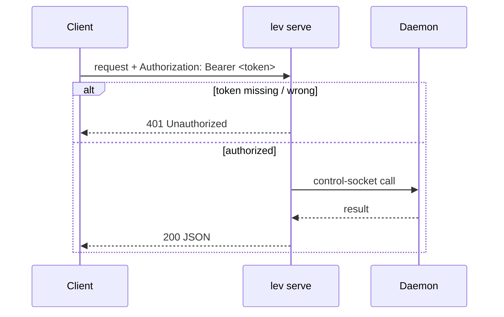
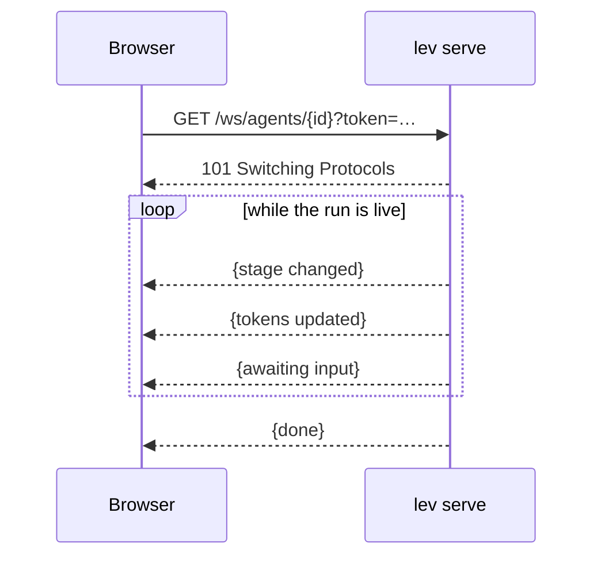

# HTTP API (`lev serve`)

`lev serve` exposes a REST + WebSocket API in front of the [daemon](/docs/daemon), so anything that
speaks HTTP can drive Leviath, including [The Lair](https://leviath.dev/lair), the browser console.

```bash
lev serve --port 3000 --token "$(openssl rand -hex 16)" --cors https://leviath.dev
```

Every route on this page is also published as a machine-readable
[OpenAPI spec](https://leviath.dev/docs/stable/openapi.json), kept in lockstep with the server by
a test, so a client generator or an agent can consume the contract directly.

## Security model

- **A token is required.** The server refuses to start without `--token <t>` (or
  `LEVIATH_API_TOKEN`). Every request must send `Authorization: Bearer <t>`; WebSocket clients
  pass it as `?token=<t>` because browsers can't set WS headers. On shared machines prefer the
  environment variable: a `--token` value is visible to other local users in the process table
  (`ps`).
- **CORS is closed by default.** Pass `--cors <origin>` (e.g. `https://leviath.dev`) or `--cors "*"`
  to allow a browser to call it cross-origin.
- **Binds to `127.0.0.1`** by default. `--host 0.0.0.0` exposes it on your network. Without
  `--tls-cert`, that puts the bearer token on the wire in cleartext for anyone on that network to read.
  If the address is publicly routable, that is the open internet. See
  [reaching a Leviath on another machine](#reaching-a-leviath-on-another-machine).
- **`--tls-cert` / `--tls-key`** serve HTTPS instead of HTTP. Off by default, bring your own
  certificate; Leviath never generates one.
- **`GET /` needs no token.** It returns a fixed "Leviath is running." page and nothing else: no
  version, no run counts, no endpoint list. It exists so a certificate can be accepted in a browser
  tab; see the section below.
- **`--allow-admin`** mounts the mutating admin routes. `GET /api/config` and
  `GET /api/mcp/servers` are always available. The writes are only mounted with `--allow-admin`, and
  the route is genuinely absent without it rather than gated by a check inside the handler. What you
  get back depends on whether the path exists at all for another method:

  | Without `--allow-admin` | Response |
  |---|---|
  | `PUT /api/config` | 405, because `GET /api/config` is mounted |
  | `POST /api/mcp/servers` | 405, because `GET /api/mcp/servers` is mounted |
  | `DELETE /api/mcp/servers/{name}` | 404, because nothing else is mounted on that path |
  | `POST /api/update` | 405, because `GET /api/update` is mounted |
- **`--workdir-root`** confines agent workdirs; **`--no-remote-yolo`** forbids `"yolo": true` and
  `"allow": [...]` on spawn, which are one lever rather than two.

> [!CAUTION]
> `lev serve` runs LLM-driven tools with whatever permissions the blueprint grants. Treat it as
> trusted-network only unless hardened. See [Security](/docs/security).

## Reaching a Leviath on another machine

The short version: **`http://` only works on loopback.** Everything else needs HTTPS or a tunnel.

A browser treats `http://localhost` and `http://127.0.0.1` as potentially trustworthy, which is the
only reason the default setup works from a page served over HTTPS. Every other address is blocked,
and **a LAN address is blocked exactly like a public one**. `http://192.168.1.50:3000` fails just as
`http://203.0.113.10:8080` does:

```
Mixed Content: The page at 'https://leviath.dev/lair' was loaded over HTTPS, but requested an
insecure resource 'http://203.0.113.10:8080/api/config'. This request has been blocked.
```

Two things that are *not* the problem, because they are what people reach for first:

- **It is not CORS.** The request is killed inside the browser before it is sent, so it never reaches
  Leviath and `--cors` is never consulted. No response header on either side lifts a mixed-content
  block.
- **The site cannot fix it.** leviath.dev is HTTPS-only, and an HTTPS page may not call `http://`.

Pick whichever of these suits you.

### mkcert, if the browser and Leviath are on machines you control

The best outcome: a certificate that is *fully* trusted, with no interstitial and nothing to accept.
[mkcert](https://github.com/FiloSottile/mkcert) installs a local CA into your OS and browser trust
stores and will issue for a bare IP.

```bash
mkcert -install                      # once, on the machine running the BROWSER
mkcert 192.168.1.50                  # on the machine running Leviath
lev serve --host 0.0.0.0 --port 3000 \
  --tls-cert ./192.168.1.50.pem --tls-key ./192.168.1.50-key.pem \
  --cors https://leviath.dev --token "$LEVIATH_API_TOKEN"
```

Installing a CA into your trust store is a real trust decision: anything holding that CA's key can
issue a certificate your browser will believe. `mkcert` keeps the key on the machine that made it.

### Tailscale, for a publicly-trusted name

`tailscale cert` issues a real certificate for your `*.ts.net` hostname, so nothing needs installing
in a trust store and the port never faces the internet.

```bash
tailscale cert my-box.tail1234.ts.net
lev serve --host 0.0.0.0 --tls-cert my-box.tail1234.ts.net.crt \
  --tls-key my-box.tail1234.ts.net.key --cors https://leviath.dev
```

### Self-signed, as a fallback

Works, with one manual step and one caveat.

```bash
openssl req -x509 -newkey rsa:2048 -nodes -days 365 \
  -keyout key.pem -out cert.pem -subj "/CN=leviath" \
  -addext "subjectAltName=IP:192.168.1.50"
lev serve --host 0.0.0.0 --tls-cert cert.pem --tls-key key.pem --cors https://leviath.dev
```

Then **open `https://192.168.1.50:3000/` in a browser tab and accept the warning.** That is what the
unauthenticated `GET /` page is for: The Lair's requests are subresource `fetch` calls, which get
no interstitial to click through, so the exception has to be established in a tab first. Afterwards
The Lair works.

Chrome discards accepted exceptions when the browser restarts, so this comes back. Firefox keeps
them. iOS Safari is unreliable about it.

### SSH forward, if you would rather not deal with certificates

Nothing to install on either end, and it puts you back inside the loopback exemption.

```bash
ssh -N -L 3000:127.0.0.1:3000 you@that-machine
```

Then point The Lair at `http://127.0.0.1:3000`. Leave Leviath on its default `127.0.0.1` bind for
this. `--host 0.0.0.0` is not wanted and only widens the exposure.

## Auth flow



## Endpoints

Base path `/api`; all JSON unless noted.

| Method · Path | Purpose |
|---|---|
| `GET /api/runs` · `DELETE /api/runs` | List runs: paginated, sortable, searchable · prune many at once. See [below](#listing-and-searching-runs) |
| `DELETE /api/runs/{id}` | Delete one finished run's record, and its sub-agent runs. Not the same as cancelling it. See [below](#deleting-runs) |
| `GET /api/agents` · `POST /api/agents` | List runs *(deprecated, use `/api/runs`)* · spawn an agent. Reads the persisted records, so finished runs stay listed |
| `GET /api/agents/{id}` · `DELETE …` | Get one · cancel. Cancelling stops the work and **keeps** the record; see [deleting runs](#deleting-runs) for removing it |
| `GET /api/agents/{id}/result` · `/context` | The run's answer and log tail · current context window |
| `GET /api/agents/{id}/logs?stage=&stream=&tail=` | A run's logs. `stage`, `stream` and `tail` pick which stage, which stream, and how much |
| `GET /api/agents/{id}/context/history` | How the context window changed over the run, paginated |
| `GET /api/agents/{id}/stages` | The per-stage ledger: what each stage spent in tokens and dollars, per visit as well as in total, which regions it carried, and whether it ran at all. See [below](#where-a-runs-cost-went) |
| `GET /api/agents/{id}/files` | List a run's files, or read one with `?path=`. `offset` pages a large one. See [below](#a-runs-files) |
| `GET /api/agents/tree` · `/{id}/tree-status` · `/{id}/children` | Sub-agent tree + token roll-ups |
| `POST /api/agents/{id}/pause` · `/resume` | Pause a run · resume it |
| `POST /api/agents/{id}/message` | Steer a running agent |
| `GET/POST /api/agents/{id}/interaction` | Read / answer a pending question |
| `GET/POST/PUT/DELETE /api/blueprints[/{name}]` · `/validate` | Blueprint CRUD + validation. The listing is paginated and takes `q`; the detail carries the manifest, the regions and the [fan-out limits](#fan-out-limits) |
| `GET /api/config` · `PUT /api/config` *(admin)* · `POST /api/config/validate` | Read redacted config · write keys · validate a key |
| `GET /api/models` | Enumerate models, with each one's token limits and where they came from |
| `GET /api/tools?agent=` | What an agent here can actually call. See [below](#tools-and-scripts) |
| `GET /api/scripts?agent=` · `GET/PUT/DELETE /api/scripts/{kind}/{name}` · `POST /api/scripts/validate` | Read and write the machine's Rhai: the agent's tools, hooks and validators, and the global model providers. Writes need admin. See [below](#tools-and-scripts) |
| `GET /api/mcp/servers` · `GET /{name}/status` · `POST /{name}/login` *(admin)* · `POST /{name}/test` *(admin)* | MCP servers. Add, remove, login and test need admin: each connects to a server, opens a browser, or spawns a command |
| `GET /api/doctor` · `POST /api/doctor/live` *(admin)* | The checks `lev doctor` runs, as data. `GET` is `lev doctor --offline`: config, search and resolve, nothing billed. `POST .../live` runs the whole chain (two billed calls and a throwaway run) and answers 409 while one is already going. A failing check is `ok: false` inside a 200, never an HTTP error |
| `GET /api/update` | Whether anything newer exists, how this copy was installed, and the command that upgrades it. See [below](#asking-how-to-upgrade) |
| `POST /api/update` *(admin)* · `GET /api/update/jobs/{id}` | Carry that plan out, and read where it got to. See [below](#pressing-the-button) |
| `GET /api/fs/dirs?path=&hidden=` | One directory level of subdirectory names, for a folder picker. Absolute paths only, fenced by `--workdir-root`; `hidden=true` includes dot-prefixed names |
| `POST /api/fs/dirs` | Make one directory: `{"path": "<absolute parent>", "name": "<one segment>"}` → `201 {"path", "parent"}`. The same fence as the `GET`; `409` if it already exists. Announced as `fs.mkdir` |
| `GET /ws` · `GET /ws/agents/{id}` | Live event stream (all agents / one run) |

On `/logs`, `stage` takes a stage index or `all`, and defaults to the current stage. `stream` is
either `output`, the assistant's own text, or `logs`, which carries tool calls, token counts and
errors. `tail` is a byte budget for how much of the end you get back.

> [!NOTE]
> A run object carries both `updated_at` and `last_progress_at`. The first advances on a 30-second
> heartbeat and stays fresh on a run that has stopped; the second moves only when the run does. Age
> a run against `last_progress_at`. `pid` is always 0 and means nothing: the daemon hosts every run
> in one shared world, so there is no process per run. If you are tracking slots from outside, read
> [reconciling an external work queue](/docs/work-queues) first.

### How long a run has taken

Three spans, and they answer different questions. A run paused overnight is hours old and spent
almost none of them working, so reporting one where the reader wanted the other is how a healthy
run comes to look stuck and a stuck one healthy.

| span | key | what it means |
| --- | --- | --- |
| **age** | `age_secs` | How long since the run was launched. Says nothing about whether it has done anything |
| **working** | `working_secs` | How long it actually spent working. Call this the run's duration |
| **last moved** | `last_progress_at` | When it last actually moved. A health signal, not a duration: it is how a wedged run is told from a slow one |

`age_secs` and `working_secs` are computed server-side and appear on every run object this API
serves - `GET /api/runs`, `GET /api/agents`, `GET /api/agents/{id}`, `GET /api/agents/{id}/children`
- alongside the raw stamps they come from. `?fields=` selects them like any other key. The same two
keys, on the same definitions, come back from `lev ps --json`.

The working clock stops for everything that is not the run's doing - paused, blocked on a person,
parked until the machine is fixed, finished - and keeps running while the run is inferring, calling
tools, or held for its own fan-out workers and sub-agents. Each stage in `stages.json` keeps one of
its own on the same rule.

To track a live run between the daemon's writes, read the clock itself rather than the computed
figure, which was true at `server_time`:

```json
"active": { "banked_secs": 412, "since": 1787720786 }
```

`banked_secs` is the time from spans that have already ended. `since` is when the span in progress
began, or `null` when the clock is stopped - so the working total is `banked_secs`, plus
`now - since` when `since` is set.

`active` is `null` on runs written before this existed, and `working_secs` then falls back to
`updated_at - started_at`. A finished run has `since: null`, so its total never moves again.

## Statuses

A run's status is one word, and it is the same word everywhere: on the run itself, in a tree node,
on `GET /api/agents/{id}/result`, and on the `agent_status` frames coming off the WebSocket.

| Status | Means |
|---|---|
| `starting` | Accepted and being set up. No inference has been issued yet |
| `running` | Working: inferring, calling tools, or moving between stages |
| `waiting_input` | Parked. `wait_reason` says on what, and only some of those want a person |
| `paused` | Paused by somebody. Resumes on request, and comes back paused after a daemon restart |
| `complete` | Finished, with nothing further to accept |
| `complete_interactive` | Every required stage is done and the run still takes follow-up input |
| `error` | Stopped by a failure. The run's `error` carries what went wrong |
| `cancelled` | Stopped from outside. Nothing went wrong, somebody decided |

The engine keeps its own vocabulary inside the daemon, where a run that is going is `idle` or
`active` and a parked one is `waiting`. Those words used to reach the socket untranslated, so a
client watching `/ws` was matching on three words no route ever sent, and a status frame quietly did
nothing for it. They are translated on the way out now.

Two older spellings are gone with them: `GET /api/agents/{id}/result` and the two tree routes
rendered the status for a human reader, which meant `WaitingInput` and `CompleteInteractive` where
every other route said `waiting_input` and `complete_interactive`.

`events.run_status` in the `capabilities` list is how you tell. A server without it sends the
engine's words on `agent_status` and the older spellings on those three routes.

The `status=` filter on `GET /api/runs` stays looser than this list on purpose: it also takes
`waitinginput` and `Waiting-Input`, so a status read off any response can be handed straight back as
a filter.

## Region kinds

A region's `kind`, wherever one appears (`GET /api/agents/{id}/context`, its history, the blueprint
detail route), is the word the blueprint's own TOML uses: `pinned`, `temporary`, `clearable`,
`sliding_window`, `compacting`, `compact_history`, `hashmap`, `checklist`, `custom`.

Context snapshots written by an older daemon say `sliding` and `history` for the two multi-word
kinds, and those files stay on disk, so accept both spellings wherever you render one.
`context.region_kinds` says a server writes the blueprint's words.

## Listing and searching runs

`GET /api/runs` returns a page, not the whole list:

```json
{ "items": [{ "meta": { "run_id": "…" }, "highlights": [] }],
  "next_cursor": "7b2276…", "total": 340, "server_time": 1785869070 }
```

Pass `next_cursor` back as `cursor` and loop until it comes back null. Do not count pages against
`total`. It is what matched at the moment of that one request, and runs are being created and
finished underneath you.

Paging is keyset rather than offset, because an offset into a list that is changing skips and
repeats items, and does it most often at the head. **`sort=started_at` is the default because it is
the only sort key that never changes.** `updated_at` moves on the daemon's 30-second heartbeat, so
every live run shifts under a walk; a run whose sort value changes mid-walk can be missed or
repeated. To poll for what changed, use `since=` with no cursor rather than deep-paginating.

`since=` filters whichever field `sort` names, and is inclusive. Pass the previous response's
`server_time` and you may see one item twice, which is the safe direction when the granularity is
whole seconds.

Two parameters exist so a browser client does not have to make N requests: `ids=a,b,c` fetches exactly
those runs, and `fields=run_id,status,title` trims each one. Ids that no longer exist come back in
`missing` rather than failing the request.

### Listing by place in the tree

A run's sub-agents are runs, so a listing that pages by runs is not paging by the rows a console
draws when it nests workers under the run that started them. At `limit=50`, seven visible rows and
forty-three workers hanging off them is a real page.

`parent=` fixes that from the server side:

| Value | Keeps |
|---|---|
| omitted | Every run, sub-agents included. What this route has always returned |
| `none` | Only runs nobody started. What a top-level list wants |
| a run id | That run's direct children, one level down |

`total` then counts what you asked for, which is what makes it worth printing beside a list: `382`
under a sidebar drawing forty rows is comparing runs the reader can see against runs they cannot.

`parent=<run_id>` is also the paged, sorted, searchable form of
[`GET /api/agents/{id}/children`](#endpoints), which answers the same question in one unbounded
array. A fan-out of two hundred workers has no windowed form there.

A run id that names nothing gives an empty page rather than a `404`: a run with no children yet is
a normal answer, not a missing resource. `none` is the only keyword, and no run can collide with it,
since a run id is `<agent>-<timestamp>-<hash>`.

Announced as `runs.parent`. Without it, page until enough top-level rows exist to fill the viewport
and filter client-side, which is what The Lair does today.

### Search

`q=` is a case-insensitive substring. It is not a regular expression, there are no boolean
operators or phrase quoting, and case folding is ASCII-only.

`q_in=` chooses where to look, defaulting to `meta,files`:

| Source | Looks at | Cost |
|---|---|---|
| `meta` | title, task, agent name, workdir, run id, error, metadata values | free |
| `files` | the paths the run recorded modifying | free |
| `context` | the run's current context window | one file read per run |
| `logs` | the tail of each stage's logs | two reads per stage per run |
| `journal` | the whole run journal: tool calls and context history | one file read per run |

The last three read from disk, which is why they are opt-in. Surface them as a "search inside
runs" toggle rather than making every keystroke pay for them. They also stop after a bounded number
of runs, newest first. When that happens the response says `scan_truncated: true` and sets `total`
to null, because a count taken from a partial scan would be read as fact.

Matching items carry `highlights` saying *why* they matched: the field, a snippet, and the stage
where there is one, which you can pass straight to `/logs?stage=`. This is the part that cannot be
done in the browser, because The Lair never holds a run's transcript.

One honest limit: the deep sources match the raw JSON on disk, so a query containing a quote,
a backslash or a newline may not match text that does contain it.

## Deleting runs

Cancelling and deleting are different verbs on purpose. `DELETE /api/agents/{id}` stops the run and
leaves everything it wrote; `DELETE /api/runs/{id}` removes the record. One stops the work, the
other forgets it happened.

Deletion is real and irreversible. The run's directory goes, transcript included. That is the point
of the route: a "Delete" button that only hid the run in one browser would tell somebody clearing a
sensitive transcript that it was gone when it was not.

```
DELETE /api/runs/deep-researcher-1786839472-d908ad2d9455
→ 204
```

- **409** if the run is still going. Removing a directory out from under a running agent is a much
  larger feature than this, so cancel it first and delete it after.
- **404** if it is already gone, so a client that lost the response to its own delete can just send
  it again instead of treating a missing run as a failure.

### Sub-agent runs go with their parent

A fan-out worker and a `sub_agent` spawn are runs of their own, but they exist because something
started them, and they are drawn nested under it. Deleting the parent deletes them too.

Leaving them behind was not a matter of a few stale rows. A client that nests runs under their
parent has nowhere to draw a run whose parent is missing except the top level, so deleting a
research run with nine workers under it emptied one row and promoted nine.

The walk only goes downwards. Deleting one worker out of a fan-out is an ordinary thing to do and
leaves the run that started it, and the workers beside it, exactly where they were.

A live sub-agent is a **409** on the parent's delete, and the reason names the run to cancel --
half a tree is not a state anything downstream knows how to read.

A run whose `meta.json` will not parse is a **409** too, overridden with `?force=true`:

```
DELETE /api/runs/{id}?force=true
```

A record that cannot be read says nothing about whether the run finished, and "cannot read it" must
not quietly read as "finished" -- that is exactly what a live run looks like to a binary whose
`RunMeta` has moved on. Such a run is also skipped by the listing, which would leave it both
invisible and permanent, so the escape hatch stays; it is just something you type rather than
something that happens to you. The bulk route never forces.

### Clearing out old runs

One request per run is its own problem once there are a few hundred, so there is a bulk form. It
takes either an age or an explicit list:

```
DELETE /api/runs?before=1785869070
DELETE /api/runs?ids=run-a,run-b,run-c
```

`before` is a unix timestamp and matches `updated_at`; only finished runs are considered. `ids` is
capped at `max_ids` from `GET /api/config`, the same cap as the batch fetch. Sending neither is a
400 rather than "every run" -- a bulk delete with no predicate is far more likely to be a client
that failed to build its query than somebody asking to erase the machine's history.

Partial success is the normal outcome, not an error. A sweep that runs into one live run has still
correctly deleted the rest, so the response is a 200 with a verdict per run:

```json
{ "deleted": ["run-a", "run-c"],
  "skipped": [{ "id": "run-b", "reason": "Run 'run-b' is Running; cancel it before deleting it" }] }
```

Read `skipped` when the list does not empty. A run that is still going and a run that was already
gone are both non-deletions, and only the reason tells them apart. Use the single-run route when you
want a status code per outcome instead.

`deleted` can hold ids you never named: every run named takes its sub-agent tree with it here too,
and those are runs that are now gone. Naming a parent and one of its own children in the same
request is fine -- each is deleted once, and the child is reported as deleted rather than skipped as
missing.

## Where a run's cost went

`GET /api/agents/{id}/stages` returns one record per declared stage, in blueprint
order:

```json
{
  "run_id": "analyst-1786409275-d17e8f82",
  "stages": [
    { "name": "plan",           "status": "complete", "entered": true,
      "prompt_tokens": 8420, "completion_tokens": 610,
      "cached_tokens": 6100, "cache_write_tokens": 240,
      "cost_usd": 0.0412, "unpriced_calls": 0, "cost_is_exact": false,
      "cost_priced_usd": 0.0412,
      "visit_count": 1,
      "visits": [
        { "entered_at": 1786409280, "left_at": 1786409461,
          "prompt_tokens": 8420, "completion_tokens": 610,
          "cached_tokens": 6100, "cache_write_tokens": 240,
          "cost_usd": 0.0412, "unpriced_calls": 0, "cost_is_exact": false,
          "cost_priced_usd": 0.0412,
          "active": { "banked_secs": 181, "since": null } }
      ],
      "region_tokens": { "task": 24, "data_preview": 4004 },
      "runaway_warned": false },
    { "name": "error_recovery", "status": "skipped",  "entered": false },
    { "name": "answer",         "status": "complete", "entered": true }
  ]
}
```

Four things here are not derivable from any other route.

**`entered` says whether the run was ever in that stage.** The alternative is to
fetch `context/history` and diff consecutive snapshots to see which stages
produced entries. That is expensive, because every point carries a whole context
window. It is also wrong in the case that matters: a stage that ran and wrote
nothing to any region leaves no trace to find. `status: "skipped"` is the same fact
stated from the other side, and means the run finished without reaching this
stage, as distinct from `"pending"` on a run that is still going.

**The per-stage cost split.** The run-level totals are on the run record; which
stage spent them, and the cache read/write split within a stage, are only here.
A stage showing no cache reads cannot be told apart from one paying to write a
prefix nothing reuses without `cache_write_tokens`.

`cost_usd` is what that stage spent. It means exactly what it means on a run:

- **`null` is unknown, never free.** Some call in that stage was served by a
  model with no reported cost and no rates the daemon knows, so any total would
  understate by an unknown amount. `unpriced_calls` says how many.
- **`cost_is_exact` says which number you have.** `true` means every priced call
  carried the provider's own figure - the invoice. `false` means at least one was
  reconstructed from published rates, which is arithmetic on numbers that drift
  for reasons outside the daemon: negotiated pricing, a gateway's margin, a
  request rerouted to another backend.
- **`cost_priced_usd` is the priced subtotal**, kept even while `cost_usd` is
  `null` so a resumed run does not restart its accounting from zero. It is not a
  substitute for `cost_usd`: showing it while calls went unpriced is exactly the
  partial total that looks authoritative and is not.

Do not multiply the tokens by a rate card of your own. Pricing is the daemon's
job, deliberately: a rate card in a console produces a fourth answer that
disagrees with the run's figure, the stage's, and the provider's, and none of the
four says which is wrong.

Every call a run bills is counted against the stage it was made in - the stage's
own turns, the compaction calls that summarize its context when the window fills,
and the routing call it makes at its own boundary to choose where to go next. The
one exception is the run's title call, which happens once at spawn beside the run
rather than inside any stage of it, so the stage costs can sum to slightly less
than the run's own `cost_usd`.

**`visits` splits a stage by each stay in it.** The record above accumulates
across revisits, which is the right total for the stage and the wrong shape for a
graph of the path a run took, where a stage entered twice is two nodes. Each
entry covers one entry into the stage: `entered_at`, `left_at` (`null` on the
visit in progress), the same four token counts, the same four cost fields, and an
`active` working clock of its own, on the rule described under
[how long a run has taken](#how-long-a-run-has-taken).

A stage that loops back to itself starts a new visit; iterations within one stay
do not. `visit_count` counts every entry, and the list stops at 128 - so
`visit_count > visits.length` means the per-visit split is partial and the
accumulated figures on the record are the complete ones. `visits` is empty on a
stage the run never entered, and on records written by a daemon older than this
field, which is the other reason to keep falling back to the stage record itself.

**`region_tokens` is what decides whether a region is earning its place.** It is
the largest each region reached while that stage was active. This is the number to
look at before trimming a layout.

`runaway_warned` is set when a stage's per-call prompt passed four times its
first call, which is the shape of a region accumulating without a cap.

The list is bounded by the blueprint's stage count, so it is not paginated. A run
that has not reached its first stage boundary returns an empty list rather than a
404. The run exists and has nothing to report yet.

`lev stages <run-id>` prints the same ledger as a table, `--visits` breaks each
stage into its stays, and `--json` is this shape read straight off disk.

> [!NOTE]
> `entered` is `false` for every stage of a run recorded before Leviath tracked
> it, because the field is not in those files at all. Read it together with
> `status`: a stage recorded `complete` with tokens against its name ran,
> whatever `entered` says on an old run.

## A run's files

`GET /api/agents/{id}/files` answers two different questions, and neither substitutes for the other.

`source=modified` (the default) is the run's own record of what it changed. It is free, but it is a
claim about the run rather than about the disk, and it is capped when recorded, so check
`modified_files_truncated`.

`source=workdir` reads the filesystem, **one directory level per request**; pass a directory as
`path` to descend. That bound is deliberate: a workdir containing `node_modules` cannot be
enumerated in one response, so walk it the way a file tree does.

> [!WARNING]
> `modifying_tool_calls` counts modifying tool *calls*, not files. A run that edits one file three
> times records three. Do not subtract it from the entry count to get "how many more files";
> that number is meaningless. Use `modified_files_truncated`, or `source=workdir` for ground truth.

With `?path=<file>` the response is the file's contents, unchanged from earlier versions. A listing
carries `"kind": "listing"`, so check that field rather than guessing from the shape.

### Reading a file larger than one response

One request returns at most 1 MiB. A run's dataset can be far larger than that, so read it a window
at a time with `offset`:

```bash
curl -H "Authorization: Bearer $TOKEN" \
  "http://localhost:3000/api/agents/$RUN/files?path=data/dataset.csv&offset=0"
```

Each response carries `next_offset`. Ask again from there until it comes back `null`, and
concatenate the windows to get the file back exactly.

An offset landing inside a multi-byte character is moved forward to the next boundary, and `offset`
in the response says where the window actually began. That is what keeps the pieces lining up. An
offset past the end of the file returns 416 rather than an empty window, so a loop cannot spin.

A whole-file read serializes exactly as it always has. `offset` is omitted when it is zero.

## Fan-out limits

A [fan-out stage](/docs/sub-agents#fan-out) has two caps, and neither is the stage's
`max_iterations`. `max_workers` is how many workers run at once and `max_items` is how many work
items the split may produce at all. `GET /api/blueprints/{name}` reports both for every fan-out
stage, resolved the way the daemon will apply them:

```json
{
  "name": "reviewer",
  "fan_outs": [
    {
      "stage": "split_review",
      "worker_stage": "review_worker",
      "merge_stage": "deep_review",
      "max_workers": 30,
      "max_items": 30,
      "on_worker_failure": "continue",
      "results_region": "worker_findings"
    }
  ],
  "regions": ["…"],
  "manifest": "…"
}
```

`max_workers` is the default (30) when the manifest names none, and `null` when the stage is
unlimited. `max_items` is `null` when there is no ceiling. Whichever of `worker_agent`,
`worker_stage` or `worker_query` the stage uses is the one present. A blueprint that never fans out
has an empty list. `blueprints.fan_outs` in the `capabilities` list on `GET /api/config` says the
daemon reports this.

Changing a cap is a manifest write: `PUT /api/blueprints/{name}` with the manifest text, the stage's
`max_workers` or `max_items` set to the number you want, or to `0` for no cap at all. `POST
/api/blueprints/validate` will tell you first if the value is not a whole number or is negative,
which are errors rather than quiet fallbacks. The workers still share the daemon's inference pool
(`[limits] max_concurrent_inferences`, 8 by default), so an unlimited fan-out queues at the model
rather than running away.

## Asking how to upgrade

`GET /api/update` answers how this copy of Leviath was installed and what command brings it
up to date. Like `GET /api/tools`, it exists because the answer is a fact about the machine
that no client can work out for itself, and guessing it wrong is worse than not saying.

The body is exactly what `lev update --check --json` prints, from the same planner:

```json
{
  "version": "0.4.0",
  "install_method": "scoop",
  "channel": "stable",
  "binary": {
    "action": "run",
    "commands": [["scoop", "update"], ["scoop", "update", "leviath"]],
    "command": ["scoop", "update", "leviath"]
  },
  "agents": [],
  "migrations": [],
  "config_error": null,

  "latest": "0.4.2",
  "update_available": true,
  "checked_at": 1787438706
}
```

`install_method` is one of `homebrew`, `scoop`, `cargo`, `script` or `unknown`. `binary.action`
is either `run`, carrying a `commands` list of argv lists to run in order, or `advise`, carrying
a `message` to show instead. A `cargo install` copy is always `advise`: rebuilding it is a full
compile, which is not something to start on someone's behalf. So is a binary sitting somewhere
no installer puts one, where the honest answer is to point at the install docs.

Render `binary.commands` rather than composing your own. That is the whole point of the route:
a client that hard-codes one package manager's command is right for the users who happen to
share its author's machine and wrong for everyone else. Where a daemon does not announce
`update.plan`, send people to the install page rather than picking a package manager for them.

`latest` is the newest version on this copy's own channel, `update_available` whether that is
newer than the version it is running, and `checked_at` when the daemon last found out, in unix
seconds, so you can say how fresh the answer is rather than presenting an hour-old one as
current. All three are `null` together when the check has not run yet, could not reach the
network, or had no channel to ask about - one state, "cannot tell", which is the honest thing to
render. Treat a missing key as an older daemon and a `null` key as an answer.

The daemon looks this up on its own schedule and the route reports whatever the last lookup
found, so asking on every page load costs nothing and never waits. The lookup runs the same code
`lev update` does, against the releases published for each channel, so the console and the
terminal cannot come to different conclusions about the same binary.

Do the comparison with `update_available` rather than against `version` yourself. A client that
compares against a number it was built with only knows the stable line, so it reports a daemon on
`alpha` or `beta` as out of date for running something newer.

The route is read-only and available without `--allow-admin`. It works out what an update would
do and does none of it, makes no network call on the request path, and cannot run a command even
if asked.

## Pressing the button

`POST /api/update` carries out the plan the `GET` prints: it runs `binary.commands` in order,
installs the blueprints the plan marks `preselected`, and applies the migrations. It needs
`lev serve --allow-admin`, which is the line it crosses and the read half does not - it runs a
package manager, replaces the blueprints in your agents directory and rewrites your config.

The body names which parts to do. Every field defaults to `true`, so an empty body is the whole
plan and a body naming one part leaves the others on. A field this route does not know is a `400`
rather than a silent default:

```json
{ "binary": true, "agents": true, "migrations": false }
```

It answers `202` straight away, with the id to watch:

```json
{
  "job_id": "update-1787438706-1",
  "status": "running",
  "applying": { "binary": true, "agents": true, "migrations": false }
}
```

An upgrade is a download and an install - a minute on a good day, and it can fail halfway - so the
request does not stay open for it. Watch `/ws`, where each step change arrives as it happens:

```json
{ "type": "update_progress", "job_id": "update-1787438706-1", "step": "binary",
  "status": "running", "detail": "running `scoop update && scoop update leviath`" }
```

`step` is `binary`, `agents` or `migrations`, always in that order, and `status` is one of
`running`, `done`, `skipped`, `advised` or `failed`. The last frame is `update_finished`, carrying
the whole record so a client that connected mid-run needs no follow-up request. Both frames are
about the machine rather than a run, so `/ws` receives them and a per-run subscription does not.

`GET /api/update/jobs/{id}` answers that same record, for a client that would rather poll than
hold a socket open:

```json
{
  "id": "update-1787438706-1",
  "status": "complete",
  "steps": [
    { "step": "binary", "status": "done", "detail": "ran `scoop update && scoop update leviath`" },
    { "step": "agents", "status": "done", "detail": "installed researcher, coder" },
    { "step": "migrations", "status": "skipped", "detail": "not asked for" }
  ],
  "restart_required": true,
  "restart_hint": "the new binary is on disk, but this server and the daemon it talks to are still running the old one...",
  "started_at": 1787438706,
  "finished_at": 1787438771
}
```

The last few runs are kept, so reading back after the fact finds the job rather than a `404`.
One update runs at a time: a second `POST` while one is going is a `409` naming the job already
running, not a second package manager over the same binary.

### What it will not do

`binary.action == "advise"` stays advice. A `cargo install` copy is a full rebuild of the
workspace, and a binary somewhere no installer writes is not something to guess at - both are
yours to do, so the step is recorded as `advised` with the plan's own sentence and no compile is
started. That is neither a success nor a failure: the job carries on to the other two steps and
still finishes `complete`.

A blueprint you edited locally is never installed. Installing removes the destination directory
first, so it would take your edits and any file you added with them; `lev update` asks about each
one on its own and no flag covers it, and there is nobody to ask over HTTP. The `agents` step says
how many it left alone and why.

A binary step that *fails* stops the two after it, the same way `lev update` stops there: the
blueprints and the config worth having are the ones the new binary ships. A failed blueprint
install does not - it is named in the step's detail and the run carries on, because most of the
blueprints plus a named failure is a better place to be left than a step that gave up in the
middle.

### The restart

Upgrading replaces the binary on disk. The daemon answering the request is the old one and stays
the old one, and so does `lev serve`, until each restarts - so a console that updates and then
reports the version it can see has told the truth in the least useful way possible.

`restart_required` is `true` when the binary step actually ran and succeeded, and `restart_hint`
carries the sentence to show. Say it; do not report the running version as the result of the
update. Restarting `lev serve` picks up the new binary, and `lev daemon restart` does the same for
the daemon - which any `lev` command also does on its own, since the daemon's build marker is
checked before a run is spawned.

## Tools and scripts

`GET /api/tools` answers what an agent on **this** machine can call, which is not a question a
client can answer for itself. Every entry carries a `source`:

| `source` | Means |
|---|---|
| `builtin` | Compiled into this Leviath. Every agent has it |
| `subagent` | A sub-agent tool, for an agent that may spawn children |
| `agent` | A `.rhai` in that agent's own `tools/`. Only that agent has it |
| `global` | A `.rhai` in `~/.leviath/tools/`. Every agent on the machine has it |

Pass `?agent=<name>` to include the fourth. Script-backed entries also carry the `path` they came
from. A separate `skipped` list carries the `.rhai` files that were found and cannot be offered,
with the reason each was passed over, so a file with a syntax error does not simply look like a file
nobody wrote. MCP tools are not here: they depend on a server being reachable rather than on
anything installed, and `/api/mcp/servers/{name}` already answers for them.

`GET /api/scripts` is the same ground from the editor's side, over the five kinds of Rhai a machine
can carry: `tool`, `region_hook`, `stage_hook`, `output_validator` and `provider`. Only tools have a
directory an agent owns (`<agent>/tools/`, plus the global one); the hooks and the validator are
named by path in the manifest and resolved against the agent's own directory, so the listing derives
them from what the manifest declares and the read and write routes address them at
`<agent>/<name>.rhai`. A hook a manifest declares inside a subdirectory is outside what `{name}` can
address, and is left out rather than listed under a name that would fetch nothing.

`GET/PUT/DELETE /api/scripts/{kind}/{name}` reads and writes one file, scoped by `?agent=<name>` or,
with no `agent`, the machine's own directory for that kind. `POST /api/scripts/validate` takes `kind`
and `content` and compiles without writing, so an editor can check before saving instead of saving
and waiting for a run to fail.

> [!WARNING]
> `PUT` and `DELETE` are **not mounted at all** without `lev serve --allow-admin`, exactly like the
> MCP add/remove routes and `PUT /api/config`. A `.rhai` file is executable code every agent then
> runs, so a session that can write one can run code on the host. The `GET` routes stay open, so an
> editor degrades to read-only rather than disappearing.

A write that does not compile is still saved, with `compiles: false` and the compiler's complaint in
the response. A draft is worth keeping, and a tool that does not compile is skipped at spawn rather
than breaking the agent.

### Providers

A [provider](/docs/rhai-providers) is the one kind no agent owns. It lives in `~/.leviath/providers/`
and a stage reaches it by name, so these routes take **no** `?agent=` and refuse one rather than
writing a file into an agent's directory that nothing would ever load. Providers are listed with or
without an `agent`, since the answer is the same either way.

Each listed provider carries a `provider` object with what its leading `// @` comments declare:
`description`, `default_model`, `max_context_tokens`, `max_output_tokens` and `supports_streaming`.

Each entry from `GET /api/models` also carries `limits_source`: `api` when the provider reported the
token limits itself, `builtin` when this build matched them off the model's name, and `override`
when a `[model_capabilities]` entry set them. Read it before treating a window as a fact - a
`builtin` figure for a model the table does not know is a guess, and region budgets resolve against
it. Which providers can report, and from where, is in
[where a window comes from](/docs/configuration#where-a-window-comes-from).
That is what lets a console show the catalog without fetching and re-parsing every script. No other
kind carries the key at all.

Validation checks more than syntax here. A provider needs `initialize(config)` and
`inference(state, request)`, and a script defining only the first used to compile, initialize, cache
and then fail at the first inference, part-way into a run. `POST /api/scripts/validate` with
`kind: "provider"` answers that before the file is saved, and the loader refuses the same script
rather than accepting one the API called invalid. Nothing runs during validation: `initialize` is
read off the compiled AST, never called.

`GET` returns the source verbatim. A provider's key comes from `initialize(config)`, which is the
`[model_providers.<name>]` table `GET /api/config` already reports as a boolean plus a list of key
names, or from `env_var`, which reads the daemon's environment. Neither value is in the file, so
there is nothing here for redaction to protect, and an editor that saved what it was shown would
write the redaction back over the real script.

Check `scripts.providers` in the `capabilities` list before offering the kind.

## Feature detection

`GET /api/config` reports `api_version`, a `capabilities` list, and the server's `limits`. Check
those instead of calling a route and treating a 404 as "unsupported": a 404 also means "no such
run", and it costs a round trip per feature. The limits matter as much as the capability names: they
are where the page cap, file cap and listing cap actually live, so a client never has to hardcode
one.

`runs.delete` and `runs.delete.bulk` are the ones worth checking before drawing a button rather than
after clicking it. Finding out whether the other routes exist costs a wasted request; finding out
this way costs a deleted run.

### What each capability means

Every string this server can announce, and the thing it promises. A server that omits one is older
than that feature, not broken.

| Capability | The server has |
|---|---|
| `runs.envelope` | `GET /api/runs` answering `{items, next_cursor, total, server_time}` rather than a bare array |
| `runs.cursor` | Keyset paging on that route: `cursor=` in, `next_cursor` out |
| `runs.search` | `q=`, a case-insensitive substring over the run listing |
| `runs.search.context` | `q_in=context`, searching each run's current context window |
| `runs.search.logs` | `q_in=logs`, searching the tail of each stage's logs |
| `runs.search.journal` | `q_in=journal`, searching the whole run journal |
| `runs.fields` | `fields=`, trimming each item to the named top-level fields |
| `runs.ids` | `ids=a,b,c`, fetching exactly those runs in one request |
| `runs.since` | `since=`, filtering on whichever timestamp `sort` names |
| `runs.parent` | `parent=none` / `parent=<run_id>`. See [listing by place in the tree](#listing-by-place-in-the-tree) |
| `runs.files.listing` | `GET /api/agents/{id}/files`, the run's own record of what it changed |
| `runs.files.workdir` | `source=workdir` on that route, reading the filesystem a directory at a time |
| `runs.stages` | `GET /api/agents/{id}/stages`, the per-stage ledger |
| `runs.stages.cost` | `cost_usd`, `unpriced_calls` and `cost_is_exact` on each stage record, and the `visits` split beneath them. Without it a stage record carries tokens and no price, and the missing field is not a zero |
| `runs.waiting_on` | `wait_reason` on a run, saying what a parked run is parked on |
| `runs.delete` | `DELETE /api/runs/{id}`, which removes the record rather than cancelling the run |
| `runs.delete.bulk` | `DELETE /api/runs` with `before` or `ids`, bounded by `max_ids` |
| `logs.stage` | `?stage=` on the logs route: an index, or `all` |
| `logs.stream` | `?stream=` on it: `output` or `logs` |
| `context.history.page` | Paging on `GET /api/agents/{id}/context/history` |
| `context.region_kinds` | Region kinds spelled as the blueprint spells them. See [region kinds](#region-kinds) |
| `events.waiting_on` | `wait_reason` on the socket too, not only on the run |
| `events.stage_and_tool` | `stage_transition`, `tool_call_started` and `tool_call_finished` as flat frames instead of the old `world` envelope |
| `events.spawn_parent` | `parent_id` on `agent_spawned`, placing a sub-agent in the tree the moment it starts |
| `events.title` | The `run_renamed` frame, plus `title` on every `agent_status` |
| `events.run_status` | One status vocabulary across the whole API. See [statuses](#statuses) |
| `events.spend` | The `agent_spend` frame, sent as a run passes a figure in `[limits] notify_spend_usd` |
| `runs.cost` | `cost_usd` and `subtree_cost_usd` on the agent tree routes |
| `blueprints.envelope` | The paginated envelope on the blueprint listing |
| `blueprints.query` | `q=` on that listing |
| `blueprints.manifest` | The manifest itself on the blueprint detail route |
| `blueprints.validate.name` | `POST /api/blueprints/validate` accepting an installed name, not only a body |
| `blueprints.fan_outs` | `fan_outs` on the detail route. See [fan-out limits](#fan-out-limits) |
| `tools.list` | `GET /api/tools?agent=`, what an agent here can actually call |
| `update.plan` | `GET /api/update`, how this copy was installed and the command that upgrades it. See [asking how to upgrade](#asking-how-to-upgrade) |
| `update.apply` | `POST /api/update` and `GET /api/update/jobs/{id}`, carrying that plan out. Says this build serves them; whether *this* daemon mounts them is `--allow-admin`, which you find out by calling one. See [pressing the button](#pressing-the-button) |
| `scripts.read` | The `GET` half of the scripts routes |
| `scripts.write` | That this build serves the write half. Whether *this* daemon mounts it is `--allow-admin`, which you find out by calling one and reading the status |
| `scripts.providers` | `provider` as a fifth script `kind`, the machine's drop-in model providers |
| `config.gateways` | `gateways` on `GET /api/config`, the script-backed providers this machine has |
| `fs.mkdir` | `POST /api/fs/dirs`, so a folder picker can offer "New Folder" rather than one that 404s |

## Live updates over WebSocket

Connect to `/ws` (all agents) or `/ws/agents/{id}` (one run) with `?token=<t>`; the server streams
`ServerEvent` frames as the run progresses:



### The frames

Every frame is a JSON object with a `type`, and every frame except `daemon_link` carries a
`run_id`, which is what `/ws/agents/{id}` filters on.

| `type` | Sent when | Beyond `agent_id` and `run_id` |
| --- | --- | --- |
| `agent_spawned` | A run first appears | `blueprint`, and `parent_id` for a sub-agent |
| `agent_status` | Status, stage, iteration or tool count moves | `status`, `stage`, `iteration`, `tool_calls`, `accepts_messages`, `wait_reason`, `title` |
| `run_renamed` | The run acquires a generated title | `title` |
| `tokens` | The run's token totals move | `prompt_tokens`, `completion_tokens`, `cached_tokens`, `cache_write_tokens` |
| `context_update` | The context window's usage moves | `total_tokens`, `max_tokens` |
| `stage_transition` | A new stage is entered | `from`, `to`, `iteration` |
| `tool_call_started` | A tool call goes to the async lane | `call_id`, `tool` |
| `tool_call_finished` | That call returns | `call_id`, `tool`, `ok`, `summary` |
| `log` | A log or output line is written | `line` |
| `agent_spend` | The run's spend passes a figure named in `[limits] notify_spend_usd` | `threshold_usd`, `total_usd`, `complete`, `stage` |
| `interaction_needed` | The run is blocked on a person | `request` |
| `agent_completed` | The run reaches a terminal status | `status`, `result` (its error), `final_output` |
| `daemon_link` | This server's link to the daemon changes | `connected`, `daemon`, `restarted`, `restart_advised` |

`agent_spend` arrives while the run is still going, which is the point: a run that quietly spends
far more than intended looks, from the outside, exactly like one making ordinary progress. Each
figure in `[limits] notify_spend_usd` is announced once per run, the first time the total passes it,
and `stage` names the stage that was running when it crossed. Nothing is emitted for an operator who
has not listed any figures.

`complete` says whether every call behind `total_usd` could be priced. When it is false the run has
spent at least that much and more by an unknown amount. It is a different question from whether the
priced part came from the provider's own figures or was reconstructed from published rate cards,
which is what `cost_is_exact` on the run record answers, so a total can be complete and still be a
reconstruction.

A run is created untitled and named a moment later, once a model has shortened its prompt into a
title. `run_renamed` is that moment. The same `title` then rides every `agent_status` frame, so a
client that connected or reconnected after the rename reads the name off the next status instead of
fetching the run. Both are the `events.title` capability; without it a client has to poll each new
run until it has a name. `title` is absent, not null, while a run has none.

Naming can also fail. The call retries a transient refusal and then walks the run's own model
candidates, the same chain its stage inference fails over along, so one provider being unreachable
no longer costs the run its name. When every candidate is spent, `title_error` on the run says what
stopped it, and stays `null` while titling is simply unfinished. Poll that field rather than waiting
forever on a `run_renamed` frame that is not coming.

`status`, on `agent_status` and on `agent_completed`, is the word `GET /api/runs` uses for the same
run. See [Statuses](#statuses) for the list and for what a server that predates
`events.run_status` sends instead.

`wait_reason` is present only on a parked run, and says what it is parked on rather than making
you fetch the run to find out. `ok` on `tool_call_finished` is `false` for a result the engine
refused or could not run, so a client should not read a finish frame as a success on its own.

`stage_transition`, `tool_call_started` and `tool_call_finished` used to arrive wrapped as
`{"type":"world","event":{…}}`. They are flat frames of their own as of API version `0.4.0`,
announced as the `events.stage_and_tool` capability on `GET /api/config`; `parent_id` on
`agent_spawned` is `events.spawn_parent`. There is no longer a `world` frame.

### When the daemon restarts

The stream stays open across a [daemon](/docs/daemon) restart. `lev serve` reconnects to the daemon
on its own, so your socket never has to. What you see is one `daemon_link` frame when the daemon's
events stop, and one when they resume:

```json
{"type":"daemon_link","connected":false,"daemon":{"version":"0.4.0","build":"3ba95219","pid":4242},"restarted":false}
{"type":"daemon_link","connected":true,"daemon":{"version":"0.4.0","build":"3ba95219","pid":4301},"restarted":true}
```

`restarted` says whether the daemon that came back is a different process from the one before.
`daemon` is absent until the daemon has introduced itself, which every current daemon does on
connect.

If the daemon came back on a different build than the running `lev serve` (the usual cause is a
`lev update` with the server left running), the frame also carries `restart_advised`, a sentence
that names both builds and says to restart `lev serve`. Every subscriber that connects while that
is true, or while the daemon is unreachable, gets a `daemon_link` frame first thing. A healthy
stream sends none, so a client that ignores the type sees exactly what it always saw.

Requests keep working across a version gap as long as the two ends still understand each other. A
request that fails because they no longer do answers **502** with the same sentence, where a
daemon that is simply not answering is a **503**. Retrying helps the second; only restarting
`lev serve` helps the first.

## Asking for a shape

Add `output_format` to ask for the answer in a particular shape. Any label works, because nothing
converts between shapes: the label reaches the model, which produces the bytes.

```bash
curl -X POST http://localhost:3000/api/agents \
  -H "Authorization: Bearer $TOKEN" -H "Content-Type: application/json" \
  -d '{"blueprint":"reviewer","task":"Review the auth module",
       "output_format":"a2ui",
       "output_instructions":"One card per finding, highest severity first."}'
```

Then read it back from `GET /api/agents/{id}/result`, where `final_output` carries the answer, its
format label, and the stage that produced it. Add `output_schema` when you want the answer validated
against a JSON Schema. [Final outputs](/docs/outputs) covers the whole cascade.

## Spawning with a signed webhook

```bash
curl -X POST http://localhost:3000/api/agents \
  -H "Authorization: Bearer $TOKEN" -H "Content-Type: application/json" \
  -d '{"blueprint":"coder","task":"Add input validation",
       "callback_url":"https://example.com/hook","callback_secret":"whsec_…"}'
```

Four things to know about the delivery.

**It carries the answer.** `final_output` holds whatever the agent submitted, so your receiver
learns what the run concluded without a second request. The `result` field beside it is the run's
error, which is what it has always been. See [Final outputs](/docs/outputs).

**It is signed.** Verify the `X-Leviath-Signature: sha256=<hex>` header against your
`callback_secret` before trusting the body.

**It carries a stable `delivery_id`**, of the form `agent_completed:<run_id>`, in both the signed
body and the `X-Leviath-Delivery` header. Stable is the important word: a retried attempt, and a
completion re-fired after a daemon restart, both send the same id. So your receiver can deduplicate
with a plain key check and handle each completion exactly once.

**It retries on transient failures**, meaning network errors, timeouts, 5xx, 429, and 408, with
exponential backoff. Every field below has a safe default, so you can leave the block out entirely:

```toml
[webhook]
max_retries = 3        # retries after the first attempt; 0 disables retries
base_delay_ms = 500    # first backoff; doubles per retry
max_delay_ms = 30000   # cap on any single backoff
timeout_secs = 10      # per-attempt request timeout
```

> [!TIP]
> [The Lair](https://leviath.dev/lair) is a full reference client for this API (connection, spawn, live
> dashboard, blueprint editing, MCP and policy management), built on the same typed endpoints.
