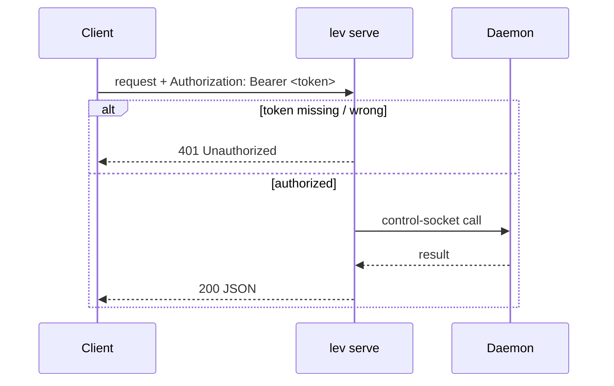
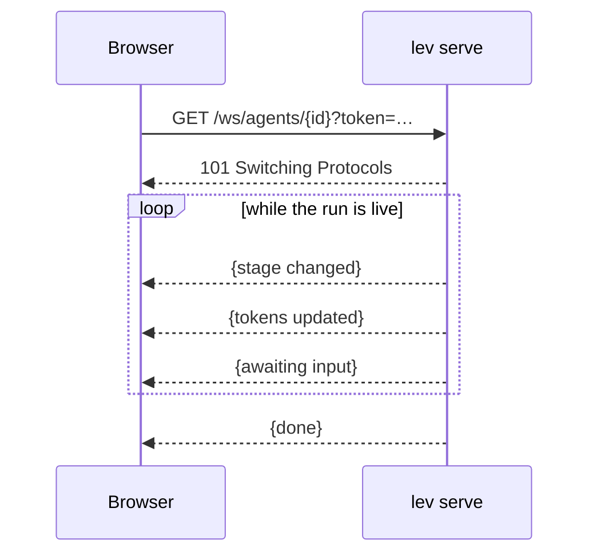

# HTTP API (`lev serve`)

`lev serve` exposes a REST + WebSocket API in front of the [daemon](/docs/daemon), so anything that
speaks HTTP can drive Leviath, including the browser [console](/app).

```bash
lev serve --port 3000 --token "$(openssl rand -hex 16)" --cors https://leviath.dev
```

## Security model

- **A token is required.** The server refuses to start without `--token <t>` (or
  `LEVIATH_API_TOKEN`). Every request must send `Authorization: Bearer <t>`; WebSocket clients
  pass it as `?token=<t>` because browsers can't set WS headers. On shared machines prefer the
  environment variable: a `--token` value is visible to other local users in the process table
  (`ps`).
- **CORS is closed by default.** Pass `--cors <origin>` (e.g. `https://leviath.dev`) or `--cors "*"`
  to allow a browser to call it cross-origin.
- **Binds to `127.0.0.1`** by default. `--host 0.0.0.0` exposes it on your network.
- **`--allow-admin`** mounts the mutating admin routes. `GET /api/config` and
  `GET /api/mcp/servers` are always available. The writes are only mounted with `--allow-admin`, and
  the route is genuinely absent without it rather than gated by a check inside the handler. What you
  get back depends on whether the path exists at all for another method:

  | Without `--allow-admin` | Response |
  |---|---|
  | `PUT /api/config` | 405, because `GET /api/config` is mounted |
  | `POST /api/mcp/servers` | 405, because `GET /api/mcp/servers` is mounted |
  | `DELETE /api/mcp/servers/{name}` | 404, because nothing else is mounted on that path |
- **`--workdir-root`** confines agent workdirs; **`--no-remote-yolo`** forbids `"yolo": true` on spawn.

> [!CAUTION]
> `lev serve` runs LLM-driven tools with whatever permissions the blueprint grants. Treat it as
> trusted-network only unless hardened. See [Security](/docs/security).

## Auth flow



## Endpoints

Base path `/api`; all JSON unless noted.

| Method · Path | Purpose |
|---|---|
| `GET /api/agents` · `POST /api/agents` | List runs · spawn an agent. Reads the persisted records, so unlike `lev ps` it keeps finished runs |
| `GET /api/agents/{id}` · `DELETE …` | Get one · cancel |
| `GET /api/agents/{id}/result` · `/logs` · `/context` · `/context/history` | Run output, logs, context |
| `GET /api/agents/tree` · `/{id}/tree-status` · `/{id}/children` | Sub-agent tree + token roll-ups |
| `POST /api/agents/{id}/pause` · `/resume` | Pause a run · resume it |
| `POST /api/agents/{id}/message` | Steer a running agent |
| `GET/POST /api/agents/{id}/interaction` | Read / answer a pending question |
| `GET/POST/PUT/DELETE /api/blueprints[/{name}]` · `/validate` | Blueprint CRUD + validation |
| `GET /api/config` · `PUT /api/config` *(admin)* · `POST /api/config/validate` | Read redacted config · write keys · validate a key |
| `GET /api/models` | Enumerate models |
| `GET /api/mcp/servers` · `GET /{name}/status` · `POST /{name}/login` · `POST /{name}/test` | MCP servers (add/remove need admin) |
| `GET /ws` · `GET /ws/agents/{id}` | Live event stream (all agents / one run) |

> [!NOTE]
> A run object carries both `updated_at` and `last_progress_at`. The first advances on a 30-second
> heartbeat and stays fresh on a run that has stopped; the second moves only when the run does. Age
> a run against `last_progress_at`. `pid` is always 0 and means nothing: the daemon hosts every run
> in one shared world, so there is no process per run. If you are tracking slots from outside, read
> [reconciling an external work queue](/docs/work-queues) first.

## Live updates over WebSocket

Connect to `/ws` (all agents) or `/ws/agents/{id}` (one run) with `?token=<t>`; the server streams
`ServerEvent` frames as the run progresses:



## Spawning with a signed webhook

```bash
curl -X POST http://localhost:3000/api/agents \
  -H "Authorization: Bearer $TOKEN" -H "Content-Type: application/json" \
  -d '{"blueprint":"coder","task":"Add input validation",
       "callback_url":"https://example.com/hook","callback_secret":"whsec_…"}'
```

Completion webhooks are signed with `callback_secret`: verify the `X-Leviath-Signature: sha256=<hex>`
header. Each delivery also carries a `delivery_id` (in the signed body and in the
`X-Leviath-Delivery` header) of the form `agent_completed:<run_id>`. It is deliberately stable:
a retried attempt and a completion re-fired after a daemon restart send the same id, so your
receiver can dedupe with a plain key check and process each completion exactly once. Transient
failures (network errors, timeouts, 5xx, 429, 408) are retried with exponential backoff, tunable
in config - every field has a safe default, so the block can be omitted entirely:

```toml
[webhook]
max_retries = 3        # retries after the first attempt; 0 disables retries
base_delay_ms = 500    # first backoff; doubles per retry
max_delay_ms = 30000   # cap on any single backoff
timeout_secs = 10      # per-attempt request timeout
```

> [!TIP]
> The [browser console](/app) is a full reference client for this API (connection, spawn, live
> dashboard, blueprint editing, MCP and policy management), built on the same typed endpoints.
