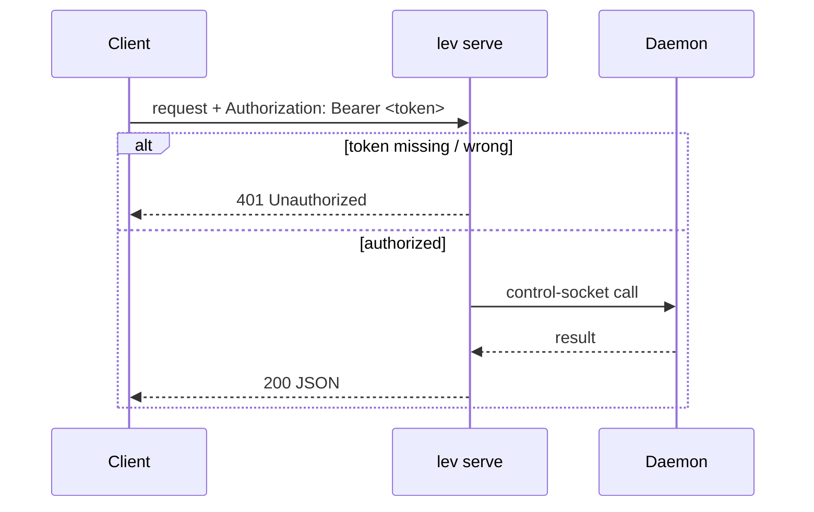
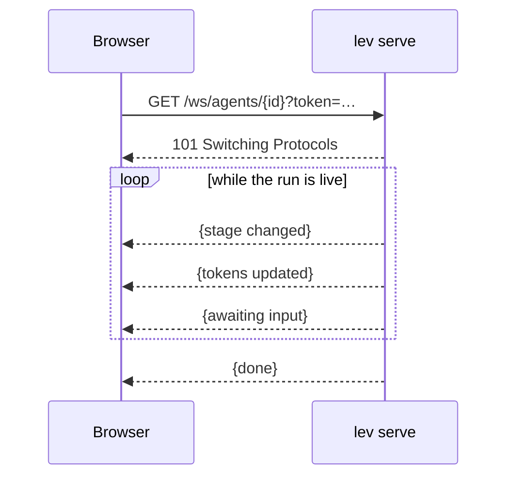

# HTTP API (`lev serve`)

`lev serve` exposes a REST + WebSocket API in front of the [daemon](/docs/daemon), so anything that
speaks HTTP can drive Leviath, including the browser [console](/app).

```bash
lev serve --port 3000 --token "$(openssl rand -hex 16)" --cors https://leviath.dev
```

## Security model

- **A token is required.** The server refuses to start without `--token <t>` (or
  `LEVIATH_API_TOKEN`). Every request must send `Authorization: Bearer <t>`; WebSocket clients
  pass it as `?token=<t>` because browsers can't set WS headers.
- **CORS is closed by default.** Pass `--cors <origin>` (e.g. `https://leviath.dev`) or `--cors "*"`
  to allow a browser to call it cross-origin.
- **Binds to `127.0.0.1`** by default. `--host 0.0.0.0` exposes it on your network.
- **`--allow-admin`** mounts the mutating admin routes. `GET /api/config` and
  `GET /api/mcp/servers` are always available; the writes (`PUT /api/config`,
  `POST`/`DELETE /api/mcp/servers`) are only mounted with `--allow-admin` and return **405 Method
  Not Allowed** otherwise. The route isn't there, rather than gated by an in-handler check.
- **`--workdir-root`** confines agent workdirs; **`--no-remote-yolo`** forbids `"yolo": true` on spawn.

> [!CAUTION]
> `lev serve` runs LLM-driven tools with whatever permissions the blueprint grants. Treat it as
> trusted-network only unless hardened. See [Security](/docs/security).

## Auth flow



## Endpoints

Base path `/api`; all JSON unless noted.

| Method · Path | Purpose |
|---|---|
| `GET /api/agents` · `POST /api/agents` | List runs · spawn an agent |
| `GET /api/agents/{id}` · `DELETE …` | Get one · cancel |
| `GET /api/agents/{id}/result` · `/logs` · `/context` · `/context/history` | Run output, logs, context |
| `GET /api/agents/tree` · `/{id}/tree-status` · `/{id}/children` | Sub-agent tree + token roll-ups |
| `POST /api/agents/{id}/message` | Steer a running agent |
| `GET/POST /api/agents/{id}/interaction` | Read / answer a pending question |
| `GET/POST/PUT/DELETE /api/blueprints[/{name}]` · `/validate` | Blueprint CRUD + validation |
| `GET /api/config` · `PUT /api/config` *(admin)* · `POST /api/config/validate` | Read redacted config · write keys · validate a key |
| `GET /api/models` | Enumerate models |
| `GET /api/mcp/servers` · `/{name}/status` · `/login` · `/test` | MCP servers (add/remove need admin) |
| `GET /ws` · `GET /ws/agents/{id}` | Live event stream (all agents / one run) |

## Live updates over WebSocket

Connect to `/ws` (all agents) or `/ws/agents/{id}` (one run) with `?token=<t>`; the server streams
`ServerEvent` frames as the run progresses:



## Spawning with a signed webhook

```bash
curl -X POST http://localhost:3000/api/agents \
  -H "Authorization: Bearer $TOKEN" -H "Content-Type: application/json" \
  -d '{"blueprint":"coder","task":"Add input validation",
       "callback_url":"https://example.com/hook","callback_secret":"whsec_…"}'
```

Completion webhooks are signed with `callback_secret`: verify the `X-Leviath-Signature: sha256=<hex>`
header. Transient failures are retried with exponential backoff.

> [!TIP]
> The [browser console](/app) is a full reference client for this API (connection, spawn, live
> dashboard, blueprint editing, MCP and policy management), built on the same typed endpoints.
