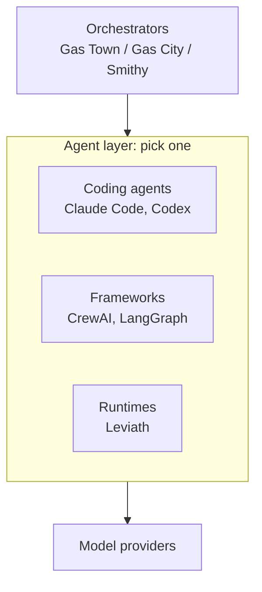

# Where Leviath sits

People arrive at Leviath already using something else, and the useful question is usually not "which
of these is best" but "what job does each of these do, and do I need more than one".

So this page is about layers, not scores. Several of the tools below are worth running *alongside*
Leviath rather than instead of it.

> [!NOTE]
> **Before this page:** nothing.
> **In one line:** a coding agent, an orchestrator, a framework, and a runtime are four different
> jobs, and Leviath is the runtime.

## Four different jobs

- **A coding agent** is a finished product you talk to. You install it and start working.
- **An orchestrator** decides which work happens and where. It does not write code itself. It picks
  up an issue, assigns it, tracks it, and collects the result.
- **A framework** is a library you build an agent *in*, in your own codebase and language.
- **A runtime** is a service your agents run *on*. You describe an agent and it executes it.

Leviath is the last one. That is why an orchestrator sits happily above it, which is what
[the Integrations section](/docs/integrations) is about.

## Side by side

These tools make different architectural bets. The table compares models, not merit, and every
description comes from that project's own documentation.

| | **Leviath** | **Claude Code + Agent SDK** | **CrewAI** | **LangGraph** |
|---|---|---|---|---|
| **Layer** | Standalone agent runtime, single binary | Coding agent CLI plus an SDK harness | Python multi-agent framework | Orchestration framework (Python/JS) |
| **Running N agents** | N entities in one daemon process | One `claude` subprocess per session | Inside your Python app | Inside your app process |
| **Context management** | Typed regions, explicit eviction, per-stage budgets | Auto-compaction near the limit | Auto-summarizes on overflow | Developer-controlled graph state |
| **Multi-agent** | Stage graphs plus in-process fan-out | Subagents within a session | Role-based crews, coordinated by flows | Explicit graphs of deterministic and agentic steps |
| **Agents are defined in** | TOML plus Rhai scripts | Markdown and YAML, or SDK code | Python classes or YAML | Python or TypeScript |
| **Expects on the machine** | One native binary | A native CLI; the SDKs want Node 18+ or Python 3.10+ | Python 3.10-3.13 | A Python or Node runtime |
| **Headless surface** | REST, WebSocket, ACP over stdio | `claude -p`, plus the SDKs | `kickoff()` in-process, REST via AMP | Library calls, REST via LangSmith |
| **Human in the loop** | Mid-run messages, interaction points, ask-user tools | Interactive steering and permission prompts | `human_input` pauses a task | `interrupt()` pauses and resumes |
| **Isolation** | Opt-in per agent or stage: containers or namespaces | Opt-in OS sandbox for shell | External sandbox services | Sandbox backends via Deep Agents |
| **Hosted option** | None | Managed Agents | CrewAI AMP | LangSmith Deployment |

## When to reach for the other one

Naming what Leviath is not for is what makes the rest of this page worth believing.

**Use a coding agent like Claude Code or Codex** when you want to sit down and work with something
polished and interactive. They are better at that than Leviath is, and it is not close. Leviath can
even run *on top of* Claude Code as a transport, so this is not either/or.

**Use CrewAI or LangGraph** when your orchestration already lives in Python or TypeScript and you
want the workflow expressed in code, with your own types and your own tests around it. A separate
runtime configured in TOML is friction you do not need.

**Use Gas City, Gas Town, or Smithy** when the hard problem is coordinating work across issues,
repos, and people. That is a different problem from what happens inside one agent, and Leviath does
not try to solve it. Run Leviath underneath one of them if you want both.

**Reach for Leviath** when the hard part is inside a single unit of work: the task has distinct
phases that want different models and different tools, you care about exactly what is in the context
window at each phase, or you want many agents running at once without paying for a process each.

## Why you might not want Leviath

- **It is not a replacement for your favourite coding agent.** Those are polished interactive
  products at a different layer.
- **Agents are configuration, not code.** A Leviath agent is a TOML blueprint plus optional Rhai
  script tools. If you want to write agent logic in Python or TypeScript against an SDK, that model
  is not here. Other languages drive Leviath through the [REST API](/docs/api) instead.
- **It runs on one machine.** The daemon hosts every agent in one process on one box. There is no
  hosted service and no multi-machine orchestration.
- **Agents share a process.** That is what makes them cheap, and it means you do not get the
  isolation a process-per-agent design gives you for free. [Sandboxing](/docs/security) is opt-in.
- **You need a model provider**: an API key, a local Ollama, or the Claude Code transport with its
  terms-of-service caveat.

## Scored against 12-Factor Agents

[12-Factor Agents](https://github.com/humanlayer/12-factor-agents) is a widely used checklist for
agent design. Here is Leviath against it, including where it falls short.

| # | Factor | Status | Notes |
|---|---|---|---|
| 1 | Natural language to tool calls | ✓ | Provider tool calls map 1:1 into the runtime |
| 2 | Own your prompts | ✓ | Stage, system, and transition prompts live in your blueprint |
| 3 | Own your context window | ✓ | Region kinds, per-stage layouts, per-tool routing, percentage budgets |
| 4 | Tools are structured outputs | ✓ | Every tool declares a JSON Schema, validated at dispatch before it runs |
| 5 | Unify execution and business state | ✓ | One append-only run journal, replayable with `lev context` |
| 6 | Launch, pause, resume | ✓ | From CLI, REST, or ACP. A paused run survives a daemon restart |
| 7 | Contact humans with tool calls | ✓ | `ask_user_*` tools plus blueprint interaction points |
| 8 | Own your control flow | ✓ | Graph transitions on error, iteration cap, stuck, and model choice |
| 9 | Compact errors into context | ✓ | Tool, inference, and iteration-cap errors all land in context |
| 10 | Small, focused agents | ✓ | Per-stage models, tools, and prompts, plus bounded fan-out |
| 11 | Trigger from anywhere | partial | CLI, REST, WebSocket, ACP, signed webhooks out. No built-in scheduler, so use cron |
| 12 | Stateless reducer | ✗ | The engine is a stateful [ECS world](/docs/engine). The run journal folds like a reducer, but the loop does not |

## How we measure

Leviath orchestrates agents rather than being a coding agent itself, so there are no head-to-head
numbers against Claude Code or Codex here. They sit at a different layer, and a benchmark comparing
them would not mean much.

What is worth measuring, on the same tasks with the same models:

- **Structured context against flat context**: the same runtime with regions on and off, scored on
  test pass rate, total billed tokens including cache reads and writes, and cost.
- **Resource footprint**: actual memory for one daemon running many concurrent agents.

Methodology and raw data will be published with the results.
