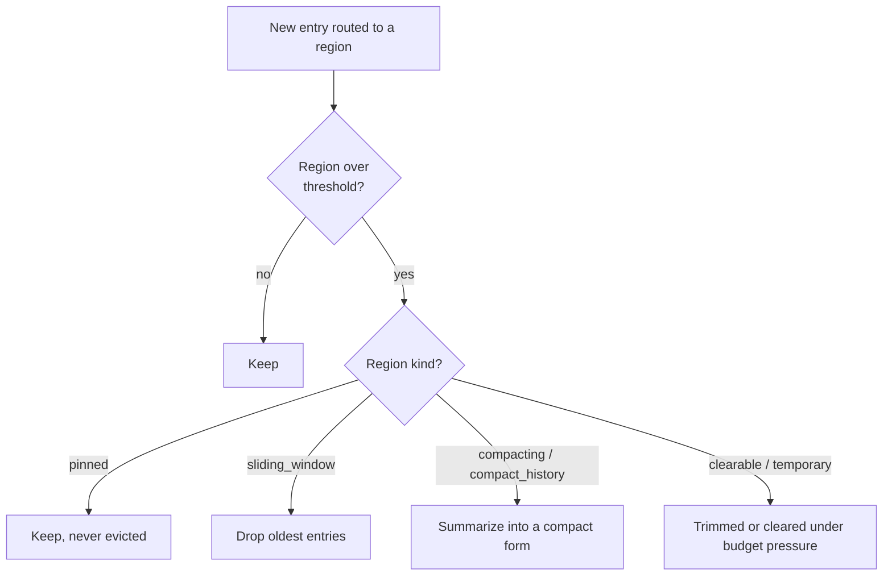

# Structured context memory

Most agent tools hand an LLM a flat message array. When a big file read lands, it shoves the system
prompt and the task toward the edge of the window. Leviath instead gives the agent **regions**:
typed slices of the context window with deterministic eviction, so a file dump can't push out what
the agent needs to remember.

A stage's context window is divided into regions, each with its own budget and eviction rule:

<div class="ctx-bar">
  <div class="ctx-seg ctx-pinned" style="flex:0 0 12%" title="pinned">pinned<br/>12%</div>
  <div class="ctx-seg ctx-codebase" style="flex:0 0 20%" title="compacting">codebase<br/>20%</div>
  <div class="ctx-seg ctx-conversation" style="flex:0 0 33%" title="sliding_window">conversation<br/>33%</div>
  <div class="ctx-seg ctx-history" style="flex:0 0 15%" title="compact_history">history<br/>15%</div>
  <div class="ctx-seg ctx-headroom" style="flex:1 1 auto" title="free">headroom</div>
</div>

## The eight region kinds

| Kind | Behavior |
|---|---|
| `temporary` | The **default** when `kind` is omitted; recent entries, trimmed first under budget pressure. |
| `pinned` | Never evicted (architecture, the task). |
| `sliding_window` | Keeps the most recent entries; the conversation lives here. |
| `compacting` | Summarizes instead of evicting: file reads and tool results. |
| `compact_history` | Rolls compacted summaries forward across stages. |
| `clearable` | Wiped in one shot when space is needed (scratch). |
| `hashmap` | Keyed entries (alias `hash_map`); a write to a key replaces it. |
| `custom` | Behavior defined by a Rhai script (see [Rhai scripting](/docs/scripting)). |

## Eviction is deterministic

When a region crosses its threshold, the runtime acts by the region's *kind*, never by pushing out
whichever message is oldest across the whole window:



## Routing tool output

Tool output is **routed** to a region, so exploration lands in a persistent codebase region rather
than scratch:

```toml
[stages.analyze.tool_routing]
default_region = "scratch"
[stages.analyze.tool_routing.overrides]
read_file = "codebase"
```

## Budgets travel across models

Budgets can be **percentages of the model's context window**, so a blueprint's intent survives
across models of different sizes. A region sized "20% of the window" is 20% whether the model has
32k or 200k tokens.

> [!NOTE]
> Percentages are ceilings and may sum past 100% (regions rarely fill at once). Absolute
> `max_tokens` and `threshold_tokens` are hard guard-rails when you need them.
