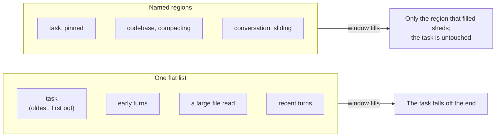
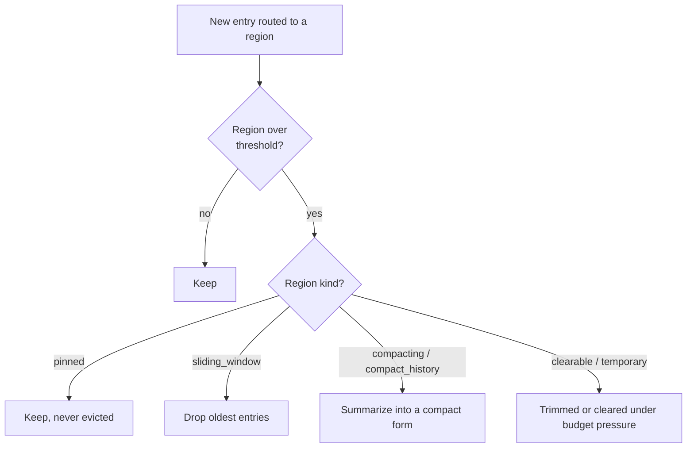

# Structured context memory

The usual way to give a model its history is one flat list of messages. That has a failure mode: read
one large file and it pushes everything else toward the edge of the window, including the system
prompt and the task the agent was given. The agent then forgets what it was doing, and nothing chose
that outcome.

Leviath splits the window into named **regions** instead. Each one has its own size limit and its
own rule for what to throw away first, so a big file read can only ever crowd out the region it
landed in.



## What that looks like

A typical coding agent might divide its window like this:

| Region | Share | Kind | Holds | When it fills |
|---|---|---|---|---|
| `task` | 12% | `pinned` | The task and the ground rules | Nothing. Pinned regions are never dropped |
| `codebase` | 20% | `compacting` | Files the agent has read | Older content is summarized, not lost |
| `conversation` | 33% | `sliding_window` | The back-and-forth | Oldest turns drop off |
| `history` | 15% | `compact_history` | Summaries carried from earlier stages | Rolls forward, compacted |
| headroom | 20% | | Left free for the reply | |

The point is the last column. In a flat message list, all five of those compete for the same space
and the loser is whatever happens to be oldest. Here, a file dump can fill `codebase` completely and
`task` is still exactly where it was.

```toml
[context.regions]
task         = { kind = "pinned", budget = "12%", seed = "task_input" }
codebase     = { kind = "compacting", budget = "20%" }
conversation = { kind = "sliding_window", budget = "33%", max_items = 20 }
history      = { kind = "compact_history", budget = "15%", source_region = "codebase" }
```

## The nine region kinds

| Kind | Behavior |
|---|---|
| `temporary` | The **default** when `kind` is omitted; recent entries, trimmed first under budget pressure. |
| `pinned` | Never evicted (architecture, the task). |
| `sliding_window` | Keeps the most recent entries; the conversation lives here. |
| `compacting` | Summarizes instead of evicting: file reads and tool results. |
| `compact_history` | Carries summaries from earlier stages forward, so a later stage knows what happened without holding the raw content. Names the region it summarizes with `source_region`. |
| `clearable` | Wiped in one shot when space is needed (scratch). |
| `hashmap` | Keyed entries (alias `hash_map`); a write to a key replaces it. |
| `checklist` | A task list whose entries carry state. Written through `todo_add` / `todo_done` / `todo_note`, never evicted, and rendered open-items-first. |
| `custom` | Behavior defined by a Rhai script (see [Rhai regions](/docs/rhai-regions)). |

An unrecognized `kind` is a hard parse error, not a silently ignored region. So is an
unrecognized `strategy`: `strategy = "per-item"` with a hyphen is refused, rather than leaving the
region to evict one entry at a time as if the line had not been written.

### Per-kind keys

Most kinds take extra keys that only make sense for them:

```toml
[context.regions.conversation]
kind      = "sliding_window"
max_items = 20                 # default 10
strategy  = "per_item"         # per_item (default) | bulk | compact
overflow  = 10                 # with strategy = "bulk": how many to drop at once
compact_count = 10             # with strategy = "compact": how many to fold into a summary

[context.regions.codebase]
kind             = "compacting"
budget           = "20%"
compact_at       = "80%"       # compact once this full, see below
threshold_tokens = 30000       # a hard token ceiling, applied as well as compact_at

[context.regions.history]
kind          = "compact_history"
source_region = "codebase"     # which region's summaries roll forward

[context.regions.findings]
kind        = "hashmap"
max_entries = 50               # a write to an existing key replaces it

[context.regions.brain]
kind       = "custom"
script     = "context_hooks/brain.rhai"   # relative to the agent directory
persistent = false             # true behaves pinned-like: never evicted
```

### Tracking work with a checklist

A pinned region plus `context_append` gives persistence, which is the easy half. What it does not
give is *state*: "compute the fee table" and "~~compute the fee table~~ done" are two different
strings, so nothing can count what is left and no gate can ask.

```toml
[context.regions]
todos = { kind = "checklist", budget = "3%" }
```

The agent writes to it through tools rather than free text, so the state cannot drift from what the
model believes it wrote:

| Tool | Effect |
|---|---|
| `todo_add(region, item)` | Adds an open item, returns its id |
| `todo_done(region, id)` | Ticks it off |
| `todo_note(region, id, note)` | Records a note **without** closing it |

It renders as one stable block with open items first, because the value of it being in the system
section is that it stays in front of the model every turn as instruction rather than history.

An id is never reused, so a `todo_done` cannot land on a different item than the one it names, and
an id that matches nothing is an error the model can read rather than a silent no-op.

The gate is the part that makes any of this enforceable:

```toml
[stages.implement.transitions.review]
gate = { require_no_open_items = "todos",
         message = "Finish or explicitly drop the open items first." }
```

The nudge names the items that are still open. It shares the same `max_attempts` budget as every
other gate, so it cannot wedge a run. A gate naming a region no stage declares, or a region that is
not a `checklist`, is refused by `lev validate`: at runtime it could only ever count zero and pass
on the first attempt, which looks exactly like a stage that finished its work.

### Keys every region accepts

| Key | Default | Meaning |
|---|---|---|
| `budget` | unset | A share of the model's context window, written as `"35%"` |
| `max_tokens` | `5000` | A token ceiling. See below for how it interacts with `budget` |
| `min_tokens` | unset | A floor for a percentage budget, so the region stays usable on a small model |
| `seed` | unset | What the region starts with. See below |
| `required` | `false` | The stage re-runs rather than moving on while this region is empty |
| `summarizable` | `true` | Set false to keep an edge `transform = "compact"` from paraphrasing this region. See [transforms](/docs/stages#carrying-context-across-an-edge) |
| `required_message` | generated | What the model is told when a required region is empty. Supports `{region}` |

**Resolved budget** is the phrase used for the number a region actually gets, once the percentage
has been worked out against the model in front of it. A `budget = "20%"` region on a 200k-token
model resolves to 40,000 tokens. `compact_at = "80%"` then means 80% of *that*, so 32,000.

`max_tokens` behaves differently depending on whether `budget` is set. On its own it is a plain
ceiling. Alongside `budget`, it caps the resolved percentage, so the region gets whichever is
smaller.

A malformed `budget` or `compact_at` string is a hard error at load, so `lev validate` catches it
instead of a run failing later.

### Seeding a region

`seed` fills a region before the first inference:

```toml
[context.regions]
task      = { kind = "pinned", seed = "task_input" }
standards = { kind = "pinned", seed = "input" }
readme    = { kind = "pinned", seed = { files = ["README.md"] } }
layout    = { kind = "temporary", seed = { glob = "src/**/*.rs" } }
rules     = { kind = "pinned", seed = { literal = "Never edit generated files." } }
env       = { kind = "pinned", seed = { command = "git log --oneline -20" } }
computed  = { kind = "temporary", seed = { rhai = "seeds/plan.rhai" } }
inherited = { kind = "pinned", seed = { caller = "brief" } }
```

| Form | Fills from |
|---|---|
| `"task_input"` | The caller's `task` key, which is what `lev run --task` sets |
| `"input"` | A caller key named after this region, so `--<region>` on the CLI reaches it |
| `"<any-other-string>"` | The caller key of that name |
| `{ files = [...] }` | The contents of those files |
| `{ glob = "..." }` | Every file matching the pattern |
| `{ literal = "..." }` | Fixed text |
| `{ command = "..." }` | The stdout of a shell command |
| `{ rhai = "..." }` | The return value of a Rhai script |
| `{ caller = "..." }` | A named value passed by a parent agent |

A region literally named `task` gets `seed = "task_input"` implicitly, so older blueprints keep
working.

A `seed` that matches none of the forms above is ignored and the region starts empty. `lev validate`
reports that as `region-seed-not-understood`, which is worth reading before wondering why a region
came out blank: the table keys are exactly the ones in the left column, so `{ caller_input = "..." }`
is a typo for `{ caller = "..." }` and seeds nothing. And a blueprint that seeds no region from the
task refuses a task outright rather than running without it.

> [!WARNING]
> A `command` seed runs at spawn, before the first inference and therefore before any tool-approval
> prompt. Because there is nobody to ask in the moment, it must also be covered by
> [`[safe_commands]`](/docs/interaction#what-runs-without-asking), or it does not run at all.
> `lev validate` prints every command seed in a blueprint, `lev run --no-seed-commands` refuses
> them for one run, and `[security] allow_seed_commands = false` refuses them machine-wide. Seeds
> run once: a daemon restart does not replay them.

#### Seed paths stay in the working directory

`files`, `glob` and `rhai` seeds resolve against the run's working directory and may not leave it.
A path that does is refused at spawn, before anything is read.

The rule is the one `read_file` follows, for the same reason: the *blueprint* chose this path, not
you. Seeded contents land in a region the model reads on its first turn, so a path that escaped
would put whatever it named in front of the model without anything having asked you.

To read outside on purpose, declare it under `[read_paths]` and grant it in your config. That is
already the mechanism for "this agent is meant to read there and I agreed", and seeding answers to
it rather than having a second one of its own. A glob is checked per match, since `../*.toml` cannot
be judged before it is expanded.

Scripts are stricter and have no `[read_paths]` escape: a stage hook, a custom-region script and an
output validator must all live inside the blueprint's own directory. A script is code the agent
ships, and there is no such thing as loading your logic from somewhere else on purpose.

## Where a stage's own instructions live

A stage's `system_prompt` is pinned context - that is why it reads as instruction rather than
history - and it goes into a region like everything else. By default that region is *whichever
pinned region you declared first*, which costs three things: its tokens are charged to that region's
name in the [stage ledger](/docs/cli#lev-stages-run-id), you cannot size or scope it, and it lands wherever
that region sits in the cacheable prefix.

Name a region for it and all three go away:

```toml
[context.regions]
stage_instructions = { kind = "pinned", budget = "3%" }
```

The runtime writes the entering stage's prompt there, replacing the previous stage's. It is always
assembled **after** every other pinned block, however you declared it, so the content in front of it
stays byte-identical when the stage changes - and that content is what a provider's prompt cache
matches on. Instructions sitting in front of the shared prefix rewrite its head on every transition,
which invalidates everything behind them.

Measured on a two-stage agent whose prompts are about 63 tokens each:

| Region | Without the declaration | With it |
|---|---|---|
| `task` | 65 | 2 |
| `stage_instructions` | not present | 63 |

The 65 is the whole problem in one number: two tokens of task and sixty-three of somebody else's
instructions, under a heading that says `task`.

A blueprint that declares no such region keeps the old behaviour exactly, so this costs nothing to
ignore. The region is never hidden by a stage that omits it from its own `[context.regions]`: it
holds the instructions of the stage being entered, so hiding it would drop that stage's prompt.

## Eviction is deterministic

When a region crosses its threshold, the runtime acts by the region's *kind*, never by pushing out
whichever message is oldest across the whole window:



## Routing tool output

Tool output is **routed** to a region, so exploration lands in a persistent codebase region rather
than scratch:

```toml
[stages.analyze.tool_routing]
default_region = "scratch"
max_result_tokens = 4000          # ceiling for any tool without one of its own
[stages.analyze.tool_routing.overrides]
read_file = "codebase"
# A stage that both greps and reads files needs two numbers, not one: a cap
# sized for the file read lets every grep through untouched, and one sized for
# the grep truncates every file.
[stages.analyze.tool_routing.max_result_tokens_per_tool]
read_file = 20000
```

Both tables are keyed by tool name, and an alias matches the tool it aliases - writing `bash` covers
the `shell` the model actually calls.

A stage may only route into a region it can see. Routing a result into a region the stage left out
of its own `[context.regions]` writes it where that stage cannot read it back, so `lev validate`
refuses the blueprint and says which region to add. The four the runtime always carries -
`conversation`, `tool_results`, `final_output` and `stage_instructions` - are always valid targets.

An override entry can also carry both answers at once, which is usually what you mean when a tool
needs its own region *and* its own ceiling:

```toml
[stages.analyze.tool_routing.overrides]
read_file = { region = "codebase", max_result_tokens = 20000 }
grep = "scratch"                     # just route it
```

Either key on its own is fine: `{ region = "codebase" }` routes without capping, and
`{ max_result_tokens = 500 }` caps without moving the result out of `default_region`. A value that
is neither a region name nor one of these tables is an error rather than a line that is quietly
skipped.

`read_file` also has a hard byte cap of its own, independent of any of this, and says so in the
result when it applies. Without one, a large file went into its region whole and was either
truncated or dropped as `[result omitted]` depending on how full the region already was - a cliff
rather than a limit.

## Budgets travel across models

This is why budgets are written as percentages. A region sized at 20% of the window is 20% whether
the model has 32k or 200k tokens, so the same blueprint keeps its shape when you switch models. Fixed
token counts would need rewriting every time.

> [!NOTE]
> Percentages are ceilings, and they may add up to more than 100%. That is deliberate: regions
> rarely fill at the same time, so reserving exact shares would waste most of the window. Use
> `max_tokens` and `threshold_tokens` when you need a limit that really is hard.
