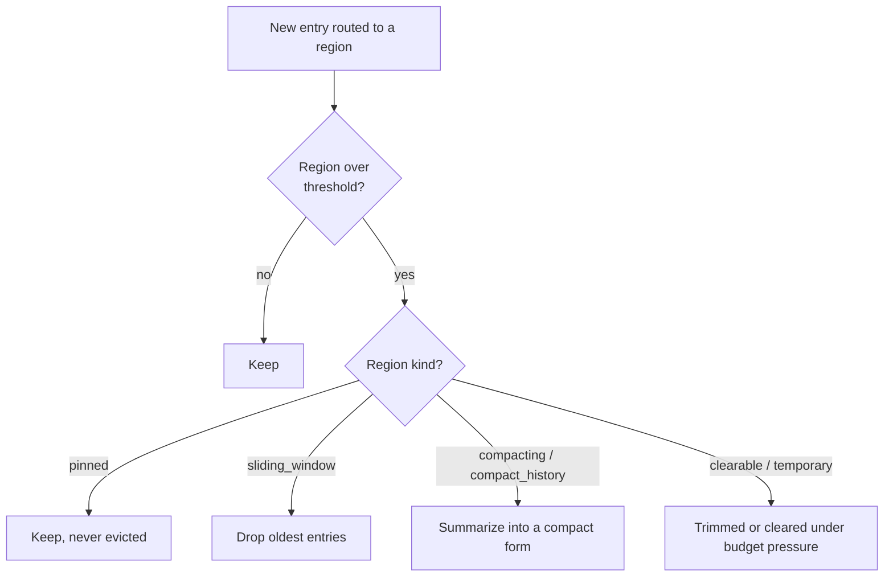

# Structured context memory

Most agent tools hand an LLM a flat message array. When a big file read lands, it shoves the system
prompt and the task toward the edge of the window. Leviath instead gives the agent **regions**:
typed slices of the context window with deterministic eviction, so a file dump can't push out what
the agent needs to remember.

A stage's context window is divided into regions, each with its own budget and eviction rule:

<div class="ctx-bar">
  <div class="ctx-seg ctx-pinned" style="flex:0 0 12%" title="pinned">pinned<br/>12%</div>
  <div class="ctx-seg ctx-codebase" style="flex:0 0 20%" title="compacting">codebase<br/>20%</div>
  <div class="ctx-seg ctx-conversation" style="flex:0 0 33%" title="sliding_window">conversation<br/>33%</div>
  <div class="ctx-seg ctx-history" style="flex:0 0 15%" title="compact_history">history<br/>15%</div>
  <div class="ctx-seg ctx-headroom" style="flex:1 1 auto" title="free">headroom</div>
</div>

## The eight region kinds

| Kind | Behavior |
|---|---|
| `temporary` | The **default** when `kind` is omitted; recent entries, trimmed first under budget pressure. |
| `pinned` | Never evicted (architecture, the task). |
| `sliding_window` | Keeps the most recent entries; the conversation lives here. |
| `compacting` | Summarizes instead of evicting: file reads and tool results. |
| `compact_history` | Rolls compacted summaries forward across stages. |
| `clearable` | Wiped in one shot when space is needed (scratch). |
| `hashmap` | Keyed entries (alias `hash_map`); a write to a key replaces it. |
| `custom` | Behavior defined by a Rhai script (see [Rhai regions](/docs/rhai-regions)). |

An unrecognized `kind` is a hard parse error, not a silently ignored region.

### Per-kind keys

Most kinds take extra keys that only make sense for them:

```toml
[context.regions.conversation]
kind      = "sliding_window"
max_items = 20                 # default 10
strategy  = "per_item"         # per_item (default) | bulk | compact
overflow  = 10                 # with strategy = "bulk": how many to drop at once
compact_count = 10             # with strategy = "compact": how many to fold into a summary

[context.regions.codebase]
kind             = "compacting"
budget           = "20%"
compact_at       = "80%"       # compact at this fraction of the resolved budget
threshold_tokens = 30000       # absolute guard-rail, applied alongside compact_at

[context.regions.history]
kind          = "compact_history"
source_region = "codebase"     # which region's summaries roll forward

[context.regions.findings]
kind        = "hashmap"
max_entries = 50               # a write to an existing key replaces it

[context.regions.brain]
kind       = "custom"
script     = "context_hooks/brain.rhai"   # relative to the agent directory
persistent = false             # true behaves pinned-like: never evicted
```

### Keys every region accepts

| Key | Default | Meaning |
|---|---|---|
| `budget` | unset | Percentage of the model's context window, as `"35%"` |
| `max_tokens` | `5000` | Absolute ceiling. With `budget` set, it caps the resolved percentage instead |
| `min_tokens` | unset | Floor for a percentage budget, so a small model still leaves the region usable |
| `seed` | unset | What the region starts with. See below |
| `required` | `false` | The stage re-runs rather than transitioning while this region is empty |
| `required_message` | generated | What the model is told when a required region is empty. Supports `{region}` |

A malformed `budget` or `compact_at` string is a hard error at load, so `lev validate` catches it
rather than a run failing later.

### Seeding a region

`seed` fills a region before the first inference:

```toml
[context.regions]
task      = { kind = "pinned", seed = "task_input" }
standards = { kind = "pinned", seed = "input" }
readme    = { kind = "pinned", seed = { files = ["README.md"] } }
layout    = { kind = "temporary", seed = { glob = "src/**/*.rs" } }
rules     = { kind = "pinned", seed = { literal = "Never edit generated files." } }
env       = { kind = "pinned", seed = { command = "git log --oneline -20" } }
computed  = { kind = "temporary", seed = { rhai = "seeds/plan.rhai" } }
inherited = { kind = "pinned", seed = { caller = "brief" } }
```

| Form | Fills from |
|---|---|
| `"task_input"` | The caller's `task` key, which is what `lev run --task` sets |
| `"input"` | A caller key named after this region, so `--<region>` on the CLI reaches it |
| `"<any-other-string>"` | The caller key of that name |
| `{ files = [...] }` | The contents of those files |
| `{ glob = "..." }` | Every file matching the pattern |
| `{ literal = "..." }` | Fixed text |
| `{ command = "..." }` | The stdout of a shell command |
| `{ rhai = "..." }` | The return value of a Rhai script |
| `{ caller = "..." }` | A named value passed by a parent agent |

A region literally named `task` gets `seed = "task_input"` implicitly, so older blueprints keep
working.

> [!WARNING]
> A `command` seed runs at spawn, before the first inference and therefore before any tool-approval
> prompt. It is the one thing a blueprint executes without being asked. `lev validate` prints every
> command seed in a blueprint, `lev run --no-seed-commands` refuses them for one run, and
> `[security] allow_seed_commands = false` refuses them machine-wide.

## Eviction is deterministic

When a region crosses its threshold, the runtime acts by the region's *kind*, never by pushing out
whichever message is oldest across the whole window:



## Routing tool output

Tool output is **routed** to a region, so exploration lands in a persistent codebase region rather
than scratch:

```toml
[stages.analyze.tool_routing]
default_region = "scratch"
[stages.analyze.tool_routing.overrides]
read_file = "codebase"
```

## Budgets travel across models

Budgets can be **percentages of the model's context window**, so a blueprint's intent survives
across models of different sizes. A region sized "20% of the window" is 20% whether the model has
32k or 200k tokens.

> [!NOTE]
> Percentages are ceilings and may sum past 100% (regions rarely fill at once). Absolute
> `max_tokens` and `threshold_tokens` are hard guard-rails when you need them.
