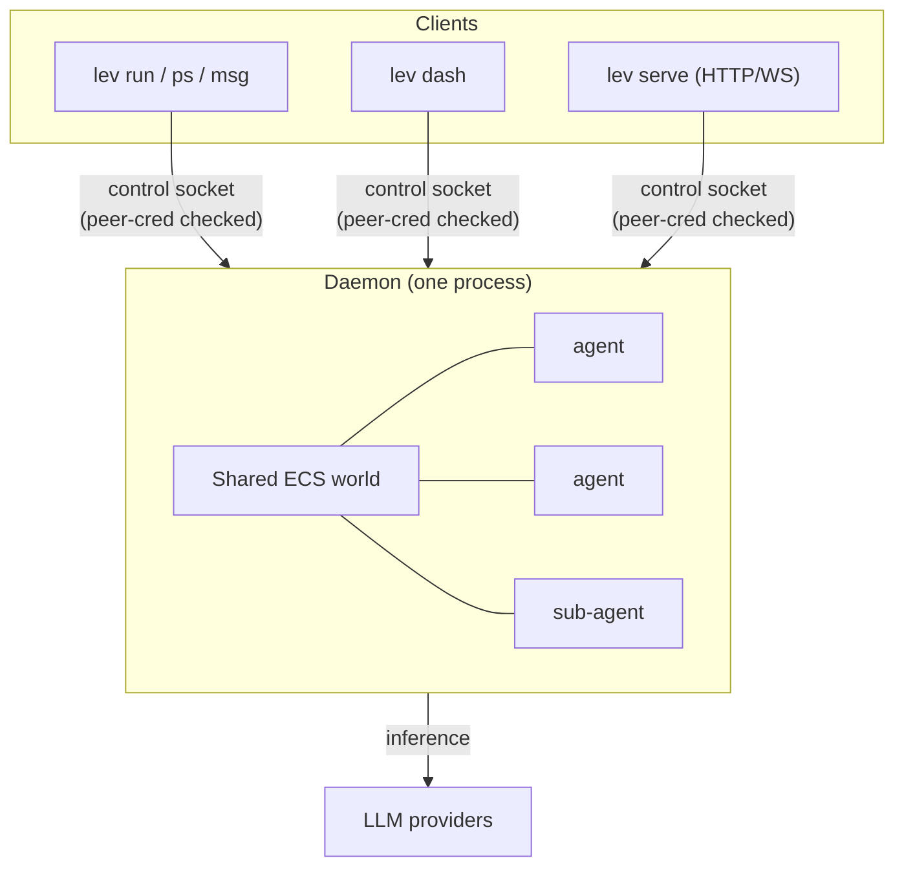
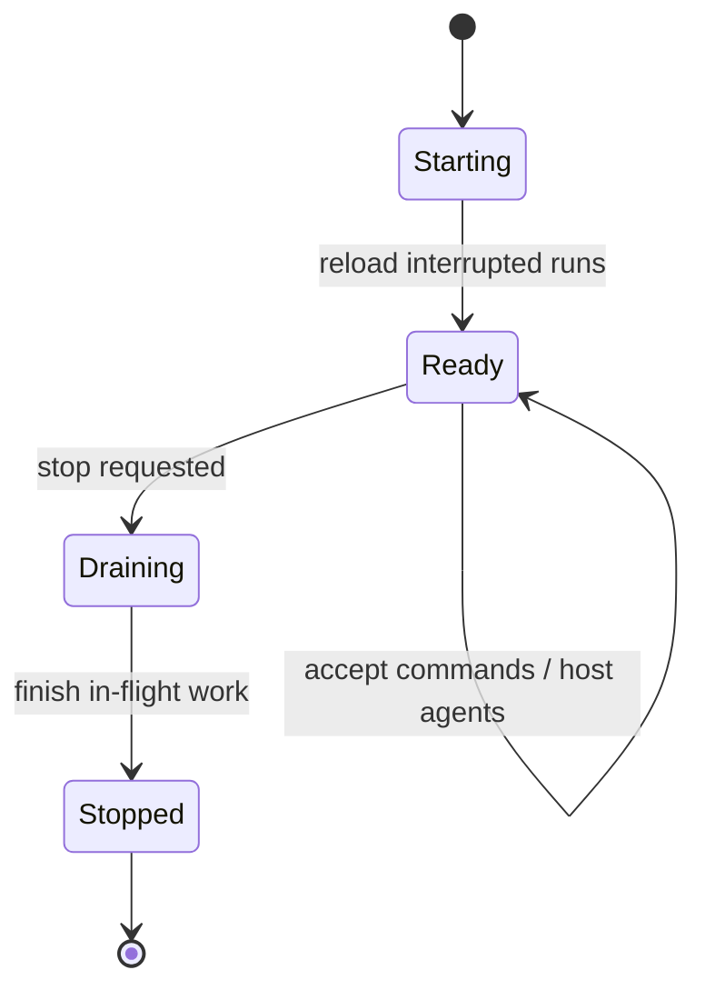

# The shared-world daemon

`lev run` doesn't run the agent in your terminal. It hands it to a background **daemon** that
hosts every agent in one shared [ECS world](/docs/engine). Runs keep going after your terminal
closes, and hundreds of agents share a single process instead of a process each.



## Lifecycle

The daemon starts automatically the first time a command needs it, and on start it **reloads runs
that were interrupted** so nothing is lost across a restart.

What that means for tool calls interrupted mid-batch: the daemon journals every batch when it
dispatches and every call's result as it finishes, so on reload the completed calls are **replayed
from the journal, never re-executed** - a shell command or file write that already ran does not run
twice. A call that was still executing when the daemon died comes back to the model as an error
that says the effect may or may not have landed, with instructions to check before re-running
anything side-effecting; an interrupted `spawn_agent` also lists the run's existing children so the
model checks for the child instead of spawning a duplicate. The one window this cannot close is a
crash in the instant between an external effect landing and its result reaching the journal (no
journal can observe an external side effect atomically) - those calls surface as the same
verify-first error rather than being silently re-run. If your receiver consumes completion
webhooks, dedupe on `delivery_id` (see the [API guide](api.md)): a completion re-fired after a
restart carries the same id as the original.



You can also drive it directly:

```bash
lev daemon                 # run in the foreground (with logs)
lev daemon status          # is it running?
lev daemon start           # start in the background
lev daemon stop
lev daemon restart
```

## Run it unattended

For an always-on setup, install the daemon under your OS service manager so it starts at login,
restarts if it dies, and reloads interrupted runs on start:

```bash
lev daemon install         # launchd (macOS) / systemd --user (Linux)
lev daemon uninstall
```

> [!TIP]
> An installed daemon plus [`lev serve`](/docs/api) is all you need to drive Leviath from the
> browser [console](/app), no terminal required.

## Config changes take effect on the next run

The daemon watches `~/.leviath/config.toml` and picks up your edits automatically. When you change
per-run policy - a tool permission, a `[read_paths]` grant, a sandbox default, a limit, taint - the
**next `lev run` uses the new value with no restart**. If a save leaves the file briefly unparseable
(a half-typed edit), the daemon keeps serving your last good config and reloads on the next clean
save, so an in-progress edit never breaks a spawn.

Two kinds of change still need `lev daemon restart`, because they set up connections and
process-wide state once at startup rather than per run:

- provider keys and `[model_providers]` (the provider registry)
- `[[mcp_servers]]` (live MCP connections), `[observability]` (the telemetry pipeline), and
  `[security] allow_local_network` (the outbound-network policy)
- `[limits] stall_timeout_secs`, `wedge_timeout_secs` and `dead_cycles_before_relief`, along with
  the other limits the world is built with (`max_concurrent_inferences`, `max_concurrent_tools`,
  `exact_token_counting`, `provider_failures_before_open`, `provider_circuit_cooldown_secs`)

`[providers] fallback_order` is per-run policy, so it reloads with everything else in the first
group. Adding a fallback provider takes effect on the next `lev run`.

## Control surface

The daemon is reached over a local **control socket**: a Unix socket / Windows pipe guarded by a
peer-credential check, *not* a TCP port, so nothing on the network can reach it. The CLI verbs that
talk to it:

| Command | Does |
|---|---|
| `lev ps` | List running agents and their status ([reading it](/docs/cli#reading-lev-ps)) |
| `lev msg <id> <text>` | Send a message to a running agent |
| `lev respond` | Answer a pending `ask_user` question |
| `lev pause <run-id>` | Pause a run |
| `lev resume <run-id>` | Resume a paused run |
| `lev cancel <run-id>` | Cancel a run |
| `lev context <run-id>` | Show a run's context-window history |

> [!NOTE]
> To drive the daemon over the network instead of the local socket, run the
> [HTTP API server](/docs/api). It's a thin REST + WebSocket gateway in front of this same daemon,
> with a mandatory auth token.

## Reconciling an external work queue

If something outside Leviath hands work to agents and tracks which slots are busy, it has to answer
one question about each run it started: is this still going. Three facts about how Leviath records
runs decide how to ask.

**`updated_at` in `meta.json` is a heartbeat, not progress.** The daemon rewrites a run's metadata
every 30 seconds whether or not the run moved, so that a stale timestamp means the daemon stopped
rather than the run. A fresh `updated_at` proves the daemon is alive and proves nothing about the
run. Read `last_progress_at` instead: it advances only on a new iteration, a new stage, or a change
of status. It is absent from runs written before it existed and from runs whose first snapshot has
not landed. A daemon restart resets it, because a reloaded run really is re-driven from its saved
context.

**`pid` is always 0.** There is no process per run. The daemon hosts every agent in one shared
world, so no run has a pid of its own. The field is still written because it always has been.
Nothing can be concluded from it.

**A finished run leaves the listing eventually.** `lev ps` shows the world the daemon is holding,
plus runs that ended within the last `[limits] finished_retention_secs` (five minutes by default).
After that the row is gone, and a daemon restart clears the memory of it at once. So the listing
answers "how did this run end" for a few minutes and then stops answering. The record on disk is
permanent; the row in `lev ps` is not.

### The recipe

Poll `lev ps --all --json`. It reports the daemon's live runs, the ones that ended recently
enough for it to still remember, the runs on disk it is not holding, and whether it answered at
all:

```json
{
  "daemon_reachable": true,
  "runs": [{ "run_id": "coder-1785568852", "status": "active", "last_progress_at": 1785568852 }],
  "finished": [{ "run_id": "coder-1785568700", "status": "error" }],
  "not_running": [
    { "run_id": "coder-1785568100", "status": "complete", "updated_at": 1785568600, "abandoned": false }
  ]
}
```

For each run your queue thinks is in progress:

| Where it appears | What it means | What to do |
|---|---|---|
| In `runs` | The daemon is driving it | Leave it alone |
| In `finished` | It ended just now, and `status` says how | Close the work item |
| In `not_running`, terminal `status` | It ended longer ago, or before a restart. `updated_at` is when, `status` and `error` are how | Close the work item |
| In `not_running`, `abandoned: true` | Disk says running, the daemon is not holding it, and it has not moved in five minutes | `lev cancel <run-id>`, then release the slot |
| Nowhere | The run id was never written, so the spawn failed before creating anything | Release the slot |

`finished` and `not_running` never overlap, so a run appears exactly once and the same run cannot
be closed twice.

When `daemon_reachable` is false, act on nothing. A daemon restarting looks exactly like every run
dying at once, and a reconciler that cannot tell the two apart will cancel a healthy factory.
Nothing is ever marked `abandoned` in that case. Wait for the next poll.

`lev ps --all` reads every run directory, and nothing deletes them, so it gets slower as the runs
dir grows. Poll it less often than plain `lev ps`.

### Fail a wedged run instead of finding it later

A run can also be left in a state no part of the engine can reach: no inference in flight, no tool
batch, nothing waiting on it. It has stopped for good, but it still says `running`. Set
`[limits] wedge_timeout_secs` and the daemon fails such a run itself, which frees whatever your
scheduler had assigned to it and turns it into an ordinary terminal run for the recipe above.

```toml
[limits]
wedge_timeout_secs = 300
```

It is `0` (off) by default, because it fails runs and that should be a choice rather than something
an upgrade does for you. It never fires on a run that is merely slow: an agent waiting on the model,
on a tool, on its sub-agents, or on a person is exempt however long it takes. If it does fire, the
run's error says so and the daemon logs it at `error` level. That is a bug in Leviath, and worth
reporting.

## Observability

The daemon can export its telemetry event stream over OpenTelemetry (OTLP/HTTP) to any collector.
Enable it in `~/.leviath/config.toml`:

```toml
[observability]
enabled      = true
exporter     = "otlp"
endpoint     = "http://localhost:4318"
service_name = "leviath"
```
