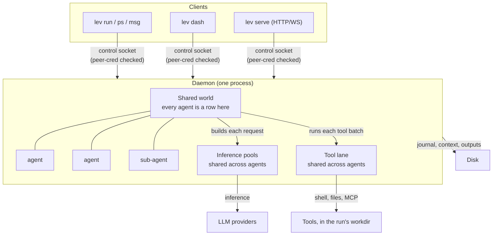
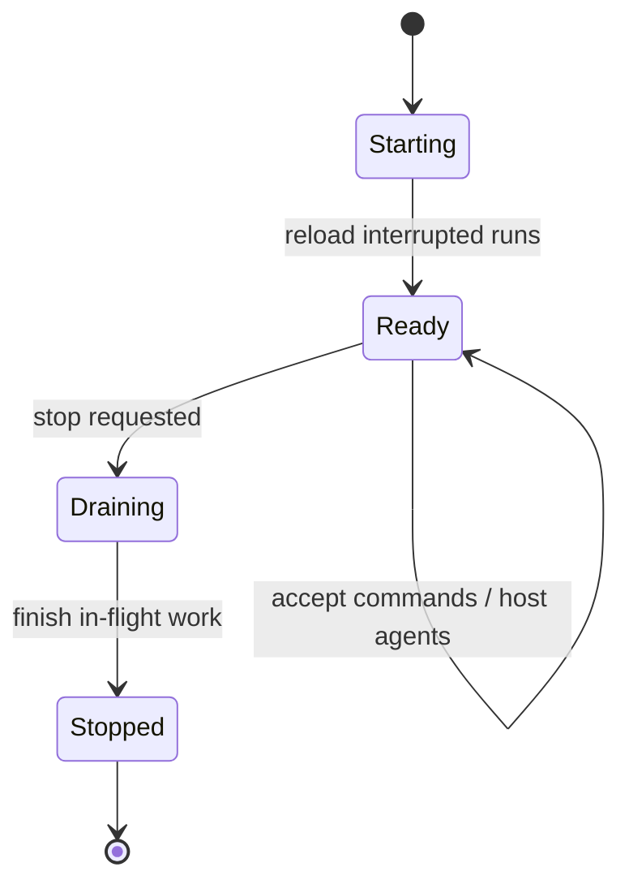

# The shared-world daemon

If an agent runs inside your terminal, then closing the terminal kills it, and a long job means
leaving a window open for hours. Leviath does not work that way. `lev run` hands the agent to a
background service called the **daemon**, which owns every run on the machine.

So your runs keep going after you close the terminal, and hundreds of agents share one process
instead of taking a process each. Building Leviath into your own Rust program instead? You can skip
the daemon entirely. See [Embedding](/docs/embedding).



Agents never talk to a provider or run a tool themselves. The world builds each request and each
tool batch on their behalf, which is what lets one process share connections, rate limits, and tool
capacity across every run instead of duplicating them per agent.

You do not normally start it yourself. It starts the first time a command needs it.

```bash
lev daemon                 # run in the foreground (with logs)
lev daemon status          # is it running?
lev daemon start           # start in the background
lev daemon stop
lev daemon restart
```

## What happens when it restarts

On start, the daemon reloads any runs that were interrupted, so a crash or a restart does not lose
work.

The tricky part is tool calls that were mid-batch when it went down. Some of those already had real
effects: a file written, a shell command run. Re-running them would do the damage twice. So the
daemon keeps a **journal**, an append-only record of every tool batch when it is dispatched and
every result as it arrives. On reload it uses the journal to work out what actually happened:

- **A call that finished** is replayed from the journal, not run again. A file write that already
  landed does not land twice.
- **A call that was still running** comes back to the model as an error saying the effect may or may
  not have happened, with instructions to check before re-running anything with side effects.
- **An interrupted `spawn_agent`** also lists the run's existing children, so the model looks for
  the child it may already have created instead of spawning a duplicate.
- **A crash in the instant between an effect landing and the journal recording it** is the one gap
  this cannot close, because no journal can watch an external side effect happen atomically. Those
  calls come back as the same check-first error rather than being quietly re-run.

If something on your end consumes completion webhooks, deduplicate on `delivery_id`, described in
the [API guide](/docs/api). A completion that re-fires after a restart carries the same id as the
original.



## Run it unattended

For an always-on setup, install the daemon under your operating system's service manager. It then
starts at login, restarts if it dies, and reloads interrupted runs on start:

```bash
lev daemon install         # launchd (macOS) / systemd --user (Linux)
lev daemon uninstall
```

There is no Windows service integration yet: `lev daemon install` reports itself unsupported
there. Use `lev daemon start`, and remember that `lev run` starts a daemon automatically anyway.

> [!TIP]
> An installed daemon plus [`lev serve`](/docs/api) is all you need to drive Leviath from the
> [The Lair](https://leviath.dev/lair), the browser console, with no terminal involved.

## Config changes take effect on the next run

The daemon watches `~/.leviath/config.toml` and picks up your edits on its own. Change a tool
permission, a `[read_paths]` grant, a sandbox default, a limit, or a taint setting, and the next
`lev run` uses the new value. No restart needed.

If a save leaves the file briefly unparseable, which happens while you are halfway through typing an
edit, the daemon keeps serving the last version that worked. It reloads on your next clean save, so
an in-progress edit never breaks a spawn.

Two kinds of change do need `lev daemon restart`. Both set up connections and process-wide state
once at startup rather than per run:

- Provider keys and `[model_providers]`, which build the provider registry.
- `[[mcp_servers]]` (live MCP connections), `[observability]` (the telemetry pipeline), and
  `[security] allow_local_network` (the outbound-network policy).
- The `[limits]` the world itself is built with: `stall_timeout_secs`, `wedge_timeout_secs`,
  `dead_cycles_before_relief`, `max_concurrent_inferences`, `max_concurrent_tools`,
  `exact_token_counting`, `provider_failures_before_open`, `provider_circuit_cooldown_secs`,
  `interaction_timeout_secs`, and `finished_retention_secs`.

`[providers] fallback_order` is not one of them. It is per-run policy, so it reloads like everything
else and a new fallback provider applies on the next `lev run`.

## Control surface

Everything reaches the daemon over a local **control socket**. That is a Unix socket, or a named
pipe on Windows, guarded by a check on who is connecting. It is not a TCP port, so nothing on the
network can reach it.

These are the commands that talk to it:

| Command | Does |
|---|---|
| `lev ps` | List running agents and their status. See [reading it](/docs/cli#reading-lev-ps) |
| `lev msg <id> <text>` | Send a message to a running agent |
| `lev respond` | Answer a pending `ask_user` question |
| `lev pause <run-id>` | Pause a run |
| `lev resume <run-id>` | Resume a paused run |
| `lev cancel <run-id>` | Cancel a run |
| `lev context <run-id>` | Show a run's context-window history |

> [!NOTE]
> To reach the daemon over the network instead of the local socket, run the
> [HTTP API server](/docs/api). It is a thin REST and WebSocket gateway in front of this same
> daemon, with a required auth token.

## Fail a wedged run instead of finding it later

A run can end up in a state no part of the engine can reach: no model call in flight, no tool batch
running, nothing waiting on it. It has stopped for good, but it still reports as `running`.

Set `[limits] wedge_timeout_secs` and the daemon fails such a run itself. That frees whatever was
assigned to it and turns it into an ordinary finished run:

```toml
[limits]
wedge_timeout_secs = 300
```

It is `0`, meaning off, by default, because it fails runs and that should be your choice.

It never fires on a run that is merely slow. An agent waiting on the model, on a tool, on its
sub-agents, or on a person is exempt however long it takes. If it does fire, the run's error says
so and the daemon logs it at `error` level. That is a bug in Leviath, and worth reporting.

## Observability

The daemon can export its telemetry over OpenTelemetry to any collector. Turn it on in
`~/.leviath/config.toml`:

```toml
[observability]
enabled      = true
exporter     = "otlp"
endpoint     = "http://localhost:4318"
service_name = "leviath"
```

See [Observability](/docs/observability) for what it exports.

> [!TIP]
> Driving Leviath from a scheduler, a CI job, or a work queue that tracks its own slots? See
> [External work queues](/docs/work-queues) for how to ask the daemon whether a run is still going,
> and which fields lie to you if you read them the obvious way.
