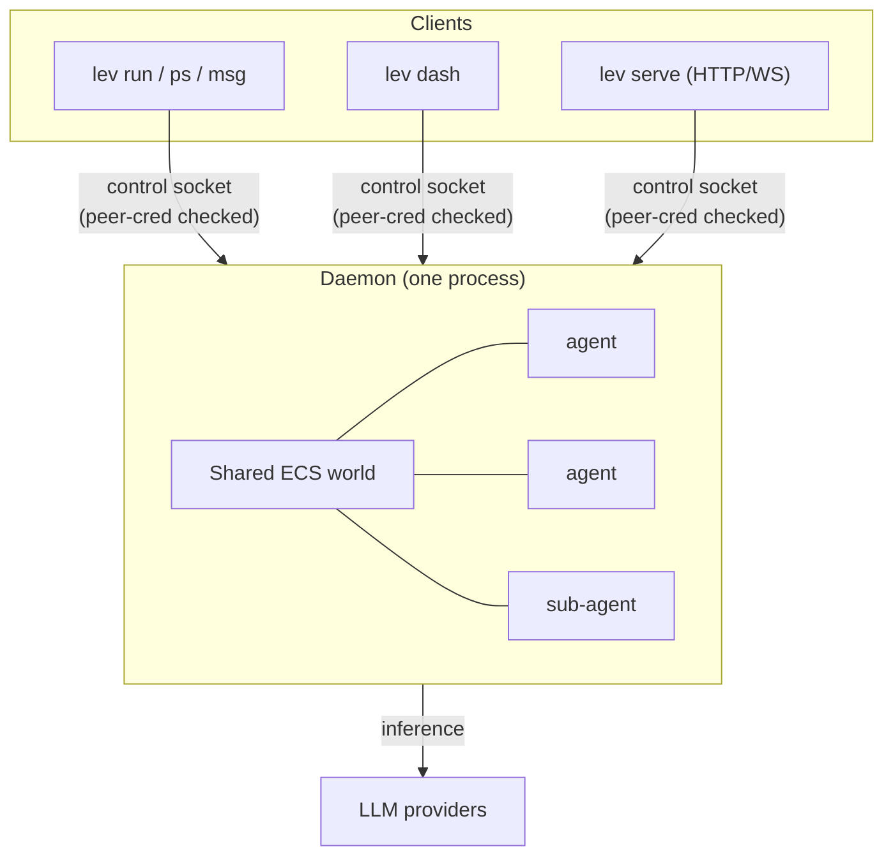
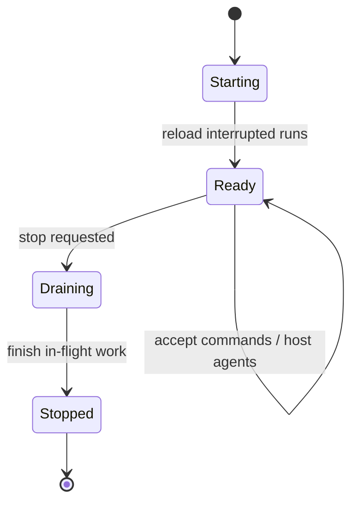

# The shared-world daemon

`lev run` doesn't run the agent in your terminal. It hands it to a background **daemon** that
hosts every agent in one shared [ECS world](/docs/engine). Runs keep going after your terminal
closes, and hundreds of agents share a single process instead of a process each.



## Lifecycle

The daemon starts automatically the first time a command needs it, and on start it **reloads runs
that were interrupted** so nothing is lost across a restart.



You can also drive it directly:

```bash
lev daemon                 # run in the foreground (with logs)
lev daemon status          # is it running?
lev daemon start           # start in the background
lev daemon stop
lev daemon restart
```

## Run it unattended

For an always-on setup, install the daemon under your OS service manager so it starts at login,
restarts if it dies, and reloads interrupted runs on start:

```bash
lev daemon install         # launchd (macOS) / systemd --user (Linux)
lev daemon uninstall
```

> [!TIP]
> An installed daemon plus [`lev serve`](/docs/api) is all you need to drive Leviath from the
> browser [console](/app), no terminal required.

## Config changes take effect on the next run

The daemon watches `~/.leviath/config.toml` and picks up your edits automatically. When you change
per-run policy - a tool permission, a `[read_paths]` grant, a sandbox default, a limit, taint - the
**next `lev run` uses the new value with no restart**. If a save leaves the file briefly unparseable
(a half-typed edit), the daemon keeps serving your last good config and reloads on the next clean
save, so an in-progress edit never breaks a spawn.

Two kinds of change still need `lev daemon restart`, because they set up connections and
process-wide state once at startup rather than per run:

- provider keys and `[model_providers]` (the provider registry)
- `[[mcp_servers]]` (live MCP connections), `[observability]` (the telemetry pipeline), and
  `[security] allow_local_network` (the outbound-network policy)

## Control surface

The daemon is reached over a local **control socket**: a Unix socket / Windows pipe guarded by a
peer-credential check, *not* a TCP port, so nothing on the network can reach it. The CLI verbs that
talk to it:

| Command | Does |
|---|---|
| `lev ps` | List running agents and their status |
| `lev msg <id> <text>` | Send a message to a running agent |
| `lev respond` | Answer a pending `ask_user` question |
| `lev cancel <run-id>` | Cancel a run |
| `lev context <run-id>` | Show a run's context-window history |

> [!NOTE]
> To drive the daemon over the network instead of the local socket, run the
> [HTTP API server](/docs/api). It's a thin REST + WebSocket gateway in front of this same daemon,
> with a mandatory auth token.

## Observability

The daemon can export its telemetry event stream over OpenTelemetry (OTLP/HTTP) to any collector.
Enable it in `~/.leviath/config.toml`:

```toml
[observability]
enabled      = true
exporter     = "otlp"
endpoint     = "http://localhost:4318"
service_name = "leviath"
```
