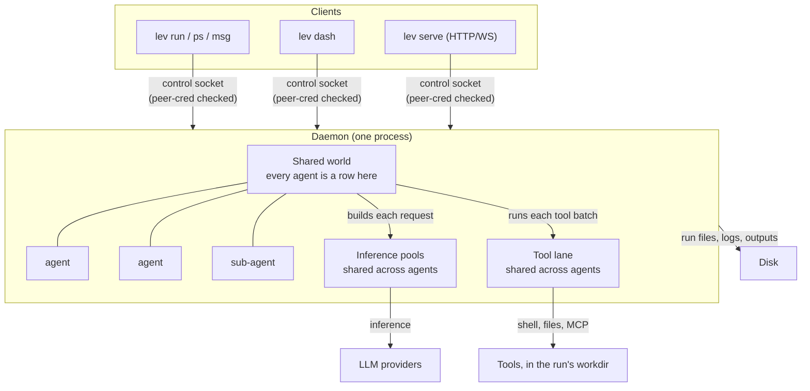
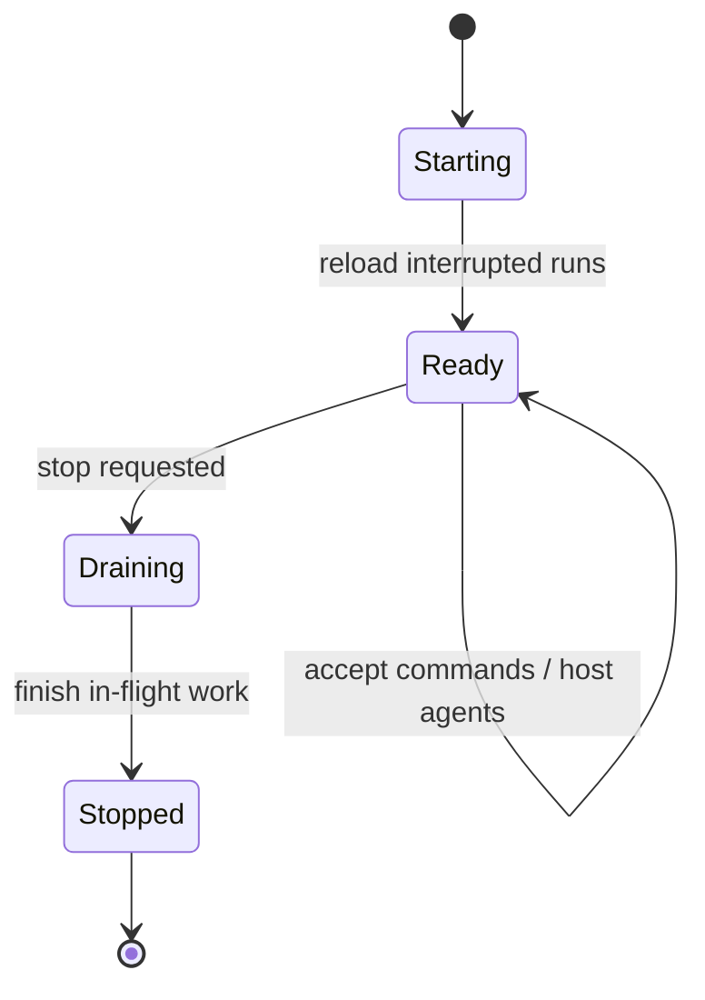

# The shared-world daemon

If an agent runs inside your terminal, then closing the terminal kills it, and a long job means
leaving a window open for hours. Leviath does not work that way. `lev run` hands the agent to a
background service called the **daemon**, which owns every run on the machine.

So your runs keep going after you close the terminal, and thousands of agents share one process
instead of taking a process each. Building Leviath into your own Rust program instead? You can skip
the daemon entirely. See [Embedding](/docs/embedding).


```mermaid
flowchart TB
  subgraph clients["Clients"]
    RUN["lev run / ps / msg"]
    DASH["lev dash"]
    SERVE["lev serve (HTTP/WS)"]
  end
  RUN & DASH & SERVE -->|"control socket<br/>(peer-cred checked)"| DAEMON
  subgraph DAEMON["Daemon (one process)"]
    WORLD["Shared world<br/>every agent is a row here"]
    WORLD --- A1["agent"]
    WORLD --- A2["agent"]
    WORLD --- A3["sub-agent"]
    POOLS["Inference pools<br/>shared across agents"]
    LANE["Tool lane<br/>shared across agents"]
    WORLD -->|"builds each request"| POOLS
    WORLD -->|"runs each tool batch"| LANE
  end
  POOLS -->|inference| PROV["LLM providers"]
  LANE -->|"shell, files, MCP"| TOOLS["Tools, in the run's workdir"]
  DAEMON -->|"run files, logs, outputs"| DISK["Disk"]
```

Agents never talk to a provider or run a tool themselves. The world builds each request and each
tool batch on their behalf, which is what lets one process share connections, rate limits, and tool
capacity across every run instead of duplicating them per agent.

You do not normally start it yourself. It starts the first time a command needs it.

```bash
lev daemon                 # run in the foreground (with logs)
lev daemon status          # is it running?
lev daemon start           # start in the background
lev daemon stop
lev daemon restart
```

## Where it logs

The daemon writes its log to `~/.leviath/daemon.log`, however it was started. In the foreground
the same lines also print to your terminal. A daemon started for you in the background has no
terminal, so the file is the only record.

The file is capped. When it reaches `[observability] log_file_max_bytes` (5 MiB by default) it
is renamed to `daemon.log.1` and a fresh file starts, so the two together never pass about
10 MiB. Raise the cap in `config.toml` and the next run applies it, with no restart. `0` never
rolls.

A daemon under `lev daemon install` also has `daemon.stdio.log`, where the supervisor keeps what
the process writes outside its log: a fatal start-up error, or a panic.

`lev serve` keeps a log of its own the same way, `~/.leviath/serve-<name>.log`, one per server.
The name is `--name`, or the port when you give none, so two servers side by side never share a
file and a restart on the same port keeps rolling the same one. The same cap applies; a server
reads it when it starts. `lev rage` packs all of these files into a bug report. See
[Reporting issues](/docs/reporting-issues).

## What happens when it restarts

On start, the daemon reloads any runs that were interrupted, so a crash or a restart does not lose
work.

Each run lives in one file, `run.lvr`, in its directory under `~/.leviath/runs/<run-id>/`. The
[run file](/docs/run-file) holds the run's spec, the code and blobs it needs, every step, and state
checkpoints. A reload reads the spec and the last state from it. It then checks the run against this
machine: the providers it was started on, its MCP servers, and its code. A run that still fits is
placed back in the world where it stopped.

A run that was waiting on a person comes back waiting on the same question. A tool call waiting
for approval, or held at the taint gate, is asked again under the same id, and the model is not
asked again. `lev respond` with that id answers it, and the call runs once.

A run that no longer fits is held, with every problem recorded in its file. A provider whose key,
base URL or model list changed since the run started is the usual cause. The daemon log names the
run and each problem:

```
ERROR leviath_cli::daemon::recovery: a run cannot be resumed on this machine as it stands; holding it run_id=release-notes-1790848481-4774f2f3b6fa issues=2 problems with this spawn:
1. stages.gather.provider: changed: provider 'openai' is configured differently from when the run started: the run was started against a different configuration. put 'openai' back the way it was (its kind, base URL and model list), or start a new run. Known: openai
```

A held run is listed as paused, with the reason `machine changed`. The same problem at several
stages is one line naming each stage. Put the provider or server back and restart the daemon, or
`lev resume` it, and it carries on where it stopped. A `lev resume` while it still does not fit
leaves it paused and says what to put back. See
[when the machine changed](/docs/run-file#when-the-machine-changed). A run directory from an older
Leviath is converted to a run file the first time the daemon loads it. Its old files move to a
`legacy/` directory inside it, except its stage logs and its answer, which stay where they are. See [upgrading from an earlier release](#upgrading-from-an-earlier-release).

The tricky part is tool calls that were mid-batch when it went down. Some of those already had real
effects: a file written, a shell command run. Re-running them would do the damage twice. So the
run file keeps a **journal**: each tool batch is recorded when it is dispatched, and each result as
it arrives. On reload the daemon uses the journal to work out what actually happened:

- **A call that finished** is replayed from the journal, not run again. A file write that already
  landed does not land twice.
- **A call that was still running** comes back to the model as an error saying the effect may or may
  not have happened, with instructions to check before re-running anything with side effects.
- **An interrupted `spawn_agent`** also lists the run's existing children, so the model looks for
  the child it may already have created instead of spawning a duplicate.
- **A question that was waiting on you** (`ask_user_*`, `present_for_review`, `edit_document`) is
  asked again. A question has no effect to check, and nothing after it in the batch had started, so
  the batch is dispatched again with its finished calls' results carried over. The question comes
  back in `lev interactions` under a new request id, and the run shows as waiting on it, as it did
  before the restart. A taint-gate prompt is not yet among these: its call is not journaled until
  you answer, so the run asks the model again instead.
- **A crash in the instant between an effect landing and the journal recording it** is the one gap
  this cannot close, because no journal can watch an external side effect happen atomically. Those
  calls come back as the same check-first error rather than being quietly re-run.

A reloaded run is not resolved again. It carries on with the models, tools, launch policy and
inputs its spec recorded when it started, including `--yolo`, the output format it was asked for,
and each stage's failover list.

If something on your end consumes completion webhooks, deduplicate on `delivery_id`, described in
the [API guide](/docs/api). A completion that re-fires after a restart carries the same id as the
original.


```mermaid
stateDiagram-v2
  [*] --> Starting
  Starting --> Ready: reload interrupted runs
  Ready --> Ready: accept commands / host agents
  Ready --> Draining: stop requested
  Draining --> Stopped: finish in-flight work
  Stopped --> [*]
```

## Upgrading from an earlier release

The first time a new release's daemon starts on your home, it brings what the earlier release wrote
up to date:

- each installed blueprint still written as an `agent.leviath` becomes an `agent.toml`, or is
  replaced by this release's copy when Leviath ships it;
- each run directory in the old many-file layout becomes a run file.

Before it changes any of them, the daemon saves it under `~/.leviath/backups/<version>-<time>/`:

| Folder | Holds |
|---|---|
| `agents/` | Each installed blueprint directory, as it was |
| `agent_paths/` | Each blueprint from one of your `agent_paths`, as it was |
| `runs/` | Each old run directory, as it was |

A run's files are hard links rather than copies, so the backup costs no extra disk space while the
run's own `legacy/` folder holds the same files. Its stage logs are copied instead, because they
stay in the run's directory, where a resumed run adds to them. One backup is kept per release, and Leviath never
deletes anything in it. An item that cannot be saved is left exactly as it was.

On a large home this takes a while: about 18 seconds for a thousand runs. The daemon answers
meanwhile, so any `lev` command waiting on it shows what it is doing and how far along it is.
That covers the command that started it, `lev ps`, `lev dash` before it opens, and `lev daemon`
in the foreground:

```text
leviath: saving everything it changes to ~/.leviath/backups/<version>-1790000000 first
leviath daemon starting: converting runs [##########--------------] 412/982
```

On a terminal the line is redrawn in place. Through a pipe or a log, each step gets one plain line
and no escape codes, and `--json` output on stdout is untouched. When the daemon is ready, the
first command to see it prints a summary once:

```text
Upgraded this home for Leviath <version>: 19 blueprints upgraded, 982 old runs converted. Everything it changed was saved first to ~/.leviath/backups/<version>-1790000000; Leviath never deletes it.
warning: blueprint 'researcher': region 'log': `max_stored = 5` was dropped: Leviath 0.6.4 and earlier accepted it but never read it, so it never changed a run
```

There is one warning for each key an upgraded blueprint held that Leviath 0.6.4 and earlier
accepted but never read. A key dropped from the blueprints of old runs is warned about once, with
how many runs held it. The summary is in the daemon log too, and when the daemon was started with
nobody waiting, the next `lev ps` prints it.

An upgraded blueprint keeps its warnings beside it, in `legacy/upgrade-warnings.json`, and
`lev list` and `lev validate` show them under it until you edit its `agent.toml` or delete that
file.

A run converts once. One that cannot be converted is left as it was and listed, with the reason, in
`~/.leviath/runs.unconverted`. Later starts of the same release leave it alone, and the next release
tries it again. To try again now, delete that file and run `lev daemon restart`.

A run whose blueprint is gone, or no longer reads, still converts: its graph is what the run
recorded, so it lists and reads back like any other run. It never resumes. One that had not
finished ends in `error`, saying why.

A blueprint that cannot be upgraded is left as it was, and the summary says why once. The daemon
tries it again on every start without repeating the summary, and `lev list` names it, with the
reason, until you fix it and convert it with `lev blueprint migrate`.

### One version at a time

Run one version of `lev` and its daemon at a time, and run `lev daemon restart` after upgrading.
Each release reads the home its own way, so a `lev` talking to a daemon of another build shows
that build's view of it: an empty `lev ps`, no open questions while one is pending, or a run file
it cannot read. When the two differ, every command that talks to the daemon starts with a line
saying which is which, and `lev daemon status` says it too. A command that only reads files, such
as `lev list` or `lev validate`, has no daemon to differ from and says nothing:

```text
warning: this daemon is an earlier release (build 839f0344), older than this lev (<version> (build 1a2b3c4d)). Each build reads the home its own way, ...
```

A command that starts runs replaces an older daemon with its own build, and says so. It leaves a
newer one running: use the newer `lev`, or run `lev daemon restart` with the one you mean to keep.
A `lev` from 0.6.4 or earlier cannot tell the two apart. It replaces any daemon that is not its own
build, newer or not, and shows its own view of the home without a warning.

### Going back

To return to the release you upgraded from:

1. Stop the daemon with this release's `lev`: `lev daemon stop`.
2. For each name in `~/.leviath/backups/<version>-<time>/agents/`, replace
   `~/.leviath/agents/<name>` with the backup's copy. Do the same for each name in the backup's
   `runs/`, replacing `~/.leviath/runs/<name>`. A blueprint under the backup's `agent_paths/` goes
   back to the agent path it came from; its folder is named after it, followed by a digest of
   where it was.
3. Delete `~/.leviath/runs.index`, and `~/.leviath/runs.unconverted` if there is one.
4. Put the earlier release's `lev` back on your `PATH` and start its daemon: `lev daemon start`.

Release 0.1.0 has no daemon, so it has no `lev daemon start` either. For it, steps 2 and 3 are
all there is: it runs each agent in the foreground with `lev run`, as it always did.

The backup holds each run as it was when the upgrade converted it. A run this release resumed and
carried on is back where it was at the upgrade, and the earlier daemon picks up each unfinished
run from there, as after any restart.

Runs started after the upgrade stay unreadable by the earlier release: they exist only as run
files, which it does not read, so it leaves their directories out of `lev ps`. Copy them aside
before going back if you want them later; the new release reads them again when you upgrade once
more. The same goes for a blueprint installed after the upgrade, which is an `agent.toml`.

Started on an upgraded home without restoring, an earlier release changes nothing, but it sees
little. `lev ps` and `lev list` come back empty, because every run is a run file and every
blueprint an `agent.toml`, neither of which it reads. `lev result` and `lev stages` say the run is
not there, and `lev run <name>` says there is no blueprint by that name. The backup folder holds a
`README.txt` with these steps.

## What the front-ends do while it restarts

The long-lived front-ends ride a daemon restart out: `lev serve`, `lev dash`, and
`lev agent-client`. Without that, `lev serve` would answer 503 for the second the socket is gone,
and the ACP bridge would end its turn with half an answer.

A request that arrives while the daemon is down waits up to ten seconds for it to come back. The
new daemon serves it. The wait is per outage, not per request: a daemon that is really gone costs
one caller the ten seconds, and every caller after that fails at once until it returns. Requests
that could double an effect, a spawn or a message that got no reply, are reported rather than
sent twice. One-shot commands such as `lev ps` do not wait: a daemon that is not running is
reported at once, with the advice to start it.

The daemon says who it is (version, build, pid) when a front-end connects. That is how each one
tells a restart from an update:

| What happened | `lev serve` | `lev dash` | `lev agent-client` |
|---|---|---|---|
| The daemon restarted on the same build | Logs it, and sends WebSocket clients a `daemon_link` event | A log line and a toast | Follows the run onto the new daemon, silently |
| The daemon came back on a different build | Logs a warning, and the `daemon_link` event carries the advice | A log line, a toast, and a chip on the run list | Says so in the conversation |

The advice is always the same: restart that front-end, so both ends run the same code. Requests
keep working while the two still understand each other. One that fails because they no longer do
is reported as exactly that (`lev serve` answers 502 rather than 503), since a daemon restart
cannot fix it.

> [!NOTE]
> After `lev update`, the next `lev` command restarts the daemon onto the new build. A `lev serve`
> or `lev dash` that was already running is now the older half of the pair, and says so. Restart
> it when convenient.

## Run it unattended

For an always-on setup, install the daemon under your operating system's service manager. It then
starts at login, restarts if it dies, and reloads interrupted runs on start:

```bash
lev daemon install         # launchd (macOS) / systemd --user (Linux)
lev daemon uninstall
```

The unit pins `LEVIATH_HOME` to the home that was current when you installed, since a supervised
process inherits nothing from your shell. Move the home and run `lev daemon install` again.

There is no Windows service integration yet: `lev daemon install` reports itself unsupported
there. Use `lev daemon start`, and remember that `lev run` starts a daemon automatically anyway.

> [!TIP]
> An installed daemon plus [`lev serve`](/docs/api) is all you need to drive Leviath from the
> [The Lair](https://leviath.dev/lair), the browser console, with no terminal involved.

## Config changes take effect on the next run

The daemon watches `~/.leviath/config.toml` and picks up your edits on its own. Change a tool
permission, a `[read_paths]` grant, a sandbox default, a limit, or a taint setting, and the next
`lev run` uses the new value. No restart needed.

If a save leaves the file briefly unparseable, which happens while you are halfway through typing an
edit, the daemon keeps serving the last version that worked. It reloads on your next clean save, so
an in-progress edit never breaks a spawn.

That is the right behaviour and it used to be invisible, which made it the wrong experience. A typo
you did not spot meant every edit after it silently did nothing, and the only record was one line in
`daemon.log`.

So a config that will not load is now a state Leviath reports rather than a fact it keeps to
itself:

- `lev run` prints one line before the run starts, naming the file, where in it the problem is, and
  that this run is on the last config that loaded.
- `lev ps` puts the same fact under the run table.
- `lev doctor` fails its `config` check with the line and column, or with the key for a value that
  parsed and was then refused.
- `lev dash` keeps a warning across the top of the screen for as long as the file is broken. It
  clears itself when the file parses again.
- `GET /api/config` carries a `config_error` object, and `/ws` sends a `config_health` frame each
  time the answer changes. See [the API reference](/docs/api#when-the-config-file-will-not-load).

The file is re-read once per save, not once per run. A broken file that nobody has touched since
costs one `stat` and produces one log line, rather than a re-read and a fresh warning on every
spawn. Fix the file and everything above clears on its own, with nothing restarted.

`[model_providers.<name>]` reloads too, as of this release. A script provider's own `.rhai` file
has always been re-read on each use, so a table beside it that needed a restart made two halves of
one feature disagree in silence. Setting a `base_url` and watching it do nothing looked exactly
like having typed the key wrong. Both halves are now live: edit the script or the table, and the
next provider load uses it.

`[security] allow_env_vars` is live for both things that read it: a Rhai script's `env_var()`, and
the `${VAR}` in an MCP server's `headers`. Naming a variable there reaches the next provider load
and the next MCP connection. A server already connected keeps the header it was given. So a global
`[[mcp_servers]]` entry that interpolates a variable is reconnected when you change the list, and
that is what puts the new value in front of the next run.

`[[mcp_servers]]` is live as well. Add, edit or remove a global server, with `lev mcp add`, `POST
/api/mcp/servers`, or by hand, and the next run gets the tools the file names now. A run already
under way keeps the servers it started with: a removed one stays connected for
`[limits] mcp_idle_disconnect_secs` so nothing loses a tool mid-call, and is torn down after that.

Provider credentials reload as well. Add a key, replace one, remove one by untoggling it in
`lev setup`, point a provider at another base URL, or change `default_provider`. The daemon
compares the file's credentials against the ones its registry was built from, and rebuilds the
registry when they differ, before the next run resolves its stages.

It makes no difference whether the write came from `lev setup`, `PUT /api/config` or an editor,
because all three write the same file. Two details are deliberate:

- A run **already under way** keeps calling the provider its current stage started on, even one you
  removed, so a config edit never pulls a provider out from under a stage mid-flight. New runs, new
  stages, and a parked run you `lev resume` all resolve against the new set.
- A provider whose key changed has its circuit-breaker record cleared, so a key you just replaced is
  tried immediately instead of sitting out the rest of the old key's cooldown.

The taint gate's own two files reload as well: `policy.toml` and the `.rhai` files in the `rules/`
directory beside it. `lev policy add` writes a rule and the next run is gated against it, with no
restart.

The scripted half needed this most, because it failed in a way no restart advice covered. The rule
sources were read into the compiled checker at boot, so editing a `.rhai` file changed nothing at
all. The gate went on answering from the text it started with.

[`yolo.toml`](/docs/yolo) is read whenever a run is spawned under a named
profile, and again when such a run resumes. So an edited rule is in force for the next `lev run
--yolo=<name>` and for a parked run you `lev resume`. Three of a profile's keys are decided once,
when the run is built: `questions`, `checkpoints` and `gate`. Those reach the next run, not one
in flight. Bare `--yolo` never reads the file.

[`mime_types.toml`](/docs/configuration#mime_typestoml) and a `[mime_types]` table in the
config reload. They are the one thing that reaches a run already under way without waiting
for anything. The daemon re-reads both files on its own timer, every thirty seconds, and rebuilds
every live run's registry over the new rows.

So a type you add while a run is going types that run's next file. A new run reads the files as it
spawns.

`[observability]` reloads too. Turn export on, point it at a different collector, rename the
service, or turn it off, and the next run emits into what the file says now. The verbosity of the
daemon's own log is not part of that; it is one of the three things below that still need a
restart.

### A run in progress reads them again when it resumes

An agent resolves its permissions when it spawns, so an edit made while it is running does not
reach the run that is already going. That mattered most in exactly the case you would want it to
work. The run has stopped on a tool it is not permitted to call, a path it may not read, or a write
ceiling it has hit. The fix is sitting in a file the run was never going to read again.

So a run re-reads four things when it starts moving again: `[tool_permissions]` (including the
per-agent overlay), `[safe_commands]`, `[security] read_paths`, and the write ceilings. Three
moments count as starting again:

- `lev resume` on a paused run.
- Answering an approval prompt, since the person answering may equally have gone and changed the
  permission the prompt was about.
- The daemon paging a run back in from disk to act on it.

A stage that is running keeps the snapshot it started on, so nothing is re-judged halfway through a
batch of tool calls. Nothing the run has already spent or been granted is reset either. The write
total, the approvals you granted for the run or the stage, and the blueprint's own per-stage
permissions all stay as they were.

Some changes do still need `lev daemon restart`. After this release the list is three items long,
and only one of them is a setting in `config.toml`:

- `[limits] mcp_idle_disconnect_secs`. It is handed to the MCP pool when the pool is built and
  nothing re-reads the config into it, so a blueprint's per-agent servers keep the grace window the
  daemon started with.
- How verbose the daemon's own log is. Its `tracing` subscriber is installed from `--verbose` on the
  command line before any config is read, and a process can install one only once. The size cap on
  the log file is not one of these; it reloads with the rest of `[observability]`.
- A provider key you exported as an environment variable instead of writing it to the file. The
  daemon inherited its environment when it started, and an export in your shell afterwards never
  reaches it.

`[providers] fallback_order` needs no restart either. It is per-run policy, so it reloads like
everything else and a new fallback provider applies on the next `lev run`.

Nor does the outbound-network policy. `[security] allow_local_network` and the two script-HTTP
limits, `script_http_timeout_secs` and `script_http_max_per_host`, are copied into process-wide
state because the shared HTTP client has no handle on your config by the time a script tool calls
through it. That copy is now refreshed on every reload, so all three follow the file.

It matters most in the direction nobody tests. Turning `allow_local_network` **off** used to stop a
script naming a loopback URL at once. A redirect from a permitted URL down to loopback carried on
being followed until you restarted the daemon.

### The `[limits]` the world is built with

These used to need a restart and no longer do, as of this release:

- The inference pools, `max_concurrent_inferences` and its `_by_model` and `_by_provider` tables.
- The tool lane, `max_concurrent_tools`.
- `stream_inference`.
- The two watchdogs, `stall_timeout_secs` and `wedge_timeout_secs`.
- The provider circuit breaker, `provider_failures_before_open` and
  `provider_circuit_cooldown_secs`.
- The inference retry schedule, `inference_retry_attempts` and `inference_retry_base_ms`.
- `dead_cycles_before_relief`, `notify_spend_usd`, `max_agents_per_run`, `finished_retention_secs`
  and `interaction_timeout_secs`.
- The whole `[title]` section.

Most of them reach the runs already going, not only the next one, because the engine reads them on
every pass. Lower `stall_timeout_secs` and the watchdog is stricter with the run in front of it.
Lower `max_agents_per_run` and the next fan-out split stops at the new ceiling.

The ones that only apply to what starts next are the ones nothing can retroactively change. A
request already on the wire keeps the streaming setting, the retry schedule and the pool slot it
started with. A prompt already waiting keeps the deadline it opened with.

Lowering a concurrency limit never interrupts anything. The slots nobody is holding are taken back
at once, and the rest as the requests and tool batches in flight finish. So the pool narrows by
draining, rather than by cancelling work you are paying for.

`[title]` had a worse failure than doing nothing. Turning it on marked each new run for a title,
because spawn already read a fresh config. The part that actually makes titles then read the value
from boot, saw titling switched off, and dropped the marker without a word. Both halves read
the same file now.

The list is a description of the code, not a policy. Anything not on it reloads.

## Control surface

Everything reaches the daemon over a local **control socket**. That is a Unix socket, or a named
pipe on Windows, guarded by a check on who is connecting. It is not a TCP port, so nothing on the
network can reach it.

These are the commands that talk to it:

| Command | Does |
|---|---|
| `lev ps` | List running agents and their status. See [reading it](/docs/cli#reading-lev-ps) |
| `lev msg <id> <text>` | Send a message to a running agent |
| `lev interactions` | List the questions runs are waiting on, or show one |
| `lev respond <id>` | Answer one of them |
| `lev pause <run-id>` | Pause a run |
| `lev resume <run-id>` | Resume a paused or cancelled run |
| `lev cancel <run-id>` | Cancel a run |
| `lev context <run-id>` | Show a run's context-window history |

> [!NOTE]
> To reach the daemon over the network instead of the local socket, run the
> [HTTP API server](/docs/api). It is a thin REST and WebSocket gateway in front of this same
> daemon, with a required auth token.

## Fail a wedged run instead of finding it later

A run can end up in a state no part of the engine can reach: no model call in flight, no tool batch
running, nothing waiting on it. It has stopped for good, but it still reports as `running`.

Set `[limits] wedge_timeout_secs` and the daemon fails such a run itself. That frees whatever was
assigned to it and turns it into an ordinary finished run:

```toml
[limits]
wedge_timeout_secs = 300
```

It is `0`, meaning off, by default, because it fails runs and that should be your choice.

A slow run never trips it. An agent waiting on the model, on a tool, on its
sub-agents, or on a person is exempt however long it takes. If it does fire, the run's error says
so and the daemon logs it at `error` level. That is a bug in Leviath, and worth reporting.

## Observability

The daemon can export its telemetry over OpenTelemetry to any collector. Turn it on in
`~/.leviath/config.toml`:

```toml
[observability]
enabled      = true
exporter     = "otlp"
endpoint     = "http://localhost:4318"
service_name = "leviath"
```

See [Observability](/docs/observability) for what it exports.

> [!TIP]
> Driving Leviath from a scheduler, a CI job, or a work queue that tracks its own slots? See
> [External work queues](/docs/work-queues) for how to ask the daemon whether a run is still going,
> and which fields lie to you if you read them the obvious way.
