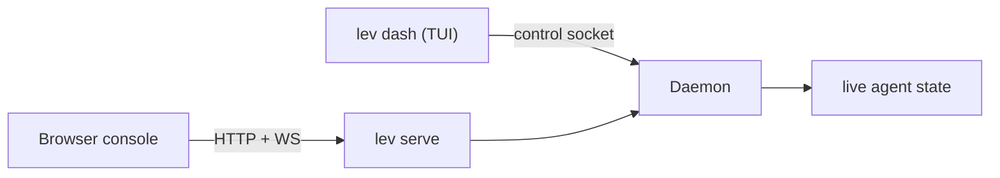

# Dashboard (`lev dash`)

`lev dash` is a full-screen TUI for managing concurrent agents. It's the fastest way to watch a fleet
of runs, answer their questions, and steer them.

```bash
lev dash
```

It reads the same [daemon](/docs/daemon) the browser [console](/app) does, just over the local
control socket instead of HTTP:



## What's on screen

- **Agent table**: blueprint/title, stage index, status, tokens in/out, context-window occupancy,
  iteration, elapsed time, model, and sub-agent depth. Titles are auto-generated per run.
- **Detail view**: per-stage tabs or a graph view of the workflow, a context-window visualization,
  and content panes for **Output**, **Logs**, and **Context** (JSON). Markdown is rendered.
- **Interactions**: answer an agent's question (free-text, edit, multiple-choice, tool-approval, or
  confirm) or send it a mid-run message.
- **Mouse support**: wheel scroll, click-drag select with copy-on-release, OSC52 copy over SSH,
  `y` to yank a pane, Shift+drag for native selection.
- **`m`** opens the MCP management screen without leaving the dashboard.

## Keys

| Key | Action |
|---|---|
| `1`–`9` | Select an agent |
| `Enter` / `Esc` | Open / close detail |
| `l` / `o` / `c` | Switch Logs / Output / Context |
| `i` | Respond to or message the agent |
| `/` | Search |
| `k` | Kill the run |
| `?` | Help |

> [!TIP]
> Prefer a browser, or want to drive Leviath from another machine? The [agent console](/app)
> mirrors the dashboard over the [HTTP API](/docs/api).
