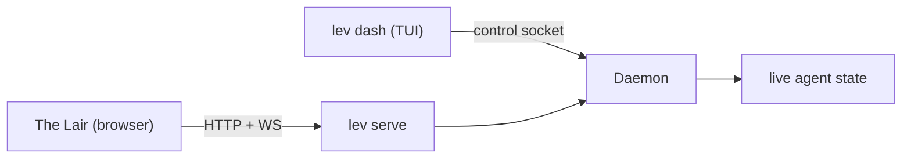

# Dashboard (`lev dash`)

`lev dash` is a full-screen TUI for managing concurrent agents. It's the fastest way to watch a fleet
of runs, answer their questions, and steer them.

```bash
lev dash
```

It reads the same [daemon](/docs/daemon) that [The Lair](https://leviath.dev/lair) does, just over
the local control socket instead of HTTP:



## Answer a waiting run

The most common reason to open the dashboard: a run stopped to ask you something. Select the run
with the arrow keys, press `Enter` for its detail view, then press `i` to open the interaction
panel and answer. `lev respond` does the same from the shell.

## What's on screen

- **Agent run table**: title and run id, blueprint, stage, status, tokens, and start time, with
  sub-agents nested under their parent. Titles are auto-generated per run. The model, iteration,
  and context-window occupancy live in the detail view.
- **Detail view**: the blueprint's stage graph as a band under the header (the flat stage tabs
  on a short terminal), a context-window visualization, and content panes for **Output**,
  **Logs**, and **Context** (JSON). Markdown is rendered. `g` opens the graph full screen.
- **Interactions**: answer an agent's question (free-text, edit, multiple-choice, tool-approval, or
  confirm) or send it a mid-run message.
- **Mouse support**: wheel scroll, click-drag select with copy-on-release, OSC52 copy over SSH,
  `y` to yank a pane, Shift+drag for native selection.
- **`m`** opens the MCP management screen without leaving the dashboard.

## Keys

Most keys work on one screen only. Press `?` for the list that applies to where you are, or `F1`
where `?` would be typed as text: on the new-run screen every printable character goes into the
filter or the task.

Besides the main list and the detail view below, there is a screen for starting a run (`n`), one for
MCP servers (`m`), and the stage explorer (`g`, from the detail view).

### Main list

| Key | Action |
|---|---|
| `↑` / `↓` (or `k` / `j`) | Select a run |
| `Home` / `End` (or `g` / `G`) | Jump to the first / last run |
| `Enter` | Open detail view |
| `n` | Start a run: pick an agent, write the task, press Enter |
| `Tab` / `Shift-Tab` | Focus the log panel (keys below) |
| `/` | Filter runs by name or status |
| `s` | Cycle the sort: start time (default), recent activity, or status groups |
| `x` | Kill the selected run. Asks first |
| `d` | Delete the run. Permanent, and asks first |
| `Space` | Mark or unmark the selected run, then move down a row |
| `p` / `r` | Pause / resume the selected run |
| `m` | Manage MCP servers |
| `Esc` | Clear the filter, or clear the marks once no filter is set |
| `?` / `F1` | Help for the screen you are on |
| `q` / `Ctrl-C` | Quit |

By default runs are listed newest first and keep their row for their whole life, so nothing jumps
around when a run finishes. The sort indicator sits in the table's top-right corner.

Marking selects several runs at once: press `Space` on each run, then `x` or `d` acts on all of
them behind one confirmation. Marked rows show a check mark, the pane title counts them, and marks
follow the run rather than the row, so sorting or filtering never changes what is marked. A kill
skips marked runs that have already finished.

### Log panel

`Tab` from the main list moves the focus into the activity log under the table.

| Key | Action |
|---|---|
| `↑` / `↓` (or `k` / `j`) | Scroll a line |
| `PgUp` / `PgDn` | Scroll a screen |
| `Home` (or `g`) | Oldest line |
| `End` (or `G`) | Newest line, and follow new lines again |
| `Tab` / `Shift-Tab` / `Esc` | Back to the run list |
| `?` / `F1` | Help |
| `q` / `Ctrl-C` | Quit |

### Starting a run (`n`)

Agent blueprints on the left, the task on the right, and above the task the selected blueprint's
stage graph, so you can see what an agent will do before you give it a task: how many stages, in
what order, where it loops back. It follows the selection, previews bundled blueprints that are not
installed yet from the copy inside the binary, and says so when a manifest cannot be read. Drag to
pan it; on a screen too short to fit both, the task keeps its rows and the preview is skipped. Once
the run starts, the dashboard opens that run's page, and `Esc` from there goes back to the list
rather than back into the form.

| Key | Action |
|---|---|
| `↑` / `↓` | Choose an agent. Any letter filters the list; `Backspace` shortens the filter |
| `Tab` / `Enter` | Move from the agent list to the task |
| `Enter` (in the task) | Start the run |
| `Alt+Enter` | Newline, rather than starting the run |
| `@` | Reference a file from the working directory: `↑` / `↓` choose a path, `Enter` or `Tab` inserts it, `Backspace` over the `@` ends the reference, `Esc` dismisses the list and keeps what you typed |
| `Ctrl-Y` | Run unattended, so the agent approves its own tool calls |
| `F1` | Help. `?` types a question mark here |
| `Esc` (in the agent list) | Clear the filter, then close the screen |
| `Esc` or `Tab` (in the task) | Back to the agent list |

`Ctrl-Y` warns the first time you use it in a sitting, and the warning is worth reading: an
unattended run approves its own file edits and shell commands, but it does **not** skip a checkpoint
the blueprint asks a person for. Those still stop, and one nobody answers ends the run when the
interaction timeout expires. The setting is off again every time the screen opens.

### Detail view

On a terminal at least 32 rows tall the stage row is the blueprint's graph: one box per stage,
transitions as edges, the stage the run is in in the run's colour, visited stages with their
visit count, the selected stage reversed. `←` / `→` and `1`-`9` move through it exactly as they
did through the tabs, and dragging pans it. On a shorter terminal, and for a run whose blueprint
could not be read, the flat tab strip stays.

| Key | Action |
|---|---|
| `←` / `→` | Switch stage tab (`h` / `l` are not aliases here: `l` is Logs) |
| `1`–`9` | Jump to that stage tab |
| `↑` / `↓` (or `k` / `j`) | Scroll the pane; in the Context view, move the tree cursor |
| `PgUp` / `PgDn` | Scroll ten lines |
| `Home` / `End` (or `b` / `e`) | Jump to the beginning / end |
| `l` / `o` / `c` | Switch the pane to Logs / Output / Context |
| `g` | Open the stage graph explorer |
| `Enter` / Space | Fold or unfold the row under the Context tree's cursor |
| `[` / `]` | Jump to the previous / next region in the Context view |
| `,` / `.` | Step back and forward through context history |
| `/` , then `n` / `N` | Search, then next / previous match |
| `y` | Copy the pane to the clipboard |
| `i` | Respond to or message the agent |
| `x` | Kill the run. Asks first |
| `p` / `r` | Pause / resume the run |
| `Esc` | Clear the search, or go back to the list |
| `?` / `F1` | Help |
| `Ctrl-C` | Quit. `q` is unbound here, so a stray keystroke cannot close the dashboard mid-run |

While you are typing a response, `Enter` sends it, `Alt+Enter` inserts a newline, `PgUp` / `PgDn`
scroll the document above the prompt, and `Esc` cancels. `/quit` or `/exit` on its own line ends
the conversation without answering.

Destructive keys always confirm on a dialog with real buttons: `←`/`→` pick an answer, `Enter`
activates it, and a stray keypress does nothing. The safe answer holds focus to start.

### Context view

The Context view is a tree, not one long scroll. Each region is a header row with its token bar;
its entries are one-line stubs with a preview. Move with `↑`/`↓`, fold or unfold with `Enter` or
Space, and jump between regions with `[` and `]`. While a search (`/`) is active everything is
temporarily unfolded so matches inside entries stay reachable. Browsing history with `,`/`.` keeps
your scroll position and fold state, and the context card's title shows which archived point you
are on, in which stage, recorded when.

### Stage explorer

`g` in the detail view opens the full-screen stage explorer for any run (a linear blueprint is a
chain; a graph blueprint is a graph):

- **Graph** draws the blueprint on a canvas: stages are boxes laid out left to right on layers,
  transitions are routed edges. The stage the run is in spins in the run's colour, stages it has
  been through show a visit count (`×2`) and the time of their last visit, the last transition it
  took is animated, and revisit loops run along a lane below the boxes. The escape edges
  (`error`, `dead_end`, `stuck`, `max_iterations`) are hidden until you ask for them, because
  nearly every stage has one to the same hub. A fan-out stage that is running shows its worker
  counts. Selecting a stage or an edge describes it on the line under the canvas.
- **Timeline** lists each actual visit in order, with when it started, how long it lasted, and how
  many iterations it ran. `Enter` on a visit opens the context window exactly as it was at that
  point.

| Key | Action |
|---|---|
| `←` `→` `↑` `↓` (or `h` `j` `k` `l`) | Select a stage in that direction |
| `[` / `]` | Select the previous / next stage in blueprint order |
| `Enter` | Graph: open the selected stage's tab. Timeline: open the visit's context |
| `+` / `-` , `0` | Zoom in / out, back to 100% |
| `f` | Fit the whole graph on screen |
| `e` | Show or hide the escape edges |
| `u` | Show or hide stages the run has never entered |
| `Tab` / `Shift-Tab` | Switch between Graph and Timeline |
| `?` / `F1` | Help |
| `Esc` / `g` | Close the explorer |

The mouse works on the canvas: drag to pan, wheel to zoom at the cursor, click a stage to select
it. While the explorer is open the detail view's keys are off, so `e`, `c`, `l`, `o` and `b` mean
what the table above says rather than what they mean underneath.

`lev validate --graph <agent>` prints the same picture as plain text.

### MCP servers (`m`)

| Key | Action |
|---|---|
| `↑` / `↓` (or `k` / `j`) | Move |
| `a` | Add a server: type its URL, `Enter` adds it, `Backspace` edits, `Esc` cancels |
| `d` | Remove the selected server. Asks first |
| `l` | Log in through the browser |
| `t` | Test the connection |
| `r` | Refresh the list |
| `?` / `F1` (`F1` while typing a URL) | Help |
| `Esc` | Back to the run list |
| `q` / `Ctrl-C` | Quit |

> [!TIP]
> Prefer a browser, or want to drive Leviath from another machine?
> [The Lair](https://leviath.dev/lair) mirrors the dashboard over the [HTTP API](/docs/api).
