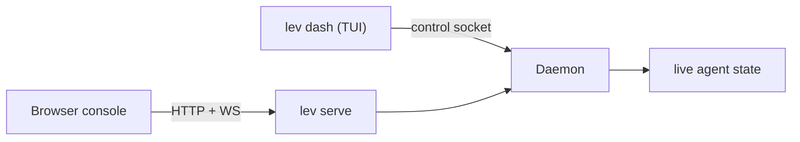

# Dashboard (`lev dash`)

`lev dash` is a full-screen TUI for managing concurrent agents. It's the fastest way to watch a fleet
of runs, answer their questions, and steer them.

```bash
lev dash
```

It reads the same [daemon](/docs/daemon) the browser [console](/app) does, just over the local
control socket instead of HTTP:



## What's on screen

- **Agent table**: blueprint/title, stage index, status, tokens in/out, context-window occupancy,
  iteration, elapsed time, model, and sub-agent depth. Titles are auto-generated per run.
- **Detail view**: per-stage tabs or a graph view of the workflow, a context-window visualization,
  and content panes for **Output**, **Logs**, and **Context** (JSON). Markdown is rendered.
- **Interactions**: answer an agent's question (free-text, edit, multiple-choice, tool-approval, or
  confirm) or send it a mid-run message.
- **Mouse support**: wheel scroll, click-drag select with copy-on-release, OSC52 copy over SSH,
  `y` to yank a pane, Shift+drag for native selection.
- **`m`** opens the MCP management screen without leaving the dashboard.

## Keys

The dashboard has two screens, and most keys only work on one of them. Press `?` on either for the
same list in the app.

### Main list

| Key | Action |
|---|---|
| `↑` / `↓` (or `k` / `j`) | Select a run |
| `Home` / `End` (or `g` / `G`) | Jump to the first / last run |
| `Enter` | Open detail view |
| `Tab` | Focus the log panel. Arrows scroll it, `End` resumes tailing, `Esc` comes back |
| `/` | Filter runs by name or status |
| `s` | Cycle the sort: start time (default), recent activity, or status groups |
| `x` | Kill the selected run. Asks first |
| `d` | Delete the run. Permanent, and asks first |
| `p` / `r` | Pause / resume the selected run |
| `m` | Manage MCP servers |
| `Esc` | Clear the filter |
| `q` / `Ctrl-C` | Quit |

By default runs are listed newest first and keep their row for their whole life, so nothing jumps
around when a run finishes. The sort indicator sits in the table's top-right corner.

### Detail view

| Key | Action |
|---|---|
| `←` / `→` | Switch stage tab |
| `1`–`9` | Jump to that stage tab |
| `↑` / `↓` (or `k` / `j`) | Scroll the pane |
| `Home` / `End` (or `b` / `e`) | Jump to the beginning / end |
| `l` / `o` / `c` | Switch the pane to Logs / Output / Context |
| `,` / `.` | Step back and forward through context history |
| `/` , then `n` / `N` | Search, then next / previous match |
| `y` | Copy the pane to the clipboard |
| `i` | Respond to or message the agent |
| `x` | Kill the run. Asks first |
| `p` / `r` | Pause / resume the run |
| `Esc` | Clear the search, or go back to the list |

While you are typing a response, `Enter` sends it, `Alt+Enter` inserts a newline, and `Esc` cancels.

Destructive keys always confirm on a dialog with real buttons: `←`/`→` pick an answer, `Enter`
activates it, and a stray keypress does nothing. The safe answer holds focus to start.

> [!TIP]
> Prefer a browser, or want to drive Leviath from another machine? The [agent console](/app)
> mirrors the dashboard over the [HTTP API](/docs/api).
