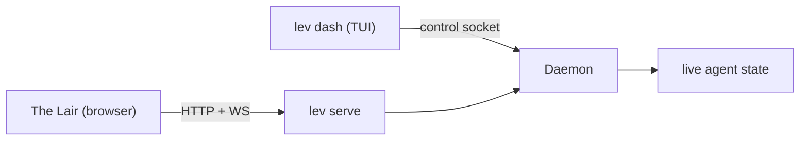

# Dashboard (`lev dash`)

`lev dash` is a full-screen TUI for managing concurrent agents. It's the fastest way to watch a fleet
of runs, answer their questions, and steer them.

```bash
lev dash
```

It reads the same [daemon](/docs/daemon) that [The Lair](https://leviath.dev/lair) does, just over
the local control socket instead of HTTP:



## Answer a waiting run

The most common reason to open the dashboard: a run stopped to ask you something. Select the run
with the arrow keys, press `Enter` for its detail view, then press `i` to open the interaction
panel and answer. `lev respond` does the same from the shell.

## What's on screen

- **Run table**: title and run id, blueprint, stage, status, tokens, and start time, with
  sub-agents nested under their parent. Titles are auto-generated per run. The model, iteration,
  and context-window occupancy live in the detail view.
- **Detail view**: per-stage tabs or a graph view of the workflow, a context-window visualization,
  and content panes for **Output**, **Logs**, and **Context** (JSON). Markdown is rendered.
- **Interactions**: answer an agent's question (free-text, edit, multiple-choice, tool-approval, or
  confirm) or send it a mid-run message.
- **Mouse support**: wheel scroll, click-drag select with copy-on-release, OSC52 copy over SSH,
  `y` to yank a pane, Shift+drag for native selection.
- **`m`** opens the MCP management screen without leaving the dashboard.

## Keys

Most keys work on one screen only. Press `?` for the list that applies to where you are, or `F1`
where `?` would be typed as text: on the new-run screen every printable character goes into the
filter or the task.

Besides the main list and the detail view below, there is a screen for starting a run (`n`), one for
MCP servers (`m`), and a stage explorer for branching agents (`g`, from the detail view).

### Main list

| Key | Action |
|---|---|
| `↑` / `↓` (or `k` / `j`) | Select a run |
| `Home` / `End` (or `g` / `G`) | Jump to the first / last run |
| `Enter` | Open detail view |
| `n` | Start a run: pick an agent, write the task, press Enter |
| `Tab` | Focus the log panel. Arrows scroll it, `End` resumes tailing, `Esc` comes back |
| `/` | Filter runs by name or status |
| `s` | Cycle the sort: start time (default), recent activity, or status groups |
| `x` | Kill the selected run. Asks first |
| `d` | Delete the run. Permanent, and asks first |
| `Space` | Mark or unmark the selected run, then move down a row |
| `p` / `r` | Pause / resume the selected run |
| `m` | Manage MCP servers |
| `Esc` | Clear the filter, or clear the marks once no filter is set |
| `q` / `Ctrl-C` | Quit |

By default runs are listed newest first and keep their row for their whole life, so nothing jumps
around when a run finishes. The sort indicator sits in the table's top-right corner.

Marking selects several runs at once: press `Space` on each run, then `x` or `d` acts on all of
them behind one confirmation. Marked rows show a check mark, the pane title counts them, and marks
follow the run rather than the row, so sorting or filtering never changes what is marked. A kill
skips marked runs that have already finished.

### Starting a run (`n`)

Agents on the left, the task on the right. Once it starts, the dashboard opens that run's page, and
`Esc` from there goes back to the list rather than back into the form.

| Key | Action |
|---|---|
| `↑` / `↓` | Choose an agent. Any letter filters the list; `Backspace` shortens the filter |
| `Tab` / `Enter` | Move from the agent list to the task |
| `Enter` (in the task) | Start the run |
| `Alt+Enter` | Newline, rather than starting the run |
| `@` | Reference a file from the working directory, with completion |
| `Ctrl-Y` | Run unattended, so the agent approves its own tool calls |
| `F1` | Help. `?` types a question mark here |
| `Esc` | Clear the filter, then close the screen |

`Ctrl-Y` warns the first time you use it in a sitting, and the warning is worth reading: an
unattended run approves its own file edits and shell commands, but it does **not** skip a checkpoint
the blueprint asks a person for. Those still stop, and one nobody answers ends the run when the
interaction timeout expires. The setting is off again every time the screen opens.

### Detail view

| Key | Action |
|---|---|
| `←` / `→` | Switch stage tab |
| `1`–`9` | Jump to that stage tab |
| `↑` / `↓` (or `k` / `j`) | Scroll the pane; in the Context view, move the tree cursor |
| `Home` / `End` (or `b` / `e`) | Jump to the beginning / end |
| `l` / `o` / `c` | Switch the pane to Logs / Output / Context |
| `g` | Open the stage explorer (graph agents) |
| `Enter` / Space | Fold or unfold the row under the Context tree's cursor |
| `[` / `]` | Jump to the previous / next region in the Context view |
| `,` / `.` | Step back and forward through context history |
| `/` , then `n` / `N` | Search, then next / previous match |
| `y` | Copy the pane to the clipboard |
| `i` | Respond to or message the agent |
| `x` | Kill the run. Asks first |
| `p` / `r` | Pause / resume the run |
| `Esc` | Clear the search, or go back to the list |

While you are typing a response, `Enter` sends it, `Alt+Enter` inserts a newline, and `Esc` cancels.

Destructive keys always confirm on a dialog with real buttons: `←`/`→` pick an answer, `Enter`
activates it, and a stray keypress does nothing. The safe answer holds focus to start.

### Context view

The Context view is a tree, not one long scroll. Each region is a header row with its token bar;
its entries are one-line stubs with a preview. Move with `↑`/`↓`, fold or unfold with `Enter` or
Space, and jump between regions with `[` and `]`. While a search (`/`) is active everything is
temporarily unfolded so matches inside entries stay reachable. Browsing history with `,`/`.` keeps
your scroll position and fold state, and the context card's title shows which archived point you
are on, in which stage, recorded when.

### Stage explorer

For a graph agent, `g` in the detail view opens the full-screen stage explorer:

- **Graph** lays the stages out on layers (parallel branches share a row), with every transition
  listed under its source stage. Revisit loops are marked with `↺` and drawn dashed. Visited stages
  show a visit count (`×2`) and the time of their last visit; unvisited ones are dimmed, and `u`
  hides them.
- **Timeline** lists each actual visit in order, with when it started, how long it lasted, and how
  many iterations it ran. `Enter` on a visit opens the context window exactly as it was at that
  point.

`Tab` switches between the two, and `Esc` or `g` closes the explorer.

> [!TIP]
> Prefer a browser, or want to drive Leviath from another machine?
> [The Lair](https://leviath.dev/lair) mirrors the dashboard over the [HTTP API](/docs/api).
