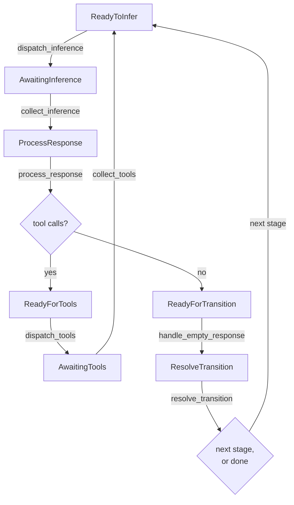

# The ECS agent engine

Most of the agents you run are waiting. Waiting on a model to reply, on a tool to finish, on a
person to answer a question. If every waiting agent costs you an operating system process, then a
hundred agents cost a hundred processes whether or not any of them are doing anything.

Leviath keeps each agent as a row of data in one shared table. A waiting agent is a row nothing
touched this pass, which costs close to nothing, so the machine only pays for work that is actually
in flight.

## Entities, components, and systems

Leviath is built on [bevy_ecs](https://bevyengine.org/), a library for organising data the way game
engines do: an Entity Component System. An ECS turns an agent inside out. Instead of one object
with its own methods and its own task, parked on an `await`, there are three separate things:

- An **entity** is just an id. No data, no methods. Think of it as a row number.
- A **component** is a plain struct attached to an entity. `AgentState` is a component,
  `ContextWindow` is a component. An entity is nothing more than the components it carries.
- A **system** is an ordinary function that runs over every entity carrying some particular set of
  components. It asks for what it needs and changes it in place.

So there is no agent object that knows how to run itself. There is agent-shaped **data**, and a
fixed list of functions that sweep across all of it. Nothing sits on an `await`, because nothing
owns a call stack. A blocked agent is just a row that this pass skipped.

That trade is aimed at running many agents at once:

- **A blocked agent costs one row.** Concurrency is paid for only where real work happens: one
  async task per in-flight request, never one per agent.
- **[Sub-agents and fan-out](/docs/sub-agents)** are more entities in the same world. No new
  processes, nothing serialized between a parent and its children.
- **Rate limits, retries, and provider clients are shared** instead of duplicated per process.
- **One place holds all the state**, so the [dashboard](/docs/dashboard) and [API](/docs/api) read
  every agent without talking to hundreds of separate processes.

The cost is the process boundary. Agents keep their own state, workdir, and tool policy, and
[a panic in one stays in one](#one-agents-failure-stays-one-agents-failure). But they share the
daemon's memory and its fate, which is a weaker guarantee than a process per agent. For a hard OS
boundary around what an agent can run, add a [sandbox](/docs/security).

## An agent is an entity

When the daemon spawns an agent, this is all that happens:

```rust
world.spawn((
    AgentBlueprint(blueprint),   // the whole stage graph, as data
    AgentState { .. },           // agent id, current stage, iteration, status
    MessageInbox::default(),     // mid-run messages not yet delivered
    StageCursor { index: 0 },    // which stage we are in
    StageProgress::default(),    // per-stage counters (tool calls, edits, timings)
    StageInferences(..),         // pre-resolved model + tools, one per stage
    StageSetups(..),             // pre-resolved layout + prompt, one per stage
    visits,                      // times each stage has been entered
    window,                      // the ContextWindow: regions and their budgets
    stage0_inf,                  // this stage's model and tool set
    stage0_cfg,                  // this stage's temperature, token caps, timeouts
    ReadyToInfer,                // a marker, explained below
));
```

Every line is a component, and most come straight from the [blueprint](/docs/agents):

| Component | Filled from |
|---|---|
| `AgentBlueprint` | the entire `agent.leviath` file |
| `ContextWindow` | `[context.regions]`, with percentage budgets resolved against the model's window |
| `StageInferences` | each `[stages.<name>.model]` and its `available_tools` |
| `StageSetups` | each stage's `system_prompt`, context layout, and tool routing |
| `StageProgress` | nothing, these are the runtime's own counters |

The per-stage arrays are worked out once, at spawn. A stage is not an entity of its own: it is
`StageCursor.index`, a position in the blueprint the agent already carries. A transition moves that
integer, resets `StageProgress`, and swaps in the next stage's pre-resolved model, tools, and
layout. It tears nothing down, which is why a workflow graph is cheap to run.

## Markers are the state machine

An agent has no field saying what phase it is in. Instead it carries one of twelve **marker**
components, and each system asks for the marker it acts on.

| Marker | What it means | Picked up by |
|---|---|---|
| `ReadyToInfer` | Ready to build a request and call the model | `dispatch_inference` |
| `AwaitingInference` | The call is in flight | `collect_inference` |
| `ProcessResponse` | The reply landed and has not been read yet | `process_response` |
| `ReadyForTools` | The reply asked for tools | `dispatch_tools` |
| `AwaitingTools` | The tool batch is running | `collect_tools` |
| `ReadyForTransition` | The reply asked for no tools, so the stage may be done | `handle_empty_response` |
| `ResolveTransition` | The stage is done, work out what comes next | `resolve_transition` |
| `AwaitingTransitionChoice` | Several edges are possible, the model has to pick | the transition-choice system |
| `AwaitingTransitionResponse` | That pick is in flight | the transition-collect system |
| `AwaitingCompaction` | The context is being summarized; the agent holds until it lands | the compaction system |
| `PendingTitle` | This run wants a generated title | `dispatch_title` |
| `AwaitingTitle` | The title call is in flight. Titling runs alongside the first turn | the title-collect system |

Moving an agent forward means removing one marker and adding another. `dispatch_inference` asks for
entities `With<ReadyToInfer>`, so an agent without that marker is simply not in the results. The
same trick makes control operations nearly free: pausing a run sets `AgentStatus::Paused`, and
every dispatch system already ignores agents that are not `Active`.

## The path one agent takes

From a fresh stage to the next one:



1. **`dispatch_inference`** builds the request from the agent's context regions and tries to take a
   slot from the model's [pool](#inference-pools). No free slot means no action, and the agent stays
   `ReadyToInfer` for a later pass.
2. **`collect_inference`** picks up whatever came back and moves the agent to `ProcessResponse`.
3. **`process_response`** reads the reply. Tool calls go down the tool path; plain text goes toward
   a transition.
4. **`dispatch_tools`** enforces the stage's `available_tools` (a tool the stage never advertised is
   refused, not merely hidden), runs the taint and permission checks, applies `context_*` tools
   immediately, and sends everything else to the tool lane.
5. **`collect_tools`** merges the results back into the order the model asked for them, files each
   into a context region per the stage's tool routing, and returns the agent to `ReadyToInfer`.
6. **`resolve_transition`** ends the stage with one of six answers: `Terminal` (done),
   `TerminalError` (failed with no `error` edge to catch it), `Next` (take this edge), `Choose`
   (ask the model which edge), `Resume` (a `stuck` interrupt fired with no `stuck` edge, so keep
   going), or `DeadEnd` (every outgoing edge is exhausted, which routes down the `error` edge or
   fails the run rather than faking a completion).

Those are six of roughly forty-five systems. The rest handle compaction, stuck detection,
iteration caps, interaction points, fan-out, telemetry, and persistence, all in a fixed order every
pass. See [Multi-stage workflows](/docs/stages) for the transition conditions and
[Structured context](/docs/context) for the regions.

## What a tick is

A **tick** is one pass of that whole system list over every agent in the world. The systems run
one after another in a fixed order, so no two ever overlap, and no system ever awaits. A dispatch
system starts async work and swaps in an `Awaiting*` marker; a collect system on a later tick
picks the result up. That one rule is what makes "hundreds of agents in one process" true, and it
gives you backpressure for free: a full pool just means an agent stays `ReadyToInfer` until a later
tick finds it a slot.

At the end of a tick, Leviath counts how many agents carry each of the twelve markers. Those
counts are the world's **fingerprint**. The loop does not do its work on a clock. It ticks for as
long as the fingerprint keeps changing, and when a whole tick changes nothing it sleeps (one slow
30-second timer stays armed as a safety net, re-driving anything a lost wakeup would strand):

```rust
loop {
    self.run_to_fixed_point();
    tokio::select! {
        _ = self.wake.notified() => {}
        _ = self.shutdown.notified() => return,
    }
}
```

Anything that could give the world work wakes it: a model reply, a tool finishing, a `lev msg`, a
new run, a control command. An idle world costs almost no CPU, no matter how many blocked or
paused agents it holds.

## Inference pools

The world holds one pool per model that caps how many requests can be in flight at once. An agent
takes a slot before calling the provider and holds it for the whole request. The default cap is
`[limits] max_concurrent_inferences` in the [config](/docs/configuration); per-model limits
override it.

Waiting for a slot is ordinary backpressure and is never treated as a failure, however long it
lasts. Waiting for a provider that was never configured is different: that agent has nothing to
wait for, so it fails after `[limits] stall_timeout_secs` (60 seconds by default; `0` waits
forever).

This knob gets confused with two others. Fan-out's `max_workers` bounds how many *sub-agents* a
stage spawns. `[rate_limits.<provider>]` shapes how fast requests are sent. The pool bounds how
many run at once. All three apply independently.

## The tool lane

Tools have a pool of their own: `[limits] max_concurrent_tools` (8 by default) caps how many
agents' tool batches run at once across the whole daemon.

The interesting part is waiting. Some things a batch can wait for have no time limit at all: a
tool-approval prompt, an `ask_user`, a `wait_for_agent` that only ends when another run finishes.
A batch waiting on one of those gives its capacity back, and takes a fresh unit when it has
something to do again. Without that, a parent waiting on a child it spawned would hold the exact
capacity the child needs, and enough parents doing it at once has frozen whole fleets. `lev ps`
lists waiting batches separately from running ones for the same reason. Waiting is fine. Queued
with nothing draining is not.

As a backstop for jams nobody has diagnosed yet, the daemon counts 30-second cycles where the lane
is full and no run moves. Past `[limits] dead_cycles_before_relief` (10, so five minutes) it
widens the lane so the queue can drain. It only adds capacity, never cancels anything, and stops
after one extra lane's worth. Set the key to `0` to turn relief off. The count is reported either
way, in `lev ps` and as `leviath.scheduler.dead_cycles.total`.

## One world, one daemon

There is exactly one world per daemon process, and every run lives in it: top-level agents,
spawned sub-agents, and fan-out workers alike. A sub-agent is an ordinary entity that also carries
a `ParentRef`.

Entity ids never leave the world. Everything outside refers to runs by **run id**, and the daemon
keeps the mapping. That is the line between the engine and
[the daemon's control surface](/docs/daemon): the CLI, the [API](/docs/api), and the
[dashboard](/docs/dashboard) all speak run ids.

## One agent's failure stays one agent's failure

Every system runs on the driver thread, so when one panics, the driver catches it and works out
which agent was being touched. That agent is marked `AgentStatus::Error` with an internal-error
message, and the tick loop carries on. A cap bounds how many such failures one round will absorb,
so a thoroughly broken world stops rather than spins.

This is the main thing Leviath does to make up for not having a process boundary per agent. It
handles a panic in a system. It cannot help with something that corrupts the whole process, which
is the guarantee separate processes would give you and this design does not.

> [!NOTE]
> The engine is not something you usually configure. You describe *what* an agent does in its
> [blueprint](/docs/agents), and the engine works out how to run it. This page exists so that
> "hundreds of agents in one process" is not a black box.
