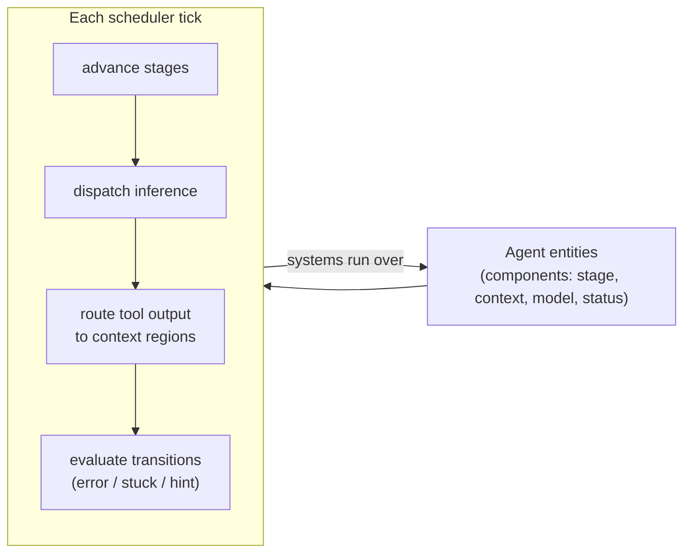

# The ECS agent engine

Leviath runs agents as **entities in a [bevy_ecs](https://bevyengine.org/) world**. Dozens of
agents share one process with game-engine-style scheduling, instead of one OS process each.

## Why an ECS?

Orchestration tools that spawn a separate process per agent carry the full weight of a Node or Go
runtime per agent, and each manages its own flat context window. Leviath's engine runs them all
over one shared, lock-free inference driver, so spinning up ten agents doesn't mean ten times the
device RAM.

Each agent is an **entity**; its stage, context regions, model selection, and status are
**components**; and the runtime's **systems** advance every agent a step per tick. Because there's
one world, cross-cutting features come for free:

- **[Sub-agents and fan-out](/docs/sub-agents)** are just more entities in the same world — no new
  processes, no IPC.
- **Shared inference** means rate limits, retries, and provider clients are pooled across all
  agents rather than duplicated per process.
- **One context store** lets the [dashboard](/docs/dashboard) and [API](/docs/api) read every
  agent's state without touching a dozen separate processes.

> [!NOTE]
> The engine is an implementation detail you rarely configure directly — you describe *what* an
> agent does in its [blueprint](/docs/agents), and the engine schedules it. This page is here so
> the "dozens of agents, one process" claim isn't a black box.
