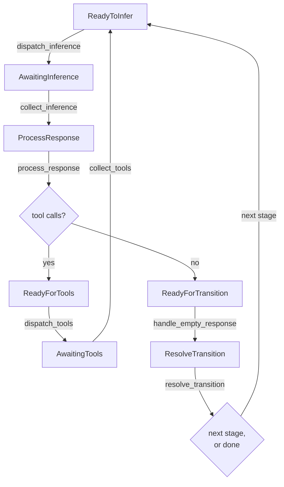

# The ECS agent engine

Leviath runs agents as **entities in a [bevy_ecs](https://bevyengine.org/) world**. Hundreds of
agents share one process with game-engine-style scheduling, instead of one OS process each.

This page explains what that means from scratch, then shows the actual world Leviath builds: the
real components an agent carries, the systems that move it, and the loop that ties them together.

## ECS in ninety seconds

If you have not met an Entity Component System before, the short version is that it inverts how you
would normally model an agent.

The model you probably expect looks like this:

```rust
struct Agent { stage: Stage, context: Context, status: Status }

impl Agent {
    async fn run(&mut self) { /* loop: infer, call tools, advance */ }
}
```

One object, its own methods, its own task or thread. Ten thousand agents means ten thousand of
those, each parked on an `await` most of the time.

An ECS splits that object into three separate things:

- An **entity** is just an id. It holds no data and has no methods. Think of it as a row number.
- A **component** is a plain data struct attached to an entity. `AgentState` is a component,
  `ContextWindow` is a component. An entity is nothing more than whichever components it currently
  carries.
- A **system** is a free function that runs over every entity carrying a particular set of
  components. It queries for what it needs and mutates it in place.

So instead of an agent object that knows how to run itself, you get agent-shaped **data**, and a
fixed list of functions that sweep across all of it. Nothing is parked on an `await`, because
nothing owns a call stack. An agent that is blocked is a row that this tick's systems skipped.

Leviath uses `bevy_ecs` 0.19 directly, with no framework layer on top: one `World`, one `Schedule`,
and a driver loop of its own.

## Why an agent runtime wants this

Tools that spawn a process per agent pay for a whole language runtime per agent, and each one
manages its own flat context window. Threads-per-agent has the same shape of problem in miniature:
the cost tracks how many agents exist rather than how much work is actually in flight.

In Leviath, a blocked agent costs one row in a table. Concurrency costs are paid only where real
work happens: one async task exists per **in-flight request**, never one per agent. Ten agents
waiting on a full inference pool are ten rows that this tick's dispatch system declined to touch.

Because everything lives in one world, several features stop being features and become consequences:

- **[Sub-agents and fan-out](/docs/sub-agents)** are just more entities in the same world. No new
  processes, no IPC, no serialization between a parent and its children.
- **Shared inference** means rate limits, retries, and provider clients are pooled across every
  agent rather than duplicated per process.
- **One context store** lets the [dashboard](/docs/dashboard) and [API](/docs/api) read every
  agent's state without talking to hundreds of separate processes.

## An agent is an entity

When the daemon spawns an agent, this is literally all that happens:

```rust
world.spawn((
    AgentBlueprint(blueprint),   // the whole stage graph, as data
    AgentState { .. },           // agent id, current stage, iteration, status
    MessageInbox::default(),     // mid-run messages not yet delivered
    StageCursor { index: 0 },    // which stage we are in
    StageProgress::default(),    // per-stage counters (tool calls, edits, timings)
    StageInferences(..),         // pre-resolved model + tools, one per stage
    StageSetups(..),             // pre-resolved layout + prompt, one per stage
    visits,                      // times each stage has been entered
    window,                      // the ContextWindow: regions and their budgets
    stage0_inf,                  // this stage's model and tool set
    stage0_cfg,                  // this stage's temperature, token caps, timeouts
    ReadyToInfer,                // a phase marker, see below
));
```

There is no agent object and no agent task. Every one of those is a component, and most map
directly onto something you wrote in the [blueprint](/docs/agents):

| Component | Filled from |
|---|---|
| `AgentBlueprint` | the entire `agent.leviath` file |
| `ContextWindow` | `[context.regions]`, with percentage budgets resolved against the model's window |
| `StageInferences` | each `[stages.<name>.model]` and its `available_tools` |
| `StageSetups` | each stage's `system_prompt`, context layout, and tool routing |
| `StageProgress` | nothing; the runtime's own counters, which is how `stuck` stays measured |

Note that the per-stage arrays are resolved **once, at spawn**. Entering a new stage is a component
swap, not a re-parse.

## Markers are the state machine

This is the part that surprises people, and it is worth stating plainly: **an agent has no field
saying what phase it is in.** Instead it carries one of twelve marker components, and each system
queries for the marker it acts on.

```
ReadyToInfer          AwaitingInference          ProcessResponse
ReadyForTools         AwaitingTools              ReadyForTransition
ResolveTransition     AwaitingTransitionChoice   AwaitingTransitionResponse
AwaitingCompaction    PendingTitle               AwaitingTitle
```

Moving an agent forward means removing one marker and inserting another. `dispatch_inference`
queries for entities `With<ReadyToInfer>`, and an agent that does not carry that marker is simply
not in the result set. There is no dispatch, no branch, and no check to skip.

The same trick makes control operations nearly free. Pausing a run sets `AgentStatus::Paused`, and
every dispatch system already skips agents that are not `Active`. A paused agent is data that
nothing picks up.

> [!NOTE]
> Counting how many agents carry each of those twelve markers gives the world its **fingerprint**.
> Two consecutive ticks with the same fingerprint mean nothing changed, which is how the driver
> knows it can stop and sleep.

## The pipeline for one agent

Here is the journey a single agent makes, from a fresh stage to the next one:



Walking that in words:

1. **`dispatch_inference`** assembles the request from the agent's context regions, tries to take a
   permit from the per-model [inference pool](#inference-pools), and hands the call to a short-lived
   async task. It then swaps `ReadyToInfer` for `AwaitingInference`. If no permit is free it does
   nothing at all, and the agent stays `ReadyToInfer` for a later tick.
2. **`collect_inference`** picks up whatever landed and moves the agent to `ProcessResponse`.
3. **`process_response`** looks at the reply. Tool calls send it down the tool path; a plain text
   answer sends it toward a transition.
4. **`dispatch_tools`** enforces the stage's `available_tools` (a tool the stage never advertised is
   refused here, not just hidden), runs the taint and permission gates, and splits the batch.
   `context_*` tools are applied **inline**, because they mutate the agent's `ContextWindow`, which
   lives in the world. Everything else goes to the tool worker lane.
5. **`collect_tools`** merges the inline and lane results back into the model's original call order,
   then routes each result into a context region per the stage's tool routing. The agent goes back
   to `ReadyToInfer` for the next turn.
6. **`resolve_transition`** decides what happens at the end of a stage. It produces one of:
   `Terminal` (done), `TerminalError` (errored with no `error` edge to catch it), `Next` (take this
   edge), `Choose` (ask the model which edge to take), or `Resume` (a `stuck` interrupt fired
   mid-stage with no `stuck` edge, so keep going rather than end a stage the agent never finished).

Those are six of about thirty-five systems. The rest handle compaction, stuck detection, iteration
caps, interaction points, fan-out, telemetry, and persistence, and they run in a fixed order every
tick. See [Multi-stage workflows](/docs/stages) for what the transition conditions mean and
[Structured context](/docs/context) for what the regions do.

## What a tick is

A **tick** is one pass of that whole system list over every agent in the world. Systems run in a
fixed, chained order, so no two ever overlap.

The driver does not tick on a timer. It ticks until the fingerprint stops changing, which means the
world has reached a fixed point where no system can make further progress. Then it **parks** on a
wake signal:

```rust
loop {
    self.run_to_fixed_point();
    tokio::select! {
        _ = self.wake.notified() => {}
        _ = self.shutdown.notified() => return,
    }
}
```

An idle world costs essentially no CPU no matter how many blocked or paused agents it holds.
Anything that could change the world fires the wake: an inference completing, a tool returning, a
`lev msg`, a new spawn, a control operation.

## Systems never block

No system ever awaits. The pattern is always the same: a dispatch system starts async work and
swaps in an `Awaiting*` marker; a collect system on some later tick picks the result up. That single
rule is what makes the "hundreds of agents in one process" claim true, and it makes backpressure
free. When a pool is full, `dispatch_inference` just does not act on that agent. No thread is
parked, no request is queued at the provider, and nothing needs to be woken when a slot opens
because the next tick will simply find the agent still sitting in `ReadyToInfer`.

<a id="inference-pools"></a>

## Inference pools

"Shared inference" is concrete: the world holds a per-model pool that caps in-flight requests.
An agent acquires a permit before calling the provider and holds it for the whole request; agents
waiting for a permit just stay in their ready-to-infer state, which costs nothing. The default cap
comes from `[limits] max_concurrent_inferences` in the [config](/docs/configuration), and per-model
limits override it.

Waiting for a permit is ordinary backpressure and is never treated as a failure, however long it
lasts. Waiting for a provider that isn't configured is a different thing entirely: that agent has
nothing to wait for, so it is failed once its stall outlives `[limits] stall_timeout_secs`
(60 seconds by default; `0` waits indefinitely).

This is a different knob from the two it is often confused with: fan-out's `max_workers` bounds
how many *sub-agents* a stage spawns ([Sub-agents](/docs/sub-agents)), and
`[rate_limits.<provider>]` shapes *request rate* to a provider. The pool bounds concurrency; the
rate limiter bounds throughput; both apply.

<a id="the-tool-lane"></a>

## The tool lane

Tools have a pool of their own. `[limits] max_concurrent_tools` (8 by default) caps how many
agents' tool batches execute at once across the whole daemon, and a batch holds one unit of that
capacity for as long as it is running.

The interesting part is what happens when a batch is not running but waiting. Several things a
batch can wait for have no time bound at all: a tool-approval prompt, an `ask_user`, a
`wait_for_agent` that only ends when some other run finishes. A batch parked on one of those gives
its capacity back and takes a fresh unit when it has something to do again, so waiting costs the
lane nothing.

That is not a nicety. A parent waiting for a child it spawned would otherwise be holding the very
capacity the child needed in order to finish, and enough parents doing that froze whole factories
for hours with every run reading as healthy. `lev ps` shows parked batches separately from running
ones for the same reason: parked is fine, queued with nothing draining is not.

As a backstop for jams nobody has diagnosed yet, the daemon counts the 30-second cycles it spends
with a full tool lane and no run moving anywhere. Past `[limits] dead_cycles_before_relief` (10 by
default, so five minutes) it widens the lane so the queued batches get through. It only ever adds
capacity, never cancels anything, and it stops after granting one extra lane's worth: if that much
did not help, the problem is not capacity. Set the key to `0` to turn relief off; the count is
reported either way, in `lev ps` and as `leviath.scheduler.dead_cycles.total`.

## Stages are not entities

A stage is not a separate entity or object. It is `StageCursor.index`, an index into the blueprint
the agent is already carrying. Entering a stage sets the cursor, resets `StageProgress`, bumps the
visit count, and swaps in that stage's pre-resolved model, tool set, and context layout.

That is why a workflow graph is cheap to run: a transition moves an integer and exchanges a couple
of components. It does not tear down or rebuild anything.

## One world, one daemon

There is exactly one world per daemon process. Every run lives in it: top-level agents, explicitly
spawned sub-agents, and fan-out workers alike. A sub-agent is an ordinary entity that additionally
carries a `ParentRef`.

Entity ids never leave the world. They are generational indices that only mean something inside it,
so everything outside addresses runs by **run id** instead, and the daemon keeps the mapping. That
is the boundary between the engine and everything in [the daemon's control surface](/docs/daemon):
the CLI, the [API](/docs/api), and the [dashboard](/docs/dashboard) all speak run ids.

## One agent's failure stays one agent's failure

Because every system runs on the driver thread, the driver can catch a panic and attribute it to
the agent that was being touched when it happened. That agent is marked
`AgentStatus::Error` with an internal-error message, and the tick loop keeps going.

A bug hit by one agent does not take down the daemon or the other runs sharing it. There is a cap
on how many attributed failures one round absorbs, so a thoroughly broken world stops rather than
spins.

> [!NOTE]
> The engine is an implementation detail you rarely configure directly. You describe *what* an
> agent does in its [blueprint](/docs/agents), and the engine schedules it. This page is here so
> the "hundreds of agents, one process" claim isn't a black box.
