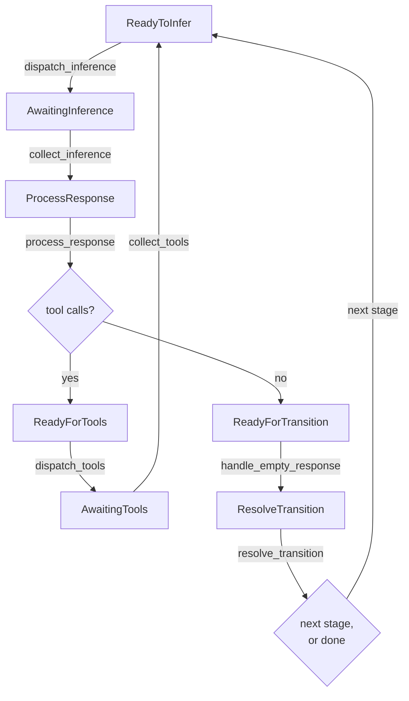

# The ECS agent engine

Most of the agents you run are waiting. Waiting on a model to reply, on a tool to finish, on a
person to answer a question. If every waiting agent costs you an operating system process, then a
hundred agents cost a hundred processes whether or not any of them are doing anything.

Leviath keeps each agent as a row of data in one shared table. A waiting agent is a row nothing
touched this pass, which costs close to nothing, so the machine only pays for work that is actually
in flight.

> [!NOTE]
> **Before this page:** nothing. It starts from scratch.
> **In one line:** agents are rows in a table, a fixed list of functions sweeps over the table, and
> the loop goes to sleep when a whole sweep changes nothing.

## Entities, components, and systems

Leviath is built on [bevy_ecs](https://bevyengine.org/), a library for organising data the way game
engines do. It is called an Entity Component System. If you have not met one before, it turns an
agent inside out compared to what you would probably write.

Here is the shape most people expect:

```rust
struct Agent { stage: Stage, context: Context, status: Status }

impl Agent {
    async fn run(&mut self) { /* loop: infer, call tools, advance */ }
}
```

One object with its own methods and its own task. Ten thousand agents means ten thousand of those,
nearly all of them parked on an `await`.

An ECS splits that object into three separate things:

- An **entity** is just an id. No data, no methods. Think of it as a row number.
- A **component** is a plain struct attached to an entity. `AgentState` is a component,
  `ContextWindow` is a component. An entity is nothing more than the components it currently
  carries.
- A **system** is an ordinary function that runs over every entity carrying some particular set of
  components. It asks for what it needs and changes it in place.

So there is no agent object that knows how to run itself. There is agent-shaped **data**, and a
fixed list of functions that sweep across all of it. Nothing sits on an `await`, because nothing
owns a call stack. A blocked agent is just a row that this pass skipped.

Leviath uses `bevy_ecs` directly, with no framework layer on top: one `World`, one `Schedule`, and
a loop of its own that drives them.

## What this buys, and what it costs

Giving each agent its own process is the obvious design, and it has real strengths. Every agent gets
hard isolation. A crash takes down one agent and touches nothing else. You can inspect or kill any
of them with ordinary operating system tools. Plenty of good tools are built this way, and for a
handful of long-lived agents it is a perfectly sound choice.

Leviath makes the opposite trade, because it is aimed at running many agents at once:

- **A blocked agent costs one row.** Concurrency is paid for only where real work happens: one async
  task per in-flight request, never one per agent. Ten agents waiting on a full model pool are ten
  rows this pass declined to touch.
- **[Sub-agents and fan-out](/docs/sub-agents)** are more entities in the same world. No new
  processes, no inter-process messaging, nothing serialized between a parent and its children.
- **Rate limits, retries, and provider clients are shared** across every agent instead of being
  duplicated per process.
- **One place holds all the state**, so the [dashboard](/docs/dashboard) and [API](/docs/api) can
  read every agent without talking to hundreds of separate processes.

What you give up is isolation. Agents share a process, so they share its memory and its fate if
something goes badly wrong. Leviath works hard to contain that, and
[the last section](#one-agents-failure-stays-one-agents-failure) covers how, but it is a weaker
guarantee than a separate process gives you. If you need a hard
boundary around what an agent can touch, put it in a [sandbox](/docs/security) rather than relying
on the engine.

## An agent is an entity

When the daemon spawns an agent, this is all that happens:

```rust
world.spawn((
    AgentBlueprint(blueprint),   // the whole stage graph, as data
    AgentState { .. },           // agent id, current stage, iteration, status
    MessageInbox::default(),     // mid-run messages not yet delivered
    StageCursor { index: 0 },    // which stage we are in
    StageProgress::default(),    // per-stage counters (tool calls, edits, timings)
    StageInferences(..),         // pre-resolved model + tools, one per stage
    StageSetups(..),             // pre-resolved layout + prompt, one per stage
    visits,                      // times each stage has been entered
    window,                      // the ContextWindow: regions and their budgets
    stage0_inf,                  // this stage's model and tool set
    stage0_cfg,                  // this stage's temperature, token caps, timeouts
    ReadyToInfer,                // a marker, explained below
));
```

There is no agent object and no agent task. Every line is a component, and most of them come
straight from what you wrote in the [blueprint](/docs/agents):

| Component | Filled from |
|---|---|
| `AgentBlueprint` | the entire `agent.leviath` file |
| `ContextWindow` | `[context.regions]`, with percentage budgets resolved against the model's window |
| `StageInferences` | each `[stages.<name>.model]` and its `available_tools` |
| `StageSetups` | each stage's `system_prompt`, context layout, and tool routing |
| `StageProgress` | nothing, these are the runtime's own counters |

Those per-stage arrays are worked out once, at spawn. Moving to a new stage swaps a component. It
does not re-read the file.

## Markers are the state machine

An agent has no field saying what phase it is in. Instead it carries one of twelve **marker**
components, and each system asks for the marker it acts on.

| Marker | What it means | Picked up by |
|---|---|---|
| `ReadyToInfer` | Ready to build a request and call the model | `dispatch_inference` |
| `AwaitingInference` | The call is in flight | `collect_inference` |
| `ProcessResponse` | The reply landed and has not been read yet | `process_response` |
| `ReadyForTools` | The reply asked for tools | `dispatch_tools` |
| `AwaitingTools` | The tool batch is running | `collect_tools` |
| `ReadyForTransition` | The reply asked for no tools, so the stage may be done | `handle_empty_response` |
| `ResolveTransition` | The stage is done, work out what comes next | `resolve_transition` |
| `AwaitingTransitionChoice` | Several edges are possible, the model has to pick | the transition-choice system |
| `AwaitingTransitionResponse` | That pick is in flight | the transition-collect system |
| `AwaitingCompaction` | The context is being summarized, and the agent is held out of inference until it lands | the compaction system |
| `PendingTitle` | This run wants a generated title | `dispatch_title` |
| `AwaitingTitle` | The title call is in flight. This one does not hold the agent back, titling runs alongside the first turn | the title-collect system |

Moving an agent forward means removing one marker and adding another. `dispatch_inference` asks for
entities `With<ReadyToInfer>`, so an agent without that marker is simply not in the results. There
is no branch and no check to skip it. It was never in the list.

The same trick makes control operations nearly free. Pausing a run sets `AgentStatus::Paused`, and
every dispatch system already ignores agents that are not `Active`. A paused agent is data that
nothing picks up.

## The path one agent takes

From a fresh stage to the next one:



In words:

1. **`dispatch_inference`** builds the request from the agent's context regions and tries to take a
   slot from the model's [pool](#inference-pools). If it gets one, it hands the call to a short-lived
   async task and swaps `ReadyToInfer` for `AwaitingInference`. If no slot is free it does nothing,
   and the agent stays `ReadyToInfer` for a later pass.
2. **`collect_inference`** picks up whatever came back and moves the agent to `ProcessResponse`.
3. **`process_response`** reads the reply. Tool calls send it down the tool path. Plain text sends
   it toward a transition.
4. **`dispatch_tools`** enforces the stage's `available_tools`. A tool the stage never advertised is
   refused here, not merely hidden. It then runs the taint and permission checks and splits the
   batch. `context_*` tools are applied immediately, because they change the agent's
   `ContextWindow`, which lives right here in the world. Everything else goes to the tool lane.
5. **`collect_tools`** merges those two sets of results back into the order the model asked for
   them, then files each result into a context region according to the stage's tool routing. The
   agent goes back to `ReadyToInfer` for its next turn.
6. **`resolve_transition`** decides what happens at the end of a stage. It produces one of five
   answers: `Terminal` (done), `TerminalError` (failed, with no `error` edge to catch it), `Next`
   (take this edge), `Choose` (ask the model which edge to take), or `Resume` (a `stuck` interrupt
   fired mid-stage with no `stuck` edge, so keep going rather than end a stage the agent never
   finished).

Those are six of roughly thirty-five systems. The rest handle compaction, stuck detection, iteration
caps, interaction points, fan-out, telemetry, and persistence. They all run in a fixed order every
pass. See [Multi-stage workflows](/docs/stages) for what the transition conditions mean, and
[Structured context](/docs/context) for what the regions do.

## What a tick is

A **tick** is one pass of that whole system list over every agent in the world. The systems run one
after another in a fixed order, so no two ever overlap.

At the end of a tick, Leviath counts how many agents are carrying each of the twelve markers. Those
counts together are the world's **fingerprint**. If a tick ends with the same fingerprint it started
with, then nothing moved anywhere.

That is what the loop runs on. It does not tick on a clock. It ticks over and over for as long as
the fingerprint keeps changing. When a whole tick changes nothing, there is no work left to do, so
the loop stops and sleeps:

```rust
loop {
    self.run_to_fixed_point();
    tokio::select! {
        _ = self.wake.notified() => {}
        _ = self.shutdown.notified() => return,
    }
}
```

Anything that could give the world something to do wakes it up again: a model reply arriving, a tool
finishing, a `lev msg`, a new run starting, a control command. An idle world costs almost no CPU, no
matter how many blocked or paused agents it is holding.

## Systems never wait

No system ever awaits. The pattern is always the same. A dispatch system starts some async work and
swaps in an `Awaiting*` marker. A collect system on some later tick picks the result up.

That one rule is what makes "hundreds of agents in one process" true, and it gives you backpressure
for free. When a pool is full, `dispatch_inference` simply does not act on that agent. No thread is
blocked, no request piles up at the provider, and nothing needs waking when a slot frees up, because
the next tick finds the agent still sitting in `ReadyToInfer`.

## Inference pools

Sharing a model connection is concrete: the world holds one pool per model that caps how many
requests can be in flight at once. An agent takes a slot before calling the provider and holds it
for the whole request. Agents waiting for a slot stay in `ReadyToInfer`, which costs nothing.

The default cap comes from `[limits] max_concurrent_inferences` in the
[config](/docs/configuration), and per-model limits override it.

Waiting for a slot is ordinary backpressure. It is never treated as a failure, however long it
lasts. Waiting for a provider that was never configured is a different thing: that agent has nothing
to wait for, so it is failed once it has been stalled longer than `[limits] stall_timeout_secs`
(60 seconds by default, and `0` waits forever).

This knob gets confused with two others. Fan-out's `max_workers` bounds how many *sub-agents* a
stage spawns, covered in [Sub-agents](/docs/sub-agents). `[rate_limits.<provider>]` shapes how fast
you send *requests* to a provider. The pool bounds how many run at once. All three apply
independently.

## The tool lane

Tools have a pool of their own. `[limits] max_concurrent_tools` (8 by default) caps how many agents'
tool batches run at once across the whole daemon, and a batch holds one unit of that capacity for as
long as it is running.

The interesting part is what happens when a batch is not running but waiting. Some of the things a
batch can wait for have no time limit at all: a tool-approval prompt, an `ask_user`, or a
`wait_for_agent` that only ends when some other run finishes. A batch waiting on one of those gives
its capacity back, and takes a fresh unit when it has something to do again. Waiting costs the lane
nothing.

That matters more than it sounds. A parent waiting on a child it spawned would otherwise be holding
the exact capacity the child needs in order to finish. Enough parents doing that at once froze
entire fleets of agents for hours, with every individual run still reporting as healthy. `lev ps`
lists waiting batches separately from running ones for the same reason. Waiting is fine. Queued with
nothing draining is not.

As a backstop for jams nobody has diagnosed yet, the daemon counts 30-second cycles where the tool
lane is full and no run moves anywhere. Past `[limits] dead_cycles_before_relief` (10 by default, so
five minutes) it widens the lane so the queue can drain. It only ever adds capacity and never
cancels anything, and it stops after granting one extra lane's worth. If that much did not help,
the problem is not capacity. Set the key to `0` to turn relief off. The count is reported either
way, in `lev ps` and as `leviath.scheduler.dead_cycles.total`.

## Stages are not entities

A stage is not a separate entity or object. It is `StageCursor.index`, a position in the blueprint
the agent is already carrying. Entering a stage sets that index, resets `StageProgress`, bumps the
visit count, and swaps in the stage's pre-resolved model, tool set, and context layout.

That is why a workflow graph is cheap to run. A transition moves an integer and exchanges a couple
of components. It does not tear anything down or build anything back up.

## One world, one daemon

There is exactly one world per daemon process, and every run lives in it: top-level agents,
explicitly spawned sub-agents, and fan-out workers alike. A sub-agent is an ordinary entity that
also carries a `ParentRef`.

Entity ids never leave the world. They only mean anything inside it, so everything outside refers to
runs by **run id** instead, and the daemon keeps the mapping between the two. That is the line
between the engine and [the daemon's control surface](/docs/daemon). The CLI, the [API](/docs/api),
and the [dashboard](/docs/dashboard) all speak run ids.

## One agent's failure stays one agent's failure

Every system runs on the driver thread, so when one panics, the driver can catch it and work out
which agent was being touched at the time. That agent is marked `AgentStatus::Error` with an
internal-error message, and the tick loop carries on.

So a bug hit by one agent does not take down the daemon or the other runs sharing it. There is a cap
on how many such failures one round will absorb, so a thoroughly broken world stops rather than
spins.

This is the main thing Leviath does to make up for not having a process boundary per agent. It
handles a panic in a system. It cannot help with something that corrupts the whole process, which is
the guarantee you would get from separate processes and do not get here.

> [!NOTE]
> The engine is not something you usually configure. You describe *what* an agent does in its
> [blueprint](/docs/agents), and the engine works out how to run it. This page exists so that
> "hundreds of agents in one process" is not a black box.
