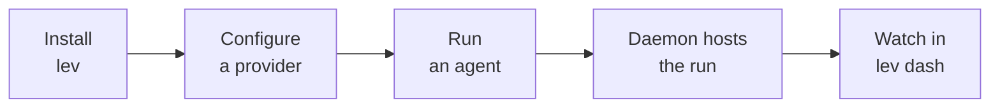
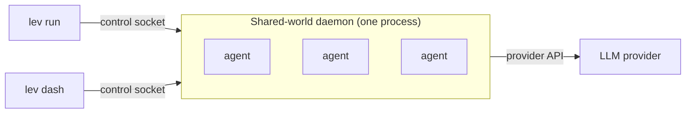

# Getting Started

Leviath is a structured agent runtime for LLMs. It gives an agent **structure**: context
that stays coherent across hundreds of tool calls, the right model for each phase of a task,
and hundreds of agents running at once in a single process.

You'll go from nothing to a running agent in four steps:



## Install

**macOS (Homebrew, recommended)**

```bash
brew tap gemisis/leviath https://github.com/GEMISIS/leviath-dist.git
brew trust gemisis/leviath # Homebrew 6 requires trusting third-party taps
brew install leviath            # or: leviath-beta, leviath-alpha
```

**Linux**

```bash
curl -fsSL https://raw.githubusercontent.com/GEMISIS/leviath-dist/main/install.sh \
  | bash -s -- --channel stable
```

**Windows (PowerShell)**

```powershell
irm https://raw.githubusercontent.com/GEMISIS/leviath-dist/main/install.ps1 | iex
```

The three options above install prebuilt binaries; no Rust toolchain needed.

**Cargo** (any platform, needs [Rust](https://rustup.rs/)):

```bash
cargo install leviath-cli                # released version from crates.io
cargo install --git https://github.com/GEMISIS/leviath.git --bin lev   # latest development build
```

To embed the runtime in your own application instead, add the [`leviath`](https://crates.io/crates/leviath) crate as a dependency.

## Configure a provider

One provider is all you need: an API key from Anthropic, OpenAI, Google AI, or OpenRouter,
or a local [Ollama](https://ollama.com) with no key at all.

```bash
lev setup                                            # interactive wizard
lev setup --non-interactive --anthropic-key sk-ant-… # scriptable
```

> [!TIP]
> No API key handy? Point Leviath at a local [Ollama](https://ollama.com) install and run
> entirely offline. `lev setup` will detect it. See [Providers](/docs/providers) for the full list.

## Run an agent

Pick one of the ten [pre-built agents](/docs/agents) and give it a task:

```bash
lev run coder --task "Build a CLI that converts CSV to JSON"
lev run deep-researcher --task "Survey the state of solid-state batteries"
```

`lev run` doesn't run the agent in your terminal. It hands it to a background
[daemon](/docs/daemon) that hosts every agent in one shared world:



Because the daemon owns the run, it keeps going after your terminal closes. Watch everything
live with the TUI [dashboard](/docs/dashboard):

```bash
lev dash
```

> [!NOTE]
> Prefer a browser or a REST/WebSocket client? `lev serve` exposes the same daemon over HTTP.
> See the [API](/docs/api) and the web console.

## Create your own

```bash
lev create my-agent        # scaffolds an agent directory
cd my-agent
lev run . --task "Your task here"
```

This writes an `agent.leviath` config you can customize: the stages, the model for each phase,
and the context regions. See [Agents](/docs/agents) to go deeper.
