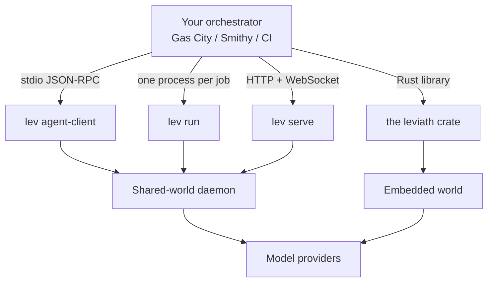

# Running Leviath under another tool

If you already use an orchestrator like [Gas City](/docs/gas-city) or [Smithy](/docs/smithy), you
have something deciding *which* work happens: which issue gets picked up, which repo it runs in, who
reviews the result. What you plug into it decides *how* one piece of that work actually gets done.

That second job is what Leviath is. Your orchestrator keeps doing the coordinating. Leviath takes
one task and runs it as a multi-stage agent with structured context, its own tools, and whichever
models you configured.

> [!NOTE]
> **Before this page:** [Getting Started](/docs/getting-started) and [The daemon](/docs/daemon).
> **In one line:** pick one of four ways in, point your orchestrator at it, and Leviath handles one
> unit of work.

## Which way in

| You want | Use | Covered in |
|---|---|---|
| A host that already speaks the Agent Client Protocol | `lev agent-client` | [Agent Client Protocol](/docs/agent-client-protocol) |
| One run per job, usually in a container | `lev run` | [CLI reference](/docs/cli) |
| A long-lived service that several jobs share | `lev serve` | [HTTP API](/docs/api) |
| Leviath inside your own Rust program | the `leviath` crate | [Embedding](/docs/embedding) |

Most orchestrators land on one of the first two. If yours can launch a subprocess and speak
JSON-RPC over its stdin and stdout, use `lev agent-client`, because you get streaming output and
in-turn tool approvals for free. If it thinks in terms of "run this command in this container until
it exits", use `lev run`.

## Three things worth knowing up front

**Approvals need somewhere to go.** By default Leviath asks before a tool call that changes
something. Under an orchestrator there is usually nobody there to answer, so a run would stop and
wait indefinitely. Either run with `--yolo`, or list the specific tools you trust with `--allow`.
The [Gas City page](/docs/gas-city) covers what this looks like in practice.

**The daemon outlives your command.** `lev run` hands the agent to a background
[daemon](/docs/daemon) and returns. In a container that exits as soon as the command finishes, that
is the wrong shape, and the [Smithy page](/docs/smithy) covers how to handle it.

**Polling needs the right field.** If your side tracks slots and needs to know whether a run is
still going, read [External work queues](/docs/work-queues) first. Two of the obvious fields to poll
do not mean what they look like.

## When Leviath is not the right choice

It is worth saying where this does not pay off:

- **For a single quick edit**, a coding agent CLI you already have is less setup and does the job.
  Leviath earns its keep on work with several distinct phases, or on many agents at once.
- **If your orchestration already lives in Python** and you want the workflow expressed in code
  rather than TOML, a framework you can import is a better fit than a separate runtime.
- **If you need a hard boundary per agent**, note that Leviath runs many agents in one process. You
  can put an agent in a [sandbox](/docs/security), but a process-per-agent tool gives you that
  isolation without asking.

[Where Leviath sits](/docs/comparison) goes into this properly.
