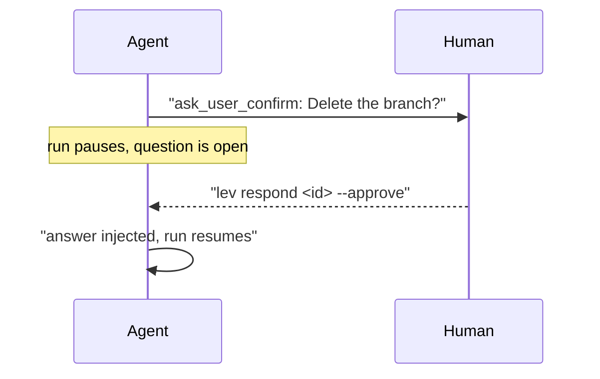

# Human-in-the-loop

A run doesn't have to be fully autonomous. An agent can raise a question and block until someone
answers it, a stage can declare an approval gate the framework always fires, and you can inject a
message into a running conversation at any time. This page covers how a person supervises and
steers a live agent, from the [dashboard](/docs/dashboard), the browser [console](/app), the
CLI, or the [HTTP API](/docs/api).



## Interaction kinds

Every prompt an agent puts to a person is one of five kinds (`InteractionKind`). The kind decides
what the client renders and what a valid answer looks like:

| Kind | Wire value | What the user does |
|---|---|---|
| Free-text | `free_text` | Types a free-form answer |
| Multiple-choice | `multiple_choice` | Picks one option from a list |
| Confirm | `confirm` | Answers yes / no |
| Tool-approval | `tool_approval` | Allows or denies a specific tool call |
| Edit-text | `edit_text` | Edits a document in place and submits the modified text |

A request may also carry a rich `body` (a markdown plan or document) for the user to review
alongside the prompt.

## Agent-raised questions

Mid-reasoning, a model may call one of these tools on its own judgment. The run pauses on the tool
call until the answer comes back, then continues with it:

- `ask_user_text`: a free-text question. Returns the user's answer (or "User provided no answer.").
- `ask_user_choice`: a multiple-choice question (requires at least 2 `options`).
- `ask_user_confirm`: a yes/no confirmation.
- `edit_document`: hands the user a document (the tool's `content`) to edit; returns the edited text.
- `present_for_review`: shows a markdown document (`title` + `markdown`) for review and collects optional feedback.

> [!NOTE]
> Under an unattended run (`--yolo`) nobody is watching, so these answer themselves rather than
> parking the run forever: a confirmation is approved, an edit submits the document unchanged, a
> review is acknowledged, and a free-text or choice question is told no one answered so the model
> decides for itself; a choice is never picked blind.
>
> Unattended applies to the whole run tree, not just the agent you launched: sub-agents and
> fan-out workers inherit it, and it survives a daemon restart. Otherwise a child could stop
> on a prompt nobody was watching for and take its parent down with it.

## Tool approval

Instead of the model asking, you can require approval for a tool before it runs. Set a tool's
per-stage (or agent-level) permission to `ask`. The values are `allow`, `ask`, and `deny`:

```toml
[tool_permissions]
read_file  = "allow"
write_file = "ask"     # pause and ask before each write
bash       = "ask"
```

An `ask` gate raises a `tool_approval` prompt naming the tool and its telling argument (the shell
command for `bash`/`shell`, the path for the file tools), with three options:

- **Allow once**: permit just this one call.
- **Allow for this session**: permit every call to this tool for the rest of the run (`session` scope).
- **Deny**: reject the call.

The same prompt backs the [security](/docs/security) taint gate: an outbound tool that would carry
sensitive data above its clearance is blocked and surfaced as a tool-approval, where **Allow for
this session** maps to always-allow and **Deny** blocks it.

## Interaction points

An interaction point is an approval gate declared **statically** on a stage. Unlike the `ask_user`
tools (which fire only if the model chooses to call them), the framework fires an interaction point
at the stage boundary *always*, before the stage may transition. Set the stage's mode to
`interactive_points` and list one or more points:

```toml
[stages.plan]
mode = "interactive_points"

[[stages.plan.interaction_points]]
name     = "plan_approval"
prompt   = "Approve the plan?"
required = true
style    = "multiple_choice"          # free_text | multiple_choice | confirm
options  = ["Approve", "Revise", "Edit", "Abort"]
abort_options = ["Abort"]
edit_options  = ["Edit"]
directives = { "Revise" = "Call ask_user_text to find out what to change, then re-plan." }
document_region = "plan"
```

The selected option is routed deterministically (in code) by which list it falls in, matched
exactly first, then with dash/whitespace normalization:

- **Approve**: any plain option not listed below. Completes the point; when every point is
  satisfied the stage transitions.
- **Directive** (a key in `directives`): injects the mapped directive text into the conversation
  and **re-runs inference in-stage**, then re-presents the point. Use it to revise.
- **Edit** (an option in `edit_options`): opens the stage's most recent output in an editable
  field; the edited text is injected and adopted as the authoritative document, and the point is
  re-presented.
- **Abort** (an option in `abort_options`): cancels the run immediately, with no further inference
  or transition.

`document_region` names a pinned [context](/docs/context) region (e.g. `"plan"`) that holds the
point's authoritative document. Each time the point is presented, the current text (the produced
output, or the user's direct edit) replaces that region, so revisions and downstream stages build
on the current version rather than regenerating from the task.

> [!WARNING]
> The revise and edit loops are bounded: after 4 revision rounds at a single point (`MAX_REVISION_ROUNDS`),
> the stage proceeds regardless, so a revise/edit loop can never run forever.

## Mid-run messages

You can steer a running agent without waiting for it to ask. A message is injected into the
conversation region between inference calls, as if the user had spoken mid-turn:

```bash
lev msg <agent-id> "Focus on the auth module first, skip the migrations for now."
```

Whether a message lands right away is per-stage. `accepts_messages` defaults to `true`; set it to
`false` on a stage that shouldn't be interrupted (e.g. a final report), and messages stay queued in
the agent's inbox until it reaches a stage that accepts them:

```toml
[stages.report]
mode = "autonomous"
accepts_messages = false   # hold messages until a later stage that accepts them
```

> [!TIP]
> A message is delivered to at most one running agent by id. If nothing accepts it (no such live
> agent), `lev msg` reports `no agent accepted the message`.

## Answering questions

When a run is waiting on a question, answer it with `lev respond`. Run it with no arguments to list
the interactions the daemon is currently holding, then answer one by its request id:

```bash
lev respond                              # list open interactions
lev respond <request-id> "your answer"   # free-text / edited value
lev respond <request-id> --choice 1      # multiple-choice, 0-based index
lev respond <request-id> --approve       # tool-approval / confirm
lev respond <request-id> --approve --session   # allow for the rest of the run
lev respond <request-id> --deny          # reject
```

You don't have to use the CLI. The same open questions can be answered interactively from the
[dashboard](/docs/dashboard) (press `i`), from the browser [console](/app), or over the
[API](/docs/api) via `GET/POST /api/agents/{id}/interaction`: read the pending question, then post
the answer.

> [!NOTE]
> Interaction state survives a daemon restart. An agent parked at a stage-boundary interaction
> point is re-presented with the exact same prompt when the daemon comes back, rather than dropping
> the question and re-running inference.
