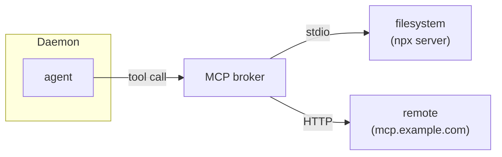
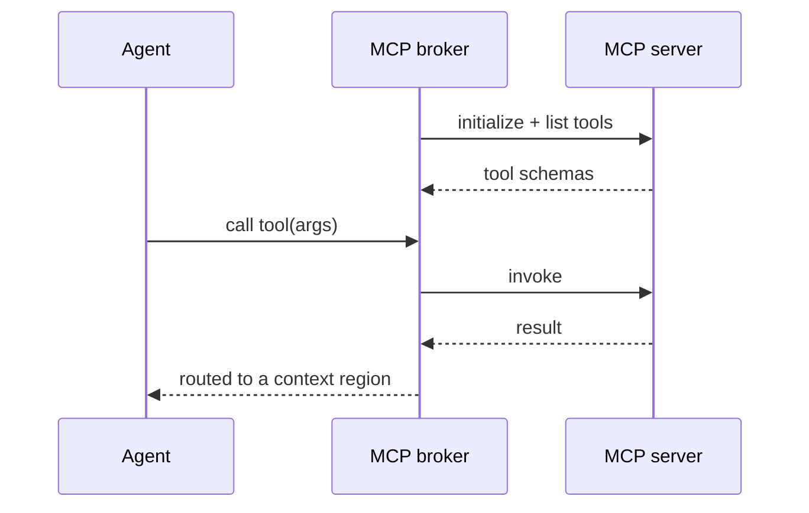

# MCP tool servers

Leviath connects to [Model Context Protocol](https://modelcontextprotocol.io) servers over stdio or
HTTP (streamable, with a legacy HTTP+SSE fallback), giving agents extra tools beyond the built-ins.



## Managing servers

```bash
lev mcp add filesystem --command npx \
  --arg -y --arg @modelcontextprotocol/server-filesystem --arg /path
lev mcp add remote --url https://mcp.example.com --header "Authorization=Bearer $TOK"
lev mcp list
lev mcp login <name>        # OAuth servers: opens your browser
lev mcp logout <name>       # drop the stored OAuth tokens
lev mcp test <name>
lev mcp remove <name>
```

`lev mcp add <name>` takes `--command` + repeatable `--arg` for a stdio server, or `--url`
(with optional `--header`/`--env`) for an HTTP one; `--no-login` skips the OAuth handshake.

`--header` and `--env` both want `KEY=VALUE`, split on the first `=`. Note that this is not the
`Name: value` form an HTTP header is usually written in, so `Authorization: Bearer ...` is rejected
with `--header must be KEY=VALUE`.

`--arg` passes its value through to the server's own command line, so an argument of its own that
starts with `-` is fine: `--arg -y` is the `-y` that `npx` wants, not a flag of ours.

There are two ways an HTTP server authenticates you, and Leviath picks between them by asking the
server rather than by guessing. If a `--header` you configured is enough, as it is for a server that
takes an API token of its own, `add` reports that no login is needed and stores nothing. If the
server answers with a `401` instead, the OAuth flow runs and the tokens land in the credential
store. `lev mcp login` on an already-satisfied server says so rather than failing.

That question is asked with the headers as they will actually be sent, `${VAR}` references
expanded, so a credential that comes from the environment is recognised as the credential it is.

> [!NOTE]
> GitHub's MCP server accepts either. A personal access token in an `Authorization` header needs no
> login at all, and the same endpoint runs the browser flow if you configure no header.

Or configure in `~/.leviath/config.toml`:

```toml
[[mcp_servers]]
name = "filesystem"
command = "npx"
args = ["-y", "@modelcontextprotocol/server-filesystem", "/path"]

[[mcp_servers]]
name = "remote"
url = "https://mcp.example.com"
headers = { Authorization = "Bearer ${MY_TOKEN}" }   # ${VAR} is expanded
```

## Discovery and invocation

On connect, Leviath discovers the server's tools and exposes them to any stage whose
`available_tools` includes them:



## Granting a whole server

`available_tools` is an exact-match list, so granting a server tool by tool means knowing what it
advertises - and that is not yours to know. It is whatever the server ships today. GitHub's server
has dozens; a house server gains one when somebody deploys. A tool added later is simply never
offered, with nothing said, so the stage quietly cannot do a thing you believed it could.

Name the server instead:

```toml
[stages.triage]
available_tools = ["read_file"]
available_connectors = ["github"]
```

The connector is resolved at spawn against what the server actually advertises then, and merged
with `available_tools`, so the two mix freely. A tool the server gains next month is offered
without touching the manifest.

A connector that resolves to nothing - the server is not installed, or did not connect this run -
grants nothing, exactly as an `available_tools` name matching nothing does. Whether a server is
present is not a property of your blueprint, so `lev validate` says nothing about connector names
either, the same way it never reports an MCP tool as unknown.

Everything else is unchanged. Connector-granted tools are ordinary tools from there on: they go
through the same `tool_permissions`, the same taint gate, and the same approval prompts as a tool
you named by hand.

> [!NOTE]
> There is no wildcard form of `available_tools` and cannot usefully be one. An MCP tool's
> advertised name does not reliably carry its server - Leviath prefers the bare tool name and only
> prefixes with the server on a collision, so `github`'s `create_issue` is usually advertised as
> just `create_issue`. There is no prefix a pattern could match on, which is why a grant names the
> server and Leviath answers for what it owns.

## OAuth, safely

`lev mcp add` detects OAuth servers, binds tokens to the server origin (RFC 8414 issuer check,
HTTPS-only, capped redirects), and stores them in `~/.leviath/mcp-auth.json` (`0600`), refreshing
non-interactively.

> [!NOTE]
> Manage servers from the [dashboard](/docs/dashboard) with `m`, or over the [API](/docs/api) under
> `/api/mcp/servers` (add/remove need `--allow-admin`).
