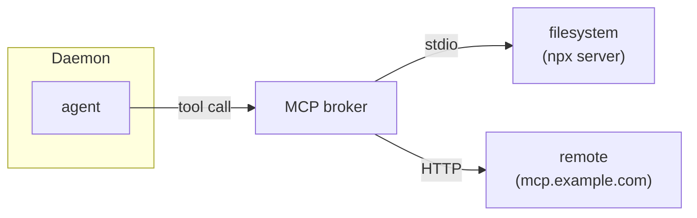
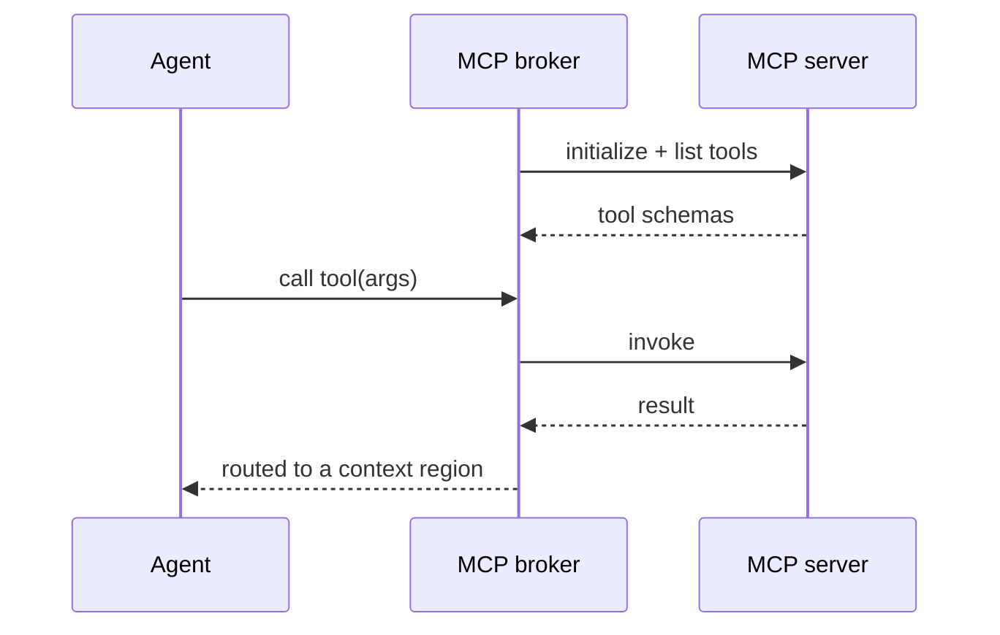

# MCP tool servers

Leviath connects to [Model Context Protocol](https://modelcontextprotocol.io) servers over stdio or
HTTP (streamable, with a legacy HTTP+SSE fallback), giving agents extra tools beyond the built-ins.



## Managing servers

```bash
lev mcp add filesystem --command npx \
  --arg -y --arg @modelcontextprotocol/server-filesystem --arg /path
lev mcp add remote --url https://mcp.example.com --header "Authorization=Bearer $TOK"
lev mcp list
lev mcp login <name>        # OAuth servers: opens your browser
lev mcp logout <name>       # drop the stored OAuth tokens
lev mcp test <name>
lev mcp remove <name>
```

`lev mcp add <name>` takes `--command` + repeatable `--arg` for a stdio server, or `--url`
(with optional `--header`/`--env`) for an HTTP one; `--no-login` skips the OAuth handshake.

`--header` and `--env` both want `KEY=VALUE`, split on the first `=`. Note that this is not the
`Name: value` form an HTTP header is usually written in, so `Authorization: Bearer ...` is rejected
with `--header must be KEY=VALUE`.

Or configure in `~/.leviath/config.toml`:

```toml
[[mcp_servers]]
name = "filesystem"
command = "npx"
args = ["-y", "@modelcontextprotocol/server-filesystem", "/path"]

[[mcp_servers]]
name = "remote"
url = "https://mcp.example.com"
headers = { Authorization = "Bearer ${MY_TOKEN}" }   # ${VAR} is expanded
```

## Discovery and invocation

On connect, Leviath discovers the server's tools and exposes them to any stage whose
`available_tools` includes them:



## OAuth, safely

`lev mcp add` detects OAuth servers, binds tokens to the server origin (RFC 8414 issuer check,
HTTPS-only, capped redirects), and stores them in `~/.leviath/mcp-auth.json` (`0600`), refreshing
non-interactively.

> [!NOTE]
> Manage servers from the [dashboard](/docs/dashboard) with `m`, or over the [API](/docs/api) under
> `/api/mcp/servers` (add/remove need `--allow-admin`).
