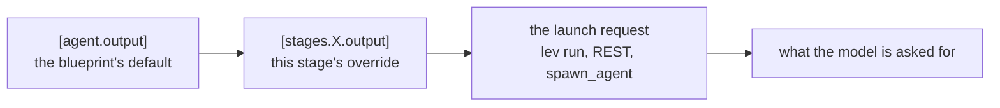
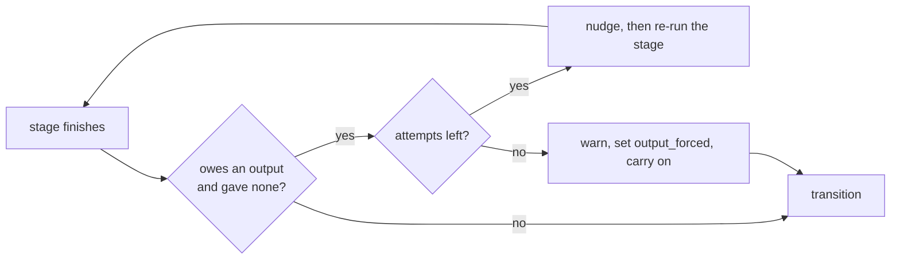

# Final outputs

An agent that finishes has usually learned something you want back. Without somewhere to put it, the
only way to say anything is to write a file and hope you look there. Its logs record what it did,
not what it concluded.

So an agent can **submit a final output**: one deliberate answer, produced by a tool call, that
every surface reports. The API returns it, `lev result` prints it, a parent agent receives it, and
the completion webhook carries it.

> [!NOTE]
> **Before this page:** [Multi-stage workflows](/docs/stages).
> **In one line:** the run's last stage calls one tool, and that call is the answer.

## The smallest version

Add a stage with `mode = "output"`:

```toml
[stages.review.transitions.summary]
hint = "The work is done"

[stages.summary]
mode = "output"
model = { models = [{ provider = "anthropic", model = "claude-sonnet-5" }] }
description = "Say what changed"
max_iterations = 8
system_prompt = """
Say what you changed, for whoever asked for it. List the files you touched and
what each change does. Then anything they need to know before merging.
"""

[stages.summary.transitions]
```

Then read it back:

```bash
lev result <run-id>          # the answer, with its run and stage
lev result <run-id> --raw    # the answer alone, for a pipeline
lev result <run-id> --json   # the answer plus its shape and stage
```

`mode = "output"` does three things for you. It grants the stage the `submit_output` tool, it
requires the stage to call it, and it lets the run end there.

## Any shape you like

Leviath never interprets the format. There is no list of supported formats and no parser. You name a
shape, and the model produces it.

```toml
[stages.summary.output]
format = "a2ui"
instructions = "One card per finding, highest severity first."
example = """
{"root": {"component": "Card", "children": [{"component": "Text"}]}}
"""
```

`format` is a label. Markdown, XML, CSV, [a2ui](https://a2ui.org/), a media type, or a format you
invent this afternoon all work the same way. The label, your instructions, and your example go into
the `submit_output` tool description and the stage's system prompt. Nothing else happens to them.

The label travels with the answer so a reader can act on it. A browser console that renders a2ui
differently from markdown matches on that string. Leviath itself never does.

## Asking for a shape at launch

A blueprint declares a default. Whoever starts the run can ask for something else.

```bash
lev run ./my-agent --task "audit the auth module" \
  --output-format xml \
  --output-instructions "One <finding> element per issue."
```

The same three fields exist on `POST /api/agents` as `output_format`, `output_instructions`, and
`output_schema`. A parent agent can ask a child through `spawn_agent`.

Three levels combine, and the later one wins per field.



One rule breaks that pattern on purpose. If you name a `format` and supply no schema, any schema the
blueprint declared is dropped. A check written for one shape says nothing about another. Supply your
own schema alongside your format when you want the answer validated.

## Validating an answer

A JSON Schema is the one thing that inspects what an agent submitted.

```toml
[stages.summary.output]
format = "json"

[stages.summary.output.schema]
type = "object"
required = ["summary", "files_changed"]

[stages.summary.output.schema.properties]
summary = { type = "string" }
files_changed = { type = "array", items = { type = "string" } }
```

A submission that fails goes back to the agent as an error, and it tries again. Nothing is recorded
until one passes, so a bad correction never replaces a good answer.

Setting `format = "json"` on its own validates nothing. The schema is a separate key because
validation is a separate decision.

## Requiring one

`require_output` makes a stage produce an answer before it moves on. `mode = "output"` sets it for
you. Set it by hand on any other stage that owes a deliverable.



A missing output never strands a run. The stage is nudged and re-run a few times, bounded by its
`max_revisits`. After that the run finishes anyway and records `output_forced` in its flags, so you
can tell a missing answer from an answer nobody asked for.

Give the stage enough `max_iterations` to spend that budget. Each nudge costs one iteration, so a
stage that runs out of iterations first ends on its `max_iterations` path instead. That path takes
precedence, and the run records `max_iterations_hit` rather than `output_forced`.

## What each surface returns

| Surface | Where the answer appears |
|---|---|
| `lev result <run-id>` | The whole answer. `--raw` for pipelines, `--json` for its shape too |
| `lev ps --json` | `has_final_output` only. The answer can be large, so fetch it separately |
| `GET /api/agents/{id}/result` | `final_output`, beside the existing `output` log tail |
| Completion webhook | `final_output`. The `result` field is the run's error, as it always was |
| `wait_for_agent`, `check_agent` | The child's answer, with its status |
| Fan-out merge stage | Each worker's answer, in the consolidated report |
| Embed `AgentEvent::Completed` | `final_output` on the event, plus `AgentWorld::result()` |

## Sub-agents and fan-out

A parent that waits on a child receives what the child submitted. A fan-out merge stage receives
what each worker submitted.

A worker that submits nothing falls back to the text of its last message. That text is often empty,
because a worker whose final action was a tool call has no trailing prose. Set `require_output` on a
worker stage when the merge depends on its answer.

```toml
[stages.fix_worker]
mode = "autonomous"
available_tools = ["read_file", "edit_file", "shell", "submit_output"]
allow_as_worker = true
require_output = true
```

## An answer counts as output

A run that changes no files is normally reported as `complete (no output)`. That verdict exists to
catch an agent that was supposed to write something and did not.

A submitted answer clears it. A researcher, a reviewer, or a router produces its answer and nothing
else, and reporting those runs as empty was wrong.

## Size

An answer is capped at 256 KiB. Past that it is cut at a character boundary and marked `truncated`,
and the agent is told so it can shorten. An agent with more than that to return should write a file
and say where it is.

## Checking a blueprint

`lev validate` refuses an output stage that cannot submit, and warns about the ways one becomes
unreachable.

| Finding | What it means |
|---|---|
| `output-unreachable` | No edge routes to the output stage |
| `allow-complete-skips-output` | An earlier stage may end the run instead of routing onward |
| `output-shape-not-required` | A shape is declared but nothing must produce it |
| `output-stage-can-modify` | An output stage can also write files |

The second one is worth knowing about. `allow_complete` offers the model a "DONE" it can choose
instead of a transition. Leviath appends that option even to a stage's own `transition_prompt`, so a
stage can offer an exit its prompt never mentions. A run that takes it ends with no answer and looks
like a success.
