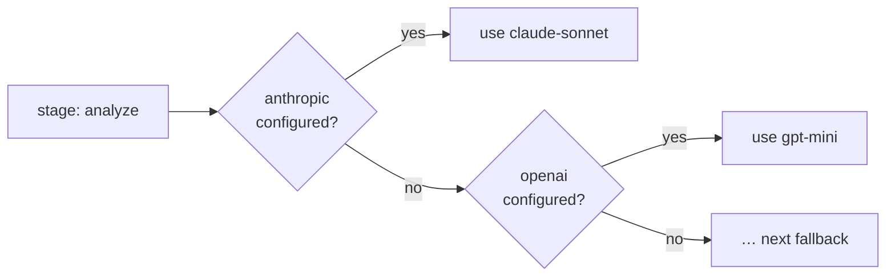

# Providers

Leviath needs at least one model provider. Configure them with `lev setup` or by writing keys via
the [API](/docs/api).

| Provider | Env var | Get a key |
|---|---|---|
| Anthropic | `ANTHROPIC_API_KEY` | [console.anthropic.com](https://console.anthropic.com/settings/keys) |
| OpenAI | `OPENAI_API_KEY` | [platform.openai.com](https://platform.openai.com/api-keys) |
| Google (Gemini) | `GOOGLE_API_KEY` | [aistudio.google.com](https://aistudio.google.com/apikey) |
| OpenRouter | `OPENROUTER_API_KEY` | [openrouter.ai/keys](https://openrouter.ai/keys) |
| Ollama | none (local) | [ollama.com/download](https://ollama.com/download) |
| Claude Code | none (subscription) | see below |

## Per-stage model selection with fallback

Each [stage](/docs/stages) names an ordered list of provider/model pairs. The runtime picks the
first one you have configured, so a blueprint can prefer a strong model and fall back gracefully:



This is why a blueprint written against Anthropic still runs for someone who only has OpenAI keys.

The rest of the list is kept, not discarded. If the provider in use stops being usable partway
through a run, the stage moves to the next entry and carries on rather than failing:

```toml
[[stages.analyze.model.models]]
provider = "openrouter"
model    = "deepseek/deepseek-v4-flash"

[[stages.analyze.model.models]]
provider = "anthropic"
model    = "claude-sonnet-5"
```

"Stops being usable" means the account is out of credits, or the key was rejected or is not allowed
to use that model. An ordinary bad request is not that, and never spends a fallback.

## A host-wide fallback chain

A stage that names a single model has nowhere to go on its own. Give the whole host somewhere to
fall back to:

```toml
[providers]
fallback_order = ["anthropic/claude-sonnet-5", "openai/gpt-5.6-mini"]
```

Entries are `provider/model` pairs, best first, and are tried after the stage's own list and your
default model. A failover target needs a model to send, so a bare provider name is not enough. An
entry naming a provider you have not configured is skipped, and a malformed one is ignored with a
warning rather than stopping the daemon.

This is read per run, so editing it takes effect on the next `lev run` with no restart.

## When a provider keeps failing

Failing over saves the run in front of you. It does nothing for the next one, which would start on
the same dead provider and fail the same way. So Leviath counts consecutive failures per provider,
and after a few takes it out of service for every run:

```toml
[limits]
provider_failures_before_open  = 3    # consecutive failures before it is pulled
provider_circuit_cooldown_secs = 300  # how long before it is tried again
```

Three rather than one because a single "payment required" can be one request asking for more output
tokens than the balance covers, which a smaller request would survive. Three in a row is the
account.

While a provider is out, runs move to their next candidate. A run with none left is failed with an
error saying so, rather than left sitting there looking healthy. Once the cooldown passes, the next
request goes through as a probe: if it works the provider is back immediately, and if it fails the
wait restarts. Topping up an account needs no restart.

`lev ps` lists anything currently out of service under the table, with why and how long until it is
retried. `lev ps --json` carries the same under `health.providers_down`, and the
`leviath.provider.circuit.open` metric reports it per provider. Set `provider_failures_before_open`
to `0` to switch the whole thing off and keep only per-run failover.

## Where credentials live

Keys live in `~/.leviath/config.toml` by default, or (to keep them out of a plaintext file) in
your OS keychain. `lev auth` manages the backend:

```bash
lev auth status                 # which backend holds your secrets
lev auth migrate                # move keys into the OS keychain
lev auth migrate --reverse      # move them back to config.toml
lev auth migrate --dry-run      # preview without moving anything
```

## Rate limits

Optional per-provider client-side rate limits, enforced before each call:

```toml
[rate_limits.anthropic]
requests_per_minute = 50
tokens_per_minute   = 100000
```

## Custom OpenAI-compatible providers

Point Leviath at any OpenAI-compatible endpoint with a small Rhai script.
[Rhai providers](/docs/rhai-providers) walks through a complete Groq provider.

## Claude Code transport

If you have Claude Code installed and signed in, you can run Leviath on your Claude subscription
with no API key. Leviath's structured regions still work; the CLI is driven as a plain inference
relay.

> [!CAUTION]
> **Terms of service.** Anthropic's terms state that third-party developers may not offer claude.ai
> login or subscription rate limits for their products without prior approval. Using this transport
> routes inference through your Claude subscription via the CLI's OAuth session. By enabling it, you
> accept responsibility for compliance with Anthropic's terms. For unambiguous compliance, use a
> direct Anthropic API key instead.

Measured caveats: the CLI adds ~130 tokens of its own context to **every** call (including your
account email address and the current date) with no flag to disable it; no prompt caching; a
subprocess per call; Anthropic models only.

Enable it through `lev setup`, or directly:

```toml
[providers]
claude_code_enabled = true
claude_code_binary  = "/usr/local/bin/claude"   # unset resolves `claude` on PATH
claude_code_effort  = "medium"                  # low | medium | high | xhigh | max
```

It is off unless you turn it on, and `lev setup` defaults to declining, so pressing Enter through
the wizard leaves it off. `claude_code_effort` is always sent explicitly: left to itself the CLI
picks `high` with adaptive thinking, spending output tokens and latency Leviath never asked for.
