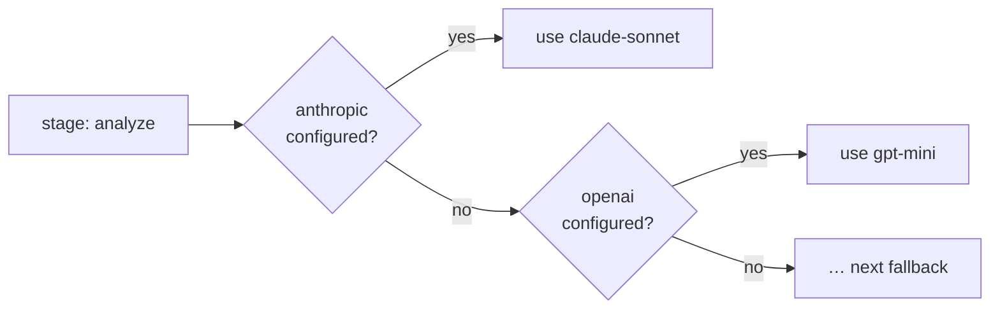

# Providers

Leviath needs at least one model provider. Configure them with `lev setup` or by writing keys via
the [API](/docs/api).

| Provider | Key |
|---|---|
| Anthropic | `ANTHROPIC_API_KEY` |
| OpenAI | `OPENAI_API_KEY` |
| Google (Gemini) | `GOOGLE_API_KEY` |
| OpenRouter | `OPENROUTER_API_KEY` |
| Ollama | *none (local)* |
| Claude Code | *none (subscription — see below)* |

## Per-stage model selection with fallback

Each [stage](/docs/stages) names an ordered list of provider/model pairs. The runtime picks the
first one you have configured — so a blueprint can prefer a strong model and fall back gracefully:



This is why a blueprint written against Anthropic still runs for someone who only has OpenAI keys.

## Rate limits

Optional per-provider client-side rate limits, enforced before each call:

```toml
[rate_limits.anthropic]
requests_per_minute = 50
tokens_per_minute   = 100000
```

## Custom OpenAI-compatible providers

Point Leviath at any OpenAI-compatible endpoint with a small Rhai script — see
`docs/rhai-providers.md` in the repo and the `docs/examples/groq.rhai` example.

## Claude Code transport

If you have Claude Code installed and signed in, you can run Leviath on your Claude subscription
with no API key. Leviath's structured regions still work; the CLI is driven as a plain inference
relay.

> [!CAUTION]
> **Terms of service.** Anthropic's terms state that third-party developers may not offer claude.ai
> login or subscription rate limits for their products without prior approval. Using this transport
> routes inference through your Claude subscription via the CLI's OAuth session. By enabling it, you
> accept responsibility for compliance with Anthropic's terms. For unambiguous compliance, use a
> direct Anthropic API key instead.

Measured caveats: the CLI adds ~130 tokens of its own context to **every** call — including your
account email address and the current date — with no flag to disable it; no prompt caching; a
subprocess per call; Anthropic models only.
