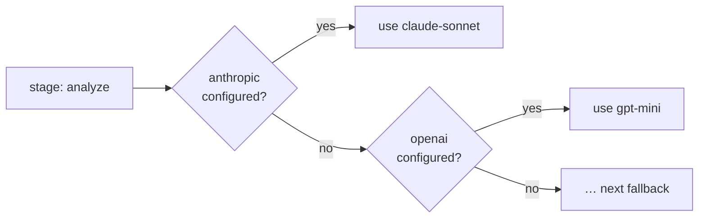

# Providers

Leviath needs at least one model provider, and a key reaches it three ways. Exporting the
provider's environment variable is enough on its own, with no config file at all. `lev setup`
writes it into `~/.leviath/config.toml` for you, interactively or with
`--non-interactive --anthropic-key ...`. Or write the config file yourself; every key is in
[Configuration](/docs/configuration).

| Provider | Env var | Get a key |
|---|---|---|
| Anthropic | `ANTHROPIC_API_KEY` | [console.anthropic.com](https://console.anthropic.com/settings/keys) |
| OpenAI | `OPENAI_API_KEY` | [platform.openai.com](https://platform.openai.com/api-keys) |
| Google (Gemini) | `GOOGLE_API_KEY` | [aistudio.google.com](https://aistudio.google.com/app/apikey) |
| OpenRouter | `OPENROUTER_API_KEY` | [openrouter.ai/keys](https://openrouter.ai/keys) |
| Ollama | `OLLAMA_HOST` (optional, local) | [ollama.com/download](https://ollama.com/download) |
| Claude Code | none (subscription; terms caveat below) | see below |

The setup flag `--ollama-url` sets the same base URL that `OLLAMA_HOST` supplies.

## Model identifiers

A model is always named by a `provider` and a `model` together. The `model` string is passed to that
provider verbatim, so it has to be spelled the way the provider spells it:

| Provider | Shape | Example |
|---|---|---|
| Anthropic | the bare model name | `claude-sonnet-5` |
| OpenAI | the bare model name | `gpt-5.4-mini` |
| Google | the bare model name | `gemini-2.5-pro` |
| OpenRouter | `vendor/model` | `deepseek/deepseek-v4-flash` |
| Ollama | `model:tag` | `qwen3.5:9b` |

OpenRouter is the one that trips people up: its identifiers carry a vendor prefix, and the prefix is
part of the name. `deepseek-v4-flash` is not a valid OpenRouter model; `deepseek/deepseek-v4-flash`
is. Browse the full catalog at [openrouter.ai/models](https://openrouter.ai/models), or ask your
install:

```bash
lev models list --provider openrouter        # what Leviath knows offline
lev models list --provider openrouter --remote   # live from the provider's API
lev models list --all                        # every provider, even unconfigured ones
```

> [!NOTE]
> Without `--remote`, `lev models list` prints a built-in table of well-known models. It is a
> convenience, not the catalog. A model absent from it is not necessarily invalid: `lev validate`
> flags an unrecognized string with an `unknown-model` warning, never an error, and the string is
> still sent to the provider exactly as written. Locally an unrecognized model gets conservative
> capability assumptions: 128K context and 8192 output on OpenRouter, 8192 context and 4096 output
> elsewhere.

### Dated and rotating identifiers

Providers publish dated aliases (`deepseek/deepseek-v4-flash-0731`,
`deepseek/deepseek-r1-0528`) alongside undated ones. A dated alias can be perfectly valid upstream
while being absent from `lev models list`, and it can also stop resolving later when the provider
retires it. Nothing local will warn you: the first sign is a model-not-found error from the API.

If you pin a dated identifier, treat it as something to revisit. If you would rather not, pin the
undated one and accept that the provider may move it under you.

## Per-stage model selection with fallback

Each [stage](/docs/stages) names an ordered list of provider/model pairs. The runtime picks the
first one you have configured, so a blueprint can prefer a strong model and fall back gracefully:



This is why a blueprint written against Anthropic still runs for someone who only has OpenAI keys.

The rest of the list is kept, not discarded. If the provider in use stops being usable partway
through a run, the stage moves to the next entry and carries on rather than failing:

```toml
[[stages.analyze.model.models]]
provider = "openrouter"
model    = "deepseek/deepseek-v4-flash"

[[stages.analyze.model.models]]
provider = "anthropic"
model    = "claude-sonnet-5"
```

"Stops being usable" means the account is out of credits, the key was rejected or is not allowed to
use that model, or the provider could not be reached at all after every retry. An ordinary bad
request is not that, and never spends a fallback.

## A host-wide fallback chain

A stage that names a single model has nowhere to go on its own. Give the whole host somewhere to
fall back to:

```toml
[providers]
fallback_order = ["anthropic/claude-sonnet-5", "openai/gpt-5.6-mini"]
```

Entries are `provider/model` pairs, best first, and are tried after the stage's own list and your
default model. A failover target needs a model to send, so a bare provider name is not enough. An
entry naming a provider you have not configured is skipped, and a malformed one is ignored with a
warning rather than stopping the daemon.

This is read per run, so editing it takes effect on the next `lev run` with no restart.

## When a provider keeps failing

Failing over saves the run in front of you. It does nothing for the next one, which would start on
the same dead provider and fail the same way. So Leviath counts consecutive failures per provider,
and after a few takes it out of service for every run:

```toml
[limits]
provider_failures_before_open  = 3    # consecutive failures before it is pulled
provider_circuit_cooldown_secs = 300  # how long before it is tried again
```

Three rather than one because a single "payment required" can be one request asking for more output
tokens than the balance covers, which a smaller request would survive. Three in a row is the
account.

While a provider is out, runs move to their next candidate. A run with none left is failed with an
error saying so, rather than left sitting there looking healthy. Once the cooldown passes, the next
request goes through as a probe: if it works the provider is back immediately, and if it fails the
wait restarts. Topping up an account needs no restart.

`lev ps` lists anything currently out of service under the table, with why and how long until it is
retried. `lev ps --json` carries the same under `health.providers_down`, and the
`leviath.provider.circuit.open` metric reports it per provider. Set `provider_failures_before_open`
to `0` to switch the whole thing off and keep only per-run failover.

## Which entry a stage starts on

Failover decides where a run *goes* when something breaks. This decides where it *begins*.

The choice is made once, at spawn. The one thing to hold on to: it depends on whether the
**provider** is configured, never on whether the model exists. A typo in a model name is not caught
here, it fails at the first request.

In order:

1. `lev run --model <provider>/<model>`, which overrides everything and skips the check entirely. A
   bare `--model <model>` replaces only the model name and keeps the provider resolved below.
2. Your `default_provider` / `default_model` from `config.toml`, when `default_model` is set, the
   provider is configured, and the stage did not set `allow_user_default = false`. It leads even
   when the blueprint lists that same provider with a different model: `default_provider = "ollama"`
   with `default_model = "qwen3.8:latest"` runs on `qwen3.8:latest`, and the blueprint's own
   `qwen3.5:9b` becomes the failover.
3. The first entry in `models` whose provider is configured.
4. The host-wide `fallback_order`, for the stages that got past everything above with nothing left.
5. The first entry in the list, whether or not its provider exists. If it does not, the run fails at
   spawn with `stage '<name>' has no usable provider`.

Everything below the first line is the failover chain, in that same order, so a stage that starts on
your default still has the blueprint's own entries to fall back to.

> [!IMPORTANT]
> `default_provider` on its own buys nothing. The resolver needs a model to send and has none, so it
> falls through to whatever the blueprint listed. Set `default_model` alongside it. `lev doctor`
> says so when you have not.

`default_model` is a bare model id: `qwen3.8:latest`, not `ollama/qwen3.8:latest`. The provider is
`default_provider`. That differs from `--model` and `[providers] fallback_order`, which take
`provider/model` in one string, so a leading `<default_provider>/` is dropped rather than sent
(`lev doctor` names the reading when it happens). The slash in an OpenRouter id such as
`deepseek/deepseek-v4-flash` is part of the model id itself, and OpenRouter's own
`openrouter/auto`-style ids are left as written.

### Running the bundled agents on your provider

The [bundled agents](/docs/agent-catalog) list all five providers, so any configured key works out
of the box. But each blueprint's own order decides which is tried first, and a custom Rhai
provider is never on the list. Naming yours as the default is what puts it in front:

```toml
default_provider = "openrouter"
default_model = "deepseek/deepseek-v4-flash"
openrouter_api_key = "sk-or-..."
```

Every stage now starts on OpenRouter and keeps the blueprint's own list behind it. A stage that must
stay on the provider its author picked opts out with `allow_user_default = false`.

Two other ways in. A full override, for one run:

```bash
lev run coder -t "fix the failing test" --model openrouter/deepseek/deepseek-v4-flash
```

Or, for something permanent and per stage, copying the blueprint and naming your provider on the
stages you care about:

```toml
model = { models = [
  { provider = "openrouter", model = "deepseek/deepseek-v4-flash" },
  { provider = "anthropic",  model = "claude-sonnet-5" },
] }
```

> [!WARNING]
> Ollama needs no key, so it is registered whether or not a server is running. Leave
> `default_model` unset on a machine with no Ollama and every stage that lists it starts against
> `http://localhost:11434`. The run moves on to its next candidate rather than dying there, but
> it still spends four attempts finding out.

### Turning off an Ollama model's thinking

Reasoning models served by Ollama think by default, and the thinking is billed to the same output
budget as the answer. On a local model that mostly shows up as latency: a stage that wanted two
sentences waits through several hundred tokens of deliberation first.

`think` is a top-level field on Ollama's API rather than a sampling parameter, and Leviath lifts it
out of the stage's parameters for you:

```toml
[stages.classify.model.parameters]
think = false
```

Left unset, nothing is sent and the model does whatever it does by default. Set it per stage, not
globally: the stage that picks a label off a list has nothing to think about, and the one that
plans the work does.

> [!NOTE]
> Ollama also accepts at most one system message, so Leviath merges a blueprint's context regions
> into a single system block for every OpenAI-compatible provider, Ollama included. The region
> headings survive the merge, which is what keeps a multi-region agent coherent there. See
> [what the model sees](/docs/context#what-the-model-sees).

## Where credentials live

Keys live in `~/.leviath/config.toml` by default, or (to keep them out of a plaintext file) in
your OS keychain. `lev auth` manages the backend:

```bash
lev auth status                 # which backend holds your secrets
lev auth migrate                # move keys into the OS keychain
lev auth migrate --to-file      # move them back to config.toml
lev auth migrate --dry-run      # preview without moving anything
```

## Rate limits

Optional per-provider client-side rate limits, enforced before each call:

```toml
[rate_limits.anthropic]
requests_per_minute = 50
tokens_per_minute   = 100000
```

## Custom OpenAI-compatible providers

Point Leviath at any OpenAI-compatible endpoint with a small Rhai script.
[Rhai providers](/docs/rhai-providers) walks through a complete Groq provider.

## Claude Code transport

If you have Claude Code installed and signed in, you can run Leviath on your Claude subscription
with no API key. Leviath's structured regions still work; the CLI is driven as a plain inference
relay.

> [!CAUTION]
> **Terms of service.** Anthropic's terms state that third-party developers may not offer claude.ai
> login or subscription rate limits for their products without prior approval. Using this transport
> routes inference through your Claude subscription via the CLI's OAuth session. By enabling it, you
> accept responsibility for compliance with Anthropic's terms. For unambiguous compliance, use a
> direct Anthropic API key instead.

Four measured caveats. The CLI adds about 130 tokens of its own context to **every** call, your
account email address and the current date included, and there is no flag to turn that off. There is
no prompt caching. Each call is a separate subprocess. And it serves Anthropic models only.

Enable it through `lev setup`, or directly:

```toml
[providers]
claude_code_enabled = true
claude_code_binary  = "/usr/local/bin/claude"   # unset resolves `claude` on PATH
claude_code_effort  = "medium"                  # low | medium | high | xhigh | max
```

It is off unless you turn it on: the wizard never selects it for you, and saving with it selected
first asks you to accept the terms risk on an explicit dialog. `claude_code_effort` is always sent
explicitly: left to itself the CLI picks `high` with adaptive thinking, spending output tokens and
latency Leviath never asked for.
