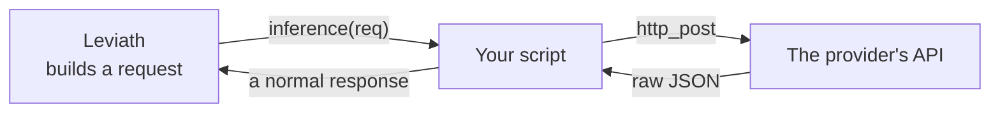

# Custom model providers

Leviath ships support for the big providers, but there are always more. A `.rhai` script in
`~/.leviath/providers/` teaches it any HTTP LLM API, without waiting for anyone to add it.

Your script does one job: translate. Leviath hands it a request in Leviath's own shape, the script
turns that into whatever body the API wants, and then turns the reply back:



Everything hard stays on Leviath's side: HTTP transport, rate limiting, per-stage timeouts, retry
with backoff, working out which errors are worth retrying, and token counting. You write the mapping
and nothing else: name the file after the provider, write an `inference` function, and reference it
from a stage.

Four things about the lifecycle:

- **The filename is the provider name.** `groq.rhai` is referenced as `provider = "groq"`.
- **Nothing runs until it is named.** The daemon does not scan and execute every file it finds at
  startup, only the ones an agent actually asks for.
- **Edits apply on the next run.** The file's modification time is checked on each use, so a change
  is picked up with no daemon restart.
- **A broken script is skipped, not fatal.** It logs a warning, and starts working again as soon as
  you fix the file.

## Where it goes and how it's referenced

Put the file at `~/.leviath/providers/groq.rhai`, then point a stage at it from the blueprint:

```toml
# agent.leviath
[stages.plan.model]
provider = "groq"                       # the filename stem
model    = "llama-3.3-70b-versatile"    # passed through as request.model
```

Model selection is per stage. Every stage that should use this provider needs its own
`[stages.<name>.model]` block.

> [!WARNING]
> A top-level `[model]` block is not read by anything. It parses without complaint and then has no
> effect, so the stage quietly runs on your default provider instead. `lev validate` catches this
> and reports it as `agent-model-block-ignored`.

A config table is optional. It only supplies overrides that reach the script's `initialize`:

```toml
# ~/.leviath/config.toml
[model_providers.groq]
script   = "groq"                            # optional; defaults to <name>.rhai
api_key  = "..."                             # optional; the script may read its own env var
base_url = "https://api.groq.com/openai/v1"  # optional

[model_providers.groq.rate_limit]            # optional; enforced by the Rust wrapper
requests_per_minute = 30
tokens_per_minute   = 100000

# Any other keys are forwarded verbatim to initialize(config).
```

## The script contract

A provider defines `initialize` and `inference` (required) and may add `stream`, `count_tokens`, and
`list_models`. Metadata comes from leading `// @key value` comments. Both required functions are
checked when the script loads, so one that is missing or takes the wrong number of parameters is
skipped with a warning, the same as a syntax error, rather than failing part-way into a run.

`initialize(config)` runs once when the provider loads. It runs **offline**, so no HTTP host
functions are available here. Return a state map that is persisted and passed to every later call.

`inference(state, request)` does one non-streaming call. `request` carries:

```jsonc
{
  "system":   [ { "text": "...", "cache_hint": "...",
                  "region": "findings", "volatility": "grows" } ],
  "messages": [ { "role": "user", "content": "...", "cache_breakpoint": false } ],
  "tools":    [ { "name": "...", "description": "...", "parameters": { /* JSON schema */ } } ],
  "model": "...", "max_tokens": 1024, "temperature": 0.7,
  "request_timeout_secs": 120, "extra": { /* forwarded config keys */ }
}
```

Two field subtleties. A message's `content` is a string on plain turns, but an **array of content
blocks** (`tool_use`, `tool_result`) whenever the agent is mid tool work, so forward it untouched
unless your API needs a transform. And `cache_breakpoint` is present only when `true`; a normal
message carries no such key.

### Building your own prompt cache

Each system block says which region it came from and how much that region moves, so a provider
can arrange the prompt for whatever cache its API has:

| field | meaning |
|---|---|
| `region` | the region it was rendered from, or `""` for a block that is not one (a hint, a preamble) |
| `volatility` | `"stable"`, `"grows"` or `"rewritten"` - what the blueprint declared. See [context regions](/docs/context#what-caching-costs) |

These are facts about the content, deliberately not instructions. Leviath does **not** decide your
cache policy for you, because every API's differs: Anthropic caches by prefix with four markers
and a minimum length, and yours may have a different count, a different floor, or no cache at all.
The built-in Anthropic provider turns these same fields into its own policy and is worth reading as
one worked example.

The rule that makes them useful is prefix matching, if your API works that way: a marker caches
everything *before* it, so one placed after content that changes can never be read back. That makes
the arrangement worth having stable content first and churn last, and a marker belongs in front of
the first `"rewritten"` block rather than behind it.

```rhai
// Send the settled part of the prompt in a form your API can cache, and the
// churn after it.
fn inference(state, request) {
    let stable = "";
    let volatile = "";
    for b in request.system {
        if b.volatility == "rewritten" { volatile += b.text + "\n\n"; }
        else { stable += b.text + "\n\n"; }
    }
    // ... send `stable` as your API's cacheable prefix, `volatile` after it
}
```

A block whose region declared nothing arrives as `"rewritten"`, the pessimistic value, so a script
that trusts these fields is never told something holds still when it does not.

and must return:

```jsonc
{
  "content": "...",
  "tool_calls":  [ { "id": "...", "name": "...", "arguments": { /* parsed */ } } ],
  "tokens_used": { "prompt_tokens": 0, "completion_tokens": 0, "total_tokens": 0,
                   "cached_tokens": 0, "cache_write_tokens": 0 },
  "finish_reason": "Complete"   // "Complete" | "ToolCall" | "TokenLimit" | "Stop"
}
```

`finish_reason` also accepts the common wire spellings (`tool_calls`, `tool_use`, `length`,
`max_tokens`, `stop_sequence`), and anything unrecognized reads as `Complete`, so most APIs'
values pass through unmapped.

## Host functions

These are the only calls that reach outside the sandbox:

- HTTP: `http_get(url [, headers])`, `http_post(url, body [, headers])`, and
  `stream_request(url, body, headers, callback)` for SSE streaming. The callback is a Rhai closure
  invoked with each SSE `data:` payload.
- Data: `parse_json(str)`, `to_json(value)`, `parse_sse(chunk)`.
- Env and encoding: `env_var(name)` (returns a string or `()`), `encode_uri(str)`,
  `encode_base64(str)`.
- Tokens: `count_tokens_heuristic(text, hint)` where `hint` is `"openai"`, `"anthropic"`,
  `"gemini"`, or `"general"`.

Rate limiting, request timeouts, retry, and 429/5xx classification are applied by the Rust wrapper
around these calls, so you do not implement them.

## Error handling

Signal an error by throwing a structured map. `transient: true` is retried with backoff; a 429
returned by `http_post`/`stream_request` is mapped to a rate-limit error automatically.

```rhai
throw #{ message: "API key not set", transient: false };  // permanent, no retry
throw #{ message: "server 503",      transient: true  };  // retried with backoff
throw #{ message: "429",  kind: "rate_limited" };         // name the class exactly
```

A `kind` of `rate_limited`, `api`, or `transport` takes precedence over `transient` when you need
the error classed exactly.

## A complete provider

This is a full OpenAI-compatible provider. Save it as `~/.leviath/providers/groq.rhai`, set
`GROQ_API_KEY`, and point a stage at `provider = "groq"`. It handles non-streaming and streaming
inference, tool calls, token usage, and model listing.

```rhai
// @provider groq
// @description Groq inference (OpenAI-compatible, fast)
// @supports_streaming true
// @default_model llama-3.3-70b-versatile
// @max_context_tokens 131072
// @max_output_tokens 32768

fn initialize(config) {
    let api_key = config.api_key ?? env_var("GROQ_API_KEY");
    if api_key == () { throw #{ message: "GROQ_API_KEY not set", transient: false }; }
    #{
        base_url: config.base_url ?? "https://api.groq.com/openai/v1",
        api_key: api_key,
        model: config.model ?? "llama-3.3-70b-versatile",
    }
}

fn auth_headers(state) {
    #{
        "Authorization": `Bearer ${state.api_key}`,
        "Content-Type": "application/json",
    }
}

fn build_messages(request) {
    let msgs = [];
    if request.system.len() > 0 {
        let sys_text = request.system.map(|b| b.text).reduce(|a, b| a + "\n\n" + b, "");
        msgs.push(#{ role: "system", content: sys_text });
    }
    for msg in request.messages {
        msgs.push(#{ role: msg.role, content: msg.content });
    }
    msgs
}

fn build_tools(request) {
    request.tools.map(|t| #{
        type: "function",
        function: #{ name: t.name, description: t.description, parameters: t.parameters },
    })
}

fn build_body(state, request, streaming) {
    let body = #{
        model: request.model ?? state.model,
        messages: build_messages(request),
        max_tokens: request.max_tokens,
        temperature: request.temperature,
    };
    let tools = build_tools(request);
    if tools.len() > 0 { body.tools = tools; }
    if streaming { body.stream = true; }
    to_json(body)
}

fn map_finish(reason) {
    switch reason {
        "stop" => "Complete",
        "tool_calls" => "ToolCall",
        "length" => "TokenLimit",
        _ => "Complete",
    }
}

fn usage_of(u) {
    if u == () { return #{ total_tokens: 0 }; }
    #{
        prompt_tokens: u.prompt_tokens ?? 0,
        completion_tokens: u.completion_tokens ?? 0,
        total_tokens: u.total_tokens ?? 0,
        cached_tokens: 0,
        cache_write_tokens: 0,
    }
}

fn inference(state, request) {
    let resp = parse_json(http_post(
        `${state.base_url}/chat/completions`,
        build_body(state, request, false),
        auth_headers(state),
    ));
    let choice = resp.choices[0];
    let msg = choice.message;
    let tool_calls = if msg.tool_calls != () {
        msg.tool_calls.map(|tc| #{
            id: tc.id,
            name: tc.function.name,
            arguments: parse_json(tc.function.arguments),
        })
    } else { [] };
    #{
        content: msg.content ?? "",
        tool_calls: tool_calls,
        tokens_used: usage_of(resp.usage),
        finish_reason: map_finish(choice.finish_reason),
    }
}

fn stream(state, request, on_chunk) {
    stream_request(
        `${state.base_url}/chat/completions`,
        build_body(state, request, true),
        auth_headers(state),
        |chunk| {
            let data = parse_sse(chunk);
            if data == () { return; }
            let choice = data.choices[0];
            let delta = choice.delta;
            let result = #{ delta: delta.content ?? "" };
            if choice.finish_reason != () {
                result.finish_reason = map_finish(choice.finish_reason);
            }
            if data.usage != () { result.tokens = usage_of(data.usage); }
            on_chunk.call(result);
        },
    );
}

fn count_tokens(state, text, model) {
    count_tokens_heuristic(text, "openai")
}

fn list_models(state) {
    let resp = parse_json(http_get(`${state.base_url}/models`, auth_headers(state)));
    resp.data.map(|m| #{
        id: m.id,
        display_name: m.id,
        max_context_tokens: m.context_window ?? 8192,
        max_output_tokens: 4096,
    })
}
```

The three optional functions each carry their own shape. `stream(state, request, on_chunk)` calls
`on_chunk.call(#{...})` per delta, where each chunk map is
`{ delta, tool_calls: [{index, id, name, arguments_delta}], tokens: {...}, finish_reason }`.
`count_tokens(state, text, model)` returns an int (Leviath falls back to a local heuristic without
it). `list_models(state)` returns an array of
`{ id, display_name, max_context_tokens, max_output_tokens }`.

## Testing it

To adapt this to another OpenAI-compatible API, change the metadata block, the default `base_url` and
env var in `initialize`, and the default `model`. The request/response mapping is usually the same.
For an API that is not OpenAI-shaped, rewrite `build_body` and the response parsing in `inference` to
match its wire format.

```bash
lev models list --provider groq   # compiles the script and calls list_models
lev doctor -m groq/<model>        # the same, then a real inference
lev run <agent> --task "..."      # a live run through a stage that references the provider
```

`lev models list --provider <name>` loads the script by name whether or not `--remote` is passed,
since a script provider has no row in the built-in model table. It **exits non-zero** when the
script does not compile, when there is no script of that name, and when `list_models` itself
raises - so it works as a CI gate, and a passing run means the script compiled, `initialize` ran,
and the provider answered.

> [!TIP]
> A broken provider script is skipped and model selection falls through to the next configured model,
> so a syntax error looks like "my agent quietly used the wrong model". Check it before you wire it
> into a blueprint: `lev models list --provider <name>` compiles it and shows the catalog, and
> `lev doctor -m <name>/<model>` goes one step further and bills a real inference. Both exit
> non-zero on failure.

If `lev serve` is running, `POST /api/scripts/validate` with `kind: "provider"` answers the same
question without a run and without a key: it compiles the text and checks that `initialize(config)`
and `inference(state, request)` are both there. The rest of the [scripts
API](/docs/api#tools-and-scripts) manages the directory itself, so a console can list, open, edit and
save a provider the same way it does a script tool.

## Not in scope

Three things this deliberately does not do: switching providers mid-run (one `inference()` call
always sees one consistent snapshot of the script), a community registry, and composing one
provider out of others.

See [Providers](/docs/providers) for how a stage selects a model and orders fallbacks, and the
[configuration reference](/docs/configuration#model_providersname) for the `[model_providers]`
keys.
