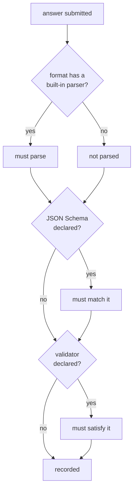

# Rhai output validators

Leviath checks that an answer parses when it recognises the format, and checks its shape when you
supply a JSON Schema. Neither helps with a format it has never heard of. If your agent produces
[a2ui](https://a2ui.org/), a house report layout, or a dialect of CSV nobody else uses, nothing knows
what a good answer looks like.

So write it down. A `.rhai` file beside your blueprint says what valid means. A bad answer then goes
back to the agent to fix, instead of reaching whoever asked.

> [!NOTE]
> **Before this page:** [Final outputs](/docs/outputs).
> **In one line:** one function, returning nothing when the answer is fine.

## Write one

```rhai
// validators/a2ui.rhai
fn validate(content) {
    let doc = parse_json(content);
    if doc.root == () {
        return "an a2ui document needs a `root` node";
    }
    if doc.root.component == () {
        return "the `root` node needs a `component`";
    }
    ()   // fine
}
```

Point your blueprint at it:

```toml
[stages.present.output]
format = "a2ui"
validator = "validators/a2ui.rhai"
```

The path is relative to the blueprint directory, so the validator travels with the agent that needs
it.

## The contract

One function, `validate(content)`, taking the submitted answer as a string.

| Return | Meaning |
|---|---|
| `()` | The answer is fine |
| `""` | Also fine. Easy to write by accident, so it is not treated as a complaint |
| a string | The answer is wrong, for this reason |

The string goes back to the agent as an error and it tries again, exactly as a failed JSON Schema
does. So write the reason for the agent, not for yourself: say what is missing and where.

## What it runs on

The same hardened engine every Leviath script gets. No filesystem, no network, no `eval`, and an
operation budget so a runaway script stops instead of hanging the run. You get the
[standard helpers](/docs/scripting), including `parse_json`.

A validator that throws, loops forever, or returns something that is neither `()` nor a string is
treated as **broken, not as a rejection**. The submission is recorded and a warning is logged.

That distinction matters. If a script bug read as "this answer is wrong", the agent would retry
against a validator that can never pass. It would burn its whole budget and end with no answer at
all. A bug in your validator should cost you a warning, not the agent's work.

## When it runs

Only when the format it was written for is the one in effect.

A validator describes one format. If a caller overrides the format at launch, your validator is
retired along with any JSON Schema, because neither describes what is now being produced. The caller
can supply their own checks with their own format.



## Failing early

A validator is compiled when the agent spawns, not when it is first used. A missing file, a syntax
error, or a `validate` with the wrong number of parameters stops the run before any tokens are spent.

This is deliberate. The only other time the script gets read is at the end of the run. That is the
worst possible moment to learn the agent cannot hand back its work.

`lev validate <path>` compiles them too, so you can check without starting anything.
