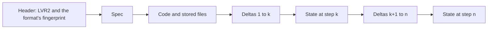

# The run file

A run that lives only in memory is lost when the machine restarts, and a run spread over many
files can come back half-restored. Leviath writes each run to one file, `run.lvr`, in the run's
directory under `~/.leviath/runs/<run-id>/`. Everything needed to resume the run, or to look at
any point of its history, is in that file.

```bash
lev run show release-notes-1790848443-51af34ec01cd             # the spec it started from
lev run show release-notes-1790848443-51af34ec01cd --at 4      # its whole state after step 4
lev run show release-notes-1790848443-51af34ec01cd --deltas 3..5   # what steps 3 to 5 changed
```

## What is in it

A run file is a list of frames, written in order and only ever appended to. It holds four kinds of
thing.

| Part | Written | What it holds |
|---|---|---|
| The **spec** | once, first | Everything decided when the run was resolved |
| **Code and files** | once each | Scripts the spec names, and stored files, by digest |
| **Deltas** | one per step | What changed in that step, and what happened |
| **State checkpoints** | every so often | The run's whole state, written out in full |



### The spec

The **run spec** is the [spawn request](/docs/starting-a-run) after the daemon resolved it against
this machine. It is the run's starting point, and nothing in it is decided again.

| Field | What it records |
|---|---|
| `graph` | The run graph: stages, edges, layout and declared inputs |
| `inputs` | Every input's checked, typed value |
| `stages` | Per stage: provider, model, window, fallbacks, and each tool's definition |
| `seeded` | What each region held at spawn, from inputs and seeds |
| `code` | The digest of every script the graph names |
| `launch` | The [launch policy](/docs/starting-a-run#launch-policy) the run got |
| `placement` | Its workdir, the run that started it, and its depth in the tree |
| `delivery` | Its webhook and your labels |
| `env` | A fingerprint of the providers and MCP servers it used |
| `origin` | Where its graph came from: a blueprint and its digest, or a raw request |

Because tool definitions and seeded contents are stored, a run does not change underneath you
when someone edits the blueprint, a script or an MCP server's tool list later.

### Deltas

Each step of a run writes one **delta**. It names the fields of the run's state that changed, with
their new values, and the **events** that happened in between. Replaying a run's deltas in order
from its start gives its state at any step.

| Event | Recorded when |
|---|---|
| `Attempt`, `Inference`, `Failover` | A model call finished, or moved to another model |
| `ToolStarted`, `Dispatched` | A tool call started, as an execution with its own id |
| `ToolFinished`, `Completed`, `Artifacts` | A tool call ended, with its result and any files |
| `Answered`, `Settled` | A person answered a question |
| `Message` | A message reached the run |
| `ContextCommitted`, `ContextNoted` | The context changed, with its cause |
| `Log` | A line for the run's log |

### State checkpoints

A **checkpoint** is the run's whole state, written out. That is where it is in its graph, what its
pipeline is doing and every region's entries. It also holds open questions, tool calls in flight,
a fan-out in progress, spend, time and child runs. It is exactly what
[`lev run show --at`](/docs/inspecting-a-run#from-the-command-line) and `Run.state` return.

The daemon writes one after 64 deltas, or once the deltas since the last one take more than twice
its size, whichever comes first. Reading the current state then means reading the last checkpoint
and replaying a few deltas after it. Each frame ends with its own length, so a reader finds the
last checkpoint by walking back from the end of the file rather than reading all of it.

On a scripted run of 120 tool-calling turns that compacted its context every ten, the file came to
67 KB. Every frame is compressed, and code and files are stored once each however often they are
used.

### Beside the file

A run's directory also holds two logs per stage, and a `blobs/` directory when its tools stored
files. `stages/<n>/output.log` is what the model wrote in stage `n`, and `stages/<n>/logs.log` is
that stage's tool activity and events. A stage that wrote no text has only `logs.log`. All of
these are for reading while the run works. The run file holds its own copy of every stored file,
so resuming needs nothing else.

A crash can cut a frame short. Every frame carries a checksum, so the next open finds a torn frame
at the end and cuts it off. The run resumes from its last complete step. `lev run show` leaves the
torn step out too, and says so.

## Resuming a run

When the daemon starts, it brings back every run that had not finished. For each run it:

1. reads the spec and the last state from the run file;
2. checks that this machine still offers what the spec relied on;
3. places the run in the [engine](/docs/engine) as it was.

Nothing is resolved again. The run carries on with the models, tools, inputs and launch policy it
started with, even if the blueprint or your config changed since.

What the run was doing comes back with it:

| It was | On resume |
|---|---|
| Waiting on a model reply | It asks again |
| Running a batch of tool calls | It dispatches them again; calls that finished are not run twice |
| Choosing its next stage | It is asked again, among the same edges |
| Running a fan-out | It picks its workers back up by run id |
| Asking a person a question | It asks again, under a new id |
| Stopped at a stage checkpoint | It asks again, under the same id and over the same document |
| Paused | It stays paused, and runs a batch it had in flight once resumed |

Each call in a batch is recorded as done the moment it finishes, so a restart part way through
a batch never runs a finished call again. After a clean stop, which stopped every command it had
running, the calls that had not finished run again. If the daemon died instead, a command it
started may still be running, so such a call is not run again: its result says it was interrupted,
and the model checks whether it took effect before running it again. A fan-out worker that finished while the daemon
was down is read from its own run file, and counts as done or failed as it ended.

A run that has finished stays finished. It reads no more messages, and there is no way yet to send
it on to another stage of its graph.

Child runs come back before the runs that started them, so a parent waiting on its fan-out finds
its workers in place. Among runs at the same depth, those with work to do come first. A run you
cancelled stays stopped through a restart, and comes back paused only when something asks for it.

## When the machine changed

The spec records a fingerprint of each provider's configuration (its kind, base URL and model
list) and each MCP server's tool list. On resume the daemon compares them with this machine. If a
provider is gone or configured differently, or an MCP server offers different tools, the run does
not go ahead on something it was never checked against.

Instead the resume is refused with typed [issues](/docs/starting-a-run#reading-the-problems), the
same kind a spawn gets. Each one is at the place in the spec that depends on what changed. Here a
run was started, then the `openai` provider's base URL was changed and the daemon restarted:

```text
ERROR leviath_cli::daemon::recovery: a run could not be resumed on this machine run_id=release-notes-1790848481-4774f2f3b6fa issues=2 problems with this spawn:
1. stages.gather.provider: changed: provider 'openai' is configured differently from when the run started: the run was started against a different configuration. put 'openai' back the way it was (its kind, base URL and model list), or start a new run. Known: openai
2. stages.write.provider: changed: provider 'openai' is configured differently from when the run started: the run was started against a different configuration. put 'openai' back the way it was (its kind, base URL and model list), or start a new run. Known: openai
```

The daemon writes that to `daemon.log`, and records it in the run file as the run's last step.
The run ends with status `error`, and `lev ps --all` lists it that way.

| What changed | Code | Path |
|---|---|---|
| A provider is no longer configured | `unavailable` | `stages.<stage>.provider` |
| A provider is configured differently | `changed` | `stages.<stage>.provider` |
| An MCP server is gone or disconnected | `unavailable` | `stages.<stage>.tools` |
| An MCP server's tools changed | `changed` | `stages.<stage>.tools`, naming tools removed, changed and added |
| A script's bytes are missing from the file | `missing` | `code[<n>]` |

A run that ended this way stays ended. If you want a run to survive a config change, put the
provider or server back the way it was before you restart the daemon. Otherwise start a new run.
Its spec records the machine as it is now.

## Runs from older versions

Older versions of Leviath kept a run in several files: an LVR1 journal, `meta.json`,
`context.json`, `stages.json`, `fanout.json`, `interactions.json` and a copy of its blueprint.
The daemon converts such a directory the first time it loads it, when it starts or when something
asks for the run:

- the spec is rebuilt from the run's metadata and the blueprint it ran;
- its code and stored files are copied in;
- each journal step that maps onto a delta becomes one;
- the state it was last in becomes the last checkpoint.

The old files move into `legacy/` inside the run's directory rather than being deleted, and a
directory that already holds a run file is never converted twice. An old run did not record
everything a run file holds. Each value the conversion had to fill in goes to `daemon.log` and to
the run's own log, with the value used and why.

An old run never recorded a machine fingerprint, so its resume does not compare one. It comes back
on whatever providers this machine has under the same names.

## Reading a run file

`lev run show` reads a run's file directly, so it works for a finished run and with the daemon
stopped.

| Command | Shows |
|---|---|
| `lev run show <run>` | The spec |
| `lev run show <run> --at <seq>` | The whole state after step `seq`; step 0 is the state it started in |
| `lev run show <run> --deltas 3..7` | Steps 3 to 7: `3..` from 3 on, `..7` up to 7, `..` all |
| add `--json` | JSON instead of TOML |

Here is a slice of a delta, the step where a tool call came back:

```toml
[[delta]]
at = 1790848532
seq = 4

[[delta.changes]]
Phase = "ReadyToInfer"

[[delta.events]]

[delta.events.ToolFinished]
call_id = "call_1"
millis = 0

[delta.events.ToolFinished.result]
is_error = false
text = "..."
```

The same data is on the HTTP API, GraphQL, and in the `run_history` tool an agent can call.
[Inspecting a run](/docs/inspecting-a-run) shows each.

The file's frame types have a published JSON Schema, `docs/schema/run-file.schema.json` in the
repository. Its hash is the fingerprint in every run file's header. A build whose frame types
differ refuses a file by name rather than reading it into the wrong shape.
