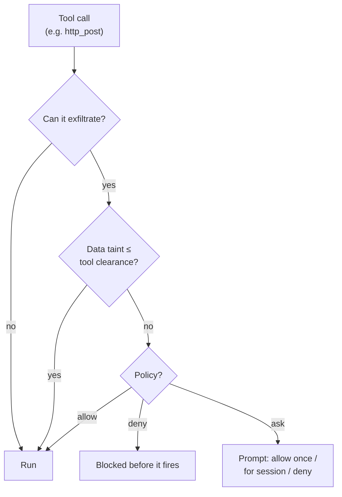

# Security: sandboxed execution and taint tracking

By default an agent's shell commands run directly on your machine. When you want isolation, opt in
per agent or per stage.

## Sandboxes

```toml
[sandbox]
kind    = "container"     # "container" | "namespace" | "none"
engine  = "docker"        # docker | podman | any Docker-CLI-compatible
image   = "debian:bookworm-slim"
network = false

[stages.analyze.sandbox]  # per-stage override
kind = "none"             # run discovery on the host…
```

- **Containers** (Docker/Podman): the daemon keeps a warm container per agent and tears it down at
  reap. Every capability is dropped, privilege regain is forbidden, processes and memory are bounded,
  and file tools keep working over the bind-mounted workdir.
- **Namespaces**: a lighter option with no container runtime; isolates PIDs and (with
  `network = false`) connectivity. It shares the host filesystem, so reach for a container when you
  want real containment.

> [!IMPORTANT]
> An *installed* agent can only ever **tighten** its sandbox: it can raise the walls, never lower
> them. A blueprint you install can't quietly turn isolation off.

## Reading outside the workdir

An agent's file tools are confined to its workdir. Some agents legitimately need to see more:
a planner that reads run archives, a reviewer that reads design docs kept next to the repo. For
that, a blueprint can declare extra read paths:

```toml
[read_paths]
allow = [
    "~/.leviath/runs",          # an exact path grants its whole subtree
    "../shared-docs",           # relative entries resolve against the run's workdir
    "glob:~/design-docs/**",    # glob patterns; * stays in one component, ** crosses
    "regex:/data/archives/.*",  # regex patterns, auto-anchored (^...$)
]
```

Declaring is not granting. The manifest travels with the agent package, and a package can only
tighten what your config allows. Declared paths stay inert until your `config.toml` grants them:

```toml
# Grant specific paths, for one agent...
[agent_read_paths.cto]
allow = ["~/.leviath/runs", "glob:~/design-docs/**"]

# ...or machine-wide, for any agent that declares them:
[security]
read_paths = ["~/.leviath/runs"]

# Or trust every blueprint's declarations wholesale (off by default):
[security]
allow_blueprint_read_paths = true
```

A grant applies to a path only when the running blueprint also declares it, so listing a
directory in your config does not open it to agents that never asked. When an agent declares
paths nothing grants, it still runs; the reads are refused.

Every surface says which side of that line an agent is on, so a missing grant turns up before a
run does:

```console
$ lev validate cto
✓ Blueprint 'cto' is valid.
  3 stages, version 1.0.0
  WARN your config does not grant glob:~/design-docs/**: reads matching them will be refused [read-paths-not-granted]
       add to your config.toml: [agent_read_paths.cto] allow = ["glob:~/design-docs/**"]
  NOTE declares [read_paths] (reads outside the run workdir): 2 declared, 1 granted [read-paths-declared]
       ~/.leviath/runs: granted; glob:~/design-docs/**: NOT granted
```

`lev list` prints the same counts under each agent, `lev run` repeats the warning and the stanza
when you start one, and `lev ps` grows a `READS` column reading granted over declared - `0/2` is a
run that is up and will be refused every read outside its workdir. `lev add` reports the status of
what you just installed.

Those checks compare patterns, not paths on disk, so treat them as the first answer rather than the
last: an individual read is still matched against the real, symlink-resolved path at run time.

You do not need to restart the daemon after editing the grant: it reloads `config.toml` on
change, so the **next `lev run` picks up the new grant automatically** (see
[the daemon docs](/docs/daemon#config-changes-take-effect-on-the-next-run)). An agent that just
failed on a refused read succeeds the next time you run it, once you have added the grant.

The rules that keep this safe:

- **Read-only.** Only `read_file`, `read_files`, and `list_dir` can leave the workdir.
  `write_file` and `edit_file` are confined to the workdir no matter what is granted.
- **Symlinks cannot widen a grant.** Every access is resolved to its real path first, and the
  real path must match a declared and granted entry. A symlink planted inside a granted
  directory that points at `~/.ssh` is refused.
- **Patterns match the real path**, written with `/` on every OS (on Windows, matching is
  case-insensitive and the `\\?\` prefix is handled for you). On macOS note that `/tmp` is
  really `/private/tmp`; `~/` entries avoid the problem since the home directory is stable.
- **Regexes are anchored.** `regex:/data/runs` matches exactly that path, not
  `/data/runs-anything`; end a pattern with `/.*` to grant a subtree. A relative regex is
  refused; use `glob:` for workdir-relative patterns.
- **Taint rises.** When a grant is active, the read tools are classified `Private` for that
  agent, so taint tracking treats out-of-workdir content with more suspicion, not less.
- Rhai script tools have their own `read_file` and it stays workdir-confined; `[read_paths]`
  applies to the built-in file tools only.

Pick the run's workdir itself with `lev run <agent> --workdir <dir>` (defaults to the directory
you ran the command from).

### Coming from a build where the blueprint allowlist stood alone

`[read_paths]` reached its current shape after 0.1.1, and the change is worth knowing about if you
wrote blueprints against an earlier build of it:

- **A blueprint's `[read_paths]` is now a declaration, not a grant.** An agent that used to read
  outside its workdir on the strength of its manifest alone reads nothing outside it now, until
  your `config.toml` grants the same paths. Add the `[agent_read_paths.<name>]` block above, or
  set `allow_blueprint_read_paths = true` if you would rather trust your blueprints wholesale.
- **`regex:` entries must be absolute.** They have to start with `/`, a drive letter, or `~/`, and
  they are anchored end to end. A catch-all like `regex:.*` is refused when the manifest is parsed,
  so `lev validate` fails rather than the agent quietly losing access. Write the subtree you mean -
  `regex:~/design-docs/.*` - or use `glob:` for anything workdir-relative.
- **Glob patterns cannot contain `.` or `..` components** anywhere but a relative entry's leading
  run, which is folded into the workdir at compile time.

Run `lev validate <agent>` against each of your blueprints after upgrading. It names every entry
that is inert and prints the config block that would fix it.

## Taint tracking (experimental)

A deterministic sensitivity model (**Public / Internal / Private**) tags every
[context region](/docs/context), set by the runtime and never by model output. Any tool that can
carry bytes off the machine is gated: before it fires, the runtime checks the tool's clearance
against the sensitivity of the data in play.



Taint recovers as entries evict, and an unrecognized tool **fails closed**. Configure with a
`[security]` block, layer on allowlists and Rhai policy rules, and dry-run any tool:

```bash
lev policy list
lev policy add send_email --target "*.example.com" --max-sensitivity internal
lev policy test bash --target example.com
```

`lev policy add` and `lev policy test` take the tool name as a **positional** argument
(`lev policy add <tool> …`, `lev policy test <tool> --target …`).

## Threat model

`lev serve` runs LLM-driven tools, so treat it as trusted-network only unless hardened. See
[SECURITY.md](https://github.com/GEMISIS/leviath/blob/main/SECURITY.md) for the full threat
model, what Leviath defends against, and how to report a vulnerability (GitHub private advisories).
