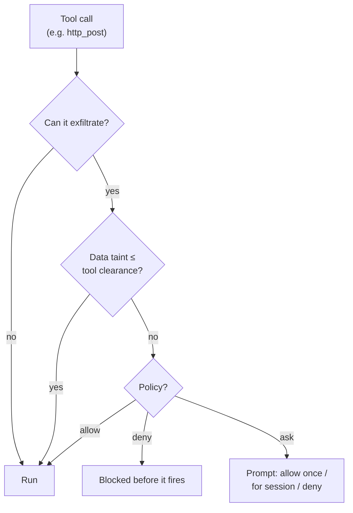

# Security: sandboxed execution and taint tracking

An agent runs shell commands and edits files. By default it does that directly on your machine, as
you, with your permissions. That is the right default for an agent working on your own project in a
directory you chose, and the wrong one for a blueprint somebody sent you.

Leviath gives you three separate controls, and you can use as few or as many as you need:

| Control | Question it answers | Section |
|---|---|---|
| Sandboxing | Where do commands run? | [Sandboxes](#sandboxes) |
| Read paths | Which files can it see? | [Reading outside the workdir](#reading-outside-the-workdir) |
| Taint tracking | Can it send what it read somewhere? | [Taint tracking](#taint-tracking-experimental) |

Tool permissions are a fourth, and they live in [Built-in tools](/docs/tools). Where API keys are
stored is `[security] credential_store` in [Configuration](/docs/configuration#security).

All of it is opt-in, and an installed blueprint can tighten these settings but never loosen them.
The one narrow exception: a blueprint may pre-allow `web_search` and `web_fetch` when you have not
configured those tools yourself.

## Sandboxes

```toml
[sandbox]
kind    = "container"     # "container" | "namespace" | "none"
engine  = "docker"        # docker | podman | any Docker-CLI-compatible
image   = "debian:bookworm-slim"
network = false

[stages.analyze.sandbox]  # per-stage override
kind = "none"             # run discovery on the host…
```

> [!IMPORTANT]
> **Today the sandbox covers what the agent executes**, and that scope is being widened. Read this
> before you rely on it.
>
> Inside the boundary: the `shell` tool, a blueprint's seed commands, and a Rhai script tool's
> `shell()` calls. Outside it: file tools, which stay on the host and rely on workdir
> [path confinement](#reading-outside-the-workdir) instead, and `web_fetch`, `web_search`, and a
> script's HTTP functions, which use the host network, so `network = false` fences the sandboxed
> commands and not those tools. [MCP servers](/docs/mcp) are host processes shared across agents,
> so they sit outside too.
>
> Covering every side effect, and letting a single run opt into a sandbox, is
> [issue #326](https://github.com/GEMISIS/leviath/issues/326) and the intended end state. Until it
> lands, run the whole daemon in a container when you want a blanket boundary.

The sandbox bind-mounts the run's workdir, so sandboxed commands and host-side file tools see the
same files.

**Containers**, using Docker or Podman, give you the real thing. The daemon keeps a warm container
per sandbox configuration, so stages with identical settings share one, and tears them down when
the agent finishes. Inside it, every Linux capability is dropped and the process cannot regain
privileges, and both process count and memory are capped.

**Namespaces** (Linux only) are lighter and need no container runtime. They isolate process IDs,
and with `network = false` they cut off connectivity. They do *not* isolate the filesystem, which
is the important limitation: a namespace shares the host's. Use one when you want cheap process
and network isolation, and a container when you want the agent's commands genuinely fenced off.

When the configured mechanism is unavailable, a `namespace` off Linux or a `container` with no
engine on `PATH`, the agent **fails to spawn** with a clear error. That is
`on_unavailable = "error"`, the default; set `on_unavailable = "warn"` to log and fall back to the
host instead.

> [!IMPORTANT]
> An *installed* agent can never weaken the sandbox you configured: it may pick a stricter kind,
> never a looser one, and its own `engine` choice is always discarded, because the engine binary
> runs on the host at spawn, before any prompt. With no `[sandbox]` of your own, a blueprint may
> still opt in with its own image and mounts, so read a downloaded agent's sandbox block rather
> than assuming it.

## Reading outside the workdir

An agent's file tools are confined to its workdir. Some agents legitimately need to see more:
a planner that reads run archives, a reviewer that reads design docs kept next to the repo. For
that, a blueprint can declare extra read paths:

```toml
[read_paths]
allow = [
    "~/.leviath/runs",          # an exact path grants its whole subtree
    "../shared-docs",           # relative entries resolve against the run's workdir
    "glob:~/design-docs/**",    # glob patterns; * stays in one component, ** crosses
    "regex:/data/archives/.*",  # regex patterns, auto-anchored (^...$)
]
```

Declaring is not granting. The blueprint travels with the agent package, and a package can only
tighten what your config allows. Declared paths stay inert until your `config.toml` grants them:

```toml
# Grant specific paths, for one agent...
[agent_read_paths.cto]
allow = ["~/.leviath/runs", "glob:~/design-docs/**"]

# ...or machine-wide, for any agent that declares them:
[security]
read_paths = ["~/.leviath/runs"]

# Or trust every blueprint's declarations wholesale (off by default):
[security]
allow_blueprint_read_paths = true
```

A grant applies to a path only when the running blueprint also declares it, so listing a
directory in your config does not open it to agents that never asked. When an agent declares
paths nothing grants, it still runs; the reads are refused.

Every surface says which side of that line an agent is on, so a missing grant turns up before a
run does:

```console
$ lev validate cto
✓ Blueprint 'cto' is valid.
  3 stages, version 1.0.0
  WARN your config does not grant glob:~/design-docs/**: reads matching them will be refused [read-paths-not-granted]
       add to your config.toml: [agent_read_paths.cto] allow = ["glob:~/design-docs/**"]
  NOTE declares [read_paths] (reads outside the run workdir): 2 declared, 1 granted [read-paths-declared]
       ~/.leviath/runs: granted; glob:~/design-docs/**: NOT granted
```

Four other commands surface the same thing, so this is hard to miss:

| Command | Shows |
|---|---|
| `lev list` | The same granted-over-declared counts under each agent |
| `lev add` | The status of what you just installed |
| `lev run` | Warns in the daemon log when an agent declares reads and your config grants none |
| `lev ps` | A `READS` column, granted over declared. `0/2` is a run that is up and will have every read outside its workdir refused |

Those checks compare patterns, not paths on disk, so treat them as the first answer rather than the
last: an individual read is still matched against the real, symlink-resolved path at run time.

You do not need to restart the daemon after editing the grant: it reloads `config.toml` on
change, so the **next `lev run` picks up the new grant automatically** (see
[the daemon docs](/docs/daemon#config-changes-take-effect-on-the-next-run)). An agent that just
failed on a refused read succeeds the next time you run it, once you have added the grant.

The rules that keep this safe:

- **Read-only.** Only `read_file`, `read_files`, and `list_dir` can leave the workdir.
  `write_file` and `edit_file` are confined to the workdir no matter what is granted.
- **Symlinks cannot widen a grant.** Every access is resolved to its real path first, and the
  real path must match a declared and granted entry. A symlink planted inside a granted
  directory that points at `~/.ssh` is refused.
- **Patterns match the real path**, written with `/` on every OS (on Windows, matching is
  case-insensitive and the `\\?\` prefix is handled for you). On macOS note that `/tmp` is
  really `/private/tmp`; `~/` entries avoid the problem since the home directory is stable.
- **Regexes are anchored.** `regex:/data/runs` matches exactly that path, not
  `/data/runs-anything`; end a pattern with `/.*` to grant a subtree. A relative regex is
  refused; use `glob:` for workdir-relative patterns.
- **Taint rises.** When a grant is active, the read tools are classified `Private` for that
  agent, so taint tracking treats out-of-workdir content with more suspicion, not less.
- Rhai script tools have their own `read_file` and it stays workdir-confined; `[read_paths]`
  applies to the built-in file tools only.

Pick the run's workdir itself with `lev run <agent> --workdir <dir>` (defaults to the directory
you ran the command from).

## Taint tracking (experimental)

Sandboxes and read paths control what an agent can *reach*. Taint tracking controls what it can do
with what it found.

Every [context region](/docs/context) carries a sensitivity label: **Public**, **Internal**, or
**Private**, in that order of increasing sensitivity. The runtime assigns it. Model output never
can, which matters, because otherwise an agent could relabel its own data.

Every tool that could send bytes off the machine has a **clearance**, the highest sensitivity it is
trusted with. Before such a tool runs, Leviath compares the two. If the data is more sensitive than
the tool's clearance, the call does not simply proceed.



Taint recovers as entries evict, and an unrecognized tool **fails closed**. Configure with a
`[security]` block, layer on allowlists and Rhai policy rules, and dry-run any tool:

```bash
lev policy list
lev policy add send_email --target "*.example.com" --max-sensitivity internal
lev policy test bash --target example.com
```

`lev policy add` and `lev policy test` take the tool name as a **positional** argument
(`lev policy add <tool> …`, `lev policy test <tool> --target …`).

## Threat model

`lev serve` runs LLM-driven tools, so treat it as trusted-network only unless hardened. See
[SECURITY.md](https://github.com/GEMISIS/leviath/blob/main/SECURITY.md) for the full threat
model, what Leviath defends against, and how to report a vulnerability (GitHub private advisories).

## Upgrading from 0.1.1

`[read_paths]` changed shape after 0.1.1. Skip this unless you wrote blueprints against an earlier
build.

**A blueprint's `[read_paths]` is now a declaration, not a grant.** An agent that used to read
outside its workdir on the strength of its own blueprint now reads nothing outside it, until your
`config.toml` grants the same paths. Add the `[agent_read_paths.<name>]` block shown above, or set
`allow_blueprint_read_paths = true` if you would rather trust your blueprints wholesale.

**`regex:` entries must be absolute.** They have to start with `/`, a drive letter, or `~/`, and
they are anchored end to end. A catch-all like `regex:.*` is refused when the blueprint is parsed,
so `lev validate` fails rather than the agent quietly losing access. Write the subtree you mean,
such as `regex:~/design-docs/.*`, or use `glob:` for anything relative to the workdir.

**Glob patterns cannot contain `.` or `..`**, except in a relative entry's leading run, which is
folded into the workdir when the pattern is compiled.

Run `lev validate <agent>` against each of your blueprints after upgrading. It names every entry
that is now inert and prints the config block that would fix it.
