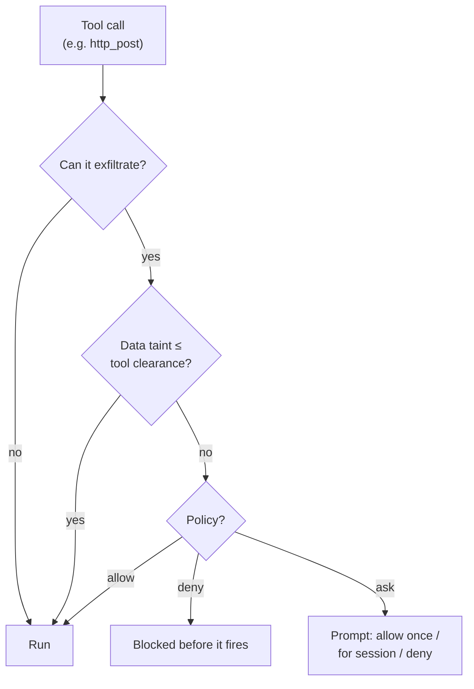

# Security: sandboxed execution and taint tracking

By default an agent's shell commands run directly on your machine. When you want isolation, opt in
per agent or per stage.

## Sandboxes

```toml
[sandbox]
kind    = "container"     # "container" | "namespace" | "none"
engine  = "docker"        # docker | podman | any Docker-CLI-compatible
image   = "debian:bookworm-slim"
network = false

[stages.analyze.sandbox]  # per-stage override
kind = "none"             # run discovery on the host…
```

- **Containers** (Docker/Podman): the daemon keeps a warm container per agent and tears it down at
  reap. Every capability is dropped, privilege regain is forbidden, processes and memory are bounded,
  and file tools keep working over the bind-mounted workdir.
- **Namespaces**: a lighter option with no container runtime; isolates PIDs and (with
  `network = false`) connectivity. It shares the host filesystem, so reach for a container when you
  want real containment.

> [!IMPORTANT]
> An *installed* agent can only ever **tighten** its sandbox — it can raise the walls, never lower
> them. A blueprint you install can't quietly turn isolation off.

## Taint tracking (experimental)

A deterministic sensitivity model — **Public / Internal / Private** — tags every
[context region](/docs/context), set by the runtime and never by model output. Any tool that can
carry bytes off the machine is gated: before it fires, the runtime checks the tool's clearance
against the sensitivity of the data in play.



Taint recovers as entries evict, and an unrecognized tool **fails closed**. Configure with a
`[security]` block, layer on allowlists and Rhai policy rules, and dry-run any tool:

```bash
lev policy list
lev policy add
lev policy test --tool bash --target example.com
```

## Threat model

`lev serve` runs LLM-driven tools, so treat it as trusted-network only unless hardened. See
[SECURITY.md](https://github.com/Sun-Forge-AI/leviath/blob/main/SECURITY.md) for the full threat
model, what Leviath defends against, and how to report a vulnerability (GitHub private advisories).
