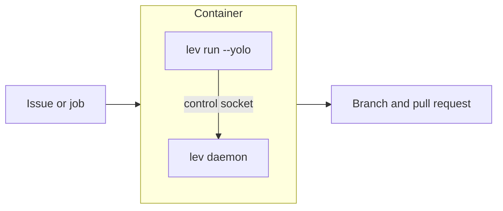

# Running Leviath under Smithy

[Smithy](https://github.com/smithy-ai/smithy-ai) orchestrates AI-assisted development through
GitHub, GitLab, or Forgejo. It picks up an issue, runs an agent session in an isolated Docker
container, opens a pull request, and responds to review feedback.

> [!IMPORTANT]
> Smithy does not currently document a way to swap its agent backend. It is built around Claude
> Code, configured with a `CLAUDE_CODE_OAUTH_TOKEN`, and there is no published adapter or plugin
> seam for a different agent CLI.
>
> So this is not a supported integration, and this page does not pretend otherwise. What follows is
> the shape the work takes if you modify Smithy's container yourself, and what you would be signing
> up to maintain. If Smithy adds a backend seam, this page gets replaced with the real instructions.

> [!NOTE]
> **Before this page:** [Where Leviath fits](/docs/integrations).
> **In one line:** the pattern is container-per-job, and the thing to get right is that `lev run`
> returns before the agent finishes.

## The general pattern

Smithy is one example of a shape lots of orchestrators use: a fresh container per unit of work,
with a command that is expected to do the job and exit. Everything below applies to any of them,
including a plain CI job.



## Getting `lev` into the image

Leviath is a single native binary with no Node, Python, or Docker runtime underneath it, so this
part is short:

```dockerfile
RUN curl -fsSL https://raw.githubusercontent.com/GEMISIS/leviath-dist/main/install.sh \
      | bash -s -- --channel stable
```

Add your agent blueprint too, either baked into the image or mounted at run time. See
[Packaging blueprints](/docs/packaging) for shipping one as a unit.

## The part that catches people

`lev run` does not run the agent in the foreground. It hands the work to the
[daemon](/docs/daemon) and returns straight away. In a container that exits when its command exits,
that kills the run you just started.

Two ways to deal with it.

**Wait for the run.** Start the daemon, spawn the agent, then poll until it is finished:

```bash
#!/usr/bin/env bash
set -euo pipefail

export LEVIATH_HOME=/work/.leviath
lev daemon start

# `lev run` prints "spawned <run-id>" and returns straight away.
RUN_ID=$(lev run /work/agent --task "$TASK" --yolo | awk '/^spawned /{print $2}')

# `runs` holds what the daemon is actively driving. Once the id drops out of
# that list the run is over, whatever the outcome.
while lev ps --all --json | jq -e --arg id "$RUN_ID" \
        '.runs[] | select(.run_id == $id)' >/dev/null; do
  sleep 5
done

# `finished` and `not_running` never overlap, so this prints exactly one record.
lev ps --all --json | jq --arg id "$RUN_ID" \
  '(.finished[], .not_running[]) | select(.run_id == $id)'
```

[External work queues](/docs/work-queues) explains why the poll reads those three lists rather than
a single status field.

**Or use the protocol instead.** If the orchestrator can launch a subprocess and talk JSON-RPC to
it, `lev agent-client` stays in the foreground for the whole turn and streams progress back, which
removes the polling entirely. That is what the [Gas City](/docs/gas-city) page uses, and it is the
nicer shape when it is available.

## Settings that matter in a container

```toml
# config.toml
[limits]
stall_timeout_secs = 120   # fail fast rather than burning the job's time budget
wedge_timeout_secs = 300   # a run nothing can reach is failed, not left hanging
```

Also worth knowing:

- **`--yolo` is not optional here.** Nobody is attached, so any tool that asks for approval would
  wait forever. It approves every call and removes the tools that need a person. It cannot lift a
  `deny`, so keep real restrictions in `[tool_permissions]`. See [Security](/docs/security).
- **Set `LEVIATH_HOME`** to a path inside the container that you control. Keep it short: the control
  socket is a Unix socket, and socket paths have a length limit that a deep temp directory will
  exceed.
- **The container is already the sandbox.** Smithy isolates each session in its own container, so
  turning on Leviath's own [sandboxing](/docs/security) as well is usually redundant. One boundary
  you understand beats two you half-configured.

## What you would be taking on

Being straight about the cost, since Smithy has no seam for this today:

- You maintain a fork or a patched image, and re-apply it whenever Smithy changes how it launches a
  session.
- Smithy's prompts and review conventions are written for Claude Code. Your blueprint has to fill
  the same role, and nothing checks that it does.
- Anything Smithy does with Claude Code's session handling, resume behaviour, or token setup will
  not apply, and there is no documented contract saying what it expects instead.

If what you want is Smithy's issue-to-PR workflow, using it as built is the path of least
resistance, and it works well. Reach for this when you specifically need multi-stage context control
inside the agent, and are willing to carry the integration yourself.
