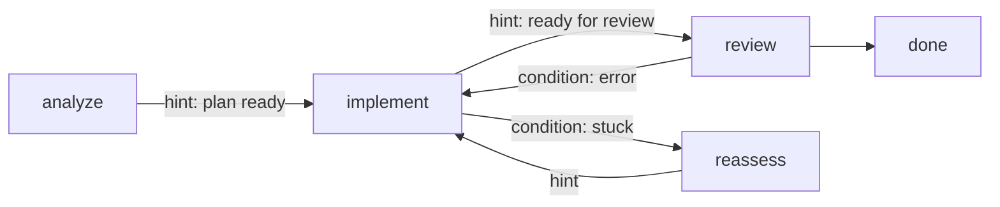

# Multi-stage workflows

A blueprint is a **graph of stages**. Each stage has its own model, tools, and context layout. Run
them linearly, or branch with conditional transitions, LLM-driven routing, and error recovery.



Every blueprint's graph is checkable before you run it:

```bash
lev validate .             # verifies the graph is well-formed and reachable
```

## Transitions

Each edge is one of two kinds:

- **hint** transitions are chosen by the agent (LLM-routed) when it decides the stage's goal is met.
- **conditional** transitions fire automatically on a runtime signal rather than the agent's
  choice: `error`, `stuck`, `max_iterations` (the stage's iteration cap is hit), or `always` (an
  unconditional edge).

```toml
[stages.implement.transitions.review]
hint = "Implementation complete, ready for review"

[stages.implement.transitions.reassess]
condition = "stuck"          # a runtime condition, not the agent's choice
```

<a id="graph"></a>

## Stuck detection

`stuck` escapes a stage that is making no progress. Crucially, stuckness is **measured, not
self-reported**. An agent can't loop forever insisting it's almost done:

```toml
[stages.implement.transitions.reassess]
condition = "stuck"
stuck_after_iterations      = 20   # inferences in this stage
stuck_after_same_file_edits = 5    # write/edit calls against one path
stuck_after_tool_calls      = 100
stuck_after_minutes         = 30
```

Any subset applies; the first threshold to trip fires the edge.

> [!TIP]
> When a `stuck` (or `error`) edge fires, the runtime writes *why* into the target stage's
> [context](/docs/context), so the recovery stage starts out knowing what went wrong instead of
> rediscovering it.
