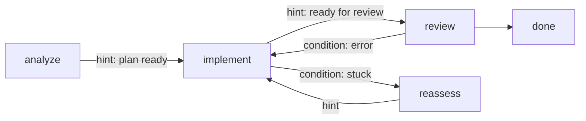

# Multi-stage workflows

A blueprint is a **graph of stages**. Each stage has its own model, tools, and context layout. Run
them linearly, or branch with conditional transitions, LLM-driven routing, and error recovery.



Every blueprint's graph is checkable before you run it:

```bash
lev validate .             # verifies the graph is well-formed and reachable
```

## Transitions

Each edge is one of two kinds:

- **hint** transitions are chosen by the agent (LLM-routed) when it decides the stage's goal is met.
- **conditional** transitions fire automatically on a runtime signal rather than the agent's
  choice: `error`, `stuck`, `max_iterations` (the stage's iteration cap is hit), or `always` (an
  unconditional edge).

```toml
[stages.implement.transitions.review]
hint = "Implementation complete, ready for review"

[stages.implement.transitions.reassess]
condition = "stuck"          # a runtime condition, not the agent's choice
```

An edge with a `hint` and no `condition` is `condition = "llm_choice"`; writing it out explicitly
is equivalent. The full set of values is `always`, `llm_choice`, `error`, `max_iterations`, and
`stuck`. An unrecognized value is a hard parse error rather than a silently ignored edge, so a typo
fails at `lev validate` instead of at 2am.

### Stage keys that shape routing

| Key | Default | Effect |
|---|---|---|
| `max_revisits` | unlimited | How many times this stage may be re-entered, not counting the first visit. An edge whose target is out of budget is dropped from the choices |
| `transition_prompt` | built-in | Overrides the prompt used to ask the model which edge to take |
| `allow_complete` | `false` | Offers the model an explicit `DONE` answer that ends the run, instead of forcing it down the single available edge |
| `requires_children` | `false` | Holds the stage until every sub-agent it spawned has finished |
| `allow_as_worker` | `false` | Opts this stage in to being the target of a [fan-out](/docs/sub-agents). Off by default, so you can only fan out into a stage designed for it |
| `accepts_messages` | `true` | Whether `lev msg` reaches this stage. See [Human-in-the-loop](/docs/interaction) |

### Carrying context across an edge

Each edge decides what the next stage inherits, with `transform`:

```toml
[stages.implement.transitions.review]
hint      = "Ready for review"
transform = "compact"        # direct | clear | compact | summarize | custom
```

- `direct` (the default) carries everything as-is.
- `clear` drops stage-specific regions and keeps pinned ones.
- `compact`, and its alias `summarize`, sends the stage's content through an LLM summarization pass
  before the next stage starts.
- `custom` takes a `transform_config` naming regions individually:

```toml
[stages.implement.transitions.review]
transform = "custom"

[stages.implement.transitions.review.transform_config]
carry          = ["system", "files"]     # pass through untouched
compact        = ["conversation"]        # summarize into the next stage
clear          = ["scratch"]             # drop entirely
compact_prompt = "Summarize what changed and why"
```

Regions declared `pinned` are immune to edge transforms, which is why the error and stuck reports
below are worth pinning.

### Gating an edge on actual work

A stage that was supposed to change files can announce it is done without having changed any. An
edge `gate` refuses the transition until the stage has something to show for itself:

```toml
[stages.implement.transitions.review]
hint = "Implementation complete, ready for review"
gate = { require_modifications = true, max_attempts = 3 }
```

| Field | Default | Meaning |
|---|---|---|
| `require_modifications` | `false` | Require at least one successful file-modifying tool call in the stage being left |
| `message` | generated | The nudge injected when the gate blocks |
| `region` | unset | A region whose non-emptiness also satisfies the gate |
| `tools` | `[]` | Extra tool names counted as modifying, beyond the built-in `write_file` and `edit_file` |
| `max_attempts` | `3` | How many times the stage is re-run before the gate gives up and lets the transition through with a warning |

Per-stage tool counters reset on stage entry and are not restored when a run resumes after a daemon
restart, but context regions are. Pointing `region` at whatever the write tools are routed into
keeps a resumed run honest. Set `tools` when an agent's writes go through MCP or
[script tools](/docs/rhai-tools) rather than the built-ins.

<a id="graph"></a>

## Stuck detection

`stuck` escapes a stage that is making no progress. Crucially, stuckness is **measured, not
self-reported**. An agent can't loop forever insisting it's almost done:

```toml
[stages.implement.transitions.reassess]
condition = "stuck"
stuck_after_iterations      = 20   # inferences in this stage
stuck_after_same_file_edits = 5    # write/edit calls against one path
stuck_after_tool_calls      = 100
stuck_after_minutes         = 30
```

Any subset applies; the first threshold to trip fires the edge.

> [!TIP]
> When a `stuck` or `error` edge fires, the runtime writes *why* into the target stage's
> [context](/docs/context), so the recovery stage starts out knowing what went wrong instead of
> rediscovering it. The same happens when a stage hits its iteration cap: whatever stage runs
> next is told the work was cut off, not finished. Stuck reasons go to a `stuck_report` region
> when the blueprint declares one; error and iteration-cap notes prefer an `error_report` region.
> Declare them `pinned` (a small budget like 2000 tokens is plenty) so the note survives edge
> transforms; without them, notes land in `conversation`.

## Nudging

When a stage's model replies with plain text before it has made a single tool call, the runtime
normally injects a `[System]` nudge ("You have tools available...") and re-runs the stage, up to
three times. That is the right reflex for a coding stage that stalls, and the wrong one for a stage
whose deliverable *is* text: a planner told to "use your tools" goes hunting for a write tool it
does not have.

Each stage can say what should happen instead:

```toml
[agent.nudge]                # agent-wide default for every stage
max = 2

[stages.plan.nudge]
enabled = false              # this stage's deliverable is text; never nudge

[stages.implement.nudge]
max = 2
text = "You have edit tools. Make the change described in {regions} rather than describing it again."
```

All three keys are optional and cascade independently: a stage block wins over `[agent.nudge]`,
which wins over the `[nudge]` section of your `config.toml`, which falls back to the built-in
defaults. This is a UX knob, not a permission, so a manifest may raise `max` above the global
setting as freely as it lowers it.

The `text` may name `{stage}` (the stage's name) and `{regions}` (the comma-separated names of the
stage's required context regions). The same substitution applies to a required region's
`required_message`, where `{region}` names the region being demanded.

With nothing configured, one stage shape is already exempt: a stage with interaction points
presents its text for review, so it is never nudged for producing exactly that text. Setting
`enabled` explicitly at any level overrides this in either direction.
